# VolumeDataSetRenderer — Dependency Map (Mermaid)

> **Confirmed (Understand tool):** **CBO = 28** coupled classes · WMC = 97 · RFC = 97 · LCOM = 0.95  
> **Scope:** full reachable graph — VDR direct dependencies + VolumeData-sibling Ce (hop 2)  
> Canonical source: `diagrams/vdsr-dependencies.puml`

---

## Graph

```mermaid
graph LR
  %% ─────────────────────────────────────
  %% Styles
  %% ─────────────────────────────────────
  classDef volumedata  fill:#D6EAF8,stroke:#2471A3,color:#000
  classDef datafeatures fill:#D5F5E3,stroke:#1E8449,color:#000
  classDef linerenderer fill:#FAD7A0,stroke:#CA6F1E,color:#000
  classDef unity        fill:#FEF9E7,stroke:#F39C12,color:#000,font-weight:bold
  classDef steamvr      fill:#FDEBD0,stroke:#E67E22,color:#000,font-weight:bold
  classDef idavieutil   fill:#E8F8F5,stroke:#148F77,color:#000
  classDef bcl          fill:#F2F3F4,stroke:#AAB7B8,color:#000
  classDef subject      fill:#AED6F1,stroke:#1A5276,color:#000,font-weight:bold,stroke-width:3px

  %% ─────────────────────────────────────
  %% SUBJECT
  %% ─────────────────────────────────────
  VDR["VolumeDataSetRenderer
  ─────────────────
  CBO=28 WMC=97
  RFC=97 LCOM=0.95 LOC=1403
  ⚠ God Class — 8+ responsibilities
  ⚠ Inside 46-file dependency cycle"]:::subject

  %% ─────────────────────────────────────
  %% VolumeData siblings
  %% ─────────────────────────────────────
  subgraph VolumeData["VolumeData namespace"]
    VDS["VolumeDataSet
    ─────
    FITS data · 3D textures
    mask buffers · WCS frame"]:::volumedata
    VIC["VolumeInputController
    ─────
    VR hand / locomotion
    [mutual ref with VDR]"]:::volumedata
    MMR["MomentMapRenderer
    ─────
    GPU moment-map compute
    [mutual ref with VDR]"]:::volumedata
    VCC["VolumeCommandController
    ─────
    Voice + menu commands
    [mutual ref with VDR]"]:::volumedata
    CFG["Config
    ─────
    Singleton: runtime settings
    rest-frequency list
    [mutual ref with VDR]"]:::volumedata
  end

  %% ─────────────────────────────────────
  %% DataFeatures
  %% ─────────────────────────────────────
  subgraph DataFeatures["DataFeatures namespace"]
    FSM["FeatureSetManager
    ─────
    Selection / mask features"]:::datafeatures
    FEAT["Feature
    ─────
    Feature.SetCubeColors() static"]:::datafeatures
    CME["ColorMapEnum
    ─────
    enum: Inferno, etc."]:::datafeatures
    CMU["ColorMapUtils
    ─────
    NumColorMaps · FromHashCode()"]:::datafeatures
    CMD["ColorMapDelegate
    ─────
    delegate: OnColorMapChanged"]:::datafeatures
  end

  %% ─────────────────────────────────────
  %% LineRenderer
  %% ─────────────────────────────────────
  subgraph LineRenderer["LineRenderer namespace"]
    PL["PolyLine
    ─────
    _measuringLine"]:::linerenderer
    CL["CuboidLine
    ─────
    _cubeOutline _voxelOutline
    _regionOutline
    _videoCursorPositionOutline"]:::linerenderer
  end

  %% ─────────────────────────────────────
  %% Unity Engine  ⚠ testability boundary
  %% ─────────────────────────────────────
  subgraph Unity["UnityEngine  ⚠ Unity"]
    MB["MonoBehaviour
    ─────
    base class
    Start · Update · OnDestroy
    OnRenderObject
    GetComponent*
    FindObjectOfType"]:::unity
    MAT["Material
    ─────
    Instantiate × 2
    SetTexture/Float/Int
    SetVector/Buffer/Pass
    20+ property sets per frame"]:::unity
    MESHR["MeshRenderer
    ─────
    GetComponent&lt;MeshRenderer&gt;()
    _renderer.material = …"]:::unity
    SHDR["Shader (static)
    ─────
    PropertyToID() × 30
    WarmupAllShaders()
    Enable/DisableKeyword()"]:::unity
    GFX["Graphics (static)
    ─────
    DrawProceduralNow()
    MeshTopology.Points"]:::unity
    CB["ComputeBuffer
    ─────
    ExistingMaskBuffer
    AddedMaskBuffer · SetBuffer()"]:::unity
    RT["RenderTexture
    ─────
    Moment0/1Map
    ImageOutput
    (via MMR — 2nd hop)"]:::unity
    SLDR["Slider  (UnityEngine.UI)
    ─────
    progressBar field"]:::unity
    TMP["TextMeshProUGUI  (TMPro)
    ─────
    loadText field"]:::unity
  end

  %% ─────────────────────────────────────
  %% SteamVR / Valve  ⚠ testability boundary
  %% ─────────────────────────────────────
  subgraph SteamVR["Valve.VR + InteractionSystem  ⚠ SteamVR"]
    SVR["SteamVR types
    ─────
    VRHand · Player
    ISteamVR_Action_*
    Stateless FSM
    (via VIC — 2nd hop)"]:::steamvr
    VNJ["Valve.Newtonsoft.Json
    ─────
    JsonProperty · JsonConverter
    (via Config — 2nd hop)"]:::steamvr
  end

  %% ─────────────────────────────────────
  %% iDaVIE Utilities
  %% ─────────────────────────────────────
  subgraph Utilities["iDaVIE Utilities"]
    FR["FitsReader  (static, P/Invoke)
    ─────
    FitsOpenFileReadOnly()
    FitsOpenFileReadWrite()
    FitsCloseFile()"]:::idavieutil
    TN["ToastNotification  (static)
    ─────
    ShowInfo · ShowWarning
    ShowError · ShowSuccess"]:::idavieutil
    DAS["DataAnalysis.SourceStats
    ─────
    struct — return type of
    SourceStatsDict property"]:::idavieutil
  end

  %% ─────────────────────────────────────
  %% BCL
  %% ─────────────────────────────────────
  BCL["System.*  BCL
  ─────
  System.IO · System.Linq
  System.Collections.Generic
  System.Text.RegularExpressions"]:::bcl

  %% ─────────────────────────────────────
  %% Afferent callers (Ca=28, not drawn individually)
  %% ─────────────────────────────────────
  CA28["28 afferent callers  Ca=28
  ─────
  FeatureData · Menu · UI
  VideoMaker · Shapes · Tools
  + VolumeData siblings
  (all inside 46-file cycle)"]:::volumedata

  %% ═════════════════════════════════════
  %% EDGES — VDR direct Ce (hop 1)
  %% ═════════════════════════════════════

  VDR -->|"inherits"| MB
  VDR -->|"uses — field: _dataSet _maskDataSet\n~92 references in code"| VDS
  VDR -->|"uses — field + FindObjectOfType"| VIC
  VDR -->|"instantiates — AddComponent"| MMR
  VDR -->|"uses — Config.Instance singleton"| CFG
  VDR -->|"uses — FindObjectOfType"| VCC
  VDR -->|"uses — field + GetComponentInChildren"| FSM
  VDR -->|"uses — Feature.SetCubeColors() static"| FEAT
  VDR -->|"uses — field: ColorMap"| CME
  VDR -->|"uses — NumColorMaps, FromHashCode()"| CMU
  VDR -->|"event — OnColorMapChanged"| CMD
  VDR -->|"uses — field: _measuringLine"| PL
  VDR -->|"uses — fields: 4× CuboidLine"| CL
  VDR -->|"uses — field: loadText"| TMP
  VDR -->|"uses — field: progressBar"| SLDR
  VDR -->|"instantiates — Instantiate()\n20+ SetProperty per frame"| MAT
  VDR -->|"uses — GetComponent"| MESHR
  VDR -->|"uses — PropertyToID ×30\nWarmup · Enable/Disable keyword"| SHDR
  VDR -->|"uses — DrawProceduralNow"| GFX
  VDR -->|"uses — mask ComputeBuffers"| CB
  VDR -->|"uses — SaveMask FITS I/O"| FR
  VDR -->|"uses — ShowInfo/Warning/Error/Success"| TN
  VDR -->|"uses — SourceStatsDict property type"| DAS
  VDR -->|"uses — IO · Regex · Linq · Dict"| BCL

  %% ═════════════════════════════════════
  %% MUTUAL REFERENCES — cycle edges (red)
  %% ═════════════════════════════════════

  VIC -->|"MUTUAL ⚠ cycle"| VDR
  MMR -->|"MUTUAL ⚠ cycle"| VDR
  VCC -->|"MUTUAL ⚠ cycle"| VDR
  CFG -->|"MUTUAL ⚠ cycle"| VDR
  CA28 -->|"Ca=28 callers"| VDR

  %% ═════════════════════════════════════
  %% 2nd-HOP: VolumeDataSet Ce
  %% ═════════════════════════════════════

  VDS -->|"inherits?"| MB
  VDS -->|"uses — P/Invoke FITS"| FR
  VDS -->|"uses"| CME
  VDS -->|"uses — GPU mask buffers"| CB
  VDS -->|"uses"| BCL

  %% ═════════════════════════════════════
  %% 2nd-HOP: VolumeInputController Ce
  %% ═════════════════════════════════════

  VIC -->|"inherits"| MB
  VIC -->|"uses ⚠ SteamVR"| SVR
  VIC -->|"uses"| FSM
  VIC -->|"uses"| PL
  VIC -->|"uses"| CL
  VIC -->|"uses"| TMP

  %% ═════════════════════════════════════
  %% 2nd-HOP: MomentMapRenderer Ce
  %% ═════════════════════════════════════

  MMR -->|"inherits"| MB
  MMR -->|"uses — SpectrumBuffer"| CB
  MMR -->|"uses — Moment maps"| RT

  %% ═════════════════════════════════════
  %% 2nd-HOP: VolumeCommandController Ce
  %% ═════════════════════════════════════

  VCC -->|"inherits"| MB
  VCC -->|"uses"| TMP
  VCC -->|"uses"| SLDR

  %% ═════════════════════════════════════
  %% 2nd-HOP: Config Ce
  %% ═════════════════════════════════════

  CFG -->|"uses ⚠ SteamVR"| VNJ
  CFG -->|"uses"| BCL
```

---

## Quick-reference: VDR's direct Ce (hop 1 only)

| Dependency | Type | Relationship | Notes |
|---|---|---|---|
| `MonoBehaviour` | UnityEngine | **inherits** | Lifecycle: Start, Update, OnDestroy, OnRenderObject |
| `VolumeDataSet` | VolumeData | uses (field) | `_dataSet`, `_maskDataSet` — ~92 references |
| `VolumeInputController` | VolumeData | uses (field + reflection) | `FindObjectOfType` + `volumeInputController` field |
| `MomentMapRenderer` | VolumeData | instantiates | `gameObject.AddComponent(typeof(MomentMapRenderer))` |
| `Config` | VolumeData | uses (singleton) | `Config.Instance` |
| `VolumeCommandController` | VolumeData | uses (reflection) | `FindObjectOfType<VolumeCommandController>()` |
| `FeatureSetManager` | DataFeatures | uses (field + reflection) | `FeatureSetManagerPrefab` field + `GetComponentInChildren` |
| `Feature` | DataFeatures | uses (static) | `Feature.SetCubeColors()` |
| `ColorMapEnum` | DataFeatures | uses (enum field) | `ColorMap` field type |
| `ColorMapUtils` | DataFeatures | uses (static) | `NumColorMaps`, `FromHashCode()` |
| `ColorMapDelegate` | DataFeatures | event | `public ColorMapDelegate OnColorMapChanged` |
| `PolyLine` | LineRenderer | uses (field) | `_measuringLine` |
| `CuboidLine` | LineRenderer | uses (field ×4) | cube/voxel/region/video-cursor outlines |
| `TextMeshProUGUI` | TMPro (Unity) | uses (field) | `loadText` |
| `Slider` | UnityEngine.UI | uses (field) | `progressBar` |
| `Material` | UnityEngine | instantiates | `Instantiate()` × 2; 20+ `Set*()` per frame |
| `MeshRenderer` | UnityEngine | uses | `GetComponent<MeshRenderer>()` |
| `Shader` | UnityEngine (static) | uses | `PropertyToID()` × 30; `WarmupAllShaders()` |
| `Graphics` | UnityEngine (static) | uses | `DrawProceduralNow()` in `OnRenderObject` |
| `ComputeBuffer` | UnityEngine | uses | Mask buffers; `SetBuffer()` on material |
| `FitsReader` | iDaVIE (P/Invoke) | uses (static) | `FitsOpenFile*`, `FitsCloseFile` in `SaveMask()` |
| `ToastNotification` | iDaVIE (static) | uses (static) | `ShowInfo/Warning/Error/Success` |
| `DataAnalysis.SourceStats` | iDaVIE | uses (return type) | `SourceStatsDict` property delegates to `_maskDataSet` |
| `System.*` BCL | BCL | uses | `Path`, `Regex`, `DateTime`, `IntPtr`, `Math`, LINQ |

**Mutual references (bidirectional — inside 46-file cycle):** `VolumeInputController`, `MomentMapRenderer`, `VolumeCommandController`, `Config`

---

## CK Metrics Summary

| Metric | Measured (commit `1cd729f`) | Target (post-refactor) |
|---|---|---|
| WMC (Count of Methods) | **97** | ≤ 20 per class |
| CBO (Count of Coupled Classes) | **28** | ≤ 14 domain / ≤ 25 orchestrator |
| RFC (Count of All Methods) | **97** | ≤ 50 |
| LCOM (% Lack of Cohesion) | **0.95** | ≤ 0.5 |
| DIT | **2** | ≤ 4 |
| LOC | **1403** | split across 5 classes |
| Public members | **152** (14 mutable public fields) | minimise |

> **Refactoring target:** `VolumeRenderCoordinator` (thin coordinator) + `VolumeMaterialBinder` + `VolumeTextureManager` + `VolumeCameraDriver` + `FoveatedSamplingPolicy`. Cycle broken via `IRenderPipeline` + `IGazeProvider` interfaces.
