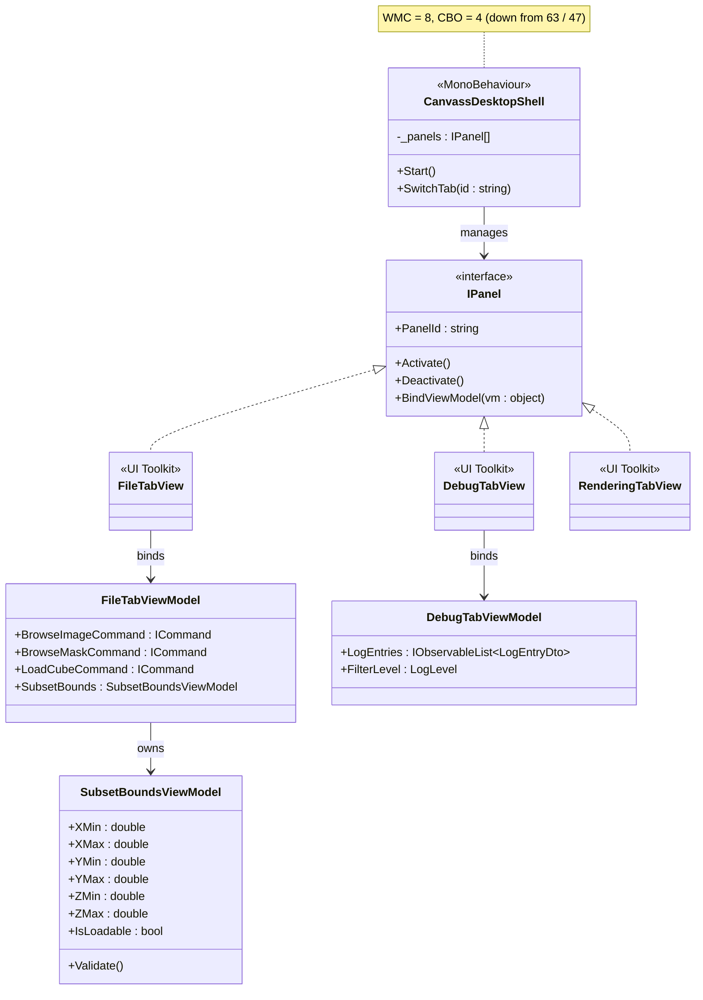

# Sub-team 6 — Desktop Client Architecture

**Status:** draft  
**Date:** 2026-05-27  
**Authors:** Sub-team 6 (Desktop GUI & Client Shell)  
**Backlog:** ARCH-1, ARCH-3, ARCH-4, ARCH-5, ARCH-7, ARCH-9, ARCH-10, ARCH-11  
**Related deliverables:** [D1 Requirements](../D1-requirements/CurrentGUIStateDoc.md) · [D3 MVVM Binding Policy](../D3-MVVM-binding-policy/mvvm-binding-policy.md) · [D4 Worked Examples](../D4-worked-examples/README.md) · [D5 Test Strategy](../D5-testing/test-strategy.md)

---

## 1. Scope and Ownership

This document covers the **Desktop GUI and Client Shell** work package (§6.6 of the assignment spec). Sub-team 6 owns:

- `CanvassDesktop` — the 1,899-line `MonoBehaviour` that is the primary refactoring target.
- File and mask loaders (FILE tab).
- Parameter panels (RENDER, STATS, SOURCES tabs).
- Debug console (DEBUG tab).
- The **client-side composition root** that wires every panel, ViewModel, and adapter to the server at startup.

The Desktop GUI is the only interface visible to the user throughout an iDaVIE session. In the current codebase it is implemented as a single God-object. The architecture proposed here decomposes it into composable MVVM panels backed by a service gateway that talks to the server kernel.

This section slots into the team architecture document as the **client-shell chapter**. C4 Level 1 (system context) and Level 2 (overall containers) are owned by Sub-team 1 (Architecture / Micro-kernel). This document contributes **C4 Level 3** for the Unity client container only.

---

## 2. Architectural Drivers

### 2.1 ISO 25010 Sub-characteristics

| Sub-characteristic | Concrete problem in the current code | Target |
|---|---|---|
| **Modularity** | `CanvassDesktop` owns eight unrelated concerns; any change to one tab risks breaking another. | Each tab concern in a separate class with an explicit interface contract. |
| **Analysability** | WMC 63, RFC 118 — too many methods and call sites to reason about locally. | WMC ≤ 27 per class; max RFC 50. No class exceeds the §7.1 thresholds. |
| **Modifiability** | 20+ `transform.Find("A/B/C").GetComponent<T>()` chains hard-wire the code to the scene hierarchy; adding a panel requires editing `CanvassDesktop`. | IPanel contract; panels registered via composition root, not hard-wired paths. |
| **Testability** | Zero testable methods today — every method is inside a MonoBehaviour. | ≥ 70% branch/line on ViewModel and domain code (NFR-TST-1); ViewModels require no Unity runner. |

### 2.2 Day 2 Baseline Evidence

The CK measurement taken on Day 2 (BNCH-1) confirms the problem quantitatively:

| Metric | `CanvassDesktop` | §7.1 threshold | Status |
|---|---|---|---|
| WMC | 63 | ≤ 40 (orchestrator) | **violation** |
| CBO | 47 | ≤ 25 (orchestrator) | **violation** |
| RFC | 118 | ≤ 50 | **violation** |
| LCOM | 0.955 | ≤ 0.50 | **violation** |
| DIT | 1 | ≤ 4 | within |
| NOC | 0 | ≤ 5 | within |

CBO of 47 breaks down as: 23 project types, 13 Unity/TMPro types, 7 System library types, and 4 `Valve.VR` types. Propagation cost is 87.5% of the monitored slice — a change anywhere in this class forces re-analysis of almost the entire sub-system.

### 2.3 Day 13 Projected Improvement

After full MVVM extraction (all five tabs plus composition root): 8 classes → 25 classes, 0 CK violations, max WMC 27, max CBO 9, max RFC 50, max LCOM 0.20, 0 circular cycles. See [BNCH-5](../other/T2-baseline-benchmark/ck-metrics.md) for the full projection.

---

## 3. C4 Level 3 — Client Shell Components

This diagram zooms into the **Unity Client** container (defined at C4 L2 by Sub-team 1) and shows its internal component structure after refactoring.

```mermaid
C4Component
    title C4 Level 3 — Desktop Client Shell (Unity Client container)

    Container_Boundary(view, "View Layer — iDaVIE.Client.View (Unity 6 UI Toolkit)") {
        Component(fileView, "FileTabView", "UI Toolkit Document", "Binds to IFileTabViewModel")
        Component(debugView, "DebugTabView", "UI Toolkit Document", "Binds to IDebugTabViewModel")
        Component(renderView, "RenderingTabView", "UI Toolkit Document", "Binds to IRenderingTabViewModel")
        Component(statsView, "StatsTabView", "UI Toolkit Document", "Binds to IStatsTabViewModel")
        Component(sourcesView, "SourcesTabView", "UI Toolkit Document", "Binds to ISourcesTabViewModel")
    }

    Container_Boundary(vm, "ViewModel Layer — iDaVIE.Client.ViewModel (pure C#, no UnityEngine)") {
        Component(fileVM, "FileTabViewModel", "C# class", "File loading commands; subset bounds validation")
        Component(debugVM, "DebugTabViewModel", "C# class", "Subscribes to ILogStream; filters and exposes log entries")
        Component(renderVM, "RenderingTabViewModel", "C# class", "Colormap, thresholds, render mode state")
        Component(statsVM, "StatsTabViewModel", "C# class", "Statistics display binding")
        Component(sourcesVM, "SourcesTabViewModel", "C# class", "Source catalogue display binding")
    }

    Container_Boundary(gw, "Gateway Layer — iDaVIE.Client.Gateway (Anti-Corruption Layer)") {
        Component(gateway, "JsonRpcServiceGateway", "C# transport", "Implements IServiceGateway; JSON-RPC 2.0 over named pipe per ADR-0002")
        Component(fileAdapter, "FitsServiceAdapter", "Gateway proxy", "Adapts IServiceGateway to IFitsService; dispatches file.open / dataset.getAxes / dataset.getHeader / file.close")
        Component(logAdapter, "GatewayLogStreamAdapter", "Gateway proxy", "Subscribes to IServiceGateway.OnNotification; republishes log.emit as ILogStream")
        Component(volumeAdapter, "VolumeServiceAdapter", "Unity adapter", "Wraps VolumeCommandController; exposes IVolumeService")
        Component(dialogAdapter, "FileDialogAdapter", "Unity adapter", "Wraps StandaloneFileBrowser; exposes IFileDialogService")
        Component(configAdapter, "ConfigServiceAdapter", "Unity adapter", "Wraps PlayerPrefs / Config; exposes IConfigService")
    }

    Component(root, "CanvassDesktopShell", "C# MonoBehaviour", "Composition root. Instantiates and wires the gateway, adapters, VMs, and views. No business logic.")

    System_Ext(server, "iDaVIE Server", "Hosts domain logic, plug-in execution, native data I/O (Sub-team 1 kernel)")
    System_Ext(native, "Native Plugins", "CFITSIO, Starlink AST, data_analysis_tool.dll — loaded server-side, not client-side")
    System_Ext(unity, "Unity / SteamVR", "UnityEngine, Valve.VR APIs")

    Rel(root, fileVM, "creates + injects")
    Rel(root, debugVM, "creates + injects")
    Rel(root, renderVM, "creates + injects")
    Rel(root, statsVM, "creates + injects")
    Rel(root, sourcesVM, "creates + injects")
    Rel(root, fileView, "creates + binds VM")
    Rel(root, debugView, "creates + binds VM")
    Rel(root, gateway, "creates + connects")
    Rel(fileView, fileVM, "one-way data + commands", "UI Toolkit binding")
    Rel(debugView, debugVM, "one-way data + commands", "UI Toolkit binding")
    Rel(renderView, renderVM, "one-way data + commands", "UI Toolkit binding")
    Rel(fileVM, fileAdapter, "calls IFitsService")
    Rel(fileVM, volumeAdapter, "calls IVolumeService")
    Rel(fileVM, dialogAdapter, "calls IFileDialogService")
    Rel(debugVM, logAdapter, "observes ILogStream")
    Rel(renderVM, configAdapter, "reads IConfigService")
    Rel(fileAdapter, gateway, "dispatches file.* / dataset.* (ADR-0002)")
    Rel(logAdapter, gateway, "subscribes to log.emit notifications")
    Rel(volumeAdapter, unity, "Unity API calls")
    Rel(dialogAdapter, unity, "StandaloneFileBrowser")
    Rel(configAdapter, unity, "PlayerPrefs")
    Rel(gateway, server, "JSON-RPC over named pipe (ADR-0002)")
    Rel(server, native, "loads server-side plug-ins")
```



**Layer rule (enforced):** arrows flow in one direction only — View → ViewModel → Gateway Layer → external systems (server via `IServiceGateway`, or the Unity SDK directly for the Unity adapters). The Gateway container houses two kinds of class: the **transport** (`JsonRpcServiceGateway`) is the only thing that speaks to the server; **service adapters** implement domain interfaces and split into **gateway proxies** (no `UnityEngine` reference) and **Unity adapters** (the only classes permitted to touch the Unity SDK). No ViewModel imports `UnityEngine` or `Valve.VR`. No adapter holds a direct reference to a sibling adapter — interfaces only.

---

## 4. Architecture Decisions

**Numbering map.** This document uses 4-digit local IDs (`ADR-0001`..`ADR-0004`). The team-alpha registry at [`../../../team-alpha/ADR_Log_Improved.md`](../../../team-alpha/ADR_Log_Improved.md) uses 3-digit central IDs (`ADR-001`..`ADR-012`). Cross-walk:

| Local | Central | Notes |
|---|---|---|
| `ADR-0001` | `ADR-009` | Sub-team-6 implementation of the MVVM-for-Desktop decision. |
| `ADR-0002` | (extends `ADR-009`) | Wire-spec sub-decision — JSON-RPC over named pipes. No separate central ADR; the central registry's versioning note (`ADR-009`) explicitly allows additive wire-spec decisions. |
| `ADR-0003` | `ADR-002` | **Number reversal — local `ADR-0003` ↔ central `ADR-002`.** Both are the Anti-Corruption Layer decision. |
| `ADR-0004` | — | Sub-team-only. Unity 6 UI Toolkit as View technology. No central equivalent because the choice is desktop-shell-specific. |

### ADR-0001 — MVVM split (View / ViewModel / Service Gateway)

- **Status:** accepted · **Date:** 2026-05-19 · **Backlog:** ARCH-1

**Context.** `CanvassDesktop` is a 1,899-line `MonoBehaviour` with eight distinct concerns and zero testable methods. The ≥ 70% branch/line coverage target (NFR-TST-1) is unreachable without removing Unity lifecycle coupling from business logic. The Unity 2021.3 → Unity 6 migration further requires separating view code (which moves from uGUI Canvas to UI Toolkit) from ViewModel code (which must not move at all).

**Decision.** Adopt a three-tier MVVM split, one C# assembly per tier (matches D3 §2.1):

1. **View** (`iDaVIE.Client.View`) — Unity 6 UI Toolkit `VisualElement` documents. Holds zero business logic. Communicates with the ViewModel exclusively via data binding and `ICommand`. May reference `UnityEngine`.
2. **ViewModel** (`iDaVIE.Client.ViewModel`) — Pure C# classes. No `UnityEngine` reference. Expose observable properties and `ICommand` implementations. Call domain services only through interfaces.
3. **Gateway Layer** (`iDaVIE.Client.Gateway`) — The Anti-Corruption Layer. Houses two kinds of class:
    - **Gateway transport** (`JsonRpcServiceGateway`): the single transport-agnostic seam between the client and the server kernel. Speaks JSON-RPC 2.0 over named pipes per ADR-0002. Pure C#.
    - **Service adapters**: implement domain interfaces (`IFitsService`, `IVolumeService`, etc.) and split by where they route to:
        - **Gateway proxies** (`FitsServiceAdapter`, `GatewayLogStreamAdapter`) — adapt `IServiceGateway` to a domain interface. Pure C#, own the wire shape, compile and unit-test without Unity.
        - **Unity adapters** (`VolumeServiceAdapter`, `FileDialogAdapter`, `ConfigServiceAdapter`) — cross into the Unity SDK / `PlayerPrefs` / native UI. They quarantine Unity coupling at the bottom of the dependency graph.

**Consequences.** All ViewModel and domain code is testable with plain NUnit. The Unity 5 → 6 view migration is contained to the View layer. Full binding policy documented in [D3 MVVM Binding Policy](../D3-MVVM-binding-policy/mvvm-binding-policy.md).

**Alternatives considered.** MVC (poor fit for Unity's component model); MVP (workable but weaker data-binding story in UI Toolkit); raw MonoBehaviour refactor without MVVM (fails the testability target).

---

### ADR-0002 — Client–server transport (JSON-RPC over named pipes / gRPC)

- **Status:** proposed · **Date:** 2026-05-19 · **Backlog:** ARCH-2

**Context.** Section 6.6 explicitly names the transport: "JSON-RPC over named pipes for local mode; gRPC for future remote streaming." This decision documents the rationale so the panel can probe it.

**Decision.**

- **Local mode (Day 1 of the refactored system):** JSON-RPC 2.0 over named pipes. One pipe per session.
- **Remote mode (post-MVP):** gRPC over HTTP/2 with the same `IServiceGateway` interface surface on the client.

The `IServiceGateway` interface is transport-agnostic — the gateway implementation is chosen by the composition root at startup.

**Consequences.** Local-mode latency is good; named pipes are first-class on Windows. JSON-RPC is debuggable by tail + eye, lowering the cost of cross-sub-team integration in Sprint 2. gRPC adoption later requires a proto schema generated from the same service surface — needs coordination with Sub-team 1.

**Alternatives considered.**

- **gRPC for local mode too** — Heavier ceremony; harder for first-year cohort to debug; brings Protobuf as a dependency on Day 1.
- **REST over loopback HTTP** — Adds an HTTP server in-process; less efficient; weaker contract.
- **In-process method calls** — Defeats the client–server separation (§4.1).

#### Wire specification — local mode

This section pins down the on-the-wire details for the JSON-RPC-over-named-pipes implementation. It is the contract the client `IServiceGateway` adapter and the server-side handler must both honour.

**Pipe naming**

- **Pipe name (Windows):** `\\.\pipe\idavie.<session-id>` where `<session-id>` is a UUIDv4 generated by the server at startup and written to `%LOCALAPPDATA%\iDaVIE\session.pipe`.
- **Direction:** duplex full-duplex byte stream. Client connects; server is the listener.
- **Lifetime:** one pipe per client session. Server tears down the pipe on client disconnect.
- **ACL:** owner-only (current interactive user). No cross-user access.

**Framing**

JSON-RPC 2.0 messages are length-prefixed to make framing unambiguous on a byte stream:

```
<ascii-decimal length><LF><utf-8 json payload>
```

- `length` = byte length of the UTF-8 payload, ASCII decimal, no leading zeros.
- Separator is a single `\n` (0x0A). No `\r`.
- Payload is exactly `length` bytes; no trailing newline inside the frame.

Rationale: identical to LSP-style framing minus the `Content-Length:` header — cheaper to parse, still tail-debuggable.

**Message shape**

```jsonc
// Request
{ "jsonrpc": "2.0", "id": 17, "method": "file.open", "params": { "path": "..." } }

// Response (success)
{ "jsonrpc": "2.0", "id": 17, "result": { "datasetId": "ds-3f1c" } }

// Response (error)
{ "jsonrpc": "2.0", "id": 17, "error": { "code": -32011, "message": "FITS header invalid", "data": { "axis": 2 } } }

// Notification (server → client, no id)
{ "jsonrpc": "2.0", "method": "log.emit", "params": { "level": "WARN", "msg": "...", "ts": "2026-05-21T09:14:02Z" } }
```

- `id` is an integer assigned by the client, monotonically increasing per session.
- Server-initiated streams (logs, progress) are **notifications** (no `id`, no response expected).

**Method catalogue (v1)**

| Method | Direction | Purpose | Backlog |
|---|---|---|---|
| `session.hello` | C→S | Handshake; returns server version + supported methods. | ARCH-2 |
| `file.open` | C→S | Open a FITS/mask file. Returns `datasetId`. | EX1-File-Tab |
| `file.close` | C→S | Release a dataset. | EX1-File-Tab |
| `file.listRecent` | C→S | Recent-files list. | EX1-File-Tab |
| `dataset.getAxes` | C→S | FITS axis metadata for the parameter panel. | EX1-File-Tab |
| `dataset.getHeader` | C→S | FITS header text for a given HDU index. Replaces `CanvassDesktop.ChangeHduSelection`'s file-reopen-per-switch defect. | EX1-File-Tab |
| `log.subscribe` | C→S | Begin receiving `log.emit` notifications. | EX2-Debug-Tab |
| `log.unsubscribe` | C→S | Stop the log stream. | EX2-Debug-Tab |
| `log.emit` | S→C (notif) | Structured log record. | EX2-Debug-Tab |
| `progress.update` | S→C (notif) | Long-running task progress. | EX1-File-Tab |

Method names are namespaced with `.`; namespaces map 1:1 to ViewModel slices.

**Error model**

| Code | Meaning |
|---|---|
| `-32700`..`-32603` | JSON-RPC reserved (parse / invalid request / method not found / invalid params / internal). |
| `-32000` | Generic server error. |
| `-32010` | File not found. |
| `-32011` | FITS header invalid. |
| `-32012` | Dataset id unknown / already closed. |
| `-32020` | Subscription already active. |
| `-32030` | Native plug-in failure (wrapped from C ABI). |

`error.data` carries a structured payload — the ViewModel uses it to render a useful message instead of a stack trace.

**Versioning.** `session.hello` returns `{ "serverVersion": "1.0.0", "wireVersion": 1 }`. `wireVersion` is bumped on any breaking change to framing, error codes, or method semantics. Client refuses to proceed if `wireVersion` is higher than it understands. Adding new methods or new optional `params` fields is not breaking.

**Real consumers (audit close, F9 / F10).** Both worked examples exercise this contract end-to-end under CI:

- **File tab** dispatches `file.open` → `dataset.getAxes` → `dataset.getHeader` → `file.close` via `FitsServiceAdapter` (request/response). Wire-shape assertions live in `refactoring-examples/sub-team-6/file-tab/adapters/tests/FitsServiceAdapterTests.cs`.
- **Debug tab** consumes `log.emit` notifications via `GatewayLogStreamAdapter` (server-pushed stream). Wire-shape assertions live in `refactoring-examples/sub-team-6/debug-tab/adapters/tests/GatewayLogStreamAdapterTests.cs`.
- Pure framing and gateway-double behaviour are pinned in `refactoring-examples/sub-team-6/contracts/tests/` against ADR-0002 §"Framing" and §"Message shape".

All three test projects build and run without Unity (`dotnet test`); current count is 82 / 82 green in &lt; 200 ms total.

---

### ADR-0003 — Anti-Corruption Layer around Unity 6 and SteamVR APIs

- **Status:** accepted · **Date:** 2026-05-21 · **Backlog:** ARCH-3

**Context.** §4.2 constraint 3 states: "Domain code must not transitively depend on `UnityEngine` or `SteamVR`." Currently `CanvassDesktop` imports 13 Unity/TMPro types and 4 `Valve.VR` types directly. This makes all domain and ViewModel logic untestable outside the Unity editor, and it exposes the entire codebase to churn when Unity 6 changes its API surface.

**Decision.** Introduce an **Anti-Corruption Layer (ACL)** between the ViewModel layer and all Unity/SteamVR APIs. Concretely:

- Every interaction with `UnityEngine` (scene graph, coroutines, `PlayerPrefs`, asset loading, native UI) is encapsulated in a dedicated adapter class that implements a domain interface.
- The ViewModel layer depends only on those interfaces. It holds no `using UnityEngine` directive.
- The ACL is enforced structurally per D3 §2.1: ViewModels live in `iDaVIE.Client.ViewModel` which has no Unity assembly reference; adapters and the transport live in `iDaVIE.Client.Gateway` which references Unity only where individual adapters need it.
- NDepend / DV8 layer-violation rules are added to CI to reject any PR that imports `UnityEngine` from the ViewModel assembly.

**ACL boundary summary:** the original FITS and log adapters wrapped `UnityEngine` / native code directly. After the gateway rewire (audit close F9 / F10) they are gateway proxies — they own a JSON-RPC wire shape, not a native API surface. The Volume / Dialog / Config adapters remain Unity-side because those resources are genuinely client-local.

| Interface | Adapter | Quarantined API | Kind |
|---|---|---|---|
| `IFitsService` | `FitsServiceAdapter` | `IServiceGateway` (dispatches `file.open`, `dataset.getAxes`, `dataset.getHeader`, `file.close`) | Gateway proxy — no Unity |
| `ILogStream` | `GatewayLogStreamAdapter` | `IServiceGateway.OnNotification` (filters `log.emit`) | Gateway proxy — no Unity |
| `IVolumeService` | `VolumeServiceAdapter` | `VolumeCommandController`, `VolumeDataSetRenderer` | Unity adapter |
| `IFileDialogService` | `FileDialogAdapter` | `StandaloneFileBrowser` | Unity adapter |
| `IConfigService` | `ConfigServiceAdapter` | `PlayerPrefs` / static `Config` | Unity adapter |

**Consequences.** Every class in the ViewModel assembly is instantiable and testable without a Unity process. DIT of adapter classes rises to 4 (inheriting from `MonoBehaviour` where coroutines are required); this is documented and acceptable under the adapter threshold (WMC ≤ 40, CBO ≤ 25). Circular dependencies between the VM and adapter assemblies are forbidden by the layer rule.

**Alternatives considered.** Partial classes (no real boundary); Unity Test Framework only (does not remove the Unity dependency, just hides it); wrapper base class for CanvassDesktop (mitigates but does not eliminate the problem).

---

### ADR-0004 — Unity 6 UI Toolkit as View technology

- **Status:** accepted · **Date:** 2026-05-21 · **Backlog:** ARCH-7

**Context.** iDaVIE currently uses the legacy Unity `UnityEngine.UI` Canvas system (Unity 2021.3). The target platform is Unity 6, which deprecates the Canvas-based UI in favour of **UI Toolkit** (`UnityEngine.UIElements`). Every existing panel (`CanvassDesktop`, tab GameObjects) must be migrated.

**Decision.** All new View components are authored as UI Toolkit `VisualTreeAsset` UXML documents with code-behind classes that inherit from `MonoBehaviour` and hold a `UIDocument` reference. Data binding uses UI Toolkit's built-in `INotifyValueChanged` / `BindingContext` mechanism (Unity 6 GA feature). Legacy `Text`, `InputField`, `Toggle`, and `Slider` references in `CanvassDesktop` are replaced by `Label`, `TextField`, `Toggle`, and `Slider` from `UnityEngine.UIElements`.

**Migration phasing:**

1. ACL adapters encapsulate all canvas-specific queries (e.g. `transform.Find(...)`) so that the ViewModel is unaffected during the transition.
2. Each tab view is migrated individually: FileTab → DebugTab → RenderingTab → StatsTab → SourcesTab.
3. Legacy Canvas components are removed only after the corresponding UI Toolkit view passes smoke tests.

**Consequences.** The View layer is the only layer affected by the Unity 5 → 6 migration. ViewModels and adapters do not change. The migration surface is reduced from the entire 1,899-line file to five isolated view documents. The `IPanel` contract (§6 below) abstracts the lifecycle so the composition root does not know whether a panel is Canvas or UI Toolkit.

**Alternatives considered.** Keep Canvas for iDaVIE v2.0 (not viable — Unity 6 deprecates Canvas for runtime UI); adopt a third-party UI framework (adds dependency risk; UI Toolkit is now the Unity-native path).

---

## 5. CanvassDesktop SRP Decomposition

### 5.1 Concerns identified in the current code

`CanvassDesktop.cs` entangles eight distinct responsibilities in one `MonoBehaviour`:

| Concern | Lines / evidence |
|---|---|
| Scene-hierarchy wiring | 20+ `transform.Find("A/B/C").GetComponent<T>()` chains in `Start()` |
| FITS file I/O and HDU parsing | `_browseImageFile`, `UpdateHeaderFromFits`, `FitsReader.*` |
| Rendering state sync | `Update()` pushes threshold/colormap from renderer into sliders every frame |
| Subset bounds validation | `checkSubsetBounds`, `updateSubsetZMax`, `IsLoadable` |
| File-dialog orchestration | `BrowseImageFile`, `BrowseMaskFile` — direct `StandaloneFileBrowser` calls |
| Coroutine lifecycle | `_loadCubeCoroutine`, `_showLoadDialogCoroutine` managed inline |
| Singleton hunting | `FindObjectOfType<VolumeInputController>()` etc. scattered in `Start()` |
| Paint-mode state | `inPaintMode`, `PaintSelectionContainer` toggle logic |

### 5.2 Target decomposition



### 5.3 SOLID principles applied

| Split | Principle | Justification |
|---|---|---|
| Tab logic extracted to individual ViewModels | **SRP** | Each ViewModel has one reason to change: the behaviour of its tab. |
| ViewModels depend on service interfaces, not implementations | **DIP** | Allows adapter substitution for testing without a Unity scene. |
| `IPanel` contract for all view panels | **OCP / ISP** | New panels added without modifying `CanvassDesktopShell`; callers depend only on the lifecycle interface. |
| `SubsetBoundsViewModel` extracted from `FileTabViewModel` | **SRP** | Validation logic is a separate, independently testable concern. |

### 5.4 GRASP principles applied

Required by §4.2 constraint 1 ("No SOLID/GRASP violations without a documented trade-off").

| Assignment decision | GRASP principle | Justification |
|---|---|---|
| `SubsetBoundsViewModel` owns subset validation | **Information Expert** | The class holds the bound data, so it is the natural home for the validation rule. Placing validation in `FileTabViewModel` or the view would spread knowledge of the invariant across layers. |
| `CanvassDesktopShell` creates all adapters, ViewModels, and views | **Creator** | The shell has the initialising data for every component and is responsible for their lifetime. No other class has sufficient context to act as creator. |
| `FileTabViewModel` / `DebugTabViewModel` handle tab commands | **Controller** | Commands enter through the ViewModel, not the view. The view raises an event; the ViewModel decides what to do. This keeps business logic out of UI Toolkit code. |
| ViewModel assembly carries no `UnityEngine` reference | **Low Coupling** | Adapters absorb all Unity coupling. The ViewModel layer can be instantiated, tested, and reasoned about without a Unity process. CBO of each ViewModel class is projected at ≤ 9. |
| Each ViewModel scoped to one tab | **High Cohesion** | A class responsible for one tab has one axis of change. The current `CanvassDesktopShell` scores LCOM = 0.955 because it conflates eight concerns; the split targets LCOM ≤ 0.20 per class. |
| `IPanel`, `IServiceGateway`, `IFitsService` etc. decouple layers | **Indirection** | Interfaces inserted between layers mean no component has a direct compile-time dependency on another component's implementation. Enables independent deployment of test doubles. |
| ACL shields domain from Unity/SteamVR API surface | **Protected Variations** | Unity 6 changed its UI API; future versions will change more. The ACL is the single variation point — only adapter classes change when Unity changes, not ViewModels. |
| `IPanel` enables Canvas → UI Toolkit substitution | **Polymorphism** | During migration, a Canvas-based panel and a UI Toolkit panel are interchangeable from `CanvassDesktopShell`'s perspective. No conditional logic in the shell selects the concrete type. |

---

## 6. Interface Contracts

The following interfaces define every public boundary within the client shell. Full C# signatures are in the worked examples ([D4](../D4-worked-examples/README.md)).

| Interface | Layer | Purpose |
|---|---|---|
| `IServiceGateway` | ViewModel → Server | Sends typed JSON-RPC requests to the server kernel; returns strongly-typed results. Transport-agnostic. |
| `IFileTabViewModel` | View → ViewModel | Exposes file-loading commands and observable properties to `FileTabView`. |
| `IDebugTabViewModel` | View → ViewModel | Exposes log-entry list and filter state to `DebugTabView`. |
| `ILogStream` | Adapter → ViewModel | Observable log event stream; `Subscribe(ILogObserver)` / `Unsubscribe(ILogObserver)` / `Publish(level, message)` / `Publish(level, message, timestamp)`. |
| `ILogObserver` | ViewModel → ViewModel | Implemented by `DebugTabViewModel`; called by `ILogStream` on each event. |
| `IPanel` | Composition root → View | Composable panel lifecycle: `Activate`, `Deactivate`, `BindViewModel`. |
| `IFitsService` | ViewModel → Adapter | `OpenImageAsync`, `OpenMaskAsync`, `GetHeaderTextAsync`, returning immutable DTOs. |
| `IVolumeService` | ViewModel → Adapter | `LoadCubeAsync`, `IsCubeLoaded`, renderer queries. |
| `IFileDialogService` | ViewModel → Adapter | `PickFileAsync(filter)` — hides `StandaloneFileBrowser`. |
| `IConfigService` | ViewModel → Adapter | `GetValue<T>(key)` / `SetValue<T>(key, value)` — hides `PlayerPrefs`. |

**Rule:** every interface must have at least one test double (mock or stub) committed to the test project before the worked example that uses it is merged (§4.2 constraint 4).

---

## 7. State Contract to Sub-team 7 (Persistence)

Sub-team 7 (Persistence) must save and restore the desktop shell state across sessions. The schema below is the minimum contract this sub-team guarantees will be serialisable.

```json
{
  "schemaVersion": 1,
  "activeTabId": "file",
  "fileHistory": ["path/to/cube.fits", "path/to/other.fits"],
  "debugLogFilter": {
    "minLevel": "INFO",
    "sourceFilter": null
  },
  "panelLayout": {
    "leftPanelMode": "VRView"
  }
}
```

**Rules:**
- `schemaVersion` is bumped whenever a field is removed or renamed. Adding optional fields is non-breaking.
- The shell reads this state in `CanvassDesktopShell.Start()` after all panels are created and bound.
- No ViewModel state (e.g. loaded FITS paths, render thresholds) is persisted here — that is owned by the server and the Data/Persistence sub-teams.

---

## 8. Compliance Check — §4.2 Mandatory Constraints

| Constraint | This sub-team's compliance |
|---|---|
| 1 — No SOLID/GRASP violations without documented trade-off | SOLID audit in §5.3 above; GRASP Indirection and Protected Variations applied via `IPanel` and service interfaces. One accepted trade-off: `VolumeServiceAdapter` has DIT = 4 (needs `MonoBehaviour` for coroutines); documented in ADR-0003. |
| 2 — Zero circular dependencies between top-level components | ViewModel assembly has no reference to Adapter assembly; Adapter assembly has no reference to ViewModel assembly; both reference a shared `Contracts` assembly containing only interfaces and DTOs. Verified by NDepend cycle rule (see CI). |
| 3 — Domain code has no transitive UnityEngine / SteamVR dep | Enforced by assembly structure (ADR-0003) + CI layer-violation check. `iDaVIE.Client.ViewModel` assembly lists no Unity assembly reference. |
| 4 — Every public API boundary expressed as interface + test double | Ten interfaces listed in §6; corresponding mock/stub committed alongside each worked example in [D4](../D4-worked-examples/README.md). |
| 5 — Plug-in C ABI semver, ABI-stable within a major | Out of scope for this sub-team — owned by Sub-team 1. Client references the server gateway, not the plug-in ABI directly. |
