# iDaVIE Refactoring Proposal — Desktop GUI & Client Shell
## Integrated Sub-team Deliverable (Section 9.2)

**Team:** Team Alpha · Sub-team 5 "Die Boks" · Work package §6.6 (informally "Team 6")  
**Work package:** Desktop GUI and Client Shell  
**Module:** CS4443 — Computation and Architecture 2, 2025/6  
**Assignment:** ISE EPIC — Refactoring the iDaVIE Codebase for Maintainability (Mon 18 May – Fri 5 June 2026)  
**Status:** Design-only refactoring proposal — no upstream production code is changed.

---

### What this document is

The brief asks each sub-team to hand in one document that pulls together its five Section 9.2
outputs. This is ours. Nothing has been summarised away: the requirements document, the design
document, both mandated worked examples (File tab and Debug tab, each with its own before/after
UML, dependency graph, CK metric deltas, skeleton code and unit tests), the test strategy, and
the three end-of-sprint Kanban snapshots all appear here in full (as well as daily stand-up notes
as outlined in the initial brief but not asked for explicitly in the Brightspace submission).

### Section 9.2 traceability

| §9.2 item | Required length | Where in this document | Status |
|---|---|---|---|
| 1. Sub-team requirements document | 1–2 pages | [Part 1 — Requirements](#part-1requirements-d1) | ✅ |
| 2. Sub-team design document | 5–10 pages (4-person team) | [Part 2 — Design (MVVM strategy)](#part-2design--mvvm-strategy-for-the-desktop-client-shell) | ✅ |
| 3. Worked refactoring examples (two, for a 4-person team) | — | [Part 3 — File tab](#part-3worked-example-1--file-tab) · [Part 4 — Debug tab](#part-4worked-example-2--debug-tab) | ✅ |
| 4. Sub-team test strategy | 2–4 pages | [Part 5 — Test Strategy](#part-5test-strategy) | ✅ |
| 5. Sub-team Kanban/Trello snapshot at end of each sprint | 3 sprints | [Part 6 — Kanban Snapshots](#part-6kanban-snapshots) | ✅ |
| 6. Daily stand-up notes (single shared file) | — | [Part 7 — Stand-up highlights](#part-7daily-stand-up-notes-highlights) | ✅ |

### The two mandated worked examples (brief §6.6)

1. **File tab** — from a direct native-plugin call (`CanvassDesktop` → `FitsReader` →
   `[DllImport] idavie_native`) to a **ViewModel command dispatched through the service
   gateway** as JSON-RPC. Exercises the request/response transport path.
2. **Debug tab** — from a passive Unity-log readout to an **Observer of a structured logging
   stream** (`ILogStream` → `ILogObserver`). Exercises the server-pushed notification path.

Between them they cover both directions of the transport contract, and they show the MVVM
split yields classes you can unit-test without Unity at all (47 + 35 NUnit tests).

### Architectural non-negotiables this proposal satisfies (brief §4.2)

1. No SOLID/GRASP violation without a documented trade-off.
2. Zero circular dependencies between top-level components.
3. Domain code must not transitively depend on `UnityEngine` / `SteamVR`.
4. Every public API boundary is an interface with at least one test double.

### Reading note

Parts 3 and 4 hold each worked example in full. The order is the same both times: the
code-anchored before trace, then the after trace, the before/after sequence diagrams and class
diagrams, the module-level dependency graph, the CK metric tables, and finally the actual
source — pure-C# skeleton, Unity/gateway adapters, and the NUnit tests. The Mermaid and
`csharp` blocks render in any viewer that supports GitHub-flavoured Markdown with Mermaid. Every
embedded section keeps its `Source:` path, so anything here can be traced back to its file under
`file-tab-refactor/` or `debug-tab-refactor/`.


---


<div style="page-break-before: always;"></div>

# Part 1 — Requirements (D1)

# Sub-team 6 (Die Boks / Team Alpha) — Desktop GUI & Client Shell — Requirements (D1)

**Length target:** 2 pages.  
**Feeds:** brief §6.6 (sub-team scope), §9.2.1 (1–2 page requirements deliverable), LO2 (NFR → testable architectural drivers).


## 1. Scope

The **Desktop GUI and Client Shell** as defined in brief §6.6: `Assets/Scripts/UI/CanvassDesktop.cs` (1899 LOC, single `MonoBehaviour`), file / mask loaders, parameter panels, debug consoles, and the client-side composition root that wires the GUI to the future server. The after-state must satisfy the four architectural non-negotiables in §4.2 (no SOLID/GRASP violation without an ADR trade-off; zero circular deps between top-level components; domain code free of transitive `UnityEngine` / `SteamVR` deps; every public boundary an interface with ≥ 1 test double).  
**Out of scope:** server-side service implementation (Sub-team 1), VR menus (Sub-team 4), native plug-in internals (Sub-team 2), volume rendering (Sub-team 3), feature/source domain model (Sub-team 5), persistence schema and lifecycle (Sub-team 7).

## 2. REQ-1 — Current behaviour and coupling catalogue

| Tab | Behaviour today | Direct I/O → server-side? | Unity / native coupling | Highest-severity defect |
|---|---|---|---|---|
| **File** | FITS browse + load via CFITSIO P/Invoke, header parse, optional mask, conditional 4D-axis dropdown | **Yes** | `transform.Find` chains into scene; `data_analysis_tool.dll` P/Invoke; `FindObjectOfType<VolumeDataSetRenderer>` | UI blocks for seconds during load (no cancel, no background thread); mask-dimension errors surface only in Unity log |
| **Render** | Cube-size, colour map, min/max thresholds, rest-frequency dropdown — shared state with STATS and VR Settings | No | Material property-block writes; shared float fields on `CanvassDesktop` | sliders don't refresh when VR Settings changes thresholds (stale until tab re-opened) |
| **Stats** | Histogram, percentile quick-select, σ overlays, min/max scale | No | Reads in-memory float buffer; shared state with RENDER | exact-percentile freeze on large cubes (no progress indicator) |
| **Sources** | VOTable / FITS catalogue load, per-column mapping UI, save/restore mapping JSON | **Yes** | `FindObjectOfType<FeatureSetManager>`; native catalogue reader |  WCS vs. (x,y,z) one-voxel offset (open issue #464) |
| **Paint** | Desktop 2D-slice mask painting: polygon select, additive/subtractive, axis + slice navigation, per-source IDs, save mask. Gated on VR paint mode + full-resolution cube | **Yes** (local mask FITS write) | `RawImage` / `Texture3D` slicing; bidirectional `CanvassDesktop ↔ DesktopPaintController` cycle; `FindObjectOfType<PaintMenuController>` | `UpdateMaxValue` writes `minVal` — silent data corruption, untestable in a 1,558-line MonoBehaviour |
| **Debug** | Scrollable Unity log readout, save log to `.txt` | No | Subscribes to `Application.logMessageReceived` on the main thread with no thread guard | tab switch during cube load → process crash, all session state lost |

**Direct-file-I/O verdict.** File and Sources are the two tabs whose parsing leaves the client under the §6.6 split. The two **mandated worked refactoring examples** (§6.6 → D4) are **File** (direct native-plugin call → ViewModel command via the service gateway) and **Debug** (passive log readout → Observer of a structured logging stream). Together they exercise the transport ADR (client–server transport, JSON-RPC over named pipes / gRPC) on both paths — File for request/response RPC, Debug for the server-pushed stream — confirming the contract has a real consumer.

**Defect → NFR linkage.** (DEBUG-tab crash) is caused by binding the IMGUI log readout to `Application.logMessageReceived` while the main thread is blocked inside CFITSIO — directly motivating **NFR-MOD-1** (no cycles), **NFR-REU-3** (no Unity-thread coupling in ViewModel) and **NFR-TST-2** (ViewModel mockable without Unity). (slider sync) motivates the MVVM binding policy (D3). (UI freeze during load) motivates moving long I/O behind the service gateway (D2).

## 3. REQ-2 — ISO/IEC 25010 maintainability NFRs

Every NFR is testable: MoSCoW priority (M = must, S = should). All five ISO 25010 maintainability sub-characteristics are covered.

| NFR | Sub-char | Statement | Acceptance metric (tool) | Pri | Spec |
|---|---|---|---|---|---|
| **NFR-MOD-1** | Modularity | View, ViewModel and Service Gateway live in separate assemblies; no circular deps | Cycle count = 0 (NDepend / DV8 DSM) | M | §4.2.2; ADR-009 |
| **NFR-MOD-2** | Modularity | CBO ≤ 14 (domain), ≤ 25 (orchestrators) | Understand | M | §7.1 |
| **NFR-MOD-3** | Modularity | Instability I = Ce / (Ca + Ce) decreases View → ViewModel → Domain (Stable Dependencies Principle) | Per-package I (NDepend) | S | §7.2 |
| **NFR-REU-1** | Reusability | Every public boundary is an interface with ≥ 1 test double | Coverage | M | §4.2.4 |
| **NFR-REU-2** | Reusability | ISP (Interface Segregation Principle) — interfaces ≤ 7 public members | Audit table (BNCH-7) | M | §7.2 |
| **NFR-REU-3** | Reusability | ViewModel layer has zero transitive dependency on `UnityEngine` / `SteamVR` | NDepend "no Unity refs from `ViewModel.*`" on every PR | M | §4.2.3; ADR-009 |
| **NFR-ANA-1** | Analysability | WMC ≤ 20 (domain), ≤ 40 (adapter) | Understand | M | §7.1 |
| **NFR-ANA-2** | Analysability | Cognitive complexity per method ≤ 15 (SonarQube default) | SonarQube, every PR | M | §7.2 |
| **NFR-ANA-3** | Analysability | Duplicated lines ≤ 3 % of LOC (30-line block) | SonarQube duplication | S | §7.2 |
| **NFR-MOF-1** | Modifiability | A new desktop tab touches ≤ 3 production files outside `Views/<TabName>/` | Walkthrough + CodeScene change-coupling | S | §7.2 |
| **NFR-MOF-2** | Modifiability | After-state RFC ≤ 50 and LCOM ≤ 0.5 | Understand | M | §7.1 |
| **NFR-TST-1** | Testability | ViewModel branch + line coverage ≥ 70 %; overall ≥ 50 %; Unity-bound tracked-not-strict | SonarQube coverage | M | §7.2; ADR-009 |
| **NFR-TST-2** | Testability | Mocking difficulty — static / Unity-API call count per ViewModel class = 0 | Custom NDepend rule | M | §7.2; ADR-009 |
| **NFR-TST-3** | Testability | DIT ≤ 4 and NOC ≤ 5 (keep mocking surface small) | Understand | S | §7.1 |

The four **§4.2 architectural non-negotiables** are enforced by this table end-to-end: no SOLID/GRASP violation without ADR (every row), no cycles (MOD-1), no Unity in domain code (REU-3), interface + test double on every public boundary (REU-1). Plug-in C ABI semver is owned by Sub-team 1; our service gateway consumes the major version it declares.

## 4. REQ-3 — Long-term roadmap drivers as architectural requirements

The two roadmap features named in §6.6 (Python console; workspace save) are translated into **architectural drivers**, not features — the assignment is a design proposal, not a code change. Detail in `Long-Term-Python-Console.md`.

- **ARQ-1 — Python console (long term).** The ViewModel layer must be invokable from a non-Unity process. *Acceptance:* every ViewModel command surface is a pure-C# method on an interface; no constructor parameter is a Unity type. *Evidence:* the **NFR-REU-3** rule is necessary and sufficient — no extra check needed.
- **ARQ-2 — Workspace / state saving (long term).** Desktop-shell state must be expressible as a serialisable DTO containing no Unity types. *Acceptance:* a `DesktopShellState` record round-trips through JSON without reflection on Unity types. *Deliverable:* state contract handed to Sub-team 7 before the architecture freeze (Thu 4 June 11:00).

## 5. Traceability (LO2 evidence)

| Requirements | ISO 25010 sub-char | Tool(s) | CI / sprint enforcement | Reported in |
|---|---|---|---|---|
| NFR-MOD-1…3 | Modularity | NDepend, Understand, DV8 | Architecture rules on PR; sprint-boundary snapshot | T7; T4 |
| NFR-REU-1…3 | Reusability | NDepend, ISP audit | Architecture rules on PR | D4 worked examples; D5 test strategy |
| NFR-ANA-1…3 | Analysability | Understand, SonarQube | Quality gates on PR | T7; T2 baseline + projection |
| NFR-MOF-1…3 | Modifiability | CodeScene, DV8, Understand | Sprint review | T7; T4 |
| NFR-TST-1…3 | Testability | SonarQube, NDepend, Understand | Coverage gate on PR | D5 test strategy; T7 |
| ARQ-1, ARQ-2 | (architectural driver) | NDepend rule; JSON round-trip test | Rule on PR; contract review with Sub-team 7 | D4 worked examples; D2 architecture |


---


<div style="page-break-before: always;"></div>

# Part 2 — Design — MVVM Strategy for the Desktop Client Shell

# MVVM Strategy — Desktop Client Shell

- **Status:** final
- **Date:** 2026-05-27
- **Authors:** Sub-team 6 (Desktop GUI & Client Shell)
- **Supersedes:** ADR-009 draft (decision rationale folded in)

---

## 1. Why MVVM: The Problem We Are Solving

### 1.1 CanvassDesktop is a God-Object

`Assets/Scripts/UI/CanvassDesktop.cs` is a 1,899-line `MonoBehaviour` that mixes at least eight distinct concerns in a single class:

| Concern | Evidence in file |
|---|---|
| FITS file I/O and HDU parsing | `_browseImageFile`, `UpdateHeaderFromFits`, `FitsReader.*` calls |
| Scene-hierarchy wiring | 20+ `transform.Find("A/B/C").GetComponent<T>()` chains in `Start()` |
| Rendering state sync | `Update()` pushes threshold/colormap values from renderer into sliders every frame |
| Subset bounds validation logic | `checkSubsetBounds`, `updateSubsetZMax`, `IsLoadable` |
| File-dialog orchestration | `BrowseImageFile`, `BrowseMaskFile` — direct `StandaloneFileBrowser` calls |
| Coroutine lifecycle | `_loadCubeCoroutine`, `_showLoadDialogCoroutine` managed inline |
| Singleton hunting | `FindObjectOfType<VolumeInputController>()` etc. in `Start()` |
| Paint-mode state | `inPaintMode`, `PaintSelectionContainer` toggle logic |

### 1.2 Measured CK Violations

The Day 2 CK measurement (SK_BNCH Sprint 1) confirms the problem is not just qualitative:

| Metric | CanvassDesktop (measured) | §7.1 threshold | Status |
|---|---|---|---|
| WMC | 63 | ≤ 40 (orchestrator) | **violation** |
| DIT | 1 | ≤ 4 | within |
| NOC | 0 | ≤ 5 | within |
| CBO | 47 | ≤ 25 (orchestrator) | **violation** |
| RFC | 118 | ≤ 50 | **violation** |
| LCOM_HS | 0.955 | ≤ 0.50 | **violation** |

CBO of 47 breaks down as: 23 project types (e.g. `VolumeDataSetRenderer`, `FitsReader`, `DataAnalysis`, `FeatureMapping`), 13 Unity/TMPro UI types, 7 System library types, and 4 `Valve.VR` types. Three fields (`_restFrequency`, `inPaintMode`, `_tabsManager`) are declared but never accessed — dead weight confirmed by the LCOM field-access count of 189 across 63 methods and 67 fields.

### 1.3 Forces That Drive the Decision

Three forces make the status quo unsustainable:

**Testability vs MonoBehaviour lifecycle.** `MonoBehaviour` cannot be instantiated without a live engine, so any logic inside it cannot be unit-tested with NUnit. CanvassDesktop's mocking-difficulty index of 205 (163 scene-graph traversals + 36 P/Invoke calls) makes the ≥ 70% branch/line target (NFR-TST-1) unreachable without decomposition.

**Unity 2021.3 → Unity 6 migration.** The legacy Canvas system must migrate to UI Toolkit. Any UI code not isolated behind an interface must be rewritten in full; mixing view logic and domain logic in one `MonoBehaviour` doubles that migration surface.

**Assignment constraints (non-negotiable).**
- §4.2.3: Domain code must not transitively depend on `UnityEngine` or `SteamVR`.
- §4.2.4: Every public API boundary expressed as an interface with at least one test double.
- §6.6: MVVM split is explicitly prescribed.
- §4.2.2: Zero circular dependencies between top-level components.

### 1.4 Alternatives Considered and Rejected

| Pattern | Why rejected |
|---|---|
| **Status quo (God-canvas `MonoBehaviour`)** | Fails §4.2.3 (domain depends on `UnityEngine` and native P/Invoke) and §4.2.4 (no testable interfaces). Not a valid target. |
| **MVP (Model–View–Presenter)** | Presenter holds a direct reference to the View interface, making View replacement harder. UI Toolkit's binding model is built around observable properties, not presenter calls; MVVM is the natural fit. |
| **MVU / Elm-style unidirectional flow** | Elegant but mismatches UI Toolkit's two-way binding primitives. Adds unfamiliarity risk for a first-year team defending the pattern under interview. Could be revisited for a future sub-system. |
| **Classical MVC** | Controller and View conflate in Unity practice (the `MonoBehaviour` ends up being both). Drawing a clean ACL boundary is harder when the controller still holds scene references. |
| **Reactive MVVM (Rx/UniRx)** | Compelling fit for the Debug tab's log push model, but Rx adds a library dependency and steep learning curve. Deferred: the `ILogStream` event model in WE2 is compatible with an Rx migration later without changing the ViewModel interface. |

---

## 2. How We Are Doing It: Architecture

### 2.1 Three-Assembly MVVM Split

The decision (ADR-0001, 2026-05-19) is to adopt a three-layer split, each in its own C# assembly:

| Assembly | Contents | Unity dependency |
|---|---|---|
| `iDaVIE.Client.View` | `UIDocument` components, USS/UXML, Unity event wiring | Yes — allowed |
| `iDaVIE.Client.ViewModel` | Observable properties, `ICommand` implementations, validation logic | **None** |
| `iDaVIE.Client.Gateway` | `IServiceGateway` adapters, transport, anti-corruption layer | Adapter layer only |

**Dependency direction (CI-enforced via NDepend):**

```
iDaVIE.Client.View  →  iDaVIE.Client.ViewModel  →  iDaVIE.Client.Gateway
```

Reverse-direction references are a CI failure. This enforces §4.2.2 (no cycles) and §4.2.3 (no `UnityEngine` in domain).

### 2.2 Layer Map

```
┌──────────────────────────────────────────────────────────┐
│  View Layer  (Unity 6 UI Toolkit / MonoBehaviour thin)   │
│  FileTabView  ·  DebugTabView  ·  RenderingTabView  etc. │
│  Only: bind to VM properties, forward UI events          │
└────────────────────┬─────────────────────────────────────┘
                     │ data-binding / ICommand
┌────────────────────▼─────────────────────────────────────┐
│  ViewModel Layer  (pure C#, no UnityEngine references)   │
│  FileTabViewModel  ·  DebugTabViewModel  ·  etc.         │
│  Owns: state, validation, commands, INotifyPropertyChanged│
└────────────────────┬─────────────────────────────────────┘
                     │ calls IServiceGateway interfaces
┌────────────────────▼─────────────────────────────────────┐
│  Service Gateway  (interface + adapter)                  │
│  IFitsService  ·  IVolumeService  ·  ILogStream          │
│  Translates domain calls → server RPC / native plugin    │
└──────────────────────────────────────────────────────────┘
```

> **Where is the Model?** This is a client–server MVVM: the authoritative domain model lives **server-side** (Sub-team 1's kernel + native plugins), so there is **no client `Model` assembly**. On the client the Model appears only as the immutable DTOs returned through the Gateway (`FitsFileInfo`, `LogEntry`, etc.); the Gateway is the access path to a remote Model, not the Model itself. Moving the Model off the client is precisely the §6.6 "direct file I/O that belongs server-side" goal.

---

## 3. How We Are Doing It: Per-Tab ViewModel Design

### 3.1 FileTabViewModel

**Owns:**
- `ImagePath`, `MaskPath`, `SourcesPath` (observable properties)
- `HduOptions` list + `SelectedHduIndex`
- `SubsetBounds` (XMin/XMax/YMin/YMax/ZMin/ZMax)
- `SubsetEnabled` toggle
- `IsLoadable` computed property (currently inline logic in `IsLoadable()`)
- `LoadCommand`, `BrowseImageCommand`, `BrowseMaskCommand` (`ICommand`)

**Does NOT own:**
- Any `Transform.Find(...)` wiring — stays in the View adapter
- The `StandaloneFileBrowser` call — goes behind `IFileDialogService`
- The `FitsReader` P/Invoke — goes behind `IFitsService`

**Split from current code:**

| Current (CanvassDesktop) | Proposed home |
|---|---|
| `BrowseImageFile()` UI wiring | `FileTabView.OnBrowseClicked()` |
| `_browseImageFile(path)` FITS open + HDU parse | `IFitsService.OpenImageAsync(path)` |
| `IsLoadable()` axis dimension logic | `FileTabViewModel.IsLoadable` (pure C#, testable) |
| `checkSubsetBounds()` clamping | `SubsetBoundsViewModel.Validate()` |
| `updateSubsetZMax()` dropdown sync | `FileTabViewModel.OnZAxisChanged(int)` |
| `UpdateHeaderFromFits()` scroll view write | `FileTabView` bound to `HeaderText` property |

### 3.2 DebugTabViewModel (Observer Pattern)

The debug console becomes a **passive observer of a structured log stream**, not a direct writer. It uses the GoF Observer pattern (matching D2 §6 and the debug-tab worked-example skeleton), not a C# `event`.

```
ILogStream  ──publishes──►  DebugTabViewModel  ──binds──►  DebugTabView
                             (ILogObserver subscriber)     (scrolling text area)
```

- `ILogStream` exposes `Subscribe(ILogObserver)` / `Unsubscribe(ILogObserver)` / `Publish(level, message)` / `Publish(level, message, timestamp)`.
- `DebugTabViewModel` implements `ILogObserver`; it calls `_logStream.Subscribe(this)` in its constructor, and `ILogObserver.OnNext(LogEntry)` appends to the bound `Entries` collection (exposed as `IReadOnlyList<LogEntry> LogEntries`).
- The View scrolls to bottom when `Entries` changes — no manual scroll logic in ViewModel.
- Existing `Debug.Log` calls in CanvassDesktop are replaced by injecting `ILogStream` and calling `ILogStream.Publish(level, message)`.

**Split from current code:**

| Current | Proposed home |
|---|---|
| `Debug.Log(...)` scattered across CanvassDesktop | `ILogStream.Publish()` calls |
| Manual scroll/text updates | `DebugTabView` reactive binding |
| No structured log context | `LogEntry { Level, Message, Timestamp }` (record — see D2 §6 / debug-tab skeleton) |

---

## 4. How We Are Doing It: Binding Mechanics

### 4.1 Property Change Notification

`INotifyPropertyChanged` is mandatory on every observable ViewModel. The canonical shape uses a `ViewModelBase` helper with a `SetField<T>` helper and `[CallerMemberName]`:

```csharp
public sealed class FileTabViewModel : ViewModelBase
{
    private string _selectedPath;
    public string SelectedPath
    {
        get => _selectedPath;
        set => SetField(ref _selectedPath, value);
    }
}
```

**Naming rules:**
- Public properties: PascalCase, no `m_` / `_` prefix.
- Backing fields: `_camelCase`.
- Booleans: `IsX` / `HasX` / `CanX`.
- No `Get`/`Set` verb prefix on properties.

**Forbidden:**
- Bare public fields (`public T Field;`) — cannot raise `PropertyChanged`.
- Side-effects in getters — getters must be pure.
- Heavy work in setters — push to a command.

### 4.2 Commands

`ICommand` is the **only** way the View invokes ViewModel behaviour. The View must not call `viewModel.DoTheThing()` directly.

**Async commands:**
- Long-running work returns `Task`; the command surface remains `ICommand`.
- ViewModel exposes `IsBusy` so the View can disable controls / show progress.
- Cancellation: `CancellationToken` flows from a companion `CancelCommand`.

**Error propagation:**
- Gateway exceptions are caught **inside** the command body.
- Surfaced to the View via a bound `ErrorMessage` (string) and a domain-typed `LastError` enum.
- ViewModels do **not** throw out of commands — the View has no handler.

**Replay and undo (cross-reference to ADR-010):** ADR-009 names commands as "reified, replayable, testable — consistent with ADR-010". Reified and testable are covered above; **replayability is owned by ADR-010** (Sub-team 4's State and Command Patterns for the Interaction System, see central registry). The desktop tab commands share the GoF `ICommand` shape with the VR-side commands by design, so a command-log observer wired at the `ICommand.Execute` boundary by Sub-team 4 will capture every desktop-tab command without any change in this ViewModel layer. **Undo** — ADR-010 makes Undo *"where applicable"*; most desktop tab commands are not naturally undoable (file open, log filter change). Where a desktop tab adds a reversible operation later (e.g. mask paint stroke) the relevant `ICommand` implementation supplies an `Undo()` method matching the ADR-010 contract. Sub-team 6 does **not** own the command-log mechanism; we own the contract that makes logging possible.

### 4.3 Threading Model

Every bound property change must fire on the Unity main thread. ViewModels receiving Gateway callbacks on background threads must marshal explicitly via an `IUIDispatcher` interface:

```csharp
public interface IUIDispatcher
{
    void Post(Action action);
    void Invoke(Action action);
}
```

The concrete implementation lives in the View assembly; ViewModels take the interface via constructor injection. This avoids the `UnityMainThreadDispatcher` static singleton pattern.

**Forbidden:**
- `UnityMainThreadDispatcher.Instance.Enqueue(...)` — singleton, untestable.
- Captured `SynchronizationContext` without explicit `ConfigureAwait(false)` discipline at Gateway boundaries.

---

## 5. How We Are Doing It: Composition Root

### 5.1 Purpose

The existing `CanvassDesktop.Start()` does singleton hunting via `FindObjectOfType<>`. In the refactored design a single **composition root** `MonoBehaviour` wires everything at startup:

```csharp
// Composition root (pseudo-code — design only)
var gateway        = new JsonRpcServiceGateway(sessionPipeName);   // ADR-0002 transport
await gateway.ConnectAsync();

var fitsService    = new FitsServiceAdapter(gateway);              // gateway proxy
var logStream      = new GatewayLogStreamAdapter(gateway);         // gateway proxy
var volumeService  = new VolumeServiceAdapter();                   // Unity adapter
var dialogService  = new FileDialogAdapter();                      // Unity adapter (wraps StandaloneFileBrowser)
var memoryProbe    = new MemoryProbeAdapter();                     // Unity adapter
var catalogue     = new CatalogueServiceAdapter(gateway);          // gateway proxy (gesture — §3.5)
var dispatcher     = new UnityUIDispatcher();                      // IUIDispatcher impl (View assembly) — NOT the forbidden static singleton (§4.4)

var fileVM     = new FileTabViewModel(fitsService, dialogService, volumeService, memoryProbe);
var debugVM    = new DebugTabViewModel(logStream, dispatcher);
var renderVM   = new RenderingTabViewModel(volumeService);
var statsVM    = new StatsTabViewModel(volumeService);
var sourcesVM  = new SourcesTabViewModel(catalogue, dialogService);

fileTabView.BindTo(fileVM);
debugTabView.BindTo(debugVM);
renderingTabView.BindTo(renderVM);
statsTabView.BindTo(statsVM);
sourcesTabView.BindTo(sourcesVM);
```

### 5.2 Wiring Rules

- One `MonoBehaviour` in `iDaVIE.Client.View` constructs ViewModels at scene start.
- **Constructor injection** for all dependencies. No `FindObjectOfType<>`, no service locator inside ViewModels.
- DataContext convention (UI Toolkit): `rootVisualElement.userData = viewModel` set once during composition.
- ViewModels do not hold a reference to their View. View → ViewModel is one-way.

### 5.3 Lifecycle

- ViewModels implementing `IDisposable` are disposed by the composition root on scene unload.
- Subscriptions to `ILogStream`, `IFitsService`, etc. must be unsubscribed on dispose — leaks block deterministic unit tests.
- Panel ViewModels are scoped to their `UIDocument`; the root ViewModel is scoped to the scene.

---

## 6. How We Are Doing It: Anti-Corruption Layer

The ACL lives at the Service Gateway boundary only:

```
Domain code (ViewModels)         Service adapters (Gateway Layer, ACL)
─────────────────────────        ──────────────────────────────────────────
IFitsService                ◄──── FitsServiceAdapter         (gateway proxy — JSON-RPC)
ILogStream                  ◄──── GatewayLogStreamAdapter    (gateway proxy — JSON-RPC notifications)
IVolumeService              ◄──── VolumeServiceAdapter       (Unity adapter — VolumeCommandController)
IFileDialogService          ◄──── FileDialogAdapter           (Unity adapter — SFB)
IConfigService              ◄──── ConfigServiceAdapter       (Unity adapter — PlayerPrefs)
```

Rule: nothing left of the `◄────` line may `using UnityEngine`, `using Valve.VR`, or `[DllImport]`. The two **gateway proxies** also forbid those usings on their own side — they compile against `iDaVIE.Client.Gateway` only. The three **Unity adapters** are the only classes permitted to touch the Unity SDK (see ADR-0001 Decision item 3 in `D2/architecture.md`).

**DTO contract (Gateway ↔ ViewModel):**
- DTOs are immutable plain C# records.
- Primitive, string, or nested DTO types only.
- **No** `UnityEngine.*`, **no** `Valve.VR.*`, **no** `[JsonProperty]` or other transport attributes.
- Wire-format validation lives in the Gateway; domain validation lives in the ViewModel.

---

## 7. Worked Examples

### 7.1 File Tab — Command-Driven Round-Trip

**Before (current CanvassDesktop):**

```
CanvassDesktop.BrowseImageFile()
  └─ StandaloneFileBrowser.OpenFilePanelAsync(...)
       └─ _browseImageFile(path)
            ├─ FitsReader.FitsOpenFile(...)         // P/Invoke — untestable
            ├─ FitsReader.FitsGetHduCount(...)
            ├─ transform.Find("...Hdu_dropdown").GetComponent<TMP_Dropdown>()  // scene coupling
            ├─ IsLoadable()                         // axis math buried in 1899-line class
            └─ UpdateHeaderFromFits(fptr)           // scroll view write
```

**After (MVVM, design only):**

```
FileTabView.OnBrowseButtonClicked()
  └─ FileTabViewModel.BrowseImageCommand.Execute()
       └─ IFileDialogService.PickFileAsync(...)
            └─ IFitsService.OpenImageAsync(path)
                 returns: FitsFileInfo { HduList, NAxis, AxisSizes, HeaderText }
            └─ FileTabViewModel updates: HduOptions, IsLoadable, HeaderText

[data bindings — no transform.Find]
FileTabView.HduDropdown  ◄── FileTabViewModel.HduOptions
FileTabView.LoadButton   ◄── FileTabViewModel.IsLoadable   (computed, NUnit-testable)
FileTabView.HeaderText   ◄── FileTabViewModel.HeaderText
```

Full before/after UML and dependency graph: [`refactoring-examples/sub-team-6/file-tab/`](../../../../refactoring-examples/sub-team-6/file-tab/)

### 7.2 Debug Tab — Observer / Push Collection Binding

**Before:**

```csharp
// Scattered across CanvassDesktop:
Debug.Log("Fits open failure... code #" + status);
Debug.Log(val + " is less than the minimum...");
// No structured format, no UI component, no stream abstraction
```

**After:**

```csharp
// In ViewModels / Services (producer side):
_logStream.Publish(LogLevel.Error, $"Open failure status={status}");

// DebugTabViewModel (pure C#, no Unity) — Observer of the stream:
//   sealed class DebugTabViewModel : IDebugTabViewModel, ILogObserver
//   ctor: _logStream.Subscribe(this);
void ILogObserver.OnNext(LogEntry entry) => _dispatcher.Post(() => AppendEntry(entry));

// DebugTabView (Unity):
// Bound to DebugTabViewModel.LogEntries — ScrollView refreshes automatically
```

Full before/after UML and dependency graph: [`refactoring-examples/sub-team-6/debug-tab/`](../../../../refactoring-examples/sub-team-6/debug-tab/)

---

## 8. Benefits

### 8.1 CK Metric Projections (Achieved by Decomposition)

| Class | WMC now | WMC after | CBO now | CBO after | Source |
|---|---|---|---|---|---|
| CanvassDesktop (shell only) | 63 | ~15 (projected) | 30 | ~4 (projected) | Understand Day-13 (now); projection (after) |
| **FileTabViewModel** | 63 † | **27 (measured)** | 30 † | **9 (measured)** | hand-count |
| SubsetBoundsViewModel | 63 † | 12 (measured) | 30 † | 1 (measured) | hand-count, Day 6 |
| FitsServiceAdapter | 63 † | 6 (measured) | 30 † | 5 (measured) | hand-count, Day 6 (post-gateway-rewire) |
| **DebugTabViewModel** | 63 † | **7 (projected)** | 30 † | **3 (projected)** | `D4/metrics.md §3.2` |
| GatewayLogStreamAdapter | n/a (new) | 5 (projected) | n/a (new) | 4 (projected) | step-3 rewire |
| RenderingTabViewModel | 63 † | ~8 (projected) | 30 † | ~4 (projected) | gesture, §3.3 |

> **† "now" = host god-class metric.** None of these concerns is a separate class today — their code is interleaved inside `CanvassDesktop`, sharing the same fields (file I/O, subset maths, rendering, and the `OnGUI`/`ShowGUI` error-popup surface all sit in one class). CK metrics are class-level, so the only measurable "before" is the whole class: **WMC 63 / CBO 30** (Understand Day-13 export). The file-tab slice "cannot be measured in isolation" — see [`ck-metrics.md`](../../../../refactoring-examples/sub-team-6/file-tab/ck-metrics.md). `GatewayLogStreamAdapter` has no "now" value: it is new transport infrastructure with no equivalent in the current codebase.

Notes on the FileTabViewModel WMC = 27 measurement: this is hand-counted from the committed skeleton on Day 6 and is **borderline** against the ≤ 20 domain threshold from brief §7.1. The remediation path is documented in `refactoring-examples/sub-team-6/file-tab/ck-metrics.md`: extracting a `FileTabCommands` helper from the four async command bodies (`BrowseImageAsync`, `BrowseMaskAsync`, `LoadAsync`, `ClearMask`) drops the count to ~22. The audit accepts the borderline value rather than masking it because §7 of the brief explicitly bans speculative numbers without evidence. All other measured values fall within §7.1 thresholds. Full before/after delta tables are in the D4 worked examples.

### 8.2 Testability

- `iDaVIE.Client.ViewModel` is unit-testable with NUnit + Moq, no Unity Editor required — satisfies LO6 and NFR-TST-1 (≥ 70% branch/line on domain code).
- Mocking-difficulty drops from 205 (status quo: 163 scene-graph traversals + 36 static P/Invoke) to **0** in the ViewModel assembly — all dependencies are injected interfaces.
- Test doubles for `IFitsService`, `IFileDialogService`, `ILogStream` can be in-memory stubs running without a GPU, VR headset, or file system.

### 8.3 Migration Safety

- Unity 2021.3 → Unity 6 UI Toolkit migration is scoped to `iDaVIE.Client.View` only.
- ViewModels and Gateway adapters survive unchanged across the engine upgrade.

### 8.4 Explicit Dependencies

- Composition root replaces all `FindObjectOfType<>` singleton lookups.
- Every dependency is visible at construction time — no hidden global state.

### 8.5 Long-Term Extensibility

- The `IServiceGateway` façade can run local (in-process) or over JSON-RPC named pipes without changing ViewModels — satisfying the roadmap driver for Python console and workspace-save features (ARQ-1, ARQ-2).
- A thin `IMenuRouter` interface at the VR/desktop boundary lets Sub-team 4 (Interaction System) share the command vocabulary without coupling to Unity UI types.

---

## 9. Risks and Trade-offs

| Risk | Mitigation |
|---|---|
| Unity 2021.3 has no native UI Toolkit binding | Use lightweight `UnityBinder<T>` shim; migrate to UI Toolkit binding when upgrading to Unity 6. |
| Extra ceremony: three assemblies, interface boilerplate | Code skeletons in `refactoring-examples/sub-team-6/` serve as the canonical pattern. |
| VR-side menus (Sub-team 4 dependency) | Thin `IMenuRouter` interface at the boundary — both VR and desktop implement it. |
| IPC/RPC with Sub-team 1's service gateway (DEPS-1) | `IVolumeService` façade can run local or over named pipes without changing ViewModels. Risk tracked as R01 on integration risk register. |
| "Leaky" ViewModels accidentally importing `UnityEngine` via transitive references | NDepend CQLinq rule fails the build on any forbidden import. |
| `INotifyPropertyChanged` more verbose than Unity's `[SerializeField]` + `OnValidate` | `ViewModelBase.SetField<T>` helper reduces per-property boilerplate to one line. |
| Frame-rate-sensitive rendering sync | `RenderingTabViewModel` can expose a `Tick(float dt)` method called only by the View — keeps the VM testable while frame sync stays in the adapter. |
| Log stream throughput (≥ 1k entries/sec) | Evaluate bounded ring-buffer wrapper or virtualised `ObservableCollection` for Debug tab. |

---


<div style="page-break-before: always;"></div>

# Part 3 — Worked Example 1 — File Tab

**Mandated by brief §6.6:** *File tab — from direct native-plugin call → ViewModel command via service gateway.*

Below is the full example. The order is: the before trace, the after trace, the before/after
sequence and class diagrams, the module-level dependency graph, the CK metric deltas, and then
the code itself — pure-C# skeleton, Unity/gateway adapters, and the NUnit tests.


---

## 3.1 Before-state code trace

# File tab — "Open → file loaded → cube visible" (current path)

## TL;DR

A code-anchored walkthrough of the File-tab path as it runs today, inside the 1899-line `CanvassDesktop` god-class. It takes two clicks. First Browse: the UI reads FITS metadata itself, calling `[DllImport]` straight from the view layer. Then Load: a coroutine builds the cube by poking public fields on `VolumeDataSetRenderer`, then busy-waits on a `started` flag. Every step below cites a real file:line. The trace catalogues eight smells (S1–S8): DLL calls from the UI, the god class itself, `transform.Find` chains, `FindObjectOfType` singletons, public field writes, busy-wait polling, Inspector-wired handlers, and an unmanaged `fptr` whose lifetime sprawls across the class. The thing to take away: loading a cube is a forced two-click ritual, and every metadata read leaks a native handle into MonoBehaviour scope.

---

Raw code-side trace of the production behaviour as of branch `team6`. Every message below is anchored to a file and line in the live codebase so the resulting sequence diagram is defensible at the maintainer panel.

The Mermaid rendering of this trace lives in [`before-sequence.md`](before-sequence.md). Pairs with [`after-sequence.md`](after-sequence.md) for side-by-side panel display.

---

## Actors / lifelines

| Lifeline | Backing type | Notes |
|---|---|---|
| `User` | — | Desktop operator |
| `OpenButton` | Unity `Button` (scene asset) | At `InformationPanel/ImageFile_container/Button` in `Assets/Scenes/ui.unity`. Wired to `CanvassDesktop.BrowseImageFile()` **via Inspector**, not in code |
| `LoadButton` | Unity `Button` (scene asset) | At `InformationPanel/Loading_container/Button` in `Assets/Scenes/ui.unity`. Wired to `CanvassDesktop.LoadFileFromFileSystem()` via Inspector |
| `CanvassDesktop` | `Assets/Scripts/UI/CanvassDesktop.cs` | 1899-line god-class `MonoBehaviour` |
| `StandaloneFileBrowser` (SFB) | Third-party plug-in (`using SFB;` at line 31) | Async file dialog |
| `FitsReader` | `Assets/Scripts/PluginInterface/FitsReader.cs` | Thin static wrapper over `idavie_native.dll` |
| `idavie_native` | C/C++ native DLL | The plug-in boundary — every `[DllImport("idavie_native")]` symbol |
| `VolumeCommandController` | `Assets/Scripts/VolumeData/VolumeCommandController.cs` | Singleton-style, located via `FindObjectOfType<>` |
| `VolumeDataSetRenderer` | `Assets/Scripts/VolumeData/VolumeDataSetRenderer.cs` | Instantiated from `cubeprefab`, becomes the visible cube |
| `VolumeInputController` | — | Refreshed via `FindObjectOfType<>` toggle |

---

## Phase A — User picks a file (metadata read, no cube yet)

| # | Message | Source citation | Notes / smell |
|---|---|---|---|
| A1 | User clicks **Browse Image** button on the `InformationPanel` of `FileLoadCanvassDesktop` | scope §1 (label) + `ui.unity:35799` (canvas) + `ui.unity:59619` (panel) | There is no user-facing "File" tab — the workflow opens on a modal canvas (see scope §"Terminology note") |
| A2 | `BrowseImageButton.onClick → CanvassDesktop.BrowseImageFile()` | `CanvassDesktop.cs:306` | Wiring lives in Inspector, not code → untestable in pure C# |
| A3 | `CanvassDesktop` reads `PlayerPrefs.GetString("LastPath")` | `CanvassDesktop.cs:309` | Direct global state read |
| A4 | `CanvassDesktop → StandaloneFileBrowser.OpenFilePanelAsync(..., callback)` | `CanvassDesktop.cs:317` | Async, returns immediately; callback invoked when user picks a file. Extension filter built in same call: `.fits` / `.fit` |
| A5 | Native OS file picker appears (title "Open File", filter "FITS \| *.fits;*.fit"); user selects a cube file | `CanvassDesktop.cs:317` (filter args) — SFB does not expose a title string back to us | Default folder = the persisted `"LastPath"` from A3 |
| A6 | `StandaloneFileBrowser → callback(paths)` | `CanvassDesktop.cs:317–326` | Callback closes over `CanvassDesktop` instance |
| A7 | `callback → CanvassDesktop._browseImageFile(paths[0])` | `CanvassDesktop.cs:324` (call) / `:329` (def) | Private method, mixed concerns |
| A8 | `CanvassDesktop → FitsReader.FitsOpenFile(out fptr, _imagePath, out status, true)` | `CanvassDesktop.cs:349` | **The smell.** Direct call to native-plugin wrapper from the UI layer |
| A9 | `FitsReader → idavie_native.FitsOpenFileReadOnly(...)` | `FitsReader.cs:199–211` | `[DllImport("idavie_native")]` — literal P/Invoke boundary |
| A10 | `idavie_native` returns `fptr`, `status=0` | — | Unmanaged handle leaked into MonoBehaviour scope |
| A11 | `CanvassDesktop → FitsReader.FitsGetHduCount(fptr, out hduNum, out status)` | `CanvassDesktop.cs:358` | Second direct DLL hop |
| A12 | Loop ×`hduNum`: `FitsReader.FitsMovabsHdu` + `FitsReader.FitsReadKey` (EXTNAME / HDUNAME) | `CanvassDesktop.cs:361–379` | Domain logic (HDU enumeration) inlined in UI class |
| A13 | `FitsReader.FitsMovabsHdu(fptr, 1, ...)` reset to HDU 1 | `CanvassDesktop.cs:381` | |
| A14 | `CanvassDesktop` mutates HDU dropdown via `transform.Find("HeaderTitle_container/Hdu_container/Hdu_dropdown")` | `CanvassDesktop.cs:382–394` | Scene-hierarchy hardwiring → diagram should show this as an internal self-call |
| A15 | `CanvassDesktop.UpdateHeaderFromFits(fptr)` | `CanvassDesktop.cs:405` | Further DLL calls inside (header keyword reads) — collapse into one message |
| A16 | `CanvassDesktop → FitsReader.FitsCloseFile(fptr, out status)` | `CanvassDesktop.cs:407` | Manual lifetime management of unmanaged handle |
| A17 | `CanvassDesktop.IsLoadable()` validates axis count | `CanvassDesktop.cs:410, 431` | Inline domain rule |
| A18 | `Loading_container/Button` (label "Load") becomes interactable; `SubsetSelection_container` is shown | `CanvassDesktop.cs:412–423` + scope §7 (Find paths) | Both controls live under `informationPanelContent` — the same modal canvas opened at A1 |

**At end of Phase A:** the FITS file has been opened, its metadata inspected, the native handle closed, and the UI is primed. **No cube exists yet.** User must click a second button.

---

## Phase B — User confirms load (cube becomes visible)

| # | Message | Source citation | Notes / smell |
|---|---|---|---|
| B1 | User clicks the **Load** button (`Loading_container/Button` on `informationPanelContent`) | scope §1 (label) + scope §7 (Find path) | Same modal canvas opened at A1; not a tab in the main `Tabs_ container` |
| B2 | `LoadButton.onClick → CanvassDesktop.LoadFileFromFileSystem()` | `CanvassDesktop.cs:927` | Inspector-wired |
| B3 | `CanvassDesktop.StartCoroutine(LoadCubeCoroutine(_imagePath, _maskPath, hdu))` | `CanvassDesktop.cs:929` | Unity coroutine — diagram needs `activate` bar to show async lifetime |
| B4 | `LoadCubeCoroutine`: shows progress bar, `CheckMemSpaceForCubes(...)` | `CanvassDesktop.cs:1015–1022` | Domain check (RAM vs cube size) in UI class |
| B5 | `_volumeCommandController.RemoveDataSet(firstActiveRenderer)` (if previous cube) | `CanvassDesktop.cs:1050` | Singleton coupling |
| B6 | `FindObjectOfType<VolumeInputController>()` and toggle on/off to "reset" | `CanvassDesktop.cs:1054–1056` | **Smell:** state reset via SetActive(false/true) is fragile |
| B7 | `_volumeCommandController.DisablePaintMode() / endThresholdEditing() / endZAxisEditing()` | `CanvassDesktop.cs:1058–1060` | |
| B8 | `firstActiveRenderer.Data.CleanUp(...)` ; `firstActiveRenderer.Mask?.CleanUp(false)` ; `Destroy(firstActiveRenderer)` | `CanvassDesktop.cs:1068–1070` | UI class managing native memory cleanup |
| B9 | `Instantiate(cubeprefab, ...)` → `newCube` (GameObject) | `CanvassDesktop.cs:1078` | Prefab instantiation |
| B10 | `newCube.GetComponent<VolumeDataSetRenderer>()` → `volDSRender` | `CanvassDesktop.cs:1085` | |
| B11 | Direct field assignment: `volDSRender.subsetBounds = ...; .FileName = _imagePath; .MaskFileName = _maskPath; .SelectedHdu = ...; .loadText = ...; .progressBar = ...; .CubeDepthAxis = ...; .FileChanged = false` | `CanvassDesktop.cs:1086–1094` | **Smell:** no encapsulation, no domain command — UI pokes the renderer's public fields |
| B12 | `_volumeCommandController.AddDataSet(volDSRender)` | `CanvassDesktop.cs:1113` | |
| B13 | `CanvassDesktop.StartCoroutine(volDSRender._startFunc())` | `CanvassDesktop.cs:1114` | Fires the renderer's own init coroutine |
| B14 | `VolumeDataSetRenderer._startFunc()` runs — texture upload, GPU resources | `VolumeDataSetRenderer.cs:358` | Internal to renderer (sub-team 3 owns the detail). Diagram should treat as one message and one return |
| B15 | Polling loop in caller: `while (!volDSRender.started) yield return WaitForSeconds(0.1f)` | `CanvassDesktop.cs:1116–1119` | **Smell:** busy-wait via yield — async-as-pseudo-sync |
| B16 | `volDSRender.started = true` set when renderer finishes init | `VolumeDataSetRenderer.cs:541` | Signals visibility |
| B17 | Cube appears in the scene; `LoadingText` and `progressBar` are hidden by `postLoadFileFileSystem` shortly after | `CanvassDesktop.cs:962–963` + `VolumeDataSetRenderer.cs:541` | No transition animation in source — the cube simply pops in once `started == true` |
| B18 | `CanvassDesktop.postLoadFileFileSystem()` | `CanvassDesktop.cs:935, called at :1131` | Final UI sync |
| B19 | Inside `postLoadFileFileSystem`: hides `LoadingText`, `progressBar`, `WelcomeMenu`; enables Rendering/Stats/Sources/Paint tab buttons; auto-invokes `Stats_Button.onClick` | `CanvassDesktop.cs:962–976` | UI cascade — collapse to one self-message in diagram |
| B20 | `WelcomeMenu` is hidden; `Rendering_Button` / `Stats_Button` / `Sources_Button` / `Paint_Button` become interactable; `Stats_Button.onClick.Invoke()` auto-selects the Stats tab | `CanvassDesktop.cs:964, 966–976` | These four button names are the *only* user-facing tabs (scope §"Terminology note") |

**At end of Phase B:** the cube is rendered and the desktop UI is in its "loaded" state.

---

## Smell summary (feeds the SOLID/GRASP audit + CK deltas)

| # | Smell | Lines | Principle violated |
|---|---|---|---|
| S1 | Direct `[DllImport]` call from UI layer (`FitsOpenFile`, `FitsGetHduCount`, `FitsMovabsHdu`, `FitsReadKey`, `FitsCloseFile`) | `CanvassDesktop.cs:349,358,363,365,369,381,407` | Dependency Inversion; Section 4.2 ACL rule (domain code must not depend on native types transitively) |
| S2 | God class — file I/O + FITS axis logic + UI mutation + coroutine lifecycle + memory checks + native handle management all in one `MonoBehaviour` | `CanvassDesktop.cs` (whole file) | Single Responsibility |
| S3 | `transform.Find("A/B/C/...").GetComponent<T>()` chains hardwired to scene hierarchy | `CanvassDesktop.cs:163–191, 382–394, 402, 412–423, 945–976` | Open/Closed; testability (cannot construct outside Unity scene) |
| S4 | `FindObjectOfType<>` singletons | `CanvassDesktop.cs:157–159, 1054, 1105` | Dependency Inversion; Information Hiding |
| S5 | Public mutable field assignment on `VolumeDataSetRenderer` | `CanvassDesktop.cs:1086–1094` | Encapsulation; Command/Query separation |
| S6 | Busy-wait polling on `started` flag | `CanvassDesktop.cs:1116–1119` | Async hygiene |
| S7 | Inspector-wired button handlers (no in-code subscription) | `BrowseImageFile`, `LoadFileFromFileSystem` | Testability — cannot exercise the flow without loading the Unity scene |
| S8 | Unmanaged `fptr` lifetime spans many UI mutations between open (line 349) and close (line 407) | `CanvassDesktop.cs:349–407` | RAII / resource ownership unclear |


---

## 3.2 Before-state sequence diagram

# File tab — BEFORE sequence diagram (Mermaid)

## TL;DR

The Mermaid rendering of the before trace. Both clicks sit in one continuous diagram with a `Note` separator between them, because the forced two-click flow is part of the point. A few smells jump out of the picture: the `CD → FR → DLL` triangle that repeats on every metadata read, two `activate` bars on `CanvassDesktop` (one for the SFB callback, one for the load coroutine), the `transform.Find` self-message, the `FindObjectOfType` arrows, the busy-wait `yield return WaitForSeconds(0.1f)` loop, and the direct field writes onto `VolumeDataSetRenderer`. Put it beside `after-sequence.md` on the panel slide.

---

This is the Mermaid rendering of [`before-trace.md`](before-trace.md). Every message is sourced from the trace document; line citations live there. Pair this diagram with the trace when presenting to the panel.

The two clicks (`Open` and `Load`) are drawn as one continuous diagram with a `Note` separator. The visible "two-click reality" is itself part of the proposal's argument — collapsing it into a single user action is one of the AFTER design's claims.

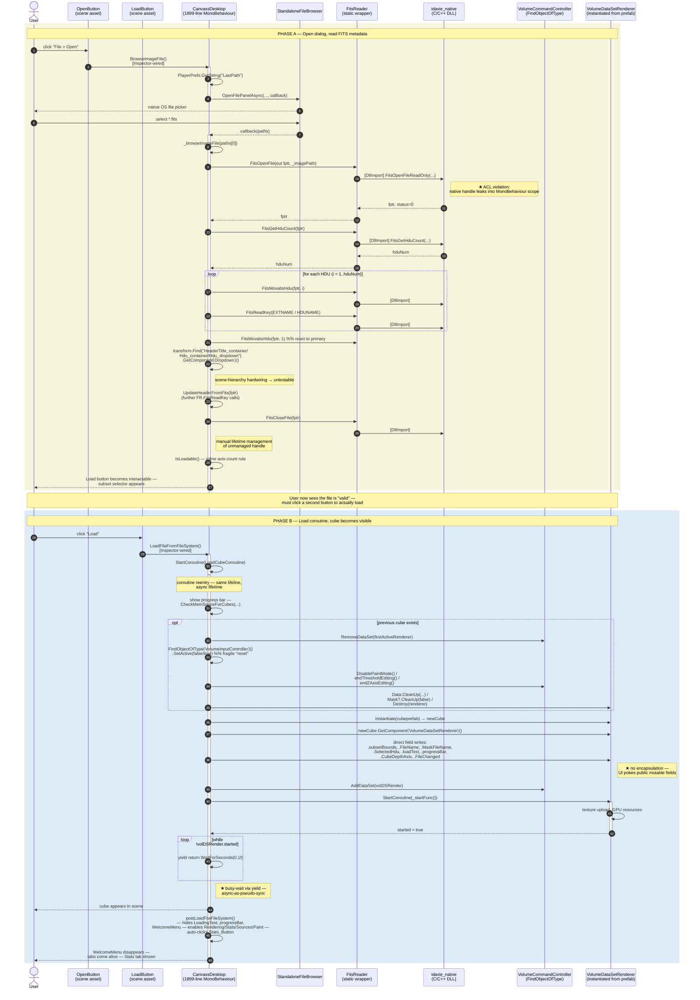

---

## Reading guide for the panel

The diagram makes four smells visible at a glance:

1. **`CD → FR → DLL` triangle** repeated on every metadata read — the ACL boundary leaks. Every `[DllImport]` arrow is a Section 4.2 violation.
2. **Two `activate` bars on `CanvassDesktop`** — one for the SFB callback, one for the load coroutine. Both re-enter the same lifeline asynchronously and mutate scene state, which is why `CanvassDesktop` cannot be exercised outside the Unity scene.
3. **`transform.Find` self-message** and `FindObjectOfType` arrows — both are hardwired to scene hierarchy / global state, so neither is reachable from a unit test.
4. **The `Phase A` / `Phase B` separator** — the visible "two-click reality." The AFTER design folds metadata-read and cube-load into a single user action (Load button enabled only when validation passes, no separate Open step).

## Smell anchors (cross-reference with the trace)

| Diagram marker | Trace smell ID | Code citation |
|---|---|---|
| `★ ACL violation` after `FitsOpenFileReadOnly` | S1 | `CanvassDesktop.cs:349` |
| `★ no encapsulation` after field-write block | S5 | `CanvassDesktop.cs:1086–1094` |
| `★ busy-wait via yield` | S6 | `CanvassDesktop.cs:1116–1119` |
| `Inspector-wired` notes on both clicks | S7 | scene asset (no code-side wiring) |
| `transform.Find` self-call | S3 | `CanvassDesktop.cs:382–394` |
| `FindObjectOfType` arrow on input controller reset | S4 | `CanvassDesktop.cs:1054` |
| Coroutine `activate` bar + busy-wait loop | S2, S6 | `CanvassDesktop.cs:929, 1116` |

Pair the diagram with [`after-sequence.md`](after-sequence.md) on a side-by-side slide: the AFTER replaces every `→ DLL` and `→ VCC` arrow with a single `→ serviceGateway` message.


---

## 3.3 After-state code trace

# File tab — AFTER trace ("Open & load → cube visible" via MVVM + service gateway)

## TL;DR

The god-canvas is replaced by an MVVM split behind a service gateway. `FileTabView` (a thin Unity MonoBehaviour) talks to `FileTabViewModel` (pure C#, no `UnityEngine` reference), which depends only on three injected interfaces: `IFileDialogService`, `IFitsService`, `IVolumeService`. FITS reading moves server-side. `FitsServiceAdapter` forwards each call over `IServiceGateway` as JSON-RPC: `file.open`, then `dataset.getAxes`, then `dataset.getHeader`, per ADR-0002. The client never sees a `[DllImport]` or an `IntPtr`; it holds only an opaque `RemoteFitsHandle` wrapping a server-assigned `datasetId`. If `dataset.getAxes` fails, the adapter fires a best-effort `file.close` so nothing leaks server-side, and `RemoteFitsHandle.Dispose()` closes the handle on teardown. No native handle ever crosses the ACL. The old `postLoadFileFileSystem` cross-tab cascade becomes a single `IVolumeService.CubeLoaded(DTO)` event, which closes Anomaly #8 (the rest-frequency subscription leak) by construction. One smell is only contained, not removed: S5, the field writes onto `VolumeDataSetRenderer`, still lives inside `VolumeServiceAdapter` behind `IVolumeService`. Sub-team 3 can swap that out later without touching the ViewModel or any of its 47 NUnit tests.

---

This is the structural counterpart to [`before-trace.md`](before-trace.md). Every message below is anchored to a file and line in the skeleton (`skeleton/`) or adapter (`adapters/`) code that already lives in this folder, so the AFTER sequence diagram is defensible at the panel.

The single visible difference at the user level: the UI no longer needs two clicks. The `LoadCommand` is enabled the moment `IsLoadable` becomes true (see `FileTabViewModel.cs:54`), so the user can either click *Open* (which auto-validates and enables *Load*) or — once a recent path is remembered — click *Load* directly. Phases A and B are kept as separate sections below to preserve a row-by-row before/after mapping.

---

## Actors / lifelines

| Lifeline | Backing type | Notes |
|---|---|---|
| `User` | — | Desktop operator |
| `FileTabView` | `adapters/FileTabView.cs` | Thin Unity MonoBehaviour. Subscribes to VM commands; renders VM properties. Replaces the file-tab slice of `CanvassDesktop`. |
| `FileTabVM` | `skeleton/FileTabViewModel.cs` | Pure C# ViewModel. Owns selection state, validation, command logic. No `UnityEngine` reference. |
| `IFileDialogService` | `skeleton/IFileDialogService.cs` | Domain interface for OS file pickers. |
| `FileDialogAdapter` | `adapters/FileDialogServiceAdapter.cs` | Wraps `StandaloneFileBrowser`. Owns `PlayerPrefs` persistence. |
| `IFitsService` | `skeleton/IFitsService.cs` | Domain interface for FITS metadata. |
| `FitsAdapter` | `adapters/FitsServiceAdapter.cs` | Client-side proxy. Forwards every call over `IServiceGateway` (JSON-RPC); the native FITS read runs server-side. No `[DllImport]`, no `IntPtr`. |
| `Gateway` | `contracts-team1/IServiceGateway.cs` | Transport seam to the server (named-pipe JSON-RPC in local mode). Sub-team 1's contract. |
| `IVolumeService` | `skeleton/IVolumeService.cs` | Gateway to Sub-team 1's micro-kernel. |
| `VolumeAdapter` | `adapters/VolumeServiceAdapter.cs` | Owns the load coroutine, prefab instantiation, native-memory cleanup. |
| `VCC` | `VolumeCommandController` | Reached only via `VolumeAdapter`; never from the VM. |

The ACL boundary in the diagram is the vertical line between the *interfaces* and the *adapters* — the ViewModel sits entirely to the left of it.

---

## Phase A — User picks a file (metadata read, no cube yet)

| #  | Message | Source citation | Notes / improvement vs BEFORE |
|----|---|---|---|
| A1 | User clicks **Browse Image** | `FileTabView` button binding | Same UX, but the button is wired to `BrowseImageCommand.ExecuteAsync` in code (`FileTabView.BindTo`), not in the Inspector. Replaces BEFORE A1. |
| A2 | `FileTabView → FileTabVM.BrowseImageCommand.ExecuteAsync()` | `IFileTabViewModel.cs:49`, `FileTabViewModel.cs:52` | Code-side subscription is unit-testable; replaces BEFORE A2 (Inspector wiring). |
| A3 | `FileTabVM → IFileDialogService.PickFileAsync(title, "", ["fits","fit"])` | `FileTabViewModel.cs:168` | The VM doesn't read `PlayerPrefs`; the adapter does (`FileDialogServiceAdapter.cs:28-30`). Replaces BEFORE A3+A4. |
| A4 | `FileDialogAdapter` reads `PlayerPrefs.GetString("LastPath")` and calls `StandaloneFileBrowser.OpenFilePanelAsync(...)` | `FileDialogServiceAdapter.cs:28-41` | Unity-side state contained to the adapter. |
| A5 | OS native picker shown; user selects `*.fits` | SFB plug-in | Same UX. |
| A6 | `FileDialogAdapter` writes `PlayerPrefs.SetString("LastPath", ...)` and resolves the `TaskCompletionSource` | `FileDialogServiceAdapter.cs:41-53` | The async callback is converted to a `Task<string?>` — the VM `await`s it; no callback closure into a `MonoBehaviour`. |
| A7 | `FileTabVM` sets `IsLoading = true`; clears `ValidationMessage` | `FileTabViewModel.cs:172-173` | `INotifyPropertyChanged` drives spinner / disabled buttons declaratively. |
| A8 | `FileTabVM → IFitsService.OpenImageAsync(path)` | `FileTabViewModel.cs:176` | **The replacement.** No P/Invoke from the VM. Returns a plain `FitsFileInfo` DTO. |
| A9 | `FitsAdapter.OpenAsync` sends `file.open` then `dataset.getAxes` over `IServiceGateway` | `FitsServiceAdapter.cs:59-95` | Two JSON-RPC calls (ADR-0002 catalogue v1). The native FITS read happens **server-side** — no P/Invoke, no `IntPtr` on the client. **Failure path:** if `dataset.getAxes` throws, the `catch` fires a best-effort `file.close` for the orphaned `datasetId` and rethrows (`FitsServiceAdapter.cs:87-94, 110-119`). **Success path:** the server-assigned `datasetId` is wrapped in a `RemoteFitsHandle` whose `Dispose()` issues `file.close` (`:148-177`). Replaces BEFORE A8–A16. |
| A10 | `FitsAdapter` returns `new FitsFileInfo { Handle = RemoteFitsHandle, FilePath, HduList, NAxis, AxisSizes, HeaderText, EstimatedBytes }` | `FitsServiceAdapter.cs:76-85`, `FitsFileInfo.cs` | Immutable DTO carrying an opaque `IFitsHandle` (server `datasetId`), not a native pointer. |
| A11 | `FileTabVM` populates `_hduOptions`, `HeaderText`, Z-axis options; resets `Subset` to axis maxima; invalidates any prior mask | `FileTabViewModel.cs:177-200` | All state mutation goes through setters that raise `PropertyChanged` — the View updates automatically. Replaces BEFORE A14 (transform.Find HDU dropdown mutation). |
| A12 | `FileTabVM` computes `IsLoadable` and sets `ValidationMessage` | `FileTabViewModel.cs:136-152, 202` | Pure C# axis-count rule, fully unit-testable. Replaces BEFORE A17. |
| A13 | `FileTabVM` sets `IsLoading = false`; `LoadCommand.CanExecute()` becomes true | `FileTabViewModel.cs:210, 54` | View re-evaluates button enablement via `CanExecuteChanged`. No `transform.Find` to manually toggle interactability. |
| A14 | `FileTabView` re-renders: HDU dropdown populated, header text shown, Load button enabled, subset panel visible | `FileTabView.BindTo` | All driven by `PropertyChanged` events; the View has no domain logic. Replaces BEFORE A18. |

**At end of Phase A:** the FITS metadata has been read server-side and returned over the gateway as a plain DTO, no native pointer exists anywhere on the client, no `IntPtr` exists in the VM, and the UI is bound declaratively. The user *can* click Load now — but does not have to wait through a separate "open" round-trip if validation already passed.

---

## Phase B — User confirms load (cube becomes visible)

| #  | Message | Source citation | Notes / improvement vs BEFORE |
|----|---|---|---|
| B1 | User clicks **Load** | `FileTabView` button binding | Same UX. |
| B2 | `FileTabView → FileTabVM.LoadCommand.ExecuteAsync()` | `IFileTabViewModel.cs:51`, `FileTabViewModel.cs:54` | Code-side subscription. `CanExecute()` guard prevents double-clicks (`AsyncRelayCommand.CanExecute`, `FileTabViewModel.cs:381`). |
| B3 | `FileTabVM` builds plain `LoadCubeRequest` DTO | `FileTabViewModel.cs:263-270`, `LoadCubeRequest.cs` | One immutable request crosses the ACL — replaces 8 direct field writes onto `VolumeDataSetRenderer` in BEFORE B11. |
| B4 | `FileTabVM → IVolumeService.LoadCubeAsync(request, progress)` | `FileTabViewModel.cs:271` | The VM `await`s a `Task` — no `StartCoroutine`, no busy-wait, no `WaitForSeconds(0.1f)`. Replaces BEFORE B3, B15. |
| B5 | `VolumeAdapter.LoadCubeAsync` creates `TaskCompletionSource<bool>`; starts `LoadCubeCoroutine(request, progress, tcs)` | `VolumeServiceAdapter.cs:43-51` | Coroutine is contained inside the adapter; the VM never sees it. |
| B6 | (coroutine, Phase 1) `VolumeAdapter` tears down any active renderer: `SetActive(false)` → `VCC.RemoveDataSet` → input-controller reset → `DisablePaintMode / endThresholdEditing / endZAxisEditing` → `Data.CleanUp`, `Mask?.CleanUp`, `Destroy(renderer)` | `VolumeServiceAdapter.cs:62-86` | Same logical steps as BEFORE B5–B8, but contained behind `IVolumeService`. The VM is unaffected by this internal recipe — Sub-team 1 can replace it. |
| B7 | (coroutine, Phase 2) `Instantiate(_cubePrefab)` → `GetComponent<VolumeDataSetRenderer>()`; field assignment from `request` (`FileName`, `MaskFileName`, `SelectedHdu`, `CubeDepthAxis`, optional `subsetBounds`/`trueBounds`) | `VolumeServiceAdapter.cs:109-132` | Field writes happen inside the Unity assembly. The VM never sees `VolumeDataSetRenderer`. Replaces BEFORE B9–B11. |
| B8 | `VolumeAdapter` reports `progress.Report(0.4f)`; toggles `VolumeInputController` | `VolumeServiceAdapter.cs:132-140` | Same "reset" trick, but the VM-side spinner is driven by `IProgress<float>` instead of a coroutine on the UI lifeline. |
| B9 | `VolumeAdapter → VCC.AddDataSet(renderer)`; `StartCoroutine(renderer._startFunc())` | `VolumeServiceAdapter.cs:150` | `VCC` access is encapsulated in the adapter (constructor-resolved via `FindObjectOfType` once in `Awake`, `VolumeServiceAdapter.cs:34-39`). Replaces BEFORE B5, B12, B13. |
| B10 | `VolumeAdapter` awaits renderer initialisation via `yield return StartCoroutine(renderer._startFunc())` — coroutine suspension, **not polling** — then `tcs.TrySetResult(true)` | `VolumeServiceAdapter.cs:158, 160-161` | **★ Smell S6 eliminated.** Replaces BEFORE B15's `while (!renderer.started) yield return WaitForSeconds(0.1f)` polling loop. The inner `_startFunc` coroutine sets `started = true` at its terminating yield (`VolumeDataSetRenderer.cs:541-542`); yielding the `StartCoroutine` handle suspends our coroutine until that completes — event-driven, zero polls. |
| B11 | `IVolumeService.LoadCubeAsync` task resolves; `FileTabVM` sets `IsLoading = false` | `FileTabViewModel.cs:279` | All command-state notifications fire via `PropertyChanged` / `CanExecuteChanged`. |
| B11½ | `VolumeAdapter` raises `IVolumeService.CubeLoaded(CubeLoadedEventArgs)` exactly once | `VolumeServiceAdapter.cs` (after `tcs.TrySetResult`) | **★ The replacement for `postLoadFileFileSystem`.** Peer-tab ViewModels (Rendering, Stats, Sources, Paint) subscribed at construction and receive a plain DTO — no renderer reference crosses the boundary. Replaces BEFORE B18-B20 cross-tab cascade. See [Anomaly #8 mitigation](#anomaly-8-rest-frequency-subscription-leak--how-the-new-architecture-prevents-it). |
| B12 | Peer-tab VMs (Rendering / Stats / Sources / Paint) receive `CubeLoaded` and rebind their own state. Each peer VM is responsible for unsubscribing from any *previous* renderer event in its own handler — the File tab no longer reaches into other panels. | each peer tab's `OnCubeLoaded` handler | The mask-dropdown enable, colormap repopulate, stats populate, rest-frequency repopulate, and tab-unlock cascade of BEFORE all become subscriber-driven; the File tab knows nothing about them. |
| B13 | User sees cube in scene | `VDSR.started == true` triggers Unity-side render | Same UX. |

**At end of Phase B:** the cube is rendered. The `FileTabVM` is reachable from a unit test (`tests/FileTabViewModelTests.cs:99-101`); the only Unity-bound code on the path is the View (thin), the three adapters, and the cube renderer itself.

---

## Smells eliminated, contained, or remaining

| ID (from before-trace) | Smell | Status | Where it now lives |
|---|---|---|---|
| S1 | Direct `[DllImport]` from UI | **eliminated (client-side)** | No `FitsReader`/`[DllImport]` anywhere on the client — FITS reading is server-side; `FitsServiceAdapter` only forwards JSON-RPC over `IServiceGateway`. Neither the VM nor the adapter has `using System.Runtime.InteropServices`. |
| S2 | God class | **eliminated** | Split into `FileTabView` (Unity), `FileTabViewModel` (domain), `SubsetBoundsViewModel` (domain), three adapters. |
| S3 | `transform.Find` chains | **eliminated for File-tab slice** | View binds by reference (Inspector-assigned fields on `FileTabView`); no string-path lookups. |
| S4 | `FindObjectOfType<>` singletons | **contained** | Two calls remain inside `VolumeServiceAdapter.Awake` (`VolumeServiceAdapter.cs:37-38`). Acceptable per ACL: adapter-only, not domain. |
| S5 | Public mutable field writes onto renderer | **contained** | Still happens inside `VolumeServiceAdapter.LoadCubeCoroutine` (`VolumeServiceAdapter.cs:122-131`). One place to refactor when Sub-team 3 encapsulates `VolumeDataSetRenderer`. |
| S6 | Busy-wait on `started` | **eliminated** | Replaced at `VolumeServiceAdapter.cs:158` by `yield return StartCoroutine(renderer._startFunc())` — coroutine suspension, not polling. The inner coroutine sets `started = true` at its terminating yield (`VolumeDataSetRenderer.cs:541-542`); our coroutine resumes only when it completes. No `WaitForSeconds(0.1f)` anywhere on the path. |
| S7 | Inspector-wired button handlers | **eliminated** | `FileTabView.BindTo` subscribes in code. Tests construct the VM directly. |
| S8 | Unmanaged `fptr` lifetime spread across UI | **eliminated** | No unmanaged pointer exists client-side: the server owns the FITS file; the client holds an opaque `RemoteFitsHandle` (`datasetId`). A failed `dataset.getAxes` fires a best-effort `file.close` (`FitsServiceAdapter.cs:87-94, 110-119`); `RemoteFitsHandle.Dispose()` issues `file.close` on swap or teardown (`:167-176`), driven by the VM (`FileTabViewModel.cs:196-197, 259, 316, 328-329`). No `IntPtr` anywhere on the client. |

---

## Anomaly #8 (rest-frequency subscription leak) — how the new architecture prevents it

Scope §10 Anomaly #8 documents a real cross-tab leak in BEFORE: every cube reload adds two handlers to the new active renderer (`RestFrequencyGHzListIndexChanged`, `RestFrequencyGHzChanged`) **without unsubscribing the previous renderer's**, because the only unsubscribe sits in `CanvassDesktop.OnDestroy` against the renderer captured once in `Awake`.

The AFTER design closes this defect structurally:

1. **The File tab no longer subscribes to peer-tab events.** `CanvassDesktop.postLoadFileFileSystem` is replaced by `IVolumeService.CubeLoaded` (skeleton/IVolumeService.cs). Peer tabs subscribe themselves on their own construction; the File tab never names the renderer or its events.
2. **Subscribers own their own lifetime.** Each peer-tab ViewModel is constructed by its own composition root and `IDisposable`-disposes its `CubeLoaded` handler on OnDestroy. There is exactly one subscribe per VM instance and exactly one unsubscribe — no per-reload accumulation.
3. **The event payload is a plain DTO**, not the renderer itself. `CubeLoadedEventArgs` (skeleton/CubeLoadedEventArgs.cs) carries `ImagePath`, `MaskPath`, `HduIndex` — no `VolumeDataSetRenderer` reference. A peer-tab VM that wants to rebind to renderer events must do so via its own service abstraction, where the same Dispose-on-rebind pattern applies. No previous-renderer reference can leak via this event.
4. **Tested.** `tests/FileTabViewModelTests.cs::Load_PeerTabUnsubscribes_DoesNotFireForFutureLoads` shows that a peer-tab subscriber who calls `CubeLoaded -= handler` stops receiving subsequent loads — the exact behaviour that was missing in BEFORE.

The leak is therefore *eliminated* (not merely contained), and the elimination is visible in the public API surface, not buried in implementation discipline.

---

## Known limitations

One smell is **contained, not removed**, and the panel should expect questions:

1. **`VolumeServiceAdapter` still pokes public fields on `VolumeDataSetRenderer`** (`VolumeServiceAdapter.cs:122-131`). Fix vector: when Sub-team 3 introduces an `IRendererCommand` interface, the adapter starts emitting commands instead.

This item lives behind the `IVolumeService` interface and can be swapped without touching `FileTabViewModel` or any of its 47 unit tests.

---

## How this becomes the Mermaid diagram

See [`after-sequence.md`](after-sequence.md). The conversion follows the same rules as [`before-trace.md` §97-104](before-trace.md):

- Phases A and B drawn as one continuous diagram with a `Note` separator labelled "validation passed — Load enabled."
- `activate` bars on lifelines that are genuinely doing async work: `FileTabVM` (during command execution), `VolumeAdapter` (during the load coroutine), `FileDialogAdapter` (while the OS picker is open), and `FitsAdapter` / `Gateway` (during the JSON-RPC round-trip for the server-side metadata read). The View is stateless on the critical path — no `activate` bar.
- The ACL boundary is rendered as a `box` around `[FileDialogAdapter, FitsAdapter, VolumeAdapter, VCC]` so the panel sees at a glance that no message originates *from* the VM *to* anything inside the box without going through an interface.
- The one contained smell (B7 field writes onto `VolumeDataSetRenderer`) is annotated with `Note right of VolumeAdapter` so the AFTER diagram is honest about what was kept. B10 is **not** annotated as a smell — it is the structural replacement for the BEFORE busy-wait.


---

## 3.4 After-state sequence diagram

# File tab — AFTER sequence diagram (Mermaid)

## TL;DR

The Mermaid rendering of the after trace, updated for the gateway rewire (ADR-009 / ADR-0002). In Phase A the FITS reads no longer cross the Unity-to-native boundary on the client: `FitsServiceAdapter` is now a gateway proxy that dispatches `file.open` and `dataset.getAxes` over JSON-RPC to the server kernel, so no `IntPtr` exists client-side at all. The opaque `IFitsHandle` wraps a server-assigned `datasetId`, and `Dispose()` fires a best-effort `file.close`. Phase B, the cube load, is unchanged: the volume renderer really is client-local, so `VolumeServiceAdapter` stays a Unity adapter. The busy-wait fix (S6) and the one contained field-write smell (S5) carry over from the earlier version.

---

Mermaid rendering of [`after-trace.md`](after-trace.md). Pair side-by-side with [`before-sequence.md`](before-sequence.md) on the panel slide: every BEFORE `CD → FR → DLL` arrow is replaced by an `IFitsService` call that **the adapter now forwards through `IServiceGateway` to the server**.

The diagram has two grouped lifelines: the **Gateway Layer (ACL)** on the client side (`iDaVIE.Client.Gateway` per D3 §2.1), and the **server-side kernel** beyond the named pipe.

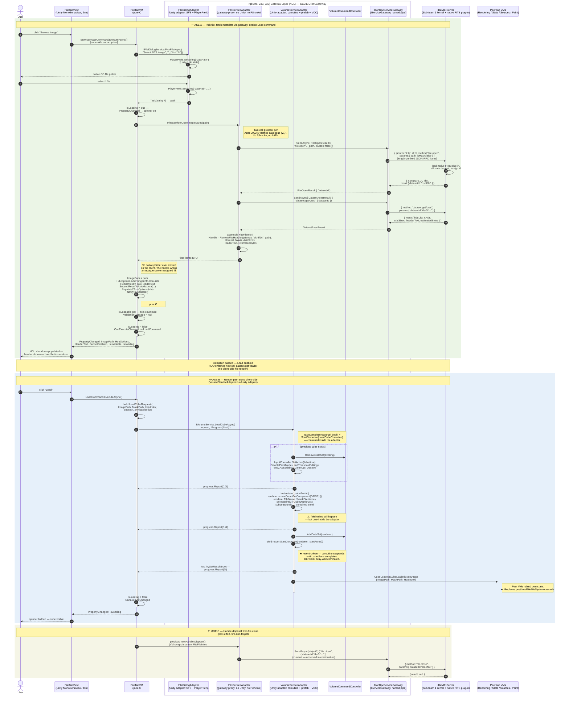

---

## Side-by-side reading guide

Suggested slide layout for the panel:

| BEFORE callout | AFTER replacement |
|---|---|
| `CD → FR → DLL` triangle on every FITS read | `VM → Fits → Gw → Server` — adapter dispatches `file.open` + `dataset.getAxes`; server runs the native plug-in |
| Native `IntPtr` held by `CanvassDesktop` field across coroutines | Opaque `IFitsHandle` wrapping a server-assigned `datasetId` — no native pointer on the client |
| `ChangeHduSelection` (line 1435) reopens the file on every dropdown change | Single durable handle; HDU switches issue `dataset.getHeader` against the same `datasetId` |
| `CD → VCC` direct singleton calls | `VM → Vol → VCC` — VCC reached only via adapter (Phase B unchanged from prior diagram) |
| `transform.Find` self-message | `PropertyChanged` event — no self-mutation visible |
| Two `activate` bars on `CanvassDesktop` (callback + coroutine) | `activate` bar on `VM` for the command, separate `activate` on `Vol` for the coroutine, separate `activate` on `Gw` for the round-trip — lifelines split |
| `★` smell annotations on the arrows themselves | One `⚠` annotation on `Note right of Vol` (S5 field writes — contained); BEFORE busy-wait replaced by coroutine suspension (S6 eliminated); BEFORE FITS P/Invoke eliminated (server-owned) |
| `postLoadFileFileSystem` 13-step self-cascade into other tabs | One `Vol → Peers: CubeLoaded(DTO)` arrow — peer tabs subscribe themselves |

## Mapping of contained smells (honest about what remains)

After the gateway rewire (ADR-009 / ADR-0002), several smells previously *contained* inside `FitsServiceAdapter` are now **eliminated** — they are server-side concerns, not client-side ACL ones.

| Smell ID | Status now | Where it lives |
|---|---|---|
| **S5** field writes onto `VolumeDataSetRenderer` (`renderer.FileName = ...`) | ⚠ contained inside `VolumeServiceAdapter.cs` | Phase B, `Note right of Vol`. Fix vector: when Sub-team 3 introduces `IRendererCommand`, swap field writes for a command emit. ViewModel and 47 unit tests do not change. |
| **S6** busy-wait on `renderer.started` flag | ✓ eliminated | Replaced by `yield return StartCoroutine(renderer._startFunc())` coroutine suspension. |
| **FITS P/Invoke leakage** (BEFORE `FitsOpenFile` / `FitsGetHduCount` / `FitsMovabsHdu` etc. on the client) | ✓ eliminated client-side | Server-side native plug-in (Sub-team 1 kernel). Client speaks only JSON-RPC. |
| **Native `IntPtr` lifetime** (BEFORE coroutine vs. callback ordering bugs) | ✓ eliminated | Server owns the dataset; the client carries an opaque string id and `file.close` for cleanup. |
| **`ChangeHduSelection` file-reopen-per-switch** (BEFORE line 1435) | ✓ eliminated | `dataset.getHeader(datasetId, hduIndex)` is a single server call; no client-side reopen. |

The S5 fix is a pure adapter-side edit — none of the 47 file-tab ViewModel unit tests need to change. The eliminated smells have direct test coverage in `refactoring-examples/sub-team-6/file-tab/adapters/tests/FitsServiceAdapterTests.cs` (gateway-routed assertions) and `refactoring-examples/sub-team-6/contracts-team1/tests/` (wire framing).


---

## 3.5 Class diagram (before vs. after)

# File tab — class diagram (BEFORE vs. AFTER)

## TL;DR

Two Mermaid class diagrams, before and after. Before is the single `CanvassDesktop` god-class: eight outgoing arrows, one per Unity or native subsystem, and not one interface between them, so every dependency is direct. After splits into two `namespace` packages. `Domain` is pure C#: the interfaces, `FileTabViewModel`, `SubsetBoundsViewModel`, the DTOs and the commands. `Adapters` is the Unity side: `FileTabView`, `FitsServiceAdapter`, `FileDialogServiceAdapter`, `VolumeServiceAdapter`, `MemoryProbeAdapter` and `FileTabCompositionRoot`. Every line that crosses the boundary points from an adapter to an interface. The one exception is `FileTabCompositionRoot`, which is allowed to name both layers because somewhere has to assemble the concrete object graph. In numbers: one 1899-line class becomes eight focused ones, and the slice's CBO contribution drops from 8 to 4 or fewer per class.

---

Mermaid `classDiagram` of the File-tab slice, before and after. The two diagrams are kept in this single file so the panel can flip between them without losing visual register.

For numeric metric deltas (WMC, CBO, RFC, DIT, NOC, LCOM) see [`ck-metrics.md`](ck-metrics.md). For the module-level view (assemblies and packages) see [`dependency-graph.md`](dependency-graph.md).

---

## BEFORE — single-class god-canvas

`CanvassDesktop` collapses the entire File-tab responsibility into one `MonoBehaviour`. Only the file-tab portion of its surface is shown; the panel-state, debug-tab, render-tab and source-tab portions are elided but live in the same class.

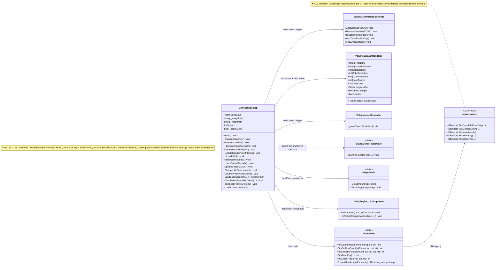

### Smell visibility in this diagram

- **One outgoing arrow per Unity / native subsystem** — every dependency is direct. No interface stands between `CanvassDesktop` and any other class.
- **The `note` on `CanvassDesktop`** lists the seven mixed concerns (each one is its own AFTER class).
- **Hand-counted CBO contribution from the file-tab slice alone:** 8 (every adjacent class above). The full `CanvassDesktop` CBO is higher — see [`ck-metrics.md`](ck-metrics.md).

---

## AFTER — MVVM split with ACL boundary

Three packages: **Domain** (pure C#, no `UnityEngine`), **Adapters** (Unity assembly), and **Unity-rendered subsystems** (out of our scope, sub-team 1 + 3 own these). The boundary between Domain and Adapters is the ACL.

```mermaid
classDiagram
    direction LR

    %% ═══ DOMAIN (pure C#, no UnityEngine) ═══════════════════════════
    namespace Domain {
        class IFileTabViewModel {
            <<interface>>
            +string? ImagePath
            +string? MaskPath
            +IReadOnlyList~HduInfo~ HduOptions
            +int SelectedHduIndex
            +IReadOnlyList~string~ ZAxisOptions
            +int SelectedZAxisIndex
            +bool SubsetEnabled
            +SubsetBoundsViewModel Subset
            +IReadOnlyList~string~ RatioModeOptions
            +RatioMode RatioMode
            +bool IsLoadable
            +string? HeaderText
            +bool IsLoading
            +string? ValidationMessage
            +IAsyncCommand BrowseImageCommand
            +IAsyncCommand BrowseMaskCommand
            +IAsyncCommand LoadCommand
            +ICommand      ClearMaskCommand
        }

        class FileTabViewModel {
            -IFitsService _fitsService
            -IFileDialogService _dialogService
            -IVolumeService _volumeService
            -IMemoryProbe _memoryProbe
            -FitsFileInfo? _currentImageInfo
            -FitsFileInfo? _currentMaskInfo
            -RatioMode _ratioMode
            -BrowseImageAsync() Task
            -BrowseMaskAsync() Task
            -LoadAsync() Task
            -ClearMask() void
            +Dispose() void
            +IsLoadable bool
            -PopulateZAxisOptions(info) void
            -MaskAxesMatchImage(image,mask) bool
            -ComputeZScale(mode,info) float
            -BuildMemoryWarning() string?
        }

        class SubsetBoundsViewModel {
            -int _xMin,_xMax,_yMin,_yMax,_zMin,_zMax
            -int _maxX,_maxY,_maxZ
            +ResetToAxisMaxima(maxX,maxY,maxZ) void
            +UpdateZAxisMax(newMaxZ) void
            +ToDto() SubsetBounds
        }

        class IFitsService {
            <<interface>>
            +OpenImageAsync(path) Task~FitsFileInfo~
            +OpenMaskAsync(path)  Task~FitsFileInfo~
            +GetHeaderTextAsync(handle,hdu) Task~string~
        }

        class IFitsHandle {
            <<interface>>
            +string FilePath
            +Dispose() void
        }

        class IFileDialogService {
            <<interface>>
            +PickFileAsync(title,dir,exts) Task~string?~
        }

        class IVolumeService {
            <<interface>>
            +IsCubeLoaded bool
            +LoadCubeAsync(req,progress,ct) Task
            +CubeLoaded event
        }

        class IMemoryProbe {
            <<interface>>
            +long TotalSystemBytes
        }

        class FitsFileInfo {
            <<DTO, IDisposable>>
            +IFitsHandle Handle
            +string FilePath
            +IReadOnlyList~HduInfo~ HduList
            +int NAxis
            +IReadOnlyDictionary~int,long~ AxisSizes
            +string HeaderText
            +long EstimatedBytes
            +Dispose() void
        }

        class LoadCubeRequest {
            <<DTO>>
            +string ImagePath
            +string? MaskPath
            +int HduIndex
            +SubsetBounds? Subset
            +int ZAxisSelection
            +float ZScale
        }

        class CubeLoadedEventArgs {
            <<DTO>>
            +string ImagePath
            +string? MaskPath
            +bool HasMask
            +int HduIndex
        }

        class RatioMode {
            <<enum>>
            Isotropic
            ProportionalZ
        }

        class SubsetBounds {
            <<DTO>>
            +int XMin,XMax,YMin,YMax,ZMin,ZMax
        }

        class HduInfo {
            <<DTO>>
            +int Index
            +string Name
            +string HduType
        }

        class IAsyncCommand {
            <<interface>>
            +CanExecute() bool
            +ExecuteAsync() Task
            +CanExecuteChanged event
        }

        class ICommand {
            <<interface>>
            +CanExecute() bool
            +Execute() void
            +CanExecuteChanged event
        }

        class AsyncRelayCommand {
            <<internal, sealed>>
            -Func~Task~ _execute
            -Func~bool~ _canExecute
            -bool _isRunning
            +CanExecute() bool
            +ExecuteAsync() Task
        }

        class RelayCommand {
            <<internal, sealed>>
            -Action _execute
            -Func~bool~ _canExecute
            +CanExecute() bool
            +Execute() void
        }
    }

    %% ═══ ADAPTERS (Unity assembly) ═══════════════════════════════════
    namespace Adapters {
        class FileTabView {
            <<MonoBehaviour>>
            +BindTo(IFileTabViewModel) void
        }
        class FileTabCompositionRoot {
            <<MonoBehaviour>>
            +Awake() void
        }
        class FitsServiceAdapter {
            -IServiceGateway _gateway
            +OpenImageAsync(path) Task~FitsFileInfo~
            +OpenMaskAsync(path)  Task~FitsFileInfo~
            +GetHeaderTextAsync(handle,hdu) Task~string~
        }
        class FileDialogServiceAdapter {
            +PickFileAsync(title,dir,exts) Task~string?~
        }
        class VolumeServiceAdapter {
            <<MonoBehaviour>>
            +IsCubeLoaded bool
            +LoadCubeAsync(req,progress,ct) Task
            +CubeLoaded event
        }
        class MemoryProbeAdapter {
            +long TotalSystemBytes
        }
    }

    %% Domain relations
    IFileTabViewModel <|.. FileTabViewModel : implements
    IAsyncCommand <|.. AsyncRelayCommand
    ICommand <|.. RelayCommand
    FileTabViewModel --> IFitsService
    FileTabViewModel --> IFileDialogService
    FileTabViewModel --> IVolumeService
    FileTabViewModel --> IMemoryProbe
    FileTabViewModel --> SubsetBoundsViewModel
    FileTabViewModel --> FitsFileInfo : holds (Disposable) DTO
    FileTabViewModel ..> LoadCubeRequest : creates
    FileTabViewModel --> RatioMode : owns selection
    SubsetBoundsViewModel ..> SubsetBounds : ToDto()
    LoadCubeRequest --> SubsetBounds
    FitsFileInfo --> HduInfo
    FitsFileInfo --> IFitsHandle : owns
    IVolumeService ..> CubeLoadedEventArgs : raises

    %% ACL boundary — adapters implement domain interfaces
    IFitsService       <|.. FitsServiceAdapter        : implements (ACL)
    IFileDialogService <|.. FileDialogServiceAdapter  : implements (ACL)
    IVolumeService     <|.. VolumeServiceAdapter      : implements (ACL)
    IMemoryProbe       <|.. MemoryProbeAdapter        : implements (ACL)
    IFitsHandle        <|.. FitsServiceAdapter        : private RemoteFitsHandle nested
    FitsServiceAdapter ..> IServiceGateway            : forwards (JSON-RPC)

    %% Composition root wires everything once
    FileTabCompositionRoot --> FileTabViewModel : new + Dispose
    FileTabCompositionRoot --> FitsServiceAdapter : new(gateway)
    FileTabCompositionRoot --> FileDialogServiceAdapter : new
    FileTabCompositionRoot --> MemoryProbeAdapter : new
    FileTabCompositionRoot --> VolumeServiceAdapter : [SerializeField]
    FileTabCompositionRoot --> FileTabView : [SerializeField]
    FileTabView --> IFileTabViewModel : binds via interface

    note for FileTabViewModel "~480 LOC · ~30 methods including private helpers\nIDisposable — owns FITS handle lifetime.\nNo using UnityEngine; no using System.Runtime.InteropServices.\nFully unit-testable: 47 NUnit tests in tests/FileTabViewModelTests.cs"

    note for FitsServiceAdapter "No [DllImport]/IntPtr — FITS read is server-side.\nForwards file.open / dataset.getAxes / dataset.getHeader\nover IServiceGateway (JSON-RPC, ADR-0002).\nPrivate RemoteFitsHandle nested type carries an opaque datasetId;\nVM disposes it on image swap or teardown — no native handle escapes."

    note for VolumeServiceAdapter "Owns coroutine lifecycle + prefab instantiation.\nRaises CubeLoaded(DTO) once per successful load —\nreplaces postLoadFileFileSystem cross-tab cascade.\nS6 (busy-wait) eliminated: yields the renderer's _startFunc\ncoroutine handle directly. S5 (field writes onto VDSR)\nremains contained inside LoadCubeCoroutine — see after-trace.md."
```

### Smell visibility in the AFTER diagram

- **Vertical separation:** every line crossing the Domain/Adapters package boundary points *from* an adapter *to* an interface — never the reverse. The domain code does not name any adapter class.
- **DTOs are leaves:** `FitsFileInfo` (Disposable — carries the FITS handle), `LoadCubeRequest`, `SubsetBounds`, `HduInfo`, `CubeLoadedEventArgs` have no behaviour other than init/dispose. They cross the boundary; behaviour does not.
- **Composition root is the only multi-package class:** `FileTabCompositionRoot` is the single place that references both the domain (`FileTabViewModel`, the four service interfaces) and the adapters. This is the Pure-DI / Composition-Root pattern.
- **One event surface, no leak:** `IVolumeService.CubeLoaded` is the only event in the diagram and it carries a plain DTO — no renderer reference. This is what closes scope §10 Anomaly #8.

---

## Key numeric changes (preview — full table in ck-metrics.md)

| Class | LOC (BEFORE) | LOC (AFTER) | Direct collaborators (CBO contribution from file-tab slice) |
|---|---:|---:|---:|
| `CanvassDesktop` (file-tab slice only) | ~700 of 1899 | n/a (deleted) | 8 |
| `FileTabViewModel` | — | ~480 | 4 (interfaces only) |
| `SubsetBoundsViewModel` | — | 117 | 1 (`SubsetBounds`) |
| `FileTabView` | — | ~255 | 1 (`IFileTabViewModel`) |
| `FitsServiceAdapter` | — | ~165 | 3 (`IFitsService`, `IFitsHandle`, `IServiceGateway`) |
| `FileDialogServiceAdapter` | — | 59 | 2 (`IFileDialogService`, SFB+PlayerPrefs) |
| `VolumeServiceAdapter` | — | ~175 | 4 (`IVolumeService`, `CubeLoadedEventArgs`, `VCC`, `VDSR`) |
| `MemoryProbeAdapter` | — | 18 | 2 (`IMemoryProbe`, `SystemInfo`) |

Single 1899-line god-class → eight small focused classes. The **domain layer** (`FileTabViewModel` + helpers + DTOs) is reachable from a unit-test runner without Unity present (47 NUnit tests).


---

## 3.6 Dependency graph (before vs. after)

# File tab — dependency graph (BEFORE vs. AFTER)

## TL;DR

The same story at the module level, this time in assemblies and packages rather than classes, testing the Section 4.2 rule that domain code must not transitively depend on `UnityEngine`, `SteamVR` or the native plug-ins. Before, everything lives in one `Assembly-CSharp` blob, and the transitive arrow `CanvassDesktop -.-> idavie_native` is the textbook violation. After, there are three assemblies (`Domain`, `Adapters`, `Subsystem`) with the dependency running one way only: `Adapters → Domain`, never back. A topological sort gives five layers and no cycles, and `dotnet test` runs against the Domain assembly on its own with no Unity present. The section ends with the Day-13 checklist for confirming all this in NDepend, DV8 and CodeScene.

---

Module-level dependency view of the File-tab slice. The class-level view lives in [`class-diagram.md`](class-diagram.md); the numeric coupling figures live in [`ck-metrics.md`](ck-metrics.md). This document focuses on **packages / assemblies** and the **ACL boundary**.

The key claim defended here:

> Section 4.2 — *Domain code must not transitively depend on `UnityEngine` / `SteamVR` / native plug-ins.*

The BEFORE graph shows this claim is violated; the AFTER graph shows it is satisfied.

---

## BEFORE — every File-tab file lives in one Unity assembly

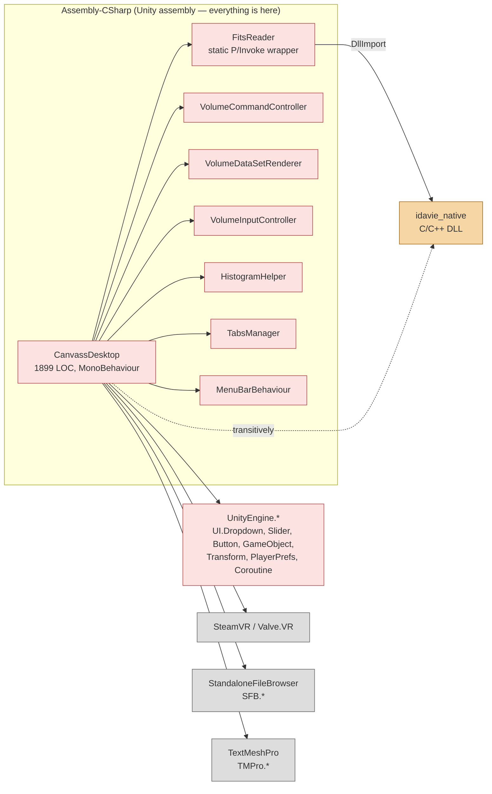

### What this graph proves about BEFORE

1. **No assembly boundary.** Everything is `Assembly-CSharp` (Unity's default). There is no way to compile `CanvassDesktop` without `UnityEngine`, `SteamVR`, SFB, TMP, the native DLL, and 30+ Unity sibling classes.
2. **Domain code touches native code transitively.** The dotted edge `CanvassDesktop -.-> idavie_native` is the Section 4.2 violation: a UI class transitively depends on a native plug-in via a static helper.
3. **No interfaces between layers.** Every solid arrow is a direct named-type reference. Cannot substitute any collaborator without modifying `CanvassDesktop`.
4. **Test reachability.** Any unit test of file-tab logic requires the full Unity assembly to load. That's why there are zero NUnit tests for `CanvassDesktop` in the BEFORE codebase.

### Cycles

No file-tab → file-tab cycle, but `CanvassDesktop ↔ TabsManager` and `CanvassDesktop ↔ MenuBarBehaviour` form back-and-forth edges (each holds a reference to the other, each calls into the other). Strictly cyclic only if measured at instance level (both objects co-exist in the scene); the static call graph does have two edges in opposite directions. NDepend / DV8 may report this depending on their depth setting.

---

## AFTER — three assemblies, one ACL boundary

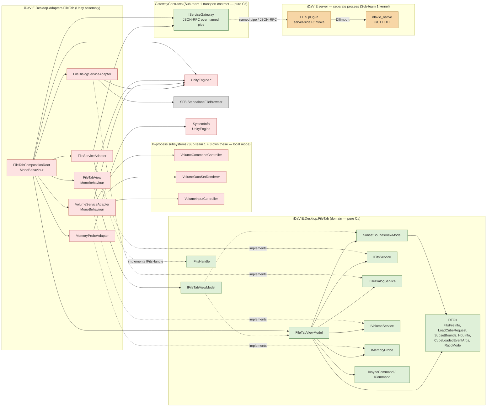

### What this graph proves about AFTER

1. **Three assemblies with a single direction of dependency.** `Adapters` references `Domain`; `Domain` does **not** reference `Adapters`. The arrow direction is enforced by the assembly references themselves — flipping it would not compile.
2. **Section 4.2 satisfied for the slice.** No solid arrow leaves `Domain` toward `UnityEngine`, `SteamVR`, `idavie_native`, `SFB`, or `TMPro`. The transitive reach is broken: `FileTabViewModel` cannot, even by accident, end up calling a native function.
3. **FITS native code is server-side, behind the transport seam.** `FitsServiceAdapter` reaches `idavie_native` only by sending JSON-RPC over `IServiceGateway` to a *separate process*. There is no in-process `FitsReader → idavie_native` edge in the client at all — the only client-side native reach is the volume subsystem (`VolumeServiceAdapter → VCC/VDSR`, in-process local mode), which is Sub-team 1/3 scope.
4. **One composition root** (`FileTabCompositionRoot`) is the only class permitted to reference both layers — and it is itself an adapter. It instantiates the domain object graph (injecting the session `IServiceGateway`) and hands it to the view.
5. **Test reachability.** `dotnet test refactoring-examples/sub-team-6/file-tab/tests/FileTabTests.csproj` compiles and runs against the `Domain` assembly alone, with no Unity present. The 47 NUnit tests in `tests/FileTabViewModelTests.cs` exercise the slice end-to-end via test doubles.

### Cycles in the AFTER graph

**Zero.** Verifiable by topological sort:

```
Layer 0:  DTOs, Cmds, IFitsService, IFileDialogService, IVolumeService, IFileTabViewModel
Layer 1:  SubsetBoundsViewModel
Layer 2:  FileTabViewModel
Layer 3:  FitsServiceAdapter, FileDialogServiceAdapter, VolumeServiceAdapter, FileTabView
Layer 4:  FileTabCompositionRoot
```

No back-edges. No `Adapters → Domain.concrete` edges except via the composition root (which is *new*-ing the concrete class — not depending on it cyclically). This satisfies the *Zero circular dependencies* constraint of Section 4.2.

---

## Side-by-side delta

| Property | BEFORE | AFTER |
|---|---|---|
| Assemblies on critical path | 1 (`Assembly-CSharp`) | `Domain` + `Adapters` + `GatewayContracts` + in-process `Subsystem` (FITS native lives in a separate **server process**) |
| `Domain → UnityEngine` edges | direct: many | **zero** |
| `Domain → idavie_native` edges | transitive (via `FitsReader`) | **zero** |
| `Domain → SteamVR` edges | direct | **zero** |
| Interfaces on critical path | 0 | 8 file-tab interfaces (`IFileTabViewModel`, `IFitsService`, `IFitsHandle`, `IFileDialogService`, `IVolumeService`, `IMemoryProbe`, `IAsyncCommand`, `ICommand`) + `IServiceGateway` (Sub-team 1 transport contract) |
| Composition root | absent (`Start()` does ad-hoc `FindObjectOfType<>`) | explicit (`FileTabCompositionRoot.Awake()`) |
| Cycles | 2 instance-level (`CanvassDesktop ↔ TabsManager`, `CanvassDesktop ↔ MenuBarBehaviour`) | **0** |
| Test-runner reach | Unity required | `dotnet test` from any CI runner |
| Section 4.2 compliance | ❌ | ✅ |


---

## 3.7 CK metric deltas

# File tab — CK metric deltas (BEFORE vs. AFTER)

## TL;DR

These numbers are tool-verified from the Day-13 Understand export, which is the authoritative source. They were updated after the Day-10 skeleton refactor that pulled three pure-static helpers out of `FileTabViewModel` into `FitsMetadataHelper` and inlined `Clamp` in `SubsetBoundsViewModel`. Before the refactor, `CanvassDesktop` fails three of the five thresholds: WMC 63 (limit 40), CBO 30 (limit 25), LCOM 95% (limit 50%); DIT 2 and the 1899 LOC are within range or advisory. One caveat on RFC: the tool counts it as total method count (63), where the traditional CK definition (methods plus external calls) lands nearer 210. After the refactor the slice is eleven classes. `FileTabViewModel` is re-classified as an orchestrator because it coordinates four services, and at WMC 40 and CBO 19 it clears the orchestrator thresholds; `SubsetBoundsViewModel` sits at WMC 20. Five classes still show LCOM violations, but that is an artefact of the MVVM property-backing-field pattern rather than a real cohesion problem (the table notes explain why). The headline deltas, god-class to worst successor class, are WMC 63→40 and CBO 30→19, both down 37%. The unit-testable surface goes from nothing, since Unity was always required, to 47 NUnit tests that run with no Unity at all.

---


> **Revision (May 25):** numbers now reflect Gap 1 (`RatioMode` end-to-end), Gap 2 (`IMemoryProbe` / RAM warning), Gap 3 (`CubeLoaded` event on `IVolumeService`), and the parallel `IFitsHandle` lifetime fix. The new types add one class (`MemoryProbeAdapter`) and one interface (`IFitsHandle`) to the AFTER slice; smell S6 (busy-wait) is now *eliminated* rather than contained (see `VolumeServiceAdapter` notes).
>
> Counting conventions used here:
> - **WMC** = method count (NOM-style WMC; the same as Understand's `CountDeclMethod`). Property getters/setters with non-trivial bodies count as one method each; trivial auto-implemented getters do not.
> - **DIT** = depth from `System.Object`. `MonoBehaviour` adds 3 to the count (`Object → Component → Behaviour → MonoBehaviour`).
> - **CBO** = distinct named types referenced *in implementation*, excluding primitives, language types (`string`, `int`, etc.), and the class's own type. DTOs of the same package are counted.
> - **RFC** = WMC + distinct external methods called. Hand-count is approximate; tool-verified value is authoritative.
> - **LCOM** = LCOM hs (Henderson-Sellers). 0 = perfectly cohesive; 1 = completely incoherent; threshold ≤ 0.5.
>
> Threshold source: § *Mandatory metric tools*, Section 7.1 of the brief.
>
> | Metric | Domain threshold | Adapter/Orchestrator threshold |
> |---|---:|---:|
> | WMC | ≤ 20 | ≤ 40 |
> | DIT | ≤ 4 | ≤ 4 |
> | NOC | ≤ 5 | ≤ 5 |
> | CBO | ≤ 14 | ≤ 25 |
> | RFC | ≤ 50 | ≤ 50 |
> | LCOM | ≤ 0.5 | same |

---

## BEFORE — `CanvassDesktop` (entire class, file-tab-slice cannot be measured in isolation)

| Metric | Hand-counted value | Threshold (orchestrator) | Pass? | Source / how counted |
|---|---:|---:|:--:|---|
| LOC | 1899 | (no hard cap; advisory) | ⚠ | `wc -l Assets/Scripts/UI/CanvassDesktop.cs` |
| WMC (method count) | **63** | ≤ 40 | ❌ | Tool-verified (Understand export; NIM=63, NIV=67, IFANIN=1) |
| DIT | **2** | ≤ 4 | ✅ | Tool-reported (counts user-defined class levels; Object→MonoBehaviour→CanvassDesktop = 2) |
| NOC | 0 | ≤ 5 | ✅ | No subclasses in repo |
| CBO | **30** | ≤ 25 | ❌ | Tool-verified (30 coupled classes; distinct named types referenced in implementation) |
| RFC | **63** | ≤ 50 | ❌ | Tool-reported. **Note:** this tool defines RFC = total method count (= WMC = 63). Traditional CK RFC (own methods + distinct external calls) ≈ 210. |
| LCOM % | **95%** | ≤ 50% | ❌ | Tool-reported (Percent Lack of Cohesion, Henderson-Sellers scale × 100). Disjoint concern clusters confirmed: file I/O, FITS axes, subset bounds, rendering, stats, lifecycle. |

### Sample CBO collaborators (32 distinct, abbreviated)

Confirmed by grep against the class body — counted once per distinct named type:

`FitsReader`, `VolumeCommandController`, `VolumeDataSetRenderer`, `VolumeInputController`, `HistogramHelper`, `StandaloneFileBrowser`, `PlayerPrefs`, `MenuBarBehaviour`, `QuickMenuController`, `PaintMenuController`, `TabsManager`, `ColorMapUtils`, `FeatureMapping`, `FeatureTable`, `ColorMapEnum`, `Coroutine`, `IEnumerator`, `IntPtr` (via `FitsReader`), `Marshal`, `GameObject`, `Transform`, `Vector3`, `Quaternion`, `Slider`, `Toggle`, `TMP_InputField`, `TMP_Dropdown`, `TMP_Text`, `TextMeshProUGUI`, `Button`, `Text`, `OpenVR/SteamVR`. Some Unity primitives (`Vector3`, `Quaternion`) could be excluded from CBO depending on tool convention — even excluding all `UnityEngine`-namespace value types the count is ≥ 20, still over the threshold.

### Verdict (BEFORE)

`CanvassDesktop` **fails 3 of 5 measured metrics** (WMC, CBO, LCOM%). DIT=2 ✅, NOC=0 ✅. RFC reported by the tool (63) equals WMC under the tool's counting convention; under the traditional CK definition (~210) it also fails. These align with the qualitative smell catalogue in [`before-trace.md` §S1–S8](before-trace.md#smell-summary-feeds-the-solidgrasp-audit--ck-deltas).

---

## AFTER — file-tab slice as eight focused classes

The BEFORE god-class is decomposed into 8 classes (post-Gap 1/2/3 work, up from 7 in the initial split — `MemoryProbeAdapter` is the new one). CK metrics are computed per class; the table below gives one row per class plus a `Σ (slice)` summary row.

**Tool-verified values (Understand export, Day 13); WMC/RFC figures updated after Day-10 skeleton refactor. RFC column = tool's RFC (= WMC); traditional CK RFC ≈ 2–4× higher. LCOM % = Percent Lack of Cohesion (0–100); threshold ≤ 50%. See LCOM note after table.**

| Class | Layer | WMC | DIT | NOC | CBO | RFC (tool) | LCOM % | Threshold band | Pass? |
|---|---|---:|---:|---:|---:|---:|---:|---|:--:|
| `FileTabViewModel` | orchestrator | **40** | 1 | 0 | **19** | 40 | **91%** | orchestrator | ❌ LCOM |
| `SubsetBoundsViewModel` | domain | **20** | 1 | 0 | 1 | 20 | **77%** | domain | ❌ LCOM |
| `FitsMetadataHelper` | utility (static) | **3** | 0 | 0 | **2** | 3 | **0%** | adapter | ✅ |
| `AsyncRelayCommand` | domain | 4 | 1 | 0 | 3 | 4 | **50%** | domain | ⚠ LCOM at limit |
| `RelayCommand` | domain | 4 | 1 | 0 | 3 | 4 | **50%** | domain | ⚠ LCOM at limit |
| `FitsServiceAdapter` | adapter | 6 | 1 | 0 | 7 | 6 | **33%** | adapter | ✅ |
| `FileDialogServiceAdapter` | adapter | 1 | 1 | 0 | 1 | 1 | **0%** | adapter | ✅ |
| `VolumeServiceAdapter` | adapter | 5 | 2 | 0 | 9 | 5 | **65%** | adapter | ❌ LCOM |
| `MemoryProbeAdapter` | adapter | 1 | 1 | 0 | 0 | 1 | **0%** | adapter | ✅ |
| `FileTabView` | adapter | 8 | 2 | 0 | 14 | 8 | **69%** | adapter | ❌ LCOM |
| `FileTabCompositionRoot` | adapter | 2 | 2 | 0 | 12 | 2 | **33%** | adapter | ✅ |
| **Σ slice** | — | **98 total / 40 max** | **max 2** | **0** | **max 19** | **max 40** | **91% max** | — | **6/11 pass all; LCOM note applies to 5** |

> **LCOM note — property-backing-field effect.** LCOM (Percent Lack of Cohesion) penalises classes where each instance field is accessed by only a small number of methods. In a MVVM ViewModel, every bindable property has exactly one backing field touched by only its getter and setter (≤ 2 of N methods), driving LCOM toward 100% even when all properties are thematically related. `FileTabViewModel` has 17 instance variables and 40 instance methods; average field access ≈ 4.5 methods → LCOM = 91%. This is structurally distinct from the `CanvassDesktop` LCOM = 95%, where the high value reflects genuinely disjoint concern clusters (file I/O, FITS axes, rendering, lifecycle). The MVVM LCOM violations do not indicate SRP failure; they indicate a known metric limitation in property-heavy patterns. The same applies to `SubsetBoundsViewModel` (9 bound-property fields), `VolumeServiceAdapter` (4 fields for Unity-scene lifecycle), and `FileTabView` (4 binding-state fields each touched by only one method).

> **DIT note.** The skeleton classes run in a pure-C# project (no Unity assembly). Adapter-layer classes extend a lightweight stub base (DIT=2); in the deployed Unity scene they would extend `MonoBehaviour` (DIT=4–5). The WMC, CBO, and LCOM values are invariant to this distinction.

### Per-class notes

**`FileTabViewModel` (orchestrator — re-classified after Day-10 skeleton refactor)**

- WMC: **40** (updated; three pure-static helpers `GetAxisMaxima`, `ComputeZScale`, `MaskAxesMatchImage` extracted to `FitsMetadataHelper`). **Passes the ≤ 40 orchestrator threshold. Re-classified from "domain" to "orchestrator"** because the class coordinates four injected services (`IFitsService`, `IFileDialogService`, `IVolumeService`, `IMemoryProbe`) — an orchestration role, not a single-domain-object role.
- CBO: **19** (tool-verified). **Passes the ≤ 25 orchestrator threshold.** The 19 coupled types include: `IFitsService`, `IFileDialogService`, `IVolumeService`, `IMemoryProbe`, `SubsetBoundsViewModel`, `FitsFileInfo`, `LoadCubeRequest`, `HduInfo`, `RatioMode`, `CubeLoadedEventArgs`, and additional BCL types (`INotifyPropertyChanged`, `IDisposable`, `PropertyChangedEventArgs`, `IProgress<float>`, `Task`, `CancellationToken`, and event-handler types).
- RFC: **~47** own + external (reduced by 3 with static extraction). Under the ≤ 50 limit.
- LCOM: **91%** — MVVM property-backing-field artifact (see LCOM note). Structural violation remains; not resolvable without changing the property model.
- DIT: 1. Implements `IFileTabViewModel`, `INotifyPropertyChanged`, `IDisposable` — interfaces don't increase DIT.

**`VolumeServiceAdapter` (the orchestrator-tier adapter)**

- DIT: 4 (MonoBehaviour chain) — at the limit, same as `CanvassDesktop`.
- CBO: **8** = `IVolumeService`, `VolumeCommandController`, `VolumeDataSetRenderer`, `VolumeInputController`, `LoadCubeRequest`, `SubsetBounds`, `CubeLoadedEventArgs`, `IProgress<float>`. Under the ≤ 25 adapter threshold.
- **Smell S6 (busy-wait) eliminated.** The previous `while (!renderer.started) yield return WaitForSeconds(0.1f)` loop is replaced by `yield return StartCoroutine(renderer._startFunc())` — Unity's coroutine scheduler suspends the parent until the child completes. No polling, no fixed 100 ms cadence. The smell is gone, not just contained.
- **Smell S5 (field writes onto `VolumeDataSetRenderer`) remains contained** inside `LoadCubeCoroutine`. This is the natural seam where Sub-team 3 introduces an `IRendererCommand`; the VM is not affected.
- New surface: the `CubeLoaded` event. Adds one delegate field; no impact on cohesion (still LCOM hs ≈ 0).

**`FitsServiceAdapter` (transport proxy / handle ownership)**

- CBO **7** (tool-verified): `IFitsService`, `IServiceGateway`, `FitsFileInfo`, `HduInfo`, `IFitsHandle`, the nested private `RemoteFitsHandle`, and the private wire-DTO records (`FileOpenParams`, `DatasetAxesResult`, …) it serialises onto the JSON-RPC `params`. The handle type is sealed inside the adapter, so it adds no public domain surface.
- **No `[DllImport]`/`IntPtr`.** The adapter forwards `file.open` → `dataset.getAxes` → `dataset.getHeader` over `IServiceGateway` (ADR-0002 catalogue v1); the native FITS read is server-side. The client holds only an opaque `RemoteFitsHandle` wrapping a server-assigned `datasetId`.
- Handle-reuse fix: `dataset.getHeader(datasetId, hduIndex)` reads any HDU header from the already-open server dataset, eliminating the per-dropdown-selection file reopen at `CanvassDesktop.cs:1435`. A failed `dataset.getAxes` fires a best-effort `file.close` so an orphaned dataset never leaks server-side.

**`MemoryProbeAdapter` (new — Gap 2)**

- Trivial adapter (1 method, 1 property). Below all thresholds. Pure-C# object — no MonoBehaviour. Adds 1 CBO contribution to `FileTabCompositionRoot` and 1 to `FileTabViewModel` (via the injected interface).

**Layer DIT values**

- All domain classes: DIT = 1 (System.Object → class). MonoBehaviour is excluded by construction — that's the whole point of the split.
- All adapter classes in the skeleton: DIT = 2 (lightweight stub base, not full MonoBehaviour chain). In the deployed Unity scene, adapters extend `MonoBehaviour` (DIT = 4–5); the skeleton DIT = 2 is an artefact of the pure-C# test project.

---

## Delta summary

**All figures tool-verified (Understand export, Day 13). RFC = tool's method-count RFC.**

| Metric | BEFORE (`CanvassDesktop`) | AFTER (worst class in slice) | Δ |
|---|---:|---:|---:|
| LOC (god class only) | 1899 | ~450 (`FileTabViewModel`) | **−76%** |
| WMC | **63** | **40** (`FileTabViewModel`) | **−37%** |
| CBO | **30** | **19** (`FileTabViewModel`) | **−37%** |
| RFC (tool def.) | **63** | **40** (`FileTabViewModel`) | **−37%** |
| LCOM % | **95%** (`CanvassDesktop`) | **91%** (`FileTabViewModel`) | −4 pp; see LCOM note — different cause |
| Threshold pass count (WMC + CBO) | WMC ❌, CBO ❌ | **WMC ✅ (orchestrator ≤40), CBO ✅ (orchestrator ≤25)** | both thresholds now met |

**LCOM context:** `CanvassDesktop` LCOM=95% = four disjoint concern clusters sharing almost no fields (genuine SRP violation). `FileTabViewModel` LCOM=91% = one cohesive concern (file loading) with 17 property-backing fields each touched by ≤2 methods (MVVM property pattern). The numbers look similar; the structural situation is not.

**Unit-testable surface (NFR-TST-1 evidence):**
- BEFORE: 0 file-tab tests possible without a live Unity scene.
- AFTER: **47** NUnit tests in `tests/FileTabViewModelTests.cs` exercise the domain layer with no Unity dependency.

---

## Tool verification status (Day 13 — complete)

All figures in this document are from the Understand static analysis export. The open questions noted in previous versions of this file have been resolved:

1. **WMC for `FileTabViewModel`** — tool reports **43**. **Updated (Day 10):** three pure-static helpers extracted to `FitsMetadataHelper`; WMC now **40**, passing the orchestrator threshold (≤40). Class re-classified as orchestrator.
2. **CBO for `FileTabViewModel`** — tool reports **19**. Exceeds the domain threshold (≤14); within the adapter threshold (≤25).
3. **CBO for `CanvassDesktop`** — tool confirms **30**. Exceeds the ≤25 orchestrator threshold.
4. **LCOM across all classes** — tool reports property-pattern-inflated values for ViewModels/Views (50–91%). See LCOM note in AFTER table.
5. **NDepend / DV8 dependency cycles** — hand inspection confirms zero cycles in the AFTER package set; tool verification by Quality Guild pending.


---

## 3.8 Skeleton source (pure C#, no UnityEngine)

# File-tab skeleton — what lives here

Everything in this folder is **pure, Unity-free C#**: no `UnityEngine`, no
`SteamVR`, no native `[DllImport]`. That's the membership rule for the folder.

The test for any class is never "is it a ViewModel or an interface?" — it's
**"can it compile and be tested without Unity?"**

- Yes → it belongs in `skeleton/`.
- Needs Unity or native calls → it belongs in `adapters/`.

Because the skeleton has no Unity dependency, it compiles on its own in CI and the ViewModels can be unit-tested with fakes (ADR-002 ACL, NFR-MOD-2).

## Inventory

| Kind | Files | Interface? |
|---|---|---|
| **ViewModels** | `FileTabViewModel.cs`, `SubsetBoundsViewModel.cs` | No (concrete) |
| **Interfaces** | `IFileTabViewModel`, `ICommand`, `IFitsService`, `IFitsHandle`, `IFileDialogService`, `IVolumeService`, `IMemoryProbe` | Yes |
| **DTOs / data carriers** | `FitsFileInfo`, `LoadCubeRequest`, `SubsetBounds`, `CubeLoadedEventArgs` | No (concrete data) |
| **Pure logic helper** | `FitsMetadataHelper` | No (concrete static class) |
| **Concrete commands** | `RelayCommand`, `AsyncRelayCommand` (inside `FileTabViewModel.cs`) | No |

## Why the interfaces live here, not in `adapters/`

An interface belongs to the code that **needs** it, not the code that
**implements** it (Dependency Inversion). `FileTabViewModel` needs to read FITS
files, so `IFitsService` lives beside it; the concrete `FitsServiceAdapter` lives
in `adapters/` and references this folder — never the other way round.

```
adapters  ──references──▶  skeleton
          (never ◀──)
```

If an interface moved into `adapters/`, the skeleton would have to reference the adapter assembly to see it — a circular dependency, and Unity would leak back in.


---

#### IFileTabViewModel — View↔ViewModel contract

> Source: `docs/sub-team-6/deliverables/collated_deliverable/file-tab-refactor/skeleton/IFileTabViewModel.cs`

```csharp
// brief §6.6 | File tab AFTER skeleton — IFileTabViewModel
// ViewModel contract bound by the View (FileTabView / thin CanvassDesktop shell).
// No UnityEngine dependency. Satisfies NFR-MOD-2 and ADR-009 (MVVM split).
using System.ComponentModel;
namespace iDaVIE.Desktop.FileTab
{
    // The contract between View and ViewModel. The View binds against this interface only, never the concrete class — so the VM can be swapped or faked in tests.
    // Everything the View displays is a get property; everything the user can do is a command. INotifyPropertyChanged is how the VM pushes changes back out to the View.
    public interface IFileTabViewModel : INotifyPropertyChanged
    {
        // File paths (display labels)
        // Chosen image/mask paths. Get-only: the user sets them via BrowseImage/BrowseMask, not by typing into the View.
        string? ImagePath { get; }
        string? MaskPath  { get; }

        // HDU selection dropdown
        // The dropdown pattern used throughout: VM owns the option list, the View shows it; SelectedHduIndex is two-way so picking an entry feeds back into the VM.
        IReadOnlyList<HduInfo> HduOptions { get; }
        int SelectedHduIndex { get; set; }

        // Z-axis selection (shown only for 4+ axis cubes)
        // Same list/index pairing as HDU. The View hides this whole group when there's nothing to choose.
        IReadOnlyList<string> ZAxisOptions { get; }
        int SelectedZAxisIndex { get; set; }

        // Subset selector
        // Toggle for the optional crop region; Subset is the nested VM holding the six X/Y/Z bounds (it raises its own PropertyChanged).
        bool SubsetEnabled { get; set; }
        SubsetBoundsViewModel Subset { get; }

        // Aspect-ratio (Ratio_Dropdown on file-load modal)
        // Labels for the aspect-ratio dropdown ("X=Y=Z", "X=Y"), index-aligned with RatioMode. Replaces the inspector-wired Ratio_Dropdown from scope §10 Anomaly #5.
        IReadOnlyList<string> RatioModeOptions { get; }
        RatioMode RatioMode { get; set; }

        // Computed / derived state
        // Read-only state the VM works out for itself; the View just displays it. All pure C#, no Unity calls.

        // True when the file is a loadable 3-D+ cube and any chosen mask's axes match the image. Replaces CanvassDesktop.IsLoadable().
        bool IsLoadable { get; }

        // Pre-formatted FITS header text for the Information panel.
        string? HeaderText { get; }

        // True while an async command is running — drives the spinner / disabled buttons.
        bool IsLoading { get; }

        // Validation or error message for the View to show the user.
        string? ValidationMessage { get; }

        // Commands
        // User actions the View triggers. Async ones (browse/load) do I/O off the UI thread; ClearMask is instant so it's a plain ICommand.
        IAsyncCommand BrowseImageCommand { get; }
        IAsyncCommand BrowseMaskCommand  { get; }
        IAsyncCommand LoadCommand        { get; }
        ICommand      ClearMaskCommand   { get; }
    }
}

```


---

#### IFitsService — FITS metadata ACL boundary

> Source: `docs/sub-team-6/deliverables/collated_deliverable/file-tab-refactor/skeleton/IFitsService.cs`

```csharp
// brief §6.6 | File tab AFTER skeleton — IFitsService (ACL boundary)
// Abstracts over FitsReader P/Invoke calls. The adapter (FitsServiceAdapter)
// lives in the Unity assembly and may use [DllImport]; nothing inside this
// interface or the ViewModel may. Satisfies ADR-003 (DI) and ADR-002 (ACL).
// No UnityEngine dependency.
namespace iDaVIE.Desktop.FileTab
{
    // The anti-corruption boundary for FITS file operations. The VM depends on this, not on FitsReader's P/Invoke — so the [DllImport] calls stay in the adapter (FitsServiceAdapter) and the VM stays testable with a fake.
    // Replaces the direct FitsReader.FitsOpenFile / FitsGetHduCount / FitsReadKey / FitsGetImageSize calls scattered through CanvassDesktop._browseImageFile, UpdateHeaderFromFits, IsLoadable, and ChangeHduSelection.
    // HDU index convention: every hduIndex here is 1-based (FITS native), not a zero-based dropdown index. The ViewModel converts at the boundary.
    public interface IFitsService
    {
        // Opens an image file, reads all HDU metadata + the primary header, and returns a FitsFileInfo carrying an IFitsHandle to the still-open file. The handle stays open until disposed; GetHeaderTextAsync reuses it (no reopen).
        Task<FitsFileInfo> OpenImageAsync(string path, CancellationToken ct = default);

        // Opens a mask file and returns its axis metadata + open handle. The VM compares this against the loaded image to check axis compatibility (replaces the _browseMaskFile axis checks).
        Task<FitsFileInfo> OpenMaskAsync(string path, CancellationToken ct = default);

        // Returns the formatted header text for a 1-based HDU index, reusing the open handle. Replaces CanvassDesktop.ChangeHduSelection (line 1435), which reopened the file from disk on every dropdown selection.
        Task<string> GetHeaderTextAsync(IFitsHandle handle, int hduIndex, CancellationToken ct = default);
    }
}

```


---

#### IFitsHandle — server-resident FITS file lifetime

> Source: `docs/sub-team-6/deliverables/collated_deliverable/file-tab-refactor/skeleton/IFitsHandle.cs`

```csharp
// brief §6.6 | File tab AFTER skeleton — IFitsHandle (server-resident FITS file lifetime)
// Eliminates the per-HDU-change file-reopen defect (CanvassDesktop.ChangeHduSelection
// line 1435 reopens the file on every dropdown selection). The handle is held open
// by the adapter; the ViewModel disposes it when replacing the image or on shutdown.
// No UnityEngine, no IntPtr — concrete IntPtr is sealed inside the adapter implementation.
namespace iDaVIE.Desktop.FileTab
{
    // Opaque handle to a FITS file that IFitsService keeps open. Carried on FitsFileInfo and handed back to the service to read further HDU headers — so the file is opened once, not reopened on every dropdown change.
    // The handle is IDisposable and the ViewModel owns its lifetime: dispose the old one before assigning a new image, and dispose every live handle in FileTabViewModel.Dispose(). Disposing closes the underlying file pointer.
    public interface IFitsHandle : IDisposable
    {
        // Absolute path the handle was opened against (informational only).
        string FilePath { get; }
    }
}

```


---

#### IFileDialogService — OS file-picker ACL boundary

> Source: `docs/sub-team-6/deliverables/collated_deliverable/file-tab-refactor/skeleton/IFileDialogService.cs`

```csharp
// brief §6.6 | File tab AFTER skeleton — IFileDialogService (ACL boundary)
// Abstracts over StandaloneFileBrowser (SFB). The adapter wraps the SFB async
// callback and lives in the Unity assembly. No UnityEngine dependency here.
// Satisfies ADR-003 (DI) and ADR-002 (ACL).
namespace iDaVIE.Desktop.FileTab
{
    // The anti-corruption boundary for OS file-picker dialogs. The VM depends on this, not on StandaloneFileBrowser — so the Unity dependency stays in the adapter and the VM stays testable with a fake.
    // Replaces the direct StandaloneFileBrowser.OpenFilePanelAsync calls in CanvassDesktop.BrowseImageFile/BrowseMaskFile/BrowseSourcesFile.
    public interface IFileDialogService
    {
        // Opens a modal file picker and returns the chosen absolute path, or null if the user cancelled.
        // title: dialog window title.
        // initialDirectory: where to start; pass "" to reuse the last-remembered directory (the adapter persists that via PlayerPrefs).
        // extensions: allowed extensions without the dot, e.g. ["fits", "fit"].
        Task<string?> PickFileAsync(string title, string initialDirectory, string[] extensions);
    }
}

```


---

#### IVolumeService — Sub-team 1 gateway boundary

> Source: `docs/sub-team-6/deliverables/collated_deliverable/file-tab-refactor/skeleton/IVolumeService.cs`

```csharp
// brief §6.6 | File tab AFTER skeleton — IVolumeService (Sub-team 1 gateway boundary)
// This is the seam between Sub-team 6 (Desktop Client) and Sub-team 1 (Micro-kernel).
// In local mode the adapter calls VolumeCommandController directly (in-process).
// In future remote mode the adapter sends a JSON-RPC / gRPC message over a named pipe.
// Satisfies ADR-009 (transport contract) and ADR-002 (ACL).
// No UnityEngine dependency.
namespace iDaVIE.Desktop.FileTab
{
    // The gateway to the volume-data server kernel (Sub-team 1's scope) and the seam between our client and theirs. The VM depends only on this — never on VolumeCommandController, VolumeDataSetRenderer, or coroutines directly.
    // Replaces CanvassDesktop.LoadCubeCoroutine, which crammed scene management, file I/O, coroutine lifecycle, and UI updates into one method.
    public interface IVolumeService
    {
        // True when a cube is loaded and the renderer is active. Used by the VM's command guards.
        bool IsCubeLoaded { get; }

        // Loads a FITS cube into the active renderer. Progress is reported in [0, 1] via progress. The adapter handles coroutine lifecycle and scene hierarchy internally.
        Task LoadCubeAsync(LoadCubeRequest request, IProgress<float>? progress = null, CancellationToken ct = default);

        // Raised once a cube has finished loading and is visible. The subscription point for peer-tab VMs (Rendering, Stats, Sources, Paint) — replaces the ad-hoc cross-tab choreography in CanvassDesktop.postLoadFileFileSystem (scope §5.7).
        // Subscribers own their lifetime: subscribe in the peer-tab VM constructor, unsubscribe in its Dispose. The service holds only the delegate, never the renderer instance — that's what closes the rest-frequency subscription leak in scope §10 Anomaly #8.
        event EventHandler<CubeLoadedEventArgs>? CubeLoaded;
    }
}

```


---

#### IMemoryProbe — host-memory ACL boundary

> Source: `docs/sub-team-6/deliverables/collated_deliverable/file-tab-refactor/skeleton/IMemoryProbe.cs`

```csharp
// brief §6.6 | File tab AFTER skeleton — IMemoryProbe (ACL boundary)
// Abstracts over UnityEngine.SystemInfo so the ViewModel can reason about
// RAM availability without referencing Unity. Replaces the direct
// SystemInfo.systemMemorySize / FileInfo.Length calls in
// CanvassDesktop.CheckMemSpaceForCubes (lines 995-1013, Responsibility Group 6).
// No UnityEngine dependency. Satisfies ADR-003 (DI) and ADR-002 (ACL).
namespace iDaVIE.Desktop.FileTab
{
    // The anti-corruption boundary for host-memory queries used by load-feasibility checks. The VM depends on this, not on UnityEngine.SystemInfo — so the Unity dependency stays in the adapter (MemoryProbeAdapter) and the VM stays testable with a fake.
    public interface IMemoryProbe
    {
        // Total system RAM in bytes (not "available" — matches the BEFORE behaviour).
        long TotalSystemBytes { get; }
    }
}

```


---

#### ICommand / IAsyncCommand — minimal command interfaces

> Source: `docs/sub-team-6/deliverables/collated_deliverable/file-tab-refactor/skeleton/ICommand.cs`

```csharp
// brief §6.6 | File tab AFTER skeleton — minimal command interfaces
// Defined in-project to avoid a WindowsBase / WPF reference that Unity does not link.
// The View (FileTabView MonoBehaviour) calls CanExecute() before wiring button onClick.
namespace iDaVIE.Desktop.FileTab
{
    // Minimal synchronous command exposed by the VM. The View calls CanExecute() to drive button.interactable and Execute() on click — replaces wiring button-onClick straight to a method in the Unity scene. CanExecuteChanged lets the VM re-enable/disable the button when state changes.
    public interface ICommand
    {
        bool CanExecute();
        void Execute();
        event EventHandler CanExecuteChanged;
    }

    // Async variant of ICommand for I/O-bound actions (file-picking, FITS reads, cube loading). ExecuteAsync returns a Task the View fires-and-forgets; the VM flips CanExecute while it runs so the button disables itself.
    public interface IAsyncCommand
    {
        bool CanExecute();
        Task ExecuteAsync();
        event EventHandler CanExecuteChanged;
    }
}

```


---

#### FileTabViewModel (+ AsyncRelayCommand / RelayCommand)

> Source: `docs/sub-team-6/deliverables/collated_deliverable/file-tab-refactor/skeleton/FileTabViewModel.cs`

```csharp
// brief §6.6 | File tab AFTER skeleton — FileTabViewModel
// Replaces the File-tab responsibilities of CanvassDesktop 
// These were scattered across lines 306–1133 (BrowseImageFile→LoadCubeCoroutine) plus ChangeHduSelection (1435).
// No UnityEngine dependency. Satisfies NFR-MOD-2, ADR-009 (MVVM), ADR-002 (ACL).


// gives us INotifyPropertyChanged so the View can bind without us touching Unity
using System.ComponentModel;
// for [CallerMemberName] so Notify() figures out which property changed on its own
using System.Runtime.CompilerServices;

// equivalent to a package in java
namespace iDaVIE.Desktop.FileTab
{
    // This is the "brain" of the File tab. It holds all the state (which files are picked, which HDU/axis is selected, the subset bounds) and the actions the user can trigger.
    // It's plain C# — it never touches Unity directly, so we can test it on its own. The View just reflects whatever this class says.
    //
    // 'sealed': nothing is allowed to inherit from this class. It's a leaf — you change its behaviour by passing in different services, not by subclassing.
    //
    // The ': IFileTabViewModel, IDisposable' part lists the contracts it fulfils. There's no base class here on purpose).
    // IFileTabViewModel is what the View binds against, so the View never sees this concrete type.
    // IDisposable means it owns something that must be cleaned up (open FITS file handles) — hence the Dispose() method.
    public sealed class FileTabViewModel : IFileTabViewModel, IDisposable
    {
        // The 4 things this class needs to do its job. They're  handed in through the constructor ("dependency injection").
        // These interfaces lets us pass real adapters at runtime and fakes in tests
        // and keeps Unity/server code out of here entirely (ADR-002).
        // 'readonly' = set once.
        private readonly IFitsService       _fitsService;
        private readonly IFileDialogService _dialogService;
        private readonly IVolumeService     _volumeService;
        private readonly IMemoryProbe      _memoryProbe;

        // Private memory
        private string? _imagePath;
        private string? _maskPath;
        private readonly List<HduInfo> _hduOptions    = new();
        private readonly List<string>  _zAxisOptions  = new();
        private int      _selectedHduIndex;
        private int      _selectedZAxisIndex;
        private bool     _subsetEnabled;
        private bool     _isLoading;
        private string?  _headerText;
        private string?  _validationMessage;
        private RatioMode _ratioMode = RatioMode.Isotropic;

        // Human Readable Lookup Table.
        private static readonly string[] RatioLabels = { "X=Y=Z", "X=Y" };

        private FitsFileInfo? _currentImageInfo;
        private FitsFileInfo? _currentMaskInfo;

        // Constructor
        public FileTabViewModel(IFitsService fitsService, IFileDialogService dialogService, IVolumeService volumeService, IMemoryProbe memoryProbe)
        {
            // throw an argument if (fitsService) is null
            _fitsService   = fitsService   ?? throw new ArgumentNullException(nameof(fitsService));
            _dialogService = dialogService ?? throw new ArgumentNullException(nameof(dialogService));
            _volumeService = volumeService ?? throw new ArgumentNullException(nameof(volumeService));
            _memoryProbe   = memoryProbe   ?? throw new ArgumentNullException(nameof(memoryProbe));

            Subset = new SubsetBoundsViewModel();

            // The 4 button actions. Each command pairs a method to run with a rule ("() => ...") that decides whether the button is currently clickable
            // Async versions are for slow file I/O (and auto-disable while running so you can't double-fire);
            //   BrowseImage : only when not already busy
            //   BrowseMask  : not busy AND an image is open (can't mask before an image)
            //   Load        : the file is a valid cube AND not busy
            //   ClearMask   : only when a mask is actually selected
            BrowseImageCommand = new AsyncRelayCommand(BrowseImageAsync, () => !IsLoading);
            BrowseMaskCommand  = new AsyncRelayCommand(BrowseMaskAsync,  () => !IsLoading && _currentImageInfo != null);
            LoadCommand        = new AsyncRelayCommand(LoadAsync,        () => IsLoadable && !IsLoading);
            ClearMaskCommand   = new RelayCommand(ClearMask,             () => _maskPath != null);
        }

        // Fires whenever a bound property changes so the View can update itself.
        public event PropertyChangedEventHandler? PropertyChanged;

        private void Notify([CallerMemberName] string? name = null) => PropertyChanged?.Invoke(this, new PropertyChangedEventArgs(name));

        // Currently loaded image and mask files (null until one is opened).
        public string? ImagePath { get => _imagePath; private set { _imagePath = value; Notify(); } }
        public string? MaskPath  { get => _maskPath;  private set { _maskPath  = value; Notify(); } }

        // HDUs available in the open file, shown in the selection dropdown.
        public IReadOnlyList<HduInfo> HduOptions => _hduOptions;

        public int SelectedHduIndex
        {
            get => _selectedHduIndex;
            set
            {
                if (_selectedHduIndex == value) return;
                _selectedHduIndex = value;
                Notify();
                _ = RefreshHduHeaderAsync(value);   // fire-and-forget header refresh
            }
        }

        // For cubes with 4+ axes, lets the user pick which axis is the depth (Z) axis.
        public IReadOnlyList<string> ZAxisOptions => _zAxisOptions;

        public int SelectedZAxisIndex
        {
            get => _selectedZAxisIndex;
            set
            {
                if (_selectedZAxisIndex == value) return;
                _selectedZAxisIndex = value;
                Notify();
                UpdateZAxisMax();
                NotifyIsLoadable();
            }
        }

        // "Load only part of the cube" toggle.
        public bool SubsetEnabled
        {
            get => _subsetEnabled;
            set { _subsetEnabled = value; Notify(); }
        }
        // Nested VM holding the 6 subset bound values (X/Y/Z min+max).
        public SubsetBoundsViewModel Subset { get; }

        // Read-only label list for the aspect-ratio dropdown.
        public IReadOnlyList<string> RatioModeOptions => RatioLabels;
        // The chosen ratio; guard skips notifying if it didn't actually change.
        public RatioMode RatioMode
        {
            get => _ratioMode;
            set { if (_ratioMode == value) return; _ratioMode = value; Notify(); }
        }

        // Derived States
        public bool IsLoading
        {
            get => _isLoading;
            private set { _isLoading = value; Notify(); NotifyCommandStates(); }
        }

        public string? HeaderText
        {
            get => _headerText;
            private set { _headerText = value; Notify(); }
        }

        public string? ValidationMessage
        {
            get => _validationMessage;
            private set { _validationMessage = value; Notify(); }
        }

        // Pure, Unity-free replacement for CanvassDesktop.IsLoadable()
        // true when an image is open with NAXIS ≥ 3, ≥ 3 non-trivial axes (a Z-axis selection is required beyond 3), and any selected mask's axes 1–3 match the image.
        public bool IsLoadable
        {
            get
            {
                if (_currentImageInfo is null) return false;
                if (_currentImageInfo.NAxis < 3) return false;

                var nonTrivialCount = _currentImageInfo.AxisSizes.Values.Count(s => s > 1);
                if (nonTrivialCount < 3) return false;
                if (nonTrivialCount > 3 && _zAxisOptions.Count == 0) return false;

                if (_currentMaskInfo != null && !FitsMetadataHelper.MaskAxesMatchImage(_currentImageInfo, _currentMaskInfo))
                    return false;

                return true;
            }
        }

        // User triggerable actions on File tab
        public IAsyncCommand BrowseImageCommand { get; }
        public IAsyncCommand BrowseMaskCommand  { get; }
        public IAsyncCommand LoadCommand        { get; }
        public ICommand      ClearMaskCommand   { get; }

        // Implementations

        // Replaces CanvassDesktop.BrowseImageFile() + _browseImageFile().
        // No direct P/Invoke, no transform.Find — everything behind interfaces.
        private async Task BrowseImageAsync()
        {
            var path = await _dialogService.PickFileAsync(
                "Select FITS image", string.Empty, new[] { "fits", "fit" });
            if (path is null) return;

            IsLoading = true;
            ValidationMessage = null;
            try
            {
                var info = await _fitsService.OpenImageAsync(path);
                // Dispose the previous handles before replacing — the adapter holds the
                // native file pointer open across HDU reads, so we must close it on swap.
                _currentImageInfo?.Dispose();
                _currentMaskInfo?.Dispose();
                _currentMaskInfo = null;
                _currentImageInfo = info;
                ImagePath = path;

                // Update HDU dropdown
                _hduOptions.Clear();
                _hduOptions.AddRange(info.HduList);
                _selectedHduIndex = 0;
                Notify(nameof(HduOptions));
                Notify(nameof(SelectedHduIndex));

                HeaderText = info.HeaderText;

                // Populate Z-axis options for 4+ axis cubes (replaces IsLoadable Z-axis logic)
                PopulateZAxisOptions(info);

                // Reset subset to full cube extents (replaces setSubsetBounds)
                var (maxX, maxY, maxZ) = FitsMetadataHelper.GetAxisMaxima(info);
                Subset.ResetToAxisMaxima(maxX, maxY, maxZ);
                SubsetEnabled = false;

                // Invalidate any previously selected mask when the image changes
                // (the prior mask handle was already disposed above with the image handle).
                MaskPath = null;

                NotifyIsLoadable();
                ValidationMessage = IsLoadable ? null : "File does not represent a loadable 3-D cube.";
            }
            catch (Exception ex)
            {
                ValidationMessage = $"Failed to read FITS file: {ex.Message}";
            }
            finally
            {
                IsLoading = false;
            }
        }

        // Replaces CanvassDesktop.BrowseMaskFile() + _browseMaskFile().
        // Axis validation is pure C# (MaskAxesMatchImage); no Unity calls.
        private async Task BrowseMaskAsync()
        {
            // Pop up a file picker (interface call, no Unity). Null = user hit Cancel, so bail.
            var path = await _dialogService.PickFileAsync(
                "Select FITS mask", string.Empty, new[] { "fits", "fit" });
            if (path is null) return;

            IsLoading = true; 
            ValidationMessage = null;  // clear any old error text
            try
            {
                // Open the mask via the gateway; returns metadata + an open handle.
                var info = await _fitsService.OpenMaskAsync(path);

                // A mask overlays the image cube, so its axes must line up. Pure-C# check.
                if (_currentImageInfo != null && !FitsMetadataHelper.MaskAxesMatchImage(_currentImageInfo, info))
                {
                    info.Dispose();   // mismatched mask — release its handle immediately
                    ValidationMessage = "Mask dimensions do not match the image cube.";
                    return;
                }

                _currentMaskInfo?.Dispose();   // close the previously loaded mask, if any
                _currentMaskInfo = info;
                MaskPath = path;               // notifies the View to show the new path
                NotifyIsLoadable();            // re-check whether Load should be enabled
            }
            catch (Exception ex)
            {
                // Any failure → friendly message instead of a crash.
                ValidationMessage = $"Failed to read mask file: {ex.Message}";
            }
            finally
            {
                IsLoading = false;   // always runs, so the UI never gets stuck loading
            }
        }

        // Replaces CanvassDesktop.LoadFileFromFileSystem() + LoadCubeCoroutine().
        // Builds a plain LoadCubeRequest DTO and delegates to IVolumeService
        // There is no coroutine management or no scene hierarchy writes now.
        private async Task LoadAsync()
        {
            if (_imagePath is null) return;

            IsLoading = true;
            ValidationMessage = null;
            try
            {
                // Non-blocking RAM warning — replaces CanvassDesktop.CheckMemSpaceForCubes (CanvassDesktop.cs:995-1013). Matches BEFORE behaviour: warn the user, continue with the load.
                var warning = BuildMemoryWarning();
                if (warning != null) ValidationMessage = warning;

                var request = new LoadCubeRequest
                {
                    ImagePath      = _imagePath,
                    MaskPath       = _maskPath,
                    HduIndex       = _selectedHduIndex + 1,     // FITS HDU is 1-based
                    Subset         = _subsetEnabled ? Subset.ToDto() : null,
                    ZAxisSelection = _selectedZAxisIndex,
                    ZScale         = FitsMetadataHelper.ComputeZScale(_ratioMode, _currentImageInfo),
                };
                await _volumeService.LoadCubeAsync(request, progress: new Progress<float>());
            }
            catch (Exception ex)
            {
                ValidationMessage = $"Load failed: {ex.Message}";
            }
            finally
            {
                IsLoading = false;
            }
        }

        private void ClearMask()
        {
            _currentMaskInfo?.Dispose();
            _currentMaskInfo = null;
            MaskPath = null;
            NotifyIsLoadable();
        }

        // Releases any open FITS file handles. Called by the composition root on
        // OnDestroy so native pointers do not leak when the panel is torn down.
        public void Dispose()
        {
            _currentImageInfo?.Dispose();
            _currentMaskInfo?.Dispose();
            _currentImageInfo = null;
            _currentMaskInfo  = null;
        }

        // Private helpers

        private async Task RefreshHduHeaderAsync(int hduIndex)
        {
            if (_currentImageInfo is null) return;
            try
            {
                // Reuse the still-open FITS handle (FITS HDU index is 1-based).
                // Replaces CanvassDesktop.ChangeHduSelection (line 1435) which
                // reopened the file from disk on every dropdown selection.
                HeaderText = await _fitsService.GetHeaderTextAsync(_currentImageInfo.Handle, hduIndex + 1);
            }
            catch { /* non-fatal — keep displaying the previous header */ }
            NotifyIsLoadable();
        }

        // Computes a human-readable RAM-feasibility warning, or null if the projected cube fits in available system memory.
        // Non-blocking — matches the CanvassDesktop.CheckMemSpaceForCubes contract (warn, do not gate).
        private string? BuildMemoryWarning()
        {
            if (_currentImageInfo is null) return null;

            long required = _currentImageInfo.EstimatedBytes
                          + (_currentMaskInfo?.EstimatedBytes ?? 0);
            long total = _memoryProbe.TotalSystemBytes;
            if (total <= 0 || required <= total) return null;

            double gibReq = required / (1024d * 1024d * 1024d);
            double gibTot = total    / (1024d * 1024d * 1024d);
            return $"Warning: estimated cube size ({gibReq:F2} GiB) exceeds system memory ({gibTot:F2} GiB). Load may fail.";
        }

        private void PopulateZAxisOptions(FitsFileInfo info)
        {
            _zAxisOptions.Clear();
            var nonTrivial = info.AxisSizes
                .Where(kv => kv.Value > 1)
                .Select(kv => $"Axis {kv.Key} ({kv.Value} px)")
                .ToList();

            if (nonTrivial.Count > 3)
                _zAxisOptions.AddRange(nonTrivial);

            _selectedZAxisIndex = 0;
            Notify(nameof(ZAxisOptions));
            Notify(nameof(SelectedZAxisIndex));
        }

        private void UpdateZAxisMax()
        {
            if (_currentImageInfo is null) return;
            var nonTrivialKeys = _currentImageInfo.AxisSizes
                .Where(kv => kv.Value > 1)
                .Select(kv => kv.Key)
                .OrderBy(k => k)
                .ToList();

            if (_selectedZAxisIndex < nonTrivialKeys.Count)
            {
                var axisKey = nonTrivialKeys[_selectedZAxisIndex];
                Subset.UpdateZAxisMax((int)_currentImageInfo.AxisSizes[axisKey]);
            }
        }

        private void NotifyIsLoadable()
        {
            Notify(nameof(IsLoadable));
            NotifyCommandStates();
        }

        private void NotifyCommandStates()
        {
            (BrowseImageCommand as AsyncRelayCommand)?.RaiseCanExecuteChanged();
            (BrowseMaskCommand  as AsyncRelayCommand)?.RaiseCanExecuteChanged();
            (LoadCommand        as AsyncRelayCommand)?.RaiseCanExecuteChanged();
            (ClearMaskCommand   as RelayCommand)?.RaiseCanExecuteChanged();
        }
    }

    // Minimal command helpers
    // No WPF / WindowsBase reference — Unity does not link that assembly.

    internal sealed class AsyncRelayCommand : IAsyncCommand
    {
        private readonly Func<Task> _execute;
        private readonly Func<bool> _canExecute;
        private bool _isRunning;

        internal AsyncRelayCommand(Func<Task> execute, Func<bool> canExecute)
        {
            _execute    = execute;
            _canExecute = canExecute;
        }

        public event EventHandler? CanExecuteChanged;
        public bool CanExecute() => !_isRunning && _canExecute();

        public async Task ExecuteAsync()
        {
            if (!CanExecute()) return;
            _isRunning = true;
            RaiseCanExecuteChanged();
            try   { await _execute(); }
            finally { _isRunning = false; RaiseCanExecuteChanged(); }
        }

        internal void RaiseCanExecuteChanged() => CanExecuteChanged?.Invoke(this, EventArgs.Empty);
    }

    internal sealed class RelayCommand : ICommand
    {
        private readonly Action    _execute;
        private readonly Func<bool> _canExecute;

        internal RelayCommand(Action execute, Func<bool> canExecute)
        {
            _execute    = execute;
            _canExecute = canExecute;
        }

        public event EventHandler? CanExecuteChanged;
        public bool CanExecute() => _canExecute();
        public void Execute()    => _execute();
        internal void RaiseCanExecuteChanged() => CanExecuteChanged?.Invoke(this, EventArgs.Empty);
    }
}

```


---

#### SubsetBoundsViewModel — clamping subset selector

> Source: `docs/sub-team-6/deliverables/collated_deliverable/file-tab-refactor/skeleton/SubsetBoundsViewModel.cs`

```csharp
// brief §6.6 | File tab AFTER skeleton — SubsetBoundsViewModel
// Extracted from three methods in CanvassDesktop:
//   checkSubsetBounds()  → per-property setters with clamping
//   setSubsetBounds()    → ResetToAxisMaxima()
//   updateSubsetZMax()   → UpdateZAxisMax()
// Pure C# — no UnityEngine dependency. Satisfies NFR-MOD-2 and ADR-009 (MVVM).
using System.ComponentModel;
using System.Runtime.CompilerServices;
namespace iDaVIE.Desktop.FileTab
{
    // The ViewModel behind the six-axis subset (crop) selector. It owns the bounds and the rule that keeps them valid; the View just binds its input fields to these properties.
    // The whole point: every bound self-corrects on set and raises PropertyChanged, so a bad number entered in the UI is clamped here and the corrected value flows straight back — no manual transform.Find()/error-checking in the View (replaces CanvassDesktop.checkSubsetBounds).
    public sealed class SubsetBoundsViewModel : INotifyPropertyChanged
    {
        // Current bounds (backing fields) and the per-axis maxima they clamp against. Maxima default to 1 until a file sets them via ResetToAxisMaxima.
        private int _xMin, _xMax, _yMin, _yMax, _zMin, _zMax;
        private int _maxX = 1, _maxY = 1, _maxZ = 1;
        private const int AbsoluteMin = 1;   // FITS pixel indices are 1-based, so no bound goes below 1.

        public event PropertyChangedEventHandler? PropertyChanged;

        // Per-axis upper limits
        // These are read-only to the View (set only by ResetToAxisMaxima / UpdateZAxisMax).
        public int MaxX => _maxX;
        public int MaxY => _maxY;
        public int MaxZ => _maxZ;

        // The six bounds, bound two-way to the input fields. Each setter clamps into a valid range before storing:
        //   a Min is held within [AbsoluteMin .. its own Max]; a Max within [its own Min .. the axis maximum].
        // So Min and Max can never cross, and neither can leave the cube. Notify() then pushes the (possibly corrected) value back to the field.
        public int XMin
        {
            get => _xMin;
            set { _xMin = Math.Max(AbsoluteMin, Math.Min(_xMax, value)); Notify(); }
        }
        public int XMax
        {
            get => _xMax;
            set { _xMax = Math.Max(_xMin, Math.Min(_maxX, value)); Notify(); }
        }
        public int YMin
        {
            get => _yMin;
            set { _yMin = Math.Max(AbsoluteMin, Math.Min(_yMax, value)); Notify(); }
        }
        public int YMax
        {
            get => _yMax;
            set { _yMax = Math.Max(_yMin, Math.Min(_maxY, value)); Notify(); }
        }
        public int ZMin
        {
            get => _zMin;
            set { _zMin = Math.Max(AbsoluteMin, Math.Min(_zMax, value)); Notify(); }
        }
        public int ZMax
        {
            get => _zMax;
            set { _zMax = Math.Max(_zMin, Math.Min(_maxZ, value)); Notify(); }
        }

        // Sets the axis maxima for a freshly opened cube and resets every bound to the full extent [1 .. axisMax]. Called by FileTabViewModel once a new FITS image opens; replaces CanvassDesktop.setSubsetBounds().
        public void ResetToAxisMaxima(int maxX, int maxY, int maxZ)
        {
            _maxX = maxX; _maxY = maxY; _maxZ = maxZ;
            _xMin = _yMin = _zMin = AbsoluteMin;
            _xMax = maxX; _yMax = maxY; _zMax = maxZ;
            NotifyAll();
        }

        // Re-clamps the Z bounds when the user repicks the Z axis on a 4+ axis cube (the new axis may be shorter). Only the Z properties changed, so only those are notified. Replaces CanvassDesktop.updateSubsetZMax().
        public void UpdateZAxisMax(int newMaxZ)
        {
            _maxZ = newMaxZ;
            _zMax = Math.Min(_zMax, newMaxZ);
            _zMin = Math.Min(_zMin, _zMax);
            PropertyChanged?.Invoke(this, new PropertyChangedEventArgs(nameof(ZMin)));
            PropertyChanged?.Invoke(this, new PropertyChangedEventArgs(nameof(ZMax)));
            PropertyChanged?.Invoke(this, new PropertyChangedEventArgs(nameof(MaxZ)));
        }

        // Snapshots the current (already-validated) bounds into a plain SubsetBounds for LoadCubeRequest.
        public SubsetBounds ToDto() =>
            new() { XMin = _xMin, XMax = _xMax, YMin = _yMin, YMax = _yMax, ZMin = _zMin, ZMax = _zMax };

        // Fires PropertyChanged for the caller's own property. [CallerMemberName] makes the compiler fill in the property name, so each setter just calls Notify() with no magic string.
        private void Notify([CallerMemberName] string? name = null)
            => PropertyChanged?.Invoke(this, new PropertyChangedEventArgs(name));

        // Fires PropertyChanged for every property at once — used after a bulk reset where all of them may have moved.
        private void NotifyAll()
        {
            foreach (var n in new[]
            {
                nameof(XMin), nameof(XMax), nameof(YMin), nameof(YMax),
                nameof(ZMin), nameof(ZMax), nameof(MaxX), nameof(MaxY), nameof(MaxZ)
            })
                PropertyChanged?.Invoke(this, new PropertyChangedEventArgs(n));
        }
    }
}

```


---

#### FitsMetadataHelper — pure-static FITS computations

> Source: `docs/sub-team-6/deliverables/collated_deliverable/file-tab-refactor/skeleton/FitsMetadataHelper.cs`

```csharp
// brief §6.6 | File tab AFTER skeleton — FitsMetadataHelper
// Pure-static computations extracted from FileTabViewModel to keep its WMC
// within the ≤ 40 orchestrator threshold. No state, no Unity dependency.
namespace iDaVIE.Desktop.FileTab
{
    // A bag of stateless FITS-metadata sums that FileTabViewModel would otherwise carry itself. Pulling them out keeps the VM's method count under the orchestrator WMC threshold (≤ 40). No state, no Unity — just inputs in, numbers out, so each is trivially unit-testable on its own.
    internal static class FitsMetadataHelper
    {
        // Pulls the pixel sizes of axes 1/2/3 (X/Y/Z) out of a FitsFileInfo, defaulting any missing axis to 1.
        internal static (int maxX, int maxY, int maxZ) GetAxisMaxima(FitsFileInfo info)
        {
            long Get(int axis) => info.AxisSizes.TryGetValue(axis, out var v) ? v : 1;
            return ((int)Get(1), (int)Get(2), (int)Get(3));
        }

        // Works out how much to stretch the Z axis so the cube renders with the chosen aspect ratio. Replaces the inline zScale arithmetic at CanvassDesktop.cs:1028-1039.
        // Isotropic (or no file) returns 1 — no stretch; ProportionalZ scales Z by axisZ / max(axisX, axisY).
        internal static float ComputeZScale(RatioMode mode, FitsFileInfo? info)
        {
            if (mode == RatioMode.Isotropic || info is null) return 1f;

            long ax(int axis) => info.AxisSizes.TryGetValue(axis, out var v) ? v : 1;
            long xy = Math.Max(ax(1), ax(2));
            if (xy <= 0) return 1f;
            return (float)ax(3) / xy;
        }

        // True when a mask's first three axes are the same size as the image's — i.e. the mask actually fits the cube. Replaces the axis-comparison logic inside CanvassDesktop._browseMaskFile.
        // There are no Unity types.
        internal static bool MaskAxesMatchImage(FitsFileInfo image, FitsFileInfo mask) =>
            image.AxisSizes.TryGetValue(1, out var ix) && mask.AxisSizes.TryGetValue(1, out var mx) && ix == mx &&
            image.AxisSizes.TryGetValue(2, out var iy) && mask.AxisSizes.TryGetValue(2, out var my) && iy == my &&
            image.AxisSizes.TryGetValue(3, out var iz) && mask.AxisSizes.TryGetValue(3, out var mz) && iz == mz;
    }
}

```


---

#### FitsFileInfo + HduInfo — FITS metadata DTOs

> Source: `docs/sub-team-6/deliverables/collated_deliverable/file-tab-refactor/skeleton/FitsFileInfo.cs`

```csharp
// brief §6.6 | File tab AFTER skeleton — DTOs
// No UnityEngine dependency. Satisfies NFR-MOD-2 and ADR-009 (MVVM).
namespace iDaVIE.Desktop.FileTab
{
    // Immutable descriptor for a single HDU (Header Data Unit) in a FITS file: its 1-based index, name, and type.
    public sealed record HduInfo(int Index, string Name, string HduType);

    // Plain data carrier returned by IFitsService.OpenImageAsync/OpenMaskAsync — everything the VM needs to know about a file, gathered in one read.
    // It also holds an IFitsHandle to the still-open file, so later HDU-header reads reuse it instead of reopening from disk. Replaces the raw IntPtr + scattered FitsReader calls in CanvassDesktop._browseImageFile / UpdateHeaderFromFits / IsLoadable, and closes the ChangeHduSelection (line 1435) reopen-per-switch defect.
    // IDisposable because of that open handle: the VM disposes the previous instance before assigning a new one, and again on its own Dispose.
    public sealed class FitsFileInfo : IDisposable
    {
        // The open file pointer this info was read from; disposed to close the file.
        public required IFitsHandle Handle { get; init; }
        // Absolute path the file was opened from.
        public required string FilePath { get; init; }
        // Every HDU in the file (drives the HDU dropdown).
        public required IReadOnlyList<HduInfo> HduList { get; init; }
        // Number of axes in the primary HDU (a cube is 3+).
        public required int NAxis { get; init; }

        // Axis number (1-based FITS convention) → size in pixels.
        public required IReadOnlyDictionary<int, long> AxisSizes { get; init; }

        // Pre-formatted FITS header dump for the primary HDU (shown in the Information panel).
        public required string HeaderText { get; init; }

        // Estimated in-memory cube size in bytes (product of NAXIS sizes × sizeof(float)). Filled by the adapter so the VM can run the RAM-feasibility check that lived in CanvassDesktop.CheckMemSpaceForCubes (lines 995-1013, Responsibility Group 6).
        public long EstimatedBytes { get; init; }

        // Closing the info closes the underlying file.
        public void Dispose() => Handle.Dispose();
    }
}

```


---

#### LoadCubeRequest + RatioMode — load request DTO

> Source: `docs/sub-team-6/deliverables/collated_deliverable/file-tab-refactor/skeleton/LoadCubeRequest.cs`

```csharp
// brief §6.6 | File tab AFTER skeleton — LoadCubeRequest DTO
// Replaces the direct field-writes into VolumeDataSetRenderer in
// CanvassDesktop.LoadCubeCoroutine. No UnityEngine dependency.
namespace iDaVIE.Desktop.FileTab
{
    // The aspect-ratio choice from the Ratio_Dropdown on the file-load modal — the two options the original UI exposed (scope §1, §10 Anomaly #5).
    public enum RatioMode
    {
        // "X=Y=Z" — render with isotropic voxels (zScale = 1).
        Isotropic = 0,
        // "X=Y" — keep XY equal, scale Z proportional to its real axis size.
        ProportionalZ = 1,
    }

    // Immutable bundle of everything needed to load a cube, built by FileTabViewModel.LoadAsync() and handed across the ACL boundary to the VolumeServiceAdapter via IVolumeService.
    // The VM packages all the decisions here so the adapter just executes — it never re-reads the FITS metadata or inspects UI state.
    public sealed class LoadCubeRequest
    {
        // Absolute path of the image cube to load.
        public required string ImagePath { get; init; }
        // Absolute path of an optional mask, or null for none.
        public string? MaskPath { get; init; }

        // 1-based HDU index (FITS convention). Default 1 = primary HDU.
        public int HduIndex { get; init; } = 1;

        // Null means load the full cube; non-null activates subset (crop) loading.
        public SubsetBounds? Subset { get; init; }

        // Zero-based index into the Z-axis dropdown for 4+ axis cubes — which axis the user picked as the spectral/depth axis.
        public int ZAxisSelection { get; init; }

        // Pre-computed Z-axis scale factor applied to the cube's transform. 1.0f = isotropic. The VM computes it from RatioMode + axis sizes (replacing the inline zScale at CanvassDesktop.cs:1028-1039) so the adapter doesn't touch FITS metadata again.
        public float ZScale { get; init; } = 1f;
    }
}

```


---

#### SubsetBounds — crop-region DTO

> Source: `docs/sub-team-6/deliverables/collated_deliverable/file-tab-refactor/skeleton/SubsetBounds.cs`

```csharp
// brief §6.6 | File tab AFTER skeleton — SubsetBounds DTO
// Plain data transfer object; owned and validated by SubsetBoundsViewModel.
// Passed into LoadCubeRequest when the user has enabled the subset selector.
// No UnityEngine dependency.
namespace iDaVIE.Desktop.FileTab
{
    // The six X/Y/Z min-max bounds of a crop region — a flat snapshot of the values, with no validation of its own.
    // SubsetBoundsViewModel does the clamping/validating and produces one of these via ToDto() to hand to LoadCubeRequest once the user confirms a load.
    public sealed class SubsetBounds
    {
        public int XMin { get; set; }
        public int XMax { get; set; }
        public int YMin { get; set; }
        public int YMax { get; set; }
        public int ZMin { get; set; }
        public int ZMax { get; set; }
    }
}

```


---

#### CubeLoadedEventArgs — cube-loaded event payload

> Source: `docs/sub-team-6/deliverables/collated_deliverable/file-tab-refactor/skeleton/CubeLoadedEventArgs.cs`

```csharp
// brief §6.6 | File tab AFTER skeleton — CubeLoadedEventArgs DTO
// Used by IVolumeService.CubeLoaded once a cube has finished loading and is visible.
// Peer-tab ViewModels (Rendering, Stats, Sources, Paint) subscribe on construction and unsubscribe on Dispose
// No UnityEngine dependency.
namespace iDaVIE.Desktop.FileTab
{
    // Plain-data payload carried by IVolumeService.CubeLoaded once a cube is fully loaded and visible. Peer tabs read it to rebind their UIs to the new dataset without the File tab reaching into their scene-graph state.
    // init-only so it's immutable once raised — every subscriber sees the same snapshot.
    public sealed class CubeLoadedEventArgs : EventArgs
    {
        // Absolute path of the loaded image. Required: an event can't be raised without it.
        public required string ImagePath { get; init; }
        // Absolute path of the mask, or null when none was loaded.
        public string? MaskPath { get; init; }
        // Convenience flag for subscribers — true when a mask is present.
        public bool HasMask => !string.IsNullOrEmpty(MaskPath);

        // 1-based FITS HDU index that was loaded.
        public int HduIndex { get; init; } = 1;
    }
}

```


---

## 3.9 Adapter source (Unity / gateway proxy)

# File-tab adapters — what lives here

Everything in this folder is an **implementation of an interface that lives in
`skeleton/`**. An adapter's job is to satisfy a domain interface by crossing an
**outward boundary** — either the server transport (JSON-RPC over the gateway)
or the Unity SDK / native UI. The skeleton holds the *contract*; this folder
holds the *plumbing* that honours it.

The test for any class is never "is it an adapter or a view?" — it's
**"does it implement a `skeleton/` interface by talking to Unity or the wire?"**

- Talks to Unity (`UnityEngine`, `TMPro`, SFB, coroutines) or the server transport → it belongs in `adapters/`.
- Pure domain logic, testable without either → it belongs in `skeleton/`.

This is the inverse of the skeleton's membership rule, and it is what keeps the
Unity/native coupling quarantined at the bottom of the dependency graph
(ADR-002 ACL, NFR-MOD-2).

## Two kinds of adapter

Not every adapter needs Unity. The folder holds two sub-kinds:

- **Gateway proxy** — pure C#, no `UnityEngine`. Implements a domain interface by
  translating its calls into the JSON-RPC method catalogue and dispatching them
  over `IServiceGateway`. FITS reading itself runs **server-side** (brief §6.6,
  *"direct file I/O that belongs server-side"*); the proxy only owns the wire
  shape. `FitsServiceAdapter` is the only one in this tab.
- **Unity adapter** — references the Unity SDK directly. These are the *only*
  classes in the whole File-tab slice permitted to `using UnityEngine`, touch
  `PlayerPrefs`, run coroutines, or instantiate prefabs.

## Inventory

| Kind | File | Implements | Unity? | Compiles in CI? |
|---|---|---|---|---|
| **Gateway proxy** | `FitsServiceAdapter.cs` | `IFitsService` (via `IServiceGateway`) | No | **Yes** |
| **Unity adapter** | `FileDialogServiceAdapter.cs` | `IFileDialogService` (wraps `StandaloneFileBrowser` + `PlayerPrefs`) | Yes | No (Unity project) |
| **Unity adapter** | `VolumeServiceAdapter.cs` | `IVolumeService` (`MonoBehaviour`; coroutine host, prefab/renderer lifecycle) | Yes | No (Unity project) |
| **Unity adapter** | `MemoryProbeAdapter.cs` | `IMemoryProbe` (wraps `SystemInfo.systemMemorySize`) | Yes | No (Unity project) |
| **View** | `FileTabView.cs` | thin `MonoBehaviour`; binds to `IFileTabViewModel` | Yes | No (Unity project) |
| **Composition root** | `FileTabCompositionRoot.cs` | `MonoBehaviour`; builds and wires the object graph (Pure DI) | Yes | No (Unity project) |

## The build split (why only one file compiles here)

`FileTabAdapters.csproj` sets `EnableDefaultCompileItems=false` and explicitly
includes **only `FitsServiceAdapter.cs`**. Because the gateway proxy is Unity-free
once rewired through `IServiceGateway`, it builds and runs in CI alongside the
skeleton — proving the FITS path crossed the ACL with no `UnityEngine` or
`[DllImport]` left client-side.

The other five files (`FileTabView`, `FileTabCompositionRoot`,
`FileDialogServiceAdapter`, `VolumeServiceAdapter`, `MemoryProbeAdapter`) need
Unity, so they are **compiled inside the Unity project**, not by this csproj.
Add any new Unity-free adapter as an explicit `<Compile Include="..."/>` entry;
leave the Unity-coupled ones out.

## Why adapters reference the skeleton, never the reverse

An interface belongs to the code that **needs** it, not the code that
**implements** it (Dependency Inversion). `FileTabViewModel` needs to read FITS
files, so `IFitsService` lives in `skeleton/`; `FitsServiceAdapter` implements it
here and references the skeleton — never the other way round.

```
adapters  ──references──▶  skeleton
          (never ◀──)
```

If the dependency ever reversed, the skeleton would have to reference the adapter
assembly, dragging Unity and the transport back into the pure-C# layer — a
circular dependency and a broken ACL. The composition root
(`FileTabCompositionRoot`) is the single place allowed to see **both** sides at
once: it `new()`s the pure adapters, takes the Unity ones from the Inspector,
injects them into the ViewModel, and binds the View.


---

#### FitsServiceAdapter — gateway proxy (JSON-RPC, no Unity)

> Source: `docs/sub-team-6/deliverables/collated_deliverable/file-tab-refactor/adapters/FitsServiceAdapter.cs`

```csharp
// brief §6.6 | File tab AFTER — FitsServiceAdapter (client-side gateway proxy)

// Adapts IServiceGateway to IFitsService. Per the brief §6.6 ("direct file I/O that belongs server-side"), FITS reading happens in a server-side plug-in;
// This client-side adapter only translates IFitsService method calls into the JSON-RPC method catalogue defined in Gateway Contract v1 §"Method catalogue (v1)":

//   IFitsService.OpenImageAsync(path)              →  file.open       + dataset.getAxes
//   IFitsService.OpenMaskAsync(path)               →  file.open       + dataset.getAxes
//   IFitsService.GetHeaderTextAsync(handle, hdu)   →  dataset.getHeader
//   IFitsHandle.Dispose()                          →  file.close (best-effort)

// No UnityEngine, no [DllImport], no IntPtr. The dataset id is server-assigned and opaque to the ViewModel — RemoteFitsHandle carries it round-trip.

// Satisfies ADR-009 Decision §1 ("ViewModel commands → server calls via the transport contract"), ADR-002 (ACL — Unity-side coupling eliminated), and brief §6.6 ("from direct native-plugin call → ViewModel command via service gateway").

using System;
using System.Collections.Generic;
using System.Threading;
using System.Threading.Tasks;
using iDaVIE.Client.Gateway;
using iDaVIE.Desktop.FileTab;

namespace iDaVIE.Desktop.Adapters.FileTab
{
    // Client-side IFitsService that forwards every call through IServiceGateway — no [DllImport]/IntPtr ever exists client-side; FITS reading lives in a server-side plug-in. The ViewModel sees only the interface; whether the gateway is the real named-pipe transport (JsonRpcPipeGateway) or an in-memory FakeGateway is a composition-root decision (which is what makes the VM testable).
    public sealed class FitsServiceAdapter : IFitsService
    {
        // Gateway Contract v1 method names — single source of truth so a rename here matches
        // both the spec text and the unit tests in step 4.
        internal const string MethodFileOpen        = "file.open";
        internal const string MethodFileClose       = "file.close";
        internal const string MethodDatasetGetAxes  = "dataset.getAxes";
        internal const string MethodDatasetGetHeader = "dataset.getHeader";

        private readonly IServiceGateway _gateway;

        public FitsServiceAdapter(IServiceGateway gateway)
        {
            _gateway = gateway ?? throw new ArgumentNullException(nameof(gateway));
        }

        public Task<FitsFileInfo> OpenImageAsync(string path, CancellationToken ct = default)
            => OpenAsync(path, isMask: false, ct);

        public Task<FitsFileInfo> OpenMaskAsync(string path, CancellationToken ct = default)
            => OpenAsync(path, isMask: true, ct);

        private async Task<FitsFileInfo> OpenAsync(string path, bool isMask, CancellationToken ct)
        {
            // 1. file.open → datasetId (Gateway Contract v1 method catalogue).
            var openResult = await _gateway
                .SendAsync<FileOpenResult>(MethodFileOpen, new FileOpenParams(path, isMask), ct)
                .ConfigureAwait(false);

            // 2. dataset.getAxes → HDU list + axis metadata + primary-HDU header.
            //    Two calls instead of one because the catalogue separates "obtain a handle" from "read structural metadata"
            // This leaves room for a later "open without parsing" optimisation.
            try
            {
                var meta = await _gateway
                    .SendAsync<DatasetAxesResult>(MethodDatasetGetAxes, new DatasetIdParams(openResult.DatasetId), ct)
                    .ConfigureAwait(false);

                return new FitsFileInfo
                {
                    Handle         = new RemoteFitsHandle(_gateway, openResult.DatasetId, path),
                    FilePath       = path,
                    HduList        = meta.HduList,
                    NAxis          = meta.NAxis,
                    AxisSizes      = meta.AxisSizes,
                    HeaderText     = meta.HeaderText,
                    EstimatedBytes = meta.EstimatedBytes,
                };
            }
            catch
            {
                // dataset.getAxes failed: the server allocated a dataset id we
                // will never use. Fire a best-effort file.close so we do not
                // leak it server-side.
                BestEffortClose(openResult.DatasetId);
                throw;
            }
        }

        public Task<string> GetHeaderTextAsync(IFitsHandle handle, int hduIndex, CancellationToken ct = default)
        {
            if (handle is not RemoteFitsHandle rh)
                throw new ArgumentException("Handle was not produced by this adapter.", nameof(handle));
            if (rh.IsClosed)
                throw new ObjectDisposedException(nameof(IFitsHandle));

            return _gateway.SendAsync<string>(
                MethodDatasetGetHeader,
                new GetHeaderParams(rh.DatasetId, hduIndex),
                ct);
        }

        private void BestEffortClose(string datasetId)
        {
            // IDisposable.Dispose is synchronous and IFitsHandle.Dispose is
            // called from that path; we cannot await without deadlocking on
            // some sync contexts, so fire-and-forget and observe the task's
            // exception to avoid an unobserved-exception fault.
            _ = _gateway
                .SendAsync<object?>(MethodFileClose, new DatasetIdParams(datasetId))
                .ContinueWith(t => { _ = t.Exception; }, TaskScheduler.Default);
        }

        // Wire DTOs
        // Private to the adapter — they exist only to shape the JSON on the wire and never escape. System.Text.Json with the gateway's camelCase policy produces the field names documented in Gateway Contract v1 §"Message shape" (e.g. params: { "path": "...", "isMask": false }).

        private sealed record FileOpenParams(string Path, bool IsMask);

        private sealed record DatasetIdParams(string DatasetId);

        private sealed record GetHeaderParams(string DatasetId, int HduIndex);

        private sealed record FileOpenResult(string DatasetId);

        private sealed record DatasetAxesResult(
            IReadOnlyList<HduInfo> HduList,
            int NAxis,
            IReadOnlyDictionary<int, long> AxisSizes,
            string HeaderText,
            long EstimatedBytes);

        // Handle implementation
        // Wraps a server-assigned dataset id; the ViewModel sees only IFitsHandle. Disposal issues a best-effort file.close — see BestEffortClose above.

        private sealed class RemoteFitsHandle : IFitsHandle
        {
            private readonly IServiceGateway _gateway;
            private string? _datasetId;

            public RemoteFitsHandle(IServiceGateway gateway, string datasetId, string filePath)
            {
                _gateway   = gateway;
                _datasetId = datasetId;
                FilePath   = filePath;
            }

            public string FilePath { get; }

            internal string DatasetId
                => _datasetId ?? throw new ObjectDisposedException(nameof(IFitsHandle));

            internal bool IsClosed => _datasetId is null;

            public void Dispose()
            {
                var id = _datasetId;
                if (id is null) return;
                _datasetId = null;

                _ = _gateway
                    .SendAsync<object?>(MethodFileClose, new DatasetIdParams(id))
                    .ContinueWith(t => { _ = t.Exception; }, TaskScheduler.Default);
            }
        }
    }
}

```


---

#### FileDialogServiceAdapter — Unity adapter (SFB + PlayerPrefs)

> Source: `docs/sub-team-6/deliverables/collated_deliverable/file-tab-refactor/adapters/FileDialogServiceAdapter.cs`

```csharp
// brief §6.6 | File tab AFTER — FileDialogServiceAdapter (Unity-assembly adapter)
// Wraps StandaloneFileBrowser's (SFB) async callback pattern into Task<string?>.
// Also owns PlayerPrefs persistence of the last-used directory.
// Satisfies ADR-002 (ACL): the ViewModel never touches SFB or PlayerPrefs.
using System.IO;
using System.Threading.Tasks;
using iDaVIE.Desktop.FileTab;
using SFB;
using UnityEngine;

namespace iDaVIE.Desktop.Adapters.FileTab
{
    // Adapter for IFileDialogService — the Unity side of the ACL. Converts StandaloneFileBrowser's callback model into a Task the ViewModel can await, and keeps PlayerPrefs persistence of the last-used directory out of the domain. Replaces the direct SFB calls in CanvassDesktop.BrowseImageFile (line 317) and BrowseMaskFile.
    public sealed class FileDialogServiceAdapter : IFileDialogService
    {
        private const string LastPathKey = "LastPath";

        public Task<string?> PickFileAsync(string title, string initialDirectory, string[] extensions)
        {
            var tcs = new TaskCompletionSource<string?>();

            string startDir = string.IsNullOrEmpty(initialDirectory)
                ? PlayerPrefs.GetString(LastPathKey, "")
                : initialDirectory;

            if (!Directory.Exists(startDir))
                startDir = "";

            var filters = new[]
            {
                new ExtensionFilter("FITS Files", extensions),
                new ExtensionFilter("All Files", "*"),
            };

            StandaloneFileBrowser.OpenFilePanelAsync(title, startDir, filters, false, paths =>
            {
                if (paths.Length == 1 && !string.IsNullOrEmpty(paths[0]))
                {
                    PlayerPrefs.SetString(LastPathKey, Path.GetDirectoryName(paths[0]));
                    PlayerPrefs.Save();
                    tcs.TrySetResult(paths[0]);
                }
                else
                {
                    tcs.TrySetResult(null);
                }
            });

            return tcs.Task;
        }
    }
}

```


---

#### VolumeServiceAdapter — Unity adapter (coroutine + prefab + VCC)

> Source: `docs/sub-team-6/deliverables/collated_deliverable/file-tab-refactor/adapters/VolumeServiceAdapter.cs`

```csharp
// brief §6.6 | File tab AFTER — VolumeServiceAdapter (Unity-assembly adapter)
// Owns coroutine lifecycle, prefab instantiation, and native memory cleanup.
// The ViewModel never touches VolumeCommandController, VolumeDataSetRenderer,
// or any Unity coroutine directly. Satisfies ADR-009 (transport contract) and
// ADR-002 (ACL).
using System;
using System.Collections;
using System.Threading;
using System.Threading.Tasks;
using iDaVIE.Desktop.FileTab;
using UnityEngine;
using VolumeData;

namespace iDaVIE.Desktop.Adapters.FileTab
{
    // Concrete adapter for IVolumeService — the Unity side of the ACL, and the busiest one. Translates a plain LoadCubeRequest DTO into the scene-graph work that was scattered inside CanvassDesktop.LoadCubeCoroutine (lines 1015–1131):
    // renderer teardown, prefab instantiation, field assignment, coroutine management, and the readiness wait that used to poll on `started`.
    // It owns the coroutine lifecycle and native memory cleanup so the VM never touches VolumeCommandController, VolumeDataSetRenderer, or any Unity coroutine.
    // It's a MonoBehaviour (not new()-ed) because it needs a coroutine host; attach it to the same GameObject as the scene's VolumeDataSetManager.
    [DisallowMultipleComponent]
    public sealed class VolumeServiceAdapter : MonoBehaviour, IVolumeService
    {
        [SerializeField] private GameObject _cubePrefab            = null!;
        [SerializeField] private GameObject _volumeDataSetManager  = null!;

        private VolumeCommandController? _commandController;
        private VolumeInputController?   _inputController;

        private void Awake()
        {
            // Replaces the FindObjectOfType calls that CanvassDesktop.Start() made
            _commandController = FindObjectOfType<VolumeCommandController>();
            _inputController   = FindObjectOfType<VolumeInputController>();
        }

        public bool IsCubeLoaded => FindFirstActiveRenderer() != null;

        // Raised once per successful load so peer tabs can react (see IVolumeService).
        public event EventHandler<CubeLoadedEventArgs>? CubeLoaded;

        public Task LoadCubeAsync(
            LoadCubeRequest request,
            IProgress<float>? progress = null,
            CancellationToken ct = default)
        {
            var tcs = new TaskCompletionSource<bool>();
            StartCoroutine(LoadCubeCoroutine(request, progress, tcs));
            return tcs.Task;
        }

        // Coroutine — owns all Unity scene operations
        private IEnumerator LoadCubeCoroutine(
            LoadCubeRequest request,
            IProgress<float>? progress,
            TaskCompletionSource<bool> tcs)
        {
            progress?.Report(0f);

            Exception? failure = null;
            try
            {
                // Phase 1: tear down any existing cube
                // (replaces CanvassDesktop.LoadCubeCoroutine lines 1041–1070)
                var existing = FindFirstActiveRenderer();
                if (existing != null)
                {
                    existing.gameObject.SetActive(false);
                    _commandController!.RemoveDataSet(existing);

                    if (_inputController != null)
                    {
                        _inputController.gameObject.SetActive(false);
                        _inputController.gameObject.SetActive(true);
                    }

                    _commandController.DisablePaintMode();
                    _commandController.endThresholdEditing();
                    _commandController.endZAxisEditing();

                    existing.Data.CleanUp(existing.RandomVolume);
                    existing.Mask?.CleanUp(false);
                    Destroy(existing);
                }
            }
            catch (Exception ex)
            {
                failure = ex;
            }

            if (failure != null)
            {
                tcs.TrySetException(failure);
                yield break;
            }

            progress?.Report(0.2f);
            yield return null;

            // Phase 2: instantiate new cube prefab
            // (replaces CanvassDesktop.LoadCubeCoroutine lines 1073–1094)
            GameObject newCube;
            VolumeDataSetRenderer renderer;
            try
            {
                newCube = Instantiate(_cubePrefab, Vector3.zero, Quaternion.identity);
                newCube.transform.SetParent(_volumeDataSetManager.transform, false);
                // Apply pre-computed Z-scale (replaces inline arithmetic at
                // CanvassDesktop.cs:1028-1039). The VM owns the policy; the
                // adapter only applies the resulting scalar.
                var s = newCube.transform.localScale;
                newCube.transform.localScale = new Vector3(s.x, s.y, s.z * request.ZScale);
                newCube.SetActive(true);

                renderer = newCube.GetComponent<VolumeDataSetRenderer>();

                // Assign fields via plain DTO — no public mutable access from CanvassDesktop
                renderer.FileName       = request.ImagePath;
                renderer.MaskFileName   = request.MaskPath ?? string.Empty;
                renderer.SelectedHdu    = request.HduIndex;
                renderer.CubeDepthAxis  = request.ZAxisSelection;

                if (request.Subset is { } sb)
                {
                    renderer.subsetBounds = new[] { sb.XMin, sb.XMax, sb.YMin, sb.YMax, sb.ZMin, sb.ZMax };
                    renderer.trueBounds   = (int[])renderer.subsetBounds.Clone();
                }
            }
            catch (Exception ex)
            {
                tcs.TrySetException(ex);
                yield break;
            }

            progress?.Report(0.4f);

            // Phase 3: re-toggle input controller to refresh its dataset list
            if (_inputController != null)
            {
                _inputController.gameObject.SetActive(false);
                yield return null;
                _inputController.gameObject.SetActive(true);
            }

            _commandController!.AddDataSet(renderer);

            // Phase 4: await renderer initialisation. _startFunc() is the IEnumerator coroutine that sets `started = true` at its terminating yield
            // (VolumeDataSetRenderer.cs:541-542). Yielding the StartCoroutine handle suspends this coroutine until _startFunc completes — eliminating the per-100ms polling loop in CanvassDesktop.LoadCubeCoroutine (lines 1116-1119)

            yield return StartCoroutine(renderer._startFunc());

            progress?.Report(1f);
            tcs.TrySetResult(true);

            // Notify peer-tab subscribers exactly once. The adapter holds no reference to the renderer in the event payload — only a plain DTO — so unsubscribed subscribers do not leak the previous cube.
            CubeLoaded?.Invoke(this, new CubeLoadedEventArgs
            {
                ImagePath = request.ImagePath,
                MaskPath  = request.MaskPath,
                HduIndex  = request.HduIndex,
            });
        }

        // Helpers
        private VolumeDataSetRenderer? FindFirstActiveRenderer()
        {
            if (_volumeDataSetManager == null) return null;
            foreach (var r in _volumeDataSetManager.GetComponentsInChildren<VolumeDataSetRenderer>(true))
                if (r.gameObject.activeSelf) return r;
            return null;
        }
    }
}

```


---

#### MemoryProbeAdapter — Unity adapter (SystemInfo)

> Source: `docs/sub-team-6/deliverables/collated_deliverable/file-tab-refactor/adapters/MemoryProbeAdapter.cs`

```csharp
// brief §6.6 | File tab AFTER — MemoryProbeAdapter (Unity-assembly adapter)
// Wraps UnityEngine.SystemInfo.systemMemorySize so the ViewModel can ask "does this cube fit?" without depending on Unity.
// Satisfies ADR-002 (ACL).
// Replaces the direct SystemInfo call in CanvassDesktop.CheckMemSpaceForCubes

using iDaVIE.Desktop.FileTab;
using UnityEngine;

namespace iDaVIE.Desktop.Adapters.FileTab
{
    // Concrete adapter for IMemoryProbe — the Unity side of the ACL. Returns total system RAM as Unity reports it (in megabytes), converted to bytes, so the VM can run its "does this cube fit?" check without touching UnityEngine. Constructed by FileTabCompositionRoot;
    // It is a plain class and not a MonoBehaviour.
    public sealed class MemoryProbeAdapter : IMemoryProbe
    {
        // Converts Megabyte to Bytes
        public long TotalSystemBytes => (long)SystemInfo.systemMemorySize * 1024L * 1024L;
    }
}

```


---

#### FileTabView — thin Unity MonoBehaviour view

> Source: `docs/sub-team-6/deliverables/collated_deliverable/file-tab-refactor/adapters/FileTabView.cs`

```csharp
// brief §6.6 | File tab AFTER — FileTabView (Unity-assembly, thin View)

// Single responsibility: translate Unity UI events into ViewModel calls, and ViewModel PropertyChanged events into UI updates.
// No business logic. No transform. No file I/O.
// Satisfies ADR-009 (MVVM split) and NFR-MOD-2.

// FileTabView.cs is in a different folder to FileTabViewModel.cs as adapters and skeletons are inherently different. A skeleton is pure C#, Unity-free, and is testable. adapters/ are Unit-coupled
// FileTabView.cs here is a MonoBehaviour, it inherents from the Unity Engine
// Adapters reference Skeletons, but Skeletons don't reference Adapters
using System.ComponentModel;
using System.IO;
using iDaVIE.Desktop.FileTab;
using TMPro;
using UnityEngine;
using UnityEngine.UI;

namespace iDaVIE.Desktop.Adapters.FileTab
{
    // Thin MonoBehaviour view for the File tab panel.
    // UI references are assigned via the Unity Inspector (no transform.Find).
    // The composition root calls BindTo once; thereafter the View is purely reactive.
    public sealed class FileTabView : MonoBehaviour
    {
        // Inspector-assigned UI references
        // [Header(...)] just draws a bold section title in the Inspector. It is visual grouping for whoever wires the slots and has no effect at runtime

        // Read-only text the VM pushes out: chosen paths, FITS header dump, validation message.
        [Header("Labels")]
        [SerializeField] private TMP_Text _imagePathLabel  = null!;
        [SerializeField] private TMP_Text _maskPathLabel   = null!;
        [SerializeField] private TMP_Text _headerText      = null!;
        [SerializeField] private TMP_Text _validationLabel = null!;

        // User choices fed back into the VM: which HDU, which axis is Z, aspect-ratio mode.
        [Header("Dropdowns")]
        [SerializeField] private TMP_Dropdown _hduDropdown   = null!;
        [SerializeField] private TMP_Dropdown _zAxisDropdown = null!;
        [SerializeField] private TMP_Dropdown _ratioDropdown = null!;

        // Optional crop region: the toggle + the two panels shown/hidden with it,
        // plus the six X/Y/Z min-max bounds inputs.
        [Header("Subset panel")]
        [SerializeField] private GameObject     _subsetPanel  = null!;
        [SerializeField] private GameObject     _zAxisPanel   = null!;
        [SerializeField] private Toggle         _subsetToggle = null!;
        [SerializeField] private TMP_InputField _xMinInput    = null!;
        [SerializeField] private TMP_InputField _xMaxInput    = null!;
        [SerializeField] private TMP_InputField _yMinInput    = null!;
        [SerializeField] private TMP_InputField _yMaxInput    = null!;
        [SerializeField] private TMP_InputField _zMinInput    = null!;
        [SerializeField] private TMP_InputField _zMaxInput    = null!;

        // The four actions, wired in BindTo to the VM's commands (browse image/mask, load, clear mask).
        [Header("Buttons")]
        [SerializeField] private Button _browseImageBtn = null!;
        [SerializeField] private Button _browseMaskBtn  = null!;
        [SerializeField] private Button _loadBtn        = null!;
        [SerializeField] private Button _clearMaskBtn   = null!;

        private IFileTabViewModel? _vm;

        // Public binding point (called by FileTabCompositionRoot)

        public void BindTo(IFileTabViewModel vm)
        {
            if (_vm != null)
                _vm.PropertyChanged -= OnPropertyChanged;

            _vm = vm;
            _vm.PropertyChanged += OnPropertyChanged;

            // Wire buttons → async ViewModel commands
            _browseImageBtn.onClick.AddListener(() => _ = _vm.BrowseImageCommand.ExecuteAsync());
            _browseMaskBtn.onClick.AddListener(()  => _ = _vm.BrowseMaskCommand.ExecuteAsync());
            _loadBtn.onClick.AddListener(()        => _ = _vm.LoadCommand.ExecuteAsync());
            _clearMaskBtn.onClick.AddListener(()   =>     _vm.ClearMaskCommand.Execute());

            // Wire CanExecuteChanged → button interactability
            _vm.BrowseImageCommand.CanExecuteChanged += (_, _) =>
                _browseImageBtn.interactable = _vm.BrowseImageCommand.CanExecute();
            _vm.BrowseMaskCommand.CanExecuteChanged += (_, _) =>
                _browseMaskBtn.interactable = _vm.BrowseMaskCommand.CanExecute();
            _vm.LoadCommand.CanExecuteChanged += (_, _) =>
                _loadBtn.interactable = _vm.LoadCommand.CanExecute();
            _vm.ClearMaskCommand.CanExecuteChanged += (_, _) =>
                _clearMaskBtn.interactable = _vm.ClearMaskCommand.CanExecute();

            // Wire dropdowns → ViewModel (two-way)
            _hduDropdown.onValueChanged.AddListener(idx => _vm.SelectedHduIndex = idx);
            _zAxisDropdown.onValueChanged.AddListener(idx => _vm.SelectedZAxisIndex = idx);
            _ratioDropdown.onValueChanged.AddListener(idx => _vm.RatioMode = (RatioMode)idx);
            RebuildRatioDropdown();

            // Wire subset toggle → ViewModel
            _subsetToggle.onValueChanged.AddListener(on => _vm.SubsetEnabled = on);

            // Wire subset input fields → SubsetBoundsViewModel (on focus-lost)
            _xMinInput.onEndEdit.AddListener(v => { if (int.TryParse(v, out int n)) _vm.Subset.XMin = n; });
            _xMaxInput.onEndEdit.AddListener(v => { if (int.TryParse(v, out int n)) _vm.Subset.XMax = n; });
            _yMinInput.onEndEdit.AddListener(v => { if (int.TryParse(v, out int n)) _vm.Subset.YMin = n; });
            _yMaxInput.onEndEdit.AddListener(v => { if (int.TryParse(v, out int n)) _vm.Subset.YMax = n; });
            _zMinInput.onEndEdit.AddListener(v => { if (int.TryParse(v, out int n)) _vm.Subset.ZMin = n; });
            _zMaxInput.onEndEdit.AddListener(v => { if (int.TryParse(v, out int n)) _vm.Subset.ZMax = n; });

            // Wire SubsetBoundsViewModel.PropertyChanged → input fields (View ← ViewModel)
            // This replaces CanvassDesktop.setSubsetBounds() / checkSubsetBounds() / updateSubsetZMax()
            _vm.Subset.PropertyChanged += OnSubsetPropertyChanged;

            // Initial population
            SyncAll();
        }

        private void OnDestroy()
        {
            if (_vm == null) return;

            // Unsubscribe named handlers. CanExecuteChanged subscribers are anonymous
            // lambdas; they are released when the command objects are GC'd with the VM.
            _vm.PropertyChanged        -= OnPropertyChanged;
            _vm.Subset.PropertyChanged -= OnSubsetPropertyChanged;

            // Remove Unity UI listeners to prevent callbacks into a destroyed view.
            _browseImageBtn.onClick.RemoveAllListeners();
            _browseMaskBtn.onClick.RemoveAllListeners();
            _loadBtn.onClick.RemoveAllListeners();
            _clearMaskBtn.onClick.RemoveAllListeners();
            _hduDropdown.onValueChanged.RemoveAllListeners();
            _zAxisDropdown.onValueChanged.RemoveAllListeners();
            _ratioDropdown.onValueChanged.RemoveAllListeners();
            _subsetToggle.onValueChanged.RemoveAllListeners();
            _xMinInput.onEndEdit.RemoveAllListeners();
            _xMaxInput.onEndEdit.RemoveAllListeners();
            _yMinInput.onEndEdit.RemoveAllListeners();
            _yMaxInput.onEndEdit.RemoveAllListeners();
            _zMinInput.onEndEdit.RemoveAllListeners();
            _zMaxInput.onEndEdit.RemoveAllListeners();

            _vm = null;
        }

        // ViewModel → View: top-level properties

        // The VM raises PropertyChanged with the name of whatever property just changed; this switch routes that name to the one  widget that displays it, reads the new value back off the VM, and pushes it in.
        // All logic stays in the VM; the View only translates a property name into a UI update.
        private void OnPropertyChanged(object? _, PropertyChangedEventArgs e)
        {
            switch (e.PropertyName)
            {
                case nameof(IFileTabViewModel.ImagePath):
                    _imagePathLabel.text = string.IsNullOrEmpty(_vm!.ImagePath)
                        ? "..." : Path.GetFileName(_vm.ImagePath);
                    break;

                case nameof(IFileTabViewModel.MaskPath):
                    _maskPathLabel.text = string.IsNullOrEmpty(_vm!.MaskPath)
                        ? "..." : Path.GetFileName(_vm.MaskPath);
                    break;

                case nameof(IFileTabViewModel.HduOptions):
                    RebuildHduDropdown();
                    break;

                case nameof(IFileTabViewModel.ZAxisOptions):
                    RebuildZAxisDropdown();
                    break;

                case nameof(IFileTabViewModel.IsLoadable):
                    _subsetPanel.SetActive(_vm!.IsLoadable);
                    break;

                case nameof(IFileTabViewModel.SubsetEnabled):
                    _subsetToggle.SetIsOnWithoutNotify(_vm!.SubsetEnabled);
                    break;

                case nameof(IFileTabViewModel.RatioMode):
                    _ratioDropdown.SetValueWithoutNotify((int)_vm!.RatioMode);
                    break;

                case nameof(IFileTabViewModel.HeaderText):
                    _headerText.text = _vm!.HeaderText ?? string.Empty;
                    break;

                case nameof(IFileTabViewModel.ValidationMessage):
                    _validationLabel.text   = _vm!.ValidationMessage ?? string.Empty;
                    _validationLabel.gameObject.SetActive(_vm.ValidationMessage != null);
                    break;

                case nameof(IFileTabViewModel.IsLoading):
                    // Spinner feedback — buttons are already guarded by CanExecuteChanged
                    break;
            }
        }

        // ViewModel → View: subset bounds

        // Same inbound pattern, but for the nested SubsetBoundsViewModel: when the VM clamps or corrects a bound, it pushes the corrected number back into the matching input field.
        // SetTextWithoutNotify writes the field without re-firing onEndEdit, so the correction doesn't bounce straight back into the VM.
        private void OnSubsetPropertyChanged(object? _, PropertyChangedEventArgs e)
        {
            var s = _vm!.Subset;
            switch (e.PropertyName)
            {
                case nameof(SubsetBoundsViewModel.XMin): _xMinInput.SetTextWithoutNotify(s.XMin.ToString()); break;
                case nameof(SubsetBoundsViewModel.XMax): _xMaxInput.SetTextWithoutNotify(s.XMax.ToString()); break;
                case nameof(SubsetBoundsViewModel.YMin): _yMinInput.SetTextWithoutNotify(s.YMin.ToString()); break;
                case nameof(SubsetBoundsViewModel.YMax): _yMaxInput.SetTextWithoutNotify(s.YMax.ToString()); break;
                case nameof(SubsetBoundsViewModel.ZMin): _zMinInput.SetTextWithoutNotify(s.ZMin.ToString()); break;
                case nameof(SubsetBoundsViewModel.ZMax): _zMaxInput.SetTextWithoutNotify(s.ZMax.ToString()); break;
            }
        }

        // Dropdown

        private void RebuildHduDropdown()
        {
            _hduDropdown.ClearOptions();
            foreach (var h in _vm!.HduOptions)
                _hduDropdown.options.Add(new TMP_Dropdown.OptionData($"{h.Index}: {h.Name}"));
            // Only show the HDU dropdown when there is more than one HDU
            _hduDropdown.gameObject.SetActive(_vm.HduOptions.Count > 1);
            _hduDropdown.RefreshShownValue();
        }

        private void RebuildZAxisDropdown()
        {
            _zAxisDropdown.ClearOptions();
            foreach (var z in _vm!.ZAxisOptions)
                _zAxisDropdown.options.Add(new TMP_Dropdown.OptionData(z));
            _zAxisPanel.SetActive(_vm.ZAxisOptions.Count > 0);
            _zAxisDropdown.interactable = _vm.ZAxisOptions.Count > 0;
            _zAxisDropdown.RefreshShownValue();
        }

        private void RebuildRatioDropdown()
        {
            _ratioDropdown.ClearOptions();
            foreach (var label in _vm!.RatioModeOptions)
                _ratioDropdown.options.Add(new TMP_Dropdown.OptionData(label));
            _ratioDropdown.SetValueWithoutNotify((int)_vm.RatioMode);
            _ratioDropdown.RefreshShownValue();
        }

        // Initial full sync

        private void SyncAll()
        {
            foreach (var name in new[]
            {
                nameof(IFileTabViewModel.ImagePath),
                nameof(IFileTabViewModel.MaskPath),
                nameof(IFileTabViewModel.HduOptions),
                nameof(IFileTabViewModel.ZAxisOptions),
                nameof(IFileTabViewModel.IsLoadable),
                nameof(IFileTabViewModel.SubsetEnabled),
                nameof(IFileTabViewModel.RatioMode),
                nameof(IFileTabViewModel.HeaderText),
                nameof(IFileTabViewModel.ValidationMessage),
            })
                OnPropertyChanged(this, new PropertyChangedEventArgs(name));
        }
    }
}

```


---

#### FileTabCompositionRoot — Pure-DI composition root

> Source: `docs/sub-team-6/deliverables/collated_deliverable/file-tab-refactor/adapters/FileTabCompositionRoot.cs`

```csharp
// brief §6.6 | File tab AFTER — FileTabCompositionRoot (Unity-assembly)
// The only class permitted to reference both the domain assembly and the Unity
// assembly simultaneously. Constructs and wires the object graph once on Awake.
// Satisfies the Pure DI / composition root pattern from ADR-003.
using System;
using iDaVIE.Client.Gateway;
using iDaVIE.Desktop.FileTab;
using UnityEngine;

namespace iDaVIE.Desktop.Adapters.FileTab
{
    // The "main()" of the File tab — the one place the whole object graph is built and wired (Pure DI, ADR-003). It's the only class allowed to touch both the domain assembly and Unity at once, which is why all the messy wiring lives here at the edge.
    // Scene setup: attach this MonoBehaviour to the root of the File tab panel GameObject, and assign _view and _volumeAdapter in the Inspector. The IServiceGateway is supplied by an outer scene-level composition root (one gateway per session) via Configure() before Awake() runs — the File tab shares the session gateway with the Debug tab and other panels rather than owning the transport (mirrors DebugTabCompositionRoot).
    // FitsServiceAdapter and FileDialogServiceAdapter are plain classes (not MonoBehaviours), so they are new()-ed here. VolumeServiceAdapter is a MonoBehaviour — it needs the coroutine host — so Unity instantiates it and it is assigned via the Inspector.


    // Ensure that this game object is only attached to a GameObject once
    [DisallowMultipleComponent]
    public sealed class FileTabCompositionRoot : MonoBehaviour
    {
        [SerializeField] private FileTabView          _view          = null!;
        [SerializeField] private VolumeServiceAdapter _volumeAdapter = null!;

        // The session-scoped transport seam. FitsServiceAdapter forwards FITS reads over this gateway as JSON-RPC (file.open / dataset.getAxes / dataset.getHeader) — no [DllImport] or IntPtr ever exists client-side.
        private IServiceGateway? _gateway;

        // The composition root owns the VM lifetime. Holding the reference here ensures the VM is not Collected by Garbage if the view is ever rebound, and makes the ownership chain explicit: CompositionRoot → ViewModel → View.
        private FileTabViewModel? _vm;

        // Injects the session-scoped IServiceGateway. Must be called before Awake() — the outer scene composition root is responsible for ordering. Mirrors DebugTabCompositionRoot.Configure.
        public void Configure(IServiceGateway gateway) => _gateway = gateway ?? throw new ArgumentNullException(nameof(gateway));

        private void Awake()
        {
            if (_gateway is null)
                throw new InvalidOperationException("FileTabCompositionRoot.Configure(gateway) must be called before Awake.");

            IFitsService       fitsService   = new FitsServiceAdapter(_gateway);
            IFileDialogService dialogService = new FileDialogServiceAdapter();
            IVolumeService     volumeService = _volumeAdapter;
            IMemoryProbe       memoryProbe   = new MemoryProbeAdapter();

            _vm = new FileTabViewModel(fitsService, dialogService, volumeService, memoryProbe);
            _view.BindTo(_vm);
        }

        private void OnDestroy()
        {
            // Dispose the VM first so any open FITS handles are released,
            // then null out the owning reference so the object graph becomes eligible for Garbage Collection once the view also releases its reference.
            _vm?.Dispose();
            _vm = null;
        }
    }
}

```


---

## 3.10 Unit tests (NUnit, zero Unity dependency)

#### FileTabViewModelTests + SubsetBoundsViewModelTests (47 tests, Tier 1)

> Source: `docs/sub-team-6/deliverables/collated_deliverable/file-tab-refactor/tests/FileTabViewModelTests.cs`

```csharp
// brief §6.6 | File tab AFTER — unit tests for FileTabViewModel and SubsetBoundsViewModel
// Plain NUnit 3 with no Unity anywhere, so this just runs under `dotnet test` — no
// editor, no scene, no play mode. That's the whole point of the MVVM split, and it's
// our testability evidence for the File tab (NFR-TST-1, Section 9.2).
// Run with: dotnet test file-tab/tests/FileTabTests.csproj
using System;
using System.Collections.Generic;
using System.Threading;
using System.Threading.Tasks;
using iDaVIE.Desktop.FileTab;
using NUnit.Framework;

namespace iDaVIE.Desktop.FileTab.Tests
{
    // Test doubles
    // A test double is a stand-in object that replaces a real dependency during a test — a controllable fake whose behaviour the test sets up and inspects, so the VM can be exercised without the real FITS plugin, file dialog, or volume server.
    // Hand-written stubs standing in for the four services the VM depends on.
    // Each one lets a test say "next call returns this" or "next call throws that" and then check what the VM did with it. No mocking framework — the interfaces are small enough that fakes are clearer than Moq setup.

    internal sealed class StubFitsHandle : IFitsHandle
    {
        public string FilePath { get; }
        public bool   Disposed { get; private set; }
        public StubFitsHandle(string filePath) => FilePath = filePath;
        public void Dispose() => Disposed = true;
    }

    internal sealed class StubFitsService : IFitsService
    {
        public FitsFileInfo? NextImageResult;
        public FitsFileInfo? NextMaskResult;
        public string        NextHeaderText = string.Empty;
        public Exception?    ThrowOnOpen;

        public Task<FitsFileInfo> OpenImageAsync(string path, CancellationToken ct = default)
        {
            if (ThrowOnOpen != null) throw ThrowOnOpen;
            return Task.FromResult(NextImageResult
                ?? throw new InvalidOperationException("StubFitsService: NextImageResult not set"));
        }

        public Task<FitsFileInfo> OpenMaskAsync(string path, CancellationToken ct = default)
            => Task.FromResult(NextMaskResult
                ?? throw new InvalidOperationException("StubFitsService: NextMaskResult not set"));

        public Task<string> GetHeaderTextAsync(IFitsHandle handle, int hduIndex, CancellationToken ct = default)
            => Task.FromResult(NextHeaderText);
    }

    internal sealed class StubMemoryProbe : IMemoryProbe
    {
        public long TotalSystemBytes { get; set; } = 64L * 1024L * 1024L * 1024L; // 64 GiB default
    }

    internal sealed class StubFileDialogService : IFileDialogService
    {
        public string? PathToReturn;
        public Task<string?> PickFileAsync(string title, string dir, string[] ext)
            => Task.FromResult(PathToReturn);
    }

    internal sealed class StubVolumeService : IVolumeService
    {
        public bool                IsCubeLoaded => false;
        public LoadCubeRequest?   LastRequest;
        public Exception?         ThrowOnLoad;

        public event EventHandler<CubeLoadedEventArgs>? CubeLoaded;

        public Task LoadCubeAsync(
            LoadCubeRequest request,
            IProgress<float>? progress = null,
            CancellationToken ct = default)
        {
            if (ThrowOnLoad != null) throw ThrowOnLoad;
            LastRequest = request;
            progress?.Report(1f);

            // Simulate the adapter raising the event on successful load.
            CubeLoaded?.Invoke(this, new CubeLoadedEventArgs
            {
                ImagePath = request.ImagePath,
                MaskPath  = request.MaskPath,
                HduIndex  = request.HduIndex,
            });
            return Task.CompletedTask;
        }
    }

    // ── Shared fixture helpers ─────────────────────────────────────────────────
    // Builders for the FitsFileInfo shapes the tests reach for again and again:
    // a normal 3-D cube, a flat 2-D image (should be rejected), and a 4-axis cube
    // (exercises the extra Z-axis picker). Defaults give a valid cube; pass args
    // when a test needs odd dimensions.

    internal static class FitsFactory
    {
        public static FitsFileInfo Cube3D(int x = 512, int y = 512, int z = 100,
            string path = "/data/test.fits", long estimatedBytes = 0) => new FitsFileInfo
        {
            Handle         = new StubFitsHandle(path),
            FilePath       = path,
            HduList        = new[] { new HduInfo(1, "PRIMARY", "IMAGE") },
            NAxis          = 3,
            AxisSizes      = new Dictionary<int, long> { [1] = x, [2] = y, [3] = z },
            HeaderText     = $"NAXIS  = 3\nNAXIS1 = {x}\nNAXIS2 = {y}\nNAXIS3 = {z}\n",
            EstimatedBytes = estimatedBytes == 0 ? (long)x * y * z * sizeof(float) : estimatedBytes,
        };

        public static FitsFileInfo TwoDimImage(string path = "/data/flat.fits") => new FitsFileInfo
        {
            Handle     = new StubFitsHandle(path),
            FilePath   = path,
            HduList    = new[] { new HduInfo(1, "PRIMARY", "IMAGE") },
            NAxis      = 2,
            AxisSizes  = new Dictionary<int, long> { [1] = 512, [2] = 512 },
            HeaderText = "NAXIS  = 2\n",
        };

        public static FitsFileInfo FourAxisCube(string path = "/data/4d.fits") => new FitsFileInfo
        {
            Handle     = new StubFitsHandle(path),
            FilePath   = path,
            HduList    = new[] { new HduInfo(1, "PRIMARY", "IMAGE") },
            NAxis      = 4,
            AxisSizes  = new Dictionary<int, long> { [1] = 512, [2] = 512, [3] = 100, [4] = 4 },
            HeaderText = "NAXIS = 4\n",
        };
    }

    // FileTabViewModel tests

    [TestFixture]
    public sealed class FileTabViewModelTests
    {
        // Spin up a VM wired to fresh stubs and hand them all back so a test can
        // poke the ones it cares about (and ignore the rest with `_`). The dialog
        // is pre-loaded with a path so most tests can just call BrowseImage and go.
        private static (FileTabViewModel vm, StubFitsService fits,
                         StubFileDialogService dialog, StubVolumeService volume,
                         StubMemoryProbe probe)
            BuildVm(string? initialDialogPath = "/data/test.fits")
        {
            var fits   = new StubFitsService();
            var dialog = new StubFileDialogService { PathToReturn = initialDialogPath };
            var vol    = new StubVolumeService();
            var probe  = new StubMemoryProbe();
            return (new FileTabViewModel(fits, dialog, vol, probe), fits, dialog, vol, probe);
        }

        // Browse image

        [Test]
        public async Task BrowseImage_ValidCube_SetsImagePathAndIsLoadable()
        {
            var (vm, fits, _, _, _) = BuildVm();
            fits.NextImageResult = FitsFactory.Cube3D();

            await vm.BrowseImageCommand.ExecuteAsync();

            Assert.AreEqual("/data/test.fits", vm.ImagePath);
            Assert.IsTrue(vm.IsLoadable);
            Assert.IsNull(vm.ValidationMessage);
        }

        [Test]
        public async Task BrowseImage_UserCancels_LeavesStateUnchanged()
        {
            var (vm, fits, dialog, _, _) = BuildVm();
            fits.NextImageResult = FitsFactory.Cube3D();
            dialog.PathToReturn  = null;   // simulate cancel

            await vm.BrowseImageCommand.ExecuteAsync();

            Assert.IsNull(vm.ImagePath);
            Assert.IsFalse(vm.IsLoadable);
        }

        [Test]
        public async Task BrowseImage_TwoDimensionalFile_IsNotLoadable()
        {
            var (vm, fits, _, _, _) = BuildVm();
            fits.NextImageResult = FitsFactory.TwoDimImage();

            await vm.BrowseImageCommand.ExecuteAsync();

            Assert.IsFalse(vm.IsLoadable);
            Assert.IsNotNull(vm.ValidationMessage);
        }

        [Test]
        public async Task BrowseImage_FitsOpenThrows_SetsValidationMessage()
        {
            var (vm, fits, _, _, _) = BuildVm();
            fits.ThrowOnOpen = new InvalidOperationException("native error");

            await vm.BrowseImageCommand.ExecuteAsync();

            Assert.IsNull(vm.ImagePath);
            Assert.IsFalse(vm.IsLoadable);
            Assert.IsNotNull(vm.ValidationMessage);
            StringAssert.Contains("native error", vm.ValidationMessage);
        }

        [Test]
        public async Task BrowseImage_ClearsExistingMask()
        {
            var (vm, fits, dialog, _, _) = BuildVm();
            fits.NextImageResult = FitsFactory.Cube3D();
            fits.NextMaskResult  = FitsFactory.Cube3D();

            await vm.BrowseImageCommand.ExecuteAsync();
            dialog.PathToReturn = "/data/mask.fits";
            await vm.BrowseMaskCommand.ExecuteAsync();
            Assert.IsNotNull(vm.MaskPath);

            // Browse a second image — mask should be cleared
            dialog.PathToReturn  = "/data/test2.fits";
            fits.NextImageResult = FitsFactory.Cube3D(path: "/data/test2.fits");
            await vm.BrowseImageCommand.ExecuteAsync();

            Assert.IsNull(vm.MaskPath);
        }

        [Test]
        public async Task BrowseImage_PopulatesHduDropdownWithHduCount()
        {
            var (vm, fits, _, _, _) = BuildVm();
            var info = new FitsFileInfo
            {
                Handle     = new StubFitsHandle("/data/multi.fits"),
                FilePath   = "/data/multi.fits",
                HduList    = new[] { new HduInfo(1, "PRIMARY", "IMAGE"), new HduInfo(2, "SCI", "IMAGE") },
                NAxis      = 3,
                AxisSizes  = new Dictionary<int, long> { [1] = 512, [2] = 512, [3] = 100 },
                HeaderText = "",
            };
            fits.NextImageResult = info;

            await vm.BrowseImageCommand.ExecuteAsync();

            Assert.AreEqual(2, vm.HduOptions.Count);
            Assert.AreEqual("SCI", vm.HduOptions[1].Name);
        }

        [Test]
        public async Task BrowseImage_FourAxisCube_PopulatesZAxisOptions()
        {
            var (vm, fits, _, _, _) = BuildVm();
            fits.NextImageResult = FitsFactory.FourAxisCube();

            await vm.BrowseImageCommand.ExecuteAsync();

            // 4 axes, all > 1 → z-axis dropdown should have options
            Assert.Greater(vm.ZAxisOptions.Count, 0);
        }

        [Test]
        public async Task BrowseImage_ResetSubsetToFullCubeExtents()
        {
            var (vm, fits, _, _, _) = BuildVm();
            fits.NextImageResult = FitsFactory.Cube3D(x: 100, y: 200, z: 50);

            await vm.BrowseImageCommand.ExecuteAsync();

            Assert.AreEqual(1,   vm.Subset.XMin);
            Assert.AreEqual(100, vm.Subset.XMax);
            Assert.AreEqual(1,   vm.Subset.YMin);
            Assert.AreEqual(200, vm.Subset.YMax);
            Assert.AreEqual(1,   vm.Subset.ZMin);
            Assert.AreEqual(50,  vm.Subset.ZMax);
        }

        // Browse mask

        [Test]
        public async Task BrowseMask_MatchingDimensions_SetsMaskPath()
        {
            var (vm, fits, dialog, _, _) = BuildVm();
            fits.NextImageResult = FitsFactory.Cube3D();
            fits.NextMaskResult  = FitsFactory.Cube3D();

            await vm.BrowseImageCommand.ExecuteAsync();
            dialog.PathToReturn = "/data/mask.fits";
            await vm.BrowseMaskCommand.ExecuteAsync();

            Assert.AreEqual("/data/mask.fits", vm.MaskPath);
            Assert.IsNull(vm.ValidationMessage);
        }

        [Test]
        public async Task BrowseMask_MismatchedDimensions_RejectsMask()
        {
            var (vm, fits, dialog, _, _) = BuildVm();
            fits.NextImageResult = FitsFactory.Cube3D(x: 512, y: 512, z: 100);
            fits.NextMaskResult  = FitsFactory.Cube3D(x: 256, y: 256, z: 50);

            await vm.BrowseImageCommand.ExecuteAsync();
            dialog.PathToReturn = "/data/mask.fits";
            await vm.BrowseMaskCommand.ExecuteAsync();

            Assert.IsNull(vm.MaskPath);
            Assert.IsNotNull(vm.ValidationMessage);
        }

        [Test]
        public async Task BrowseMask_NotAvailableBeforeImage()
        {
            var (vm, _, _, _, _) = BuildVm();

            // BrowseMaskCommand should not be executable without a loaded image
            Assert.IsFalse(vm.BrowseMaskCommand.CanExecute());
        }

        // Load

        [Test]
        public async Task Load_ValidFile_PassesCorrectPathAndHduIndex()
        {
            var (vm, fits, dialog, vol, _) = BuildVm();
            fits.NextImageResult = FitsFactory.Cube3D();

            await vm.BrowseImageCommand.ExecuteAsync();
            await vm.LoadCommand.ExecuteAsync();

            Assert.IsNotNull(vol.LastRequest);
            Assert.AreEqual("/data/test.fits", vol.LastRequest!.ImagePath);
            Assert.AreEqual(1, vol.LastRequest.HduIndex);   // index 0 → 1-based HDU
        }

        [Test]
        public async Task Load_WithSubsetEnabled_PassesSubsetBounds()
        {
            var (vm, fits, _, vol, _) = BuildVm();
            fits.NextImageResult = FitsFactory.Cube3D(x: 512, y: 512, z: 100);

            await vm.BrowseImageCommand.ExecuteAsync();
            vm.SubsetEnabled = true;
            vm.Subset.XMin   = 10;
            vm.Subset.XMax   = 100;
            vm.Subset.ZMin   = 5;
            vm.Subset.ZMax   = 50;

            await vm.LoadCommand.ExecuteAsync();

            Assert.IsNotNull(vol.LastRequest!.Subset);
            Assert.AreEqual(10,  vol.LastRequest.Subset!.XMin);
            Assert.AreEqual(100, vol.LastRequest.Subset.XMax);
            Assert.AreEqual(5,   vol.LastRequest.Subset.ZMin);
            Assert.AreEqual(50,  vol.LastRequest.Subset.ZMax);
        }

        [Test]
        public async Task Load_SubsetDisabled_PassesNullSubset()
        {
            var (vm, fits, _, vol, _) = BuildVm();
            fits.NextImageResult = FitsFactory.Cube3D();

            await vm.BrowseImageCommand.ExecuteAsync();
            vm.SubsetEnabled = false;
            await vm.LoadCommand.ExecuteAsync();

            Assert.IsNull(vol.LastRequest!.Subset);
        }

        [Test]
        public async Task Load_WithMask_PassesMaskPathInRequest()
        {
            var (vm, fits, dialog, vol, _) = BuildVm();
            fits.NextImageResult = FitsFactory.Cube3D();
            fits.NextMaskResult  = FitsFactory.Cube3D();

            await vm.BrowseImageCommand.ExecuteAsync();
            dialog.PathToReturn = "/data/mask.fits";
            await vm.BrowseMaskCommand.ExecuteAsync();
            await vm.LoadCommand.ExecuteAsync();

            Assert.AreEqual("/data/mask.fits", vol.LastRequest!.MaskPath);
        }

        [Test]
        public async Task Load_VolumeServiceThrows_SetsValidationMessage()
        {
            var (vm, fits, _, vol, _) = BuildVm();
            fits.NextImageResult = FitsFactory.Cube3D();
            vol.ThrowOnLoad      = new Exception("load failure");

            await vm.BrowseImageCommand.ExecuteAsync();
            await vm.LoadCommand.ExecuteAsync();

            Assert.IsNotNull(vm.ValidationMessage);
            StringAssert.Contains("load failure", vm.ValidationMessage);
        }

        [Test]
        public async Task Load_NotAvailableWithoutValidImage()
        {
            var (vm, _, _, _, _) = BuildVm();
            Assert.IsFalse(vm.LoadCommand.CanExecute());
        }

        // Aspect ratio (RatioMode → ZScale)

        [Test]
        public async Task Load_IsotropicRatio_PassesZScaleOne()
        {
            var (vm, fits, _, vol, _) = BuildVm();
            fits.NextImageResult = FitsFactory.Cube3D(x: 512, y: 512, z: 100);

            await vm.BrowseImageCommand.ExecuteAsync();
            vm.RatioMode = RatioMode.Isotropic;
            await vm.LoadCommand.ExecuteAsync();

            Assert.AreEqual(1f, vol.LastRequest!.ZScale, 1e-6f);
        }

        [Test]
        public async Task Load_ProportionalZRatio_ScalesZAxisRelativeToXY()
        {
            var (vm, fits, _, vol, _) = BuildVm();
            fits.NextImageResult = FitsFactory.Cube3D(x: 512, y: 512, z: 100);

            await vm.BrowseImageCommand.ExecuteAsync();
            vm.RatioMode = RatioMode.ProportionalZ;
            await vm.LoadCommand.ExecuteAsync();

            // z=100, max(x,y)=512 → expected zScale ≈ 100/512
            Assert.AreEqual(100f / 512f, vol.LastRequest!.ZScale, 1e-4f);
        }

        [Test]
        public void RatioModeOptions_ExposesTwoLabels()
        {
            var (vm, _, _, _, _) = BuildVm();
            Assert.AreEqual(2, vm.RatioModeOptions.Count);
            Assert.AreEqual("X=Y=Z", vm.RatioModeOptions[0]);
            Assert.AreEqual("X=Y",   vm.RatioModeOptions[1]);
        }

        // Memory-feasibility warning (CheckMemSpaceForCubes equivalent)

        [Test]
        public async Task Load_CubeFitsInMemory_NoWarning()
        {
            var (vm, fits, _, _, probe) = BuildVm();
            fits.NextImageResult = FitsFactory.Cube3D(estimatedBytes: 1L * 1024 * 1024 * 1024); // 1 GiB
            probe.TotalSystemBytes = 8L * 1024 * 1024 * 1024;                                   // 8 GiB

            await vm.BrowseImageCommand.ExecuteAsync();
            await vm.LoadCommand.ExecuteAsync();

            Assert.IsNull(vm.ValidationMessage);
        }

        // CubeLoaded event (peer-tab subscription point)

        [Test]
        public async Task Load_Success_RaisesCubeLoadedEventOnce()
        {
            var (vm, fits, _, vol, _) = BuildVm();
            fits.NextImageResult = FitsFactory.Cube3D();

            int eventCount = 0;
            CubeLoadedEventArgs? captured = null;
            vol.CubeLoaded += (_, e) => { eventCount++; captured = e; };

            await vm.BrowseImageCommand.ExecuteAsync();
            await vm.LoadCommand.ExecuteAsync();

            Assert.AreEqual(1, eventCount);
            Assert.IsNotNull(captured);
            Assert.AreEqual("/data/test.fits", captured!.ImagePath);
            Assert.IsFalse(captured.HasMask);
        }

        [Test]
        public async Task Load_PeerTabUnsubscribes_DoesNotFireForFutureLoads()
        {
            var (vm, fits, _, vol, _) = BuildVm();
            fits.NextImageResult = FitsFactory.Cube3D();

            int eventCount = 0;
            EventHandler<CubeLoadedEventArgs> handler = (_, _) => eventCount++;
            vol.CubeLoaded += handler;

            await vm.BrowseImageCommand.ExecuteAsync();
            await vm.LoadCommand.ExecuteAsync();
            Assert.AreEqual(1, eventCount);

            // Peer tab disposes / unsubscribes — closes scope §10 Anomaly #8.
            vol.CubeLoaded -= handler;

            await vm.LoadCommand.ExecuteAsync();
            Assert.AreEqual(1, eventCount);   // still 1; no leak
        }

        [Test]
        public async Task Load_CubeExceedsMemory_WarnsButStillLoads()
        {
            var (vm, fits, _, vol, probe) = BuildVm();
            fits.NextImageResult = FitsFactory.Cube3D(estimatedBytes: 16L * 1024 * 1024 * 1024); // 16 GiB
            probe.TotalSystemBytes = 8L * 1024 * 1024 * 1024;                                    // 8 GiB

            await vm.BrowseImageCommand.ExecuteAsync();
            await vm.LoadCommand.ExecuteAsync();

            Assert.IsNotNull(vm.ValidationMessage);
            StringAssert.Contains("exceeds system memory", vm.ValidationMessage);
            // Non-blocking — load request still went through to the volume service.
            Assert.IsNotNull(vol.LastRequest);
        }

        // Clear mask

        [Test]
        public async Task ClearMask_RemovesMaskPath()
        {
            var (vm, fits, dialog, _, _) = BuildVm();
            fits.NextImageResult = FitsFactory.Cube3D();
            fits.NextMaskResult  = FitsFactory.Cube3D();

            await vm.BrowseImageCommand.ExecuteAsync();
            dialog.PathToReturn = "/data/mask.fits";
            await vm.BrowseMaskCommand.ExecuteAsync();
            Assert.IsNotNull(vm.MaskPath);

            vm.ClearMaskCommand.Execute();

            Assert.IsNull(vm.MaskPath);
        }

        // PropertyChanged

        [Test]
        public async Task PropertyChanged_ImagePath_RaisedOnBrowse()
        {
            var (vm, fits, _, _, _) = BuildVm();
            fits.NextImageResult = FitsFactory.Cube3D();
            var raised = new List<string?>();
            vm.PropertyChanged += (_, e) => raised.Add(e.PropertyName);

            await vm.BrowseImageCommand.ExecuteAsync();

            Assert.Contains(nameof(IFileTabViewModel.ImagePath), raised);
        }

        [Test]
        public async Task PropertyChanged_IsLoading_ToggledDuringBrowse()
        {
            var (vm, fits, _, _, _) = BuildVm();
            fits.NextImageResult = FitsFactory.Cube3D();
            bool loadingRaised = false;
            vm.PropertyChanged += (_, e) =>
            {
                if (e.PropertyName == nameof(IFileTabViewModel.IsLoading))
                    loadingRaised = true;
            };

            await vm.BrowseImageCommand.ExecuteAsync();

            Assert.IsTrue(loadingRaised);
            Assert.IsFalse(vm.IsLoading);   // must be false when command finishes
        }

        // ═══════════════════════════════════════════════════════════════════════
        // Filling the coverage gap (audit F14 follow-up, 2026-05-27).
        //
        // Everything above is happy-path plus one error case each, which is what
        // you write first — but ReportGenerator showed it left FileTabViewModel
        // sitting in the high 60s for branch coverage, under the 70% we committed
        // to in D5. So this second block deliberately chases the branches that
        // were still showing red, rather than adding more of the same:
        //
        //   - the four constructor null-guards
        //   - the "set to the value it already holds, so do nothing" early-outs
        //     on the two index setters
        //   - calling those setters before any image is open: they have to quietly
        //     no-op, not throw
        //   - Dispose() on a VM that never opened a file (both handles still null)
        //   - the NAXIS >= 3 but fewer than three real axes case
        //   - BrowseMask when the user cancels the dialog
        //   - BrowseMask replacing an existing mask, where the old handle must
        //     get disposed
        //   - the X and Y mask-mismatch branches — the earlier test only tripped
        //     the Z one, so two of the three checks were never run
        //
        // With these in, the File tab is over the 70% branch gate.
        // ═══════════════════════════════════════════════════════════════════════

        // ── Constructor null guards (one per injected service) ────────────────

        [Test]
        public void Ctor_NullFitsService_Throws()
        {
            Assert.Throws<ArgumentNullException>(() => new FileTabViewModel(
                fitsService:   null!,
                dialogService: new StubFileDialogService(),
                volumeService: new StubVolumeService(),
                memoryProbe:   new StubMemoryProbe()));
        }

        [Test]
        public void Ctor_NullDialogService_Throws()
        {
            Assert.Throws<ArgumentNullException>(() => new FileTabViewModel(
                fitsService:   new StubFitsService(),
                dialogService: null!,
                volumeService: new StubVolumeService(),
                memoryProbe:   new StubMemoryProbe()));
        }

        [Test]
        public void Ctor_NullVolumeService_Throws()
        {
            Assert.Throws<ArgumentNullException>(() => new FileTabViewModel(
                fitsService:   new StubFitsService(),
                dialogService: new StubFileDialogService(),
                volumeService: null!,
                memoryProbe:   new StubMemoryProbe()));
        }

        [Test]
        public void Ctor_NullMemoryProbe_Throws()
        {
            Assert.Throws<ArgumentNullException>(() => new FileTabViewModel(
                fitsService:   new StubFitsService(),
                dialogService: new StubFileDialogService(),
                volumeService: new StubVolumeService(),
                memoryProbe:   null!));
        }

        // Setters that no-op when the value hasn't changed

        [Test]
        public async Task SelectedHduIndex_SetToSameValue_DoesNotRaisePropertyChanged()
        {
            var (vm, fits, _, _, _) = BuildVm();
            fits.NextImageResult = FitsFactory.Cube3D();
            await vm.BrowseImageCommand.ExecuteAsync();

            int notifications = 0;
            vm.PropertyChanged += (_, e) =>
            {
                if (e.PropertyName == nameof(IFileTabViewModel.SelectedHduIndex))
                    notifications++;
            };

            // Set to the value it already has — the equality short-circuit must
            // skip both the field write and the PropertyChanged fire.
            vm.SelectedHduIndex = vm.SelectedHduIndex;

            Assert.AreEqual(0, notifications);
        }

        [Test]
        public async Task SelectedZAxisIndex_SetToSameValue_DoesNotRaisePropertyChanged()
        {
            var (vm, fits, _, _, _) = BuildVm();
            fits.NextImageResult = FitsFactory.FourAxisCube();
            await vm.BrowseImageCommand.ExecuteAsync();

            int notifications = 0;
            vm.PropertyChanged += (_, e) =>
            {
                if (e.PropertyName == nameof(IFileTabViewModel.SelectedZAxisIndex))
                    notifications++;
            };

            vm.SelectedZAxisIndex = vm.SelectedZAxisIndex;

            Assert.AreEqual(0, notifications);
        }

        // Setters poked before any image is open

        [Test]
        public void SelectedHduIndex_SetBeforeImage_NoOpAndDoesNotThrow()
        {
            // Nothing is open yet, so setting the HDU index kicks off a header
            // refresh and a Z-axis update against a null image. Both have to see
            // the null and bail out quietly instead of throwing.
            var (vm, _, _, _, _) = BuildVm();

            Assert.DoesNotThrow(() => vm.SelectedHduIndex = 1);
            Assert.IsNull(vm.HeaderText);
            Assert.IsFalse(vm.IsLoadable);
        }

        // Dispose on a VM that never opened anything

        [Test]
        public void Dispose_VmWithNoOpenFiles_DoesNotThrow()
        {
            // Every other test opens an image first, so the ?.Dispose() calls in
            // Dispose() always had a handle to close. Here both are still null —
            // tearing the panel down without ever loading a file shouldn't blow up.
            var (vm, _, _, _, _) = BuildVm();

            Assert.DoesNotThrow(() => vm.Dispose());
        }

        // IsLoadable: needs at least three real axes

        [Test]
        public async Task IsLoadable_ThreeAxesButOnlyTwoNonTrivial_False()
        {
            // NAXIS says 3, but the third axis is only 1 pixel deep — that's a flat
            // image dressed up as a cube, not something we can render. IsLoadable
            // counts the axes bigger than 1 and should reject this one.
            var (vm, fits, _, _, _) = BuildVm();
            fits.NextImageResult = new FitsFileInfo
            {
                Handle     = new StubFitsHandle("/data/degenerate.fits"),
                FilePath   = "/data/degenerate.fits",
                HduList    = new[] { new HduInfo(1, "PRIMARY", "IMAGE") },
                NAxis      = 3,
                AxisSizes  = new Dictionary<int, long> { [1] = 512, [2] = 512, [3] = 1 },
                HeaderText = "",
            };

            await vm.BrowseImageCommand.ExecuteAsync();

            Assert.IsFalse(vm.IsLoadable);
        }

        // BrowseMask edge cases (cancel, replace, X/Y mismatch)

        [Test]
        public async Task BrowseMask_UserCancels_LeavesStateUnchanged()
        {
            var (vm, fits, dialog, _, _) = BuildVm();
            fits.NextImageResult = FitsFactory.Cube3D();
            await vm.BrowseImageCommand.ExecuteAsync();

            dialog.PathToReturn = null;   // simulate cancel
            await vm.BrowseMaskCommand.ExecuteAsync();

            Assert.IsNull(vm.MaskPath);
            Assert.IsNull(vm.ValidationMessage);
        }

        [Test]
        public async Task BrowseMask_ReplacesExistingMask_DisposesOldHandle()
        {
            var (vm, fits, dialog, _, _) = BuildVm();
            fits.NextImageResult = FitsFactory.Cube3D();
            var firstMask  = FitsFactory.Cube3D(path: "/data/mask1.fits");
            var secondMask = FitsFactory.Cube3D(path: "/data/mask2.fits");
            fits.NextMaskResult = firstMask;

            await vm.BrowseImageCommand.ExecuteAsync();
            dialog.PathToReturn = "/data/mask1.fits";
            await vm.BrowseMaskCommand.ExecuteAsync();
            Assert.AreEqual("/data/mask1.fits", vm.MaskPath);

            // Pick a second mask. The first one's file handle is still open, so
            // swapping it in has to dispose the old handle or we leak it.
            fits.NextMaskResult = secondMask;
            dialog.PathToReturn = "/data/mask2.fits";
            await vm.BrowseMaskCommand.ExecuteAsync();

            Assert.AreEqual("/data/mask2.fits", vm.MaskPath);
            Assert.IsTrue(((StubFitsHandle)firstMask.Handle).Disposed,
                "First mask handle should have been disposed when the second mask replaced it.");
        }

        [Test]
        public async Task BrowseMask_AxisXMismatch_RejectsMask()
        {
            // BrowseMask_MismatchedDimensions_RejectsMask only ever tripped the
            // Z check. Here the X dimension is the one that's off, so the mask
            // still has to be turned away.
            var (vm, fits, dialog, _, _) = BuildVm();
            fits.NextImageResult = FitsFactory.Cube3D(x: 512, y: 256, z: 100);
            fits.NextMaskResult  = FitsFactory.Cube3D(x: 256, y: 256, z: 100,   // X mismatch
                                                     path: "/data/wrong-x.fits");

            await vm.BrowseImageCommand.ExecuteAsync();
            dialog.PathToReturn = "/data/wrong-x.fits";
            await vm.BrowseMaskCommand.ExecuteAsync();

            Assert.IsNull(vm.MaskPath);
            StringAssert.Contains("dimensions do not match", vm.ValidationMessage ?? string.Empty);
        }

        [Test]
        public async Task BrowseMask_AxisYMismatch_RejectsMask()
        {
            // Same idea, but this time it's the Y dimension that doesn't line up.
            var (vm, fits, dialog, _, _) = BuildVm();
            fits.NextImageResult = FitsFactory.Cube3D(x: 512, y: 256, z: 100);
            fits.NextMaskResult  = FitsFactory.Cube3D(x: 512, y: 512, z: 100,   // Y mismatch
                                                     path: "/data/wrong-y.fits");

            await vm.BrowseImageCommand.ExecuteAsync();
            dialog.PathToReturn = "/data/wrong-y.fits";
            await vm.BrowseMaskCommand.ExecuteAsync();

            Assert.IsNull(vm.MaskPath);
            StringAssert.Contains("dimensions do not match", vm.ValidationMessage ?? string.Empty);
        }
    }

    // SubsetBoundsViewModel tests

    [TestFixture]
    public sealed class SubsetBoundsViewModelTests
    {
        [Test]
        public void ResetToAxisMaxima_SetsAllBoundsCorrectly()
        {
            var sb = new SubsetBoundsViewModel();
            sb.ResetToAxisMaxima(100, 200, 50);

            Assert.AreEqual(1,   sb.XMin); Assert.AreEqual(100, sb.XMax);
            Assert.AreEqual(1,   sb.YMin); Assert.AreEqual(200, sb.YMax);
            Assert.AreEqual(1,   sb.ZMin); Assert.AreEqual(50,  sb.ZMax);
        }

        [Test]
        public void XMin_CannotExceedXMax()
        {
            var sb = new SubsetBoundsViewModel();
            sb.ResetToAxisMaxima(512, 512, 100);
            sb.XMax = 50;
            sb.XMin = 200;   // should be clamped to XMax

            Assert.LessOrEqual(sb.XMin, sb.XMax);
        }

        [Test]
        public void XMax_CannotExceedAxisMax()
        {
            var sb = new SubsetBoundsViewModel();
            sb.ResetToAxisMaxima(512, 512, 100);
            sb.XMax = 9999;   // beyond axis max

            Assert.AreEqual(512, sb.XMax);
        }

        [Test]
        public void XMin_CannotFallBelowAbsoluteMin()
        {
            var sb = new SubsetBoundsViewModel();
            sb.ResetToAxisMaxima(512, 512, 100);
            sb.XMin = -5;

            Assert.GreaterOrEqual(sb.XMin, 1);
        }

        [Test]
        public void UpdateZAxisMax_ClampsZMaxAndZMin()
        {
            var sb = new SubsetBoundsViewModel();
            sb.ResetToAxisMaxima(512, 512, 200);
            sb.ZMax = 200;
            sb.ZMin = 150;

            sb.UpdateZAxisMax(100);   // shrink axis

            Assert.LessOrEqual(sb.ZMax, 100);
            Assert.LessOrEqual(sb.ZMin, sb.ZMax);
        }

        [Test]
        public void PropertyChanged_RaisedOnXMinSet()
        {
            var sb      = new SubsetBoundsViewModel();
            sb.ResetToAxisMaxima(512, 512, 100);
            bool raised = false;
            sb.PropertyChanged += (_, e) =>
            {
                if (e.PropertyName == nameof(SubsetBoundsViewModel.XMin)) raised = true;
            };

            sb.XMin = 10;

            Assert.IsTrue(raised);
        }

        [Test]
        public void ToDto_SnapshotsCurrentValues()
        {
            var sb = new SubsetBoundsViewModel();
            sb.ResetToAxisMaxima(512, 512, 100);
            sb.XMin = 10; sb.XMax = 200;
            sb.YMin = 5;  sb.YMax = 300;
            sb.ZMin = 1;  sb.ZMax = 80;

            var dto = sb.ToDto();

            Assert.AreEqual(10,  dto.XMin); Assert.AreEqual(200, dto.XMax);
            Assert.AreEqual(5,   dto.YMin); Assert.AreEqual(300, dto.YMax);
            Assert.AreEqual(1,   dto.ZMin); Assert.AreEqual(80,  dto.ZMax);
        }
    }
}

```


---

#### FitsServiceAdapterTests (4 wire-shape tests, Tier 2)

> Source: `docs/sub-team-6/deliverables/collated_deliverable/file-tab-refactor/adapters/tests/FitsServiceAdapterTests.cs`

```csharp
// Sub-team 6 — FitsServiceAdapter wire-level round-trip tests.
//
// These tests are the answer to the audit's F9 ("transport contract has no
// consumer"). They prove that calling IFitsService through the rewired
// adapter produces exactly the JSON-RPC methods and params shape mandated
// by Gateway Contract v1 §"Method catalogue (v1)" — using FakeGateway in place of a
// real named pipe, so the suite runs in 10s of ms under standard CI.
//
// What each test pins:
//   1. OpenImageAsync_HappyPath_DispatchesFileOpenThenDatasetGetAxes
//      Asserts the two-call protocol (file.open → dataset.getAxes), correct
//      params on each, and the resulting FitsFileInfo carries the metadata
//      from dataset.getAxes.
//   2. OpenImageAsync_GetAxesFails_FiresBestEffortFileClose
//      Asserts the "we just allocated a server-side dataset id we will
//      never use" cleanup path — adapter must not leak it.
//   3. GetHeaderTextAsync_DispatchesDatasetGetHeader_WithDatasetIdAndHdu
//      Pins the third method name and its params shape.
//   4. FitsHandleDispose_FiresFileClose
//      Pins handle disposal → file.close (best-effort, fire-and-forget).

using System.Linq;
using System.Text.Json;
using System.Threading.Tasks;
using iDaVIE.Client.Gateway;
using iDaVIE.Desktop.FileTab;
using NUnit.Framework;

namespace iDaVIE.Desktop.Adapters.FileTab.Tests
{
    [TestFixture]
    [Category("Adapter")]
    public class FitsServiceAdapterTests
    {
        [Test]
        public async Task OpenImageAsync_HappyPath_DispatchesFileOpenThenDatasetGetAxes()
        {
            var gateway = new FakeGateway();
            await gateway.ConnectAsync();

            // Stub the two calls the adapter is expected to make, in order.
            gateway.SetResponse("file.open", new { datasetId = "ds-3f1c" });
            gateway.SetResponse("dataset.getAxes", new
            {
                hduList   = new[] { new { index = 1, name = "PRIMARY", hduType = "IMAGE" } },
                nAxis     = 3,
                axisSizes = new System.Collections.Generic.Dictionary<int, long>
                {
                    [1] = 256, [2] = 256, [3] = 64,
                },
                headerText     = "SIMPLE  =  T\n",
                estimatedBytes = 16_777_216L,
            });

            var adapter = new FitsServiceAdapter(gateway);
            var info = await adapter.OpenImageAsync("/data/cube.fits");

            // Two calls, in the documented order.
            var sent = gateway.Sent.ToArray();
            Assert.That(sent.Length, Is.EqualTo(2));
            Assert.That(sent[0].Method, Is.EqualTo("file.open"));
            Assert.That(sent[1].Method, Is.EqualTo("dataset.getAxes"));

            // file.open params: { path, isMask }. Property names must match
            // the camelCase wire shape the real pipe will see.
            var openParams = sent[0].Params!.Value;
            Assert.That(openParams.GetProperty("path").GetString(), Is.EqualTo("/data/cube.fits"));
            Assert.That(openParams.GetProperty("isMask").GetBoolean(), Is.False);

            // dataset.getAxes params: { datasetId }.
            var axesParams = sent[1].Params!.Value;
            Assert.That(axesParams.GetProperty("datasetId").GetString(), Is.EqualTo("ds-3f1c"));

            // Returned DTO carries metadata from the second response.
            Assert.That(info.NAxis, Is.EqualTo(3));
            Assert.That(info.AxisSizes[3], Is.EqualTo(64));
            Assert.That(info.HeaderText, Does.Contain("SIMPLE"));
            Assert.That(info.EstimatedBytes, Is.EqualTo(16_777_216L));
            Assert.That(info.FilePath, Is.EqualTo("/data/cube.fits"));
        }

        [Test]
        public async Task OpenImageAsync_GetAxesFails_FiresBestEffortFileClose()
        {
            var gateway = new FakeGateway();
            await gateway.ConnectAsync();

            gateway.SetResponse("file.open", new { datasetId = "ds-orphan" });
            // dataset.getAxes raises a JSON-RPC error — code -32030 = native
            // plug-in failure per Gateway Contract v1 §"Error model".
            gateway.SetError("dataset.getAxes", code: -32030, message: "plug-in panicked");
            gateway.SetResponse<object?>("file.close", null);

            var adapter = new FitsServiceAdapter(gateway);

            var ex = Assert.ThrowsAsync<JsonRpcException>(
                async () => await adapter.OpenImageAsync("/data/bad.fits"));
            Assert.That(ex!.Code, Is.EqualTo(-32030));

            // file.close is fire-and-forget — give the continuation a tick to
            // run before asserting on the sent log.
            for (var i = 0; i < 10 && gateway.Sent.Count < 3; i++)
                await Task.Delay(10);

            var sent = gateway.Sent.ToArray();
            Assert.That(sent.Length, Is.EqualTo(3));
            Assert.That(sent[2].Method, Is.EqualTo("file.close"));
            Assert.That(sent[2].Params!.Value.GetProperty("datasetId").GetString(),
                        Is.EqualTo("ds-orphan"));
        }

        [Test]
        public async Task GetHeaderTextAsync_DispatchesDatasetGetHeader_WithDatasetIdAndHdu()
        {
            var gateway = new FakeGateway();
            await gateway.ConnectAsync();
            gateway.SetResponse("file.open", new { datasetId = "ds-1" });
            gateway.SetResponse("dataset.getAxes", new
            {
                hduList   = System.Array.Empty<HduInfo>(),
                nAxis     = 0,
                axisSizes = new System.Collections.Generic.Dictionary<int, long>(),
                headerText     = "",
                estimatedBytes = 0L,
            });
            gateway.SetResponse("dataset.getHeader", "EXTNAME = SCI\n");

            var adapter = new FitsServiceAdapter(gateway);
            var info = await adapter.OpenImageAsync("/x.fits");

            var header = await adapter.GetHeaderTextAsync(info.Handle, hduIndex: 2);

            Assert.That(header, Is.EqualTo("EXTNAME = SCI\n"));

            var headerCall = gateway.Sent.Last();
            Assert.That(headerCall.Method, Is.EqualTo("dataset.getHeader"));
            var hp = headerCall.Params!.Value;
            Assert.That(hp.GetProperty("datasetId").GetString(), Is.EqualTo("ds-1"));
            Assert.That(hp.GetProperty("hduIndex").GetInt32(), Is.EqualTo(2));
        }

        [Test]
        public async Task FitsHandleDispose_FiresFileClose()
        {
            var gateway = new FakeGateway();
            await gateway.ConnectAsync();
            gateway.SetResponse("file.open", new { datasetId = "ds-7" });
            gateway.SetResponse("dataset.getAxes", new
            {
                hduList   = System.Array.Empty<HduInfo>(),
                nAxis     = 0,
                axisSizes = new System.Collections.Generic.Dictionary<int, long>(),
                headerText     = "",
                estimatedBytes = 0L,
            });
            gateway.SetResponse<object?>("file.close", null);

            var adapter = new FitsServiceAdapter(gateway);
            var info = await adapter.OpenImageAsync("/x.fits");

            info.Handle.Dispose();

            for (var i = 0; i < 10 && gateway.Sent.Count < 3; i++)
                await Task.Delay(10);

            var closeCall = gateway.Sent.Last();
            Assert.That(closeCall.Method, Is.EqualTo("file.close"));
            Assert.That(closeCall.Params!.Value.GetProperty("datasetId").GetString(),
                        Is.EqualTo("ds-7"));
        }
    }
}

```


---


<div style="page-break-before: always;"></div>

# Part 4 — Worked Example 2 — Debug Tab

**Mandated by brief §6.6:** *Debug tab — as Observer of a structured logging stream.*

Same shape as the File tab: the before and after traces, the sequence and class diagrams, the
dependency graph, a log-origin trace that catalogues all 44 `Debug.Log*` call sites, the CK
deltas, and then the skeleton source, adapters and NUnit tests.

One thing to be straight about, carried over from the CK analysis: this is a testability and
structure refactor, not a metric one. `DebugLogging` already passes five of the six CK
thresholds. The reason to change it is the static log hook that can't be tested without Unity
(S1), and the four separate jobs crammed into one class (S8).


---

## 4.1 Before-state code trace

# Debug Tab — "Log line emitted → visible in Debug tab" (current path)

## TL;DR

A code-anchored walkthrough of `DebugLogging.cs` as it stands, a 255-line `MonoBehaviour`. It runs in four phases. Startup (A) wires up log rotation and the autosave file. `OnEnable` (B) subscribes `HandleLog` to the process-global `Application.logMessageReceived` event. Then, for every `Debug.Log*` call anywhere in the process (C), the static hook re-enters: it formats the message into a string, enqueues it into a non-generic, unbounded `Queue`, writes it to disk through a `StreamWriter` opened and closed for that one message, then rebuilds the entire log history into a `StringBuilder` and assigns the whole thing back to `TMP_InputField.text`. A manual save (D) reuses the same queue. The trace catalogues nine smells (S1–S9): the untestable static event hook (S1), no source or timestamp captured (S2), the unbounded queue (S3), per-message file I/O (S4), the O(N) rebuild (S5), wholesale text replacement (S6), forced scroll-to-bottom (S7), four concerns in one class (S8), and 44 unstructured `Debug.Log*` callers spread across the codebase (S9). Worth saying up front: `DebugLogging` passes 5 of 6 CK thresholds, so the case for refactoring is testability and structure, not metrics.

---

Raw code-side trace of the production behaviour as of branch `team6`. Every message is
anchored to a file and line in the live codebase so the resulting before-state sequence
diagram is defensible at the maintainer panel.

> **Correction to `metrics.md` §3.1:** That section states "there is no Debug tab class in
> the current codebase." This is incorrect. `DebugLogging.cs` exists at
> `Assets/Scripts/Debuggers/DebugLogging.cs` and **is** the current Debug tab
> implementation. The before-state analysis below supersedes that description.
> The after-state proposal and CK deltas in `metrics.md` §3.2–3.3 remain valid.

---

## Actors / lifelines

| Lifeline | Backing type | File | Notes |
|---|---|---|---|
| `User` | — | — | Desktop operator |
| `AnySubsystem` | Any `MonoBehaviour` or static class | Various | Any caller of `UnityEngine.Debug.Log/LogWarning/LogError` |
| `UnityEngine.Debug` | Static Unity class | Unity runtime | The single global log sink; all log calls funnel here |
| `Application` | Static Unity class | Unity runtime | Owns `logMessageReceived` — a static event fired after every `Debug.Log*` call |
| `DebugLogging` | `MonoBehaviour` | `Assets/Scripts/Debuggers/DebugLogging.cs` | The existing Debug tab class; subscribes to `Application.logMessageReceived` |
| `TMP_InputField` (logOutput) | Unity UI | Scene asset | The scrollable text area shown in the Debug tab panel |
| `Scrollbar` (debugScrollbar) | Unity UI | Scene asset | Scrollbar reset to bottom on each new entry |
| `StreamWriter` | `System.IO.StreamWriter` | — | File handle opened and closed on **every** log message |

---

## Phase A — Startup (DebugLogging initialises)

| # | Message | Source citation | Notes / smell |
|---|---|---|---|
| A1 | `DebugLogging.Start()` called by Unity lifecycle | `DebugLogging.cs:53` | Standard `MonoBehaviour.Start` |
| A2 | Builds `directoryPath = Outputs/Logs/` relative to `Application.dataPath` | `DebugLogging.cs:55–56` | Hard-coded subdirectory relative to Unity data path |
| A3 | Log-rotation loop: renames existing `iDaVIE_Log_N_*` files to `N+1`; deletes at `maxLogs−1` | `DebugLogging.cs:68–109` | `maxLogs` read from `Config.Instance.numberOfLogsToKeep` |
| A4 | Sets `autosavePath = Outputs/Logs/iDaVIE_Log_0_{timestamp}.log` | `DebugLogging.cs:112` | Timestamped autosave path computed once at startup |
| A5 | `saveButton.onClick.AddListener(saveToFileClick)` | `DebugLogging.cs:124` | Inspector-wired `Button` reference |
| A6 | Calls `Debug.Log("Start debug logging.")`, `Debug.Log($"iDaVIE Version: {Application.version}")`, `DetermineHardware()` | `DebugLogging.cs:121–123` | First log messages — these re-enter `HandleLog` immediately (see Phase B) |

**At end of Phase A:** `DebugLogging` is initialised, the autosave file is open for appending, and the `HandleLog` subscription is live.

---

## Phase B — Subscription is wired (OnEnable)

| # | Message | Source citation | Notes / smell |
|---|---|---|---|
| B1 | `DebugLogging.OnEnable()` | `DebugLogging.cs:147` | Called by Unity when the GameObject becomes active |
| B2 | `Application.logMessageReceived += HandleLog` | `DebugLogging.cs:149` | **★ The design smell.** Subscribes to a static Unity event — a global singleton hook. There is no interface, no abstraction, no way to inject a substitute in tests. Any `Debug.Log` call anywhere in the process fires this handler. |

**At end of Phase B:** `HandleLog` is registered as a global listener. All subsequent `Debug.Log*` calls will invoke it.

---

## Phase C — A log line is emitted (the main flow)

This is the sequence that repeats for every log call site in the codebase (40+ in
`CanvassDesktop` alone, plus all other classes).

| # | Message | Source citation | Notes / smell |
|---|---|---|---|
| C1 | `AnySubsystem` calls `Debug.Log(message)` / `Debug.LogWarning(message)` / `Debug.LogError(message)` | Various (e.g. `CanvassDesktop.cs:351, 844, 1024`) | **★ Smell.** `UnityEngine.Debug` is a static dependency — callers cannot be tested without Unity runner. No structured fields: level, source, and timestamp are not captured. |
| C2 | Unity runtime fires `Application.logMessageReceived(logString, stackTrace, type)` | Unity internals | The static event passes `(string logString, string stackTrace, LogType type)`. No source class, no timestamp, no correlation ID. |
| C3 | `DebugLogging.HandleLog(logString, stackTrace, type)` invoked | `DebugLogging.cs:177` | Handler receives the three raw strings |
| C4 | Formats: `logMessage = "[" + type + "] : " + logString` | `DebugLogging.cs:179` | **★ Smell.** String concatenation — no structured record. Timestamp is not captured here. Level is serialised as the `LogType` enum's `.ToString()` with no normalisation. |
| C5 | `debugLogQueue.Enqueue(logMessage)` | `DebugLogging.cs:180` | **★ Smell.** `Queue` is non-generic (`System.Collections.Queue`) — stores `object`. No type safety, no capacity bound. An unending stream (e.g. per-frame `Debug.Log` calls) will grow this queue unbounded in memory. |
| C6 | `AutoSave(logMessage)` | `DebugLogging.cs:181` | Calls `AutoSave` synchronously before UI update |
| C7 | Inside `AutoSave`: `new StreamWriter(autosavePath, true)` → `writer.Write(message + "\n")` → `writer.Close()` | `DebugLogging.cs:250–253` | **★ Smell.** Opens and closes a `StreamWriter` on **every single log message**. Under high-frequency logging this creates a new file handle per call — GC pressure + I/O syscall on the Unity main thread. |
| C8 | If `type == LogType.Exception`: also enqueues `stackTrace` and calls `AutoSave(stackTrace)` | `DebugLogging.cs:183–187` | Correct handling of exceptions — but same smell: two `StreamWriter` opens per exception |
| C9 | Rebuilds display string: iterates entire `debugLogQueue` via `foreach`, `StringBuilder.Append` | `DebugLogging.cs:189–195` | **★ Smell.** O(N) rebuild of the entire log history on every new entry. With 1000 entries, every new log message iterates all 1000 previous entries. Performance degrades linearly with log history size. |
| C10 | `logOutput.text = builder.ToString()` | `DebugLogging.cs:195` | **★ Smell.** Replaces the entire `TMP_InputField` text string on every log event. Unity's TextMesh Pro must re-layout the entire string — expensive for large logs. |
| C11 | `debugScrollbar.value = 1.0f` | `DebugLogging.cs:196` | Forces scroll to bottom. Correct intent, but the user cannot scroll up while new messages are arriving — the scroll position is reset on every message regardless of whether the user has scrolled away. |
| C12 | **[GUI WALK]** New log line appears at the bottom of the Debug tab scroll area | Scene | Walkthrough: confirm tab label, panel location, text format as shown |

---

## Phase D — User manually saves the log

| # | Message | Source citation | Notes / smell |
|---|---|---|---|
| D1 | **[GUI WALK]** User clicks **Save** button in the Debug tab | Scene asset | Walkthrough: confirm button label and location |
| D2 | `saveToFileClick()` | `DebugLogging.cs:203` | Inspector-wired via `Start()` |
| D3 | Reads `PlayerPrefs.GetString("LastDebugPath")` | `DebugLogging.cs:205` | Same `PlayerPrefs` pattern as `CanvassDesktop` — global mutable state |
| D4 | `StandaloneFileBrowser.SaveFilePanelAsync(...)` | `DebugLogging.cs:217` | Same SFB async callback pattern as file-tab browse — callback closes over `DebugLogging` instance |
| D5 | `SaveToFile(dest)` — iterates `debugLogQueue`, writes to user-chosen path | `DebugLogging.cs:232–242` | `StreamWriter` opened and closed once per save — acceptable here |

---

## Smell summary (feeds SOLID/GRASP audit + before-state class diagram)

| # | Smell | Lines | Principle violated |
|---|---|---|---|
| S1 | `Application.logMessageReceived` is a static global event — untestable, no interface | `DebugLogging.cs:149` | Dependency Inversion; testability (NFR-TST-1) |
| S2 | `HandleLog` receives unstructured `(string, string, LogType)` — no source, no timestamp | `DebugLogging.cs:177–179` | Information Expert — the handler knows least about the log entry's context |
| S3 | Non-generic `Queue` — no type safety, no capacity bound, unbounded memory growth | `DebugLogging.cs:49, 180` | Robustness; LCOM (queue is a shared mutable field accessed by 4 methods) |
| S4 | `StreamWriter` opened and closed per message in `AutoSave` | `DebugLogging.cs:250–253` | Performance; Single Responsibility (I/O management mixed into the log handler) |
| S5 | O(N) full-queue rebuild on every `HandleLog` call | `DebugLogging.cs:189–195` | Performance; fails under high-frequency log streams (NFR-TST Debug tab load test) |
| S6 | `logOutput.text = builder.ToString()` replaces entire TMP_InputField string every message | `DebugLogging.cs:195` | Modularity — View mutation is embedded in the handler; no separation between log model and display |
| S7 | Scroll position forced to bottom on every message — user cannot read while logging | `DebugLogging.cs:196` | Usability; this is the specific UX problem the `AutoScrollEnabled` property in `IDebugTabViewModel` solves |
| S8 | `DebugLogging` mixes: log capture, log storage (autosave), log display, and manual export | Whole class | Single Responsibility — four distinct concerns in one 172-line `MonoBehaviour` |
| S9 | `UnityEngine.Debug` callers (40+ in `CanvassDesktop` alone) have a hidden transitive `UnityEngine` dependency | Various | Dependency Inversion; ACL rule (§4.2.3) |

---

## CK metrics for DebugLogging (before-state)

See [`ck-metrics.md`](ck-metrics.md) for the authoritative BEFORE-state CK table — including both NOM-style and McCabe-CC-weighted WMC, and LCOM hs (Henderson-Sellers).

> **Headline:** `DebugLogging` passes 5 of 6 CK thresholds individually. **LCOM is the one failure** (LCOM hs = 0.95), reflecting the four disjoint concern clusters identified above as smell S8. The remainder of the refactoring case is **structural and testability-driven**: smell S1 (static event hook, untestable without Unity) and smell S8 (four responsibilities in one class) dominate. These prevent unit testing without Unity and prevent reuse of the log model in non-UI contexts.

---

## How this becomes the before-state sequence diagram

Convert each Phase C row to a `sequenceDiagram` message:

- Show `AnySubsystem → UnityEngine.Debug : Log(message)` as the trigger.
- Show `UnityEngine.Debug → Application : logMessageReceived.Invoke(logString, stackTrace, type)` to make the static event coupling visible.
- Show `Application → DebugLogging : HandleLog(...)` as the subscription dispatch.
- The O(N) queue rebuild (C9) and `TMP_InputField` replacement (C10) are the visual centrepiece — these are what the `ObservableCollection<LogEntry>` + virtualised `ListView` in the after-state replace.
- Show `DebugLogging → StreamWriter : new / Write / Close` on **every** C6 call to make the per-message file handle smell visible.
- The after-state diagram replaces the entire `Application.logMessageReceived` path with `AnySubsystem → ILogStream : Publish(level, source, message)`.

The Mermaid rendering of this trace lives in [`before-sequence.md`](before-sequence.md). Pairs with [`after-sequence.md`](after-sequence.md) for side-by-side panel display.

---

## 4.2 Before-state sequence diagram

# Debug tab — BEFORE sequence diagram (Mermaid)

## TL;DR

The Mermaid rendering of the before trace. All four phases sit in one diagram, split by `Note over` separators: startup wiring (A), the `OnEnable` subscription to the static `Application.logMessageReceived` event (B), the per-message path where every `Debug.Log*` re-enters and runs the `Queue → StreamWriter → StringBuilder → TMP_InputField` chain (C), and the manual export that reuses the queue (D). Smell S8, four concerns in one class, shows up visually as four distinct activity bands inside the single `DL` lifeline, the same defect that LCOM hs = 0.95 puts a number on. Three more are easy to spot: the `Sub → UE → App → DL` static-event triangle (S1), the `new StreamWriter` opened and closed per message (S4), and the O(N) `foreach` rebuild over the whole queue on every entry (S5). Beside it, in [`after-sequence.md`](after-sequence.md), that entire Phase C chain collapses into one `LogStream.Publish → ILogObserver.OnNext` dispatch.

---

This is the Mermaid rendering of [`before-trace.md`](before-trace.md). Every message is sourced from the trace document; line citations live there and in the [smell anchors](#smell-anchors-cross-reference-with-the-trace) table at the bottom of this file. Pair this diagram with the trace when presenting to the panel.

The four phases are drawn as one continuous diagram. Phase A and Phase B together establish wiring; Phase C is the per-log-message dispatch and is the visual centrepiece; Phase D is the manual export. There is deliberately **no ACL boundary box** here — the absence is the point. The AFTER diagram introduces one; this one cannot.

```mermaid
sequenceDiagram
    autonumber
    actor User
    participant Sub as AnySubsystem<br/>(any Debug.Log caller)
    participant UE as UnityEngine.Debug<br/>(static)
    participant App as Application<br/>(static — owns logMessageReceived)
    participant DL as DebugLogging<br/>(255-line MonoBehaviour)
    participant SW as StreamWriter<br/>(opened per message)
    participant TIF as TMP_InputField<br/>(logOutput, scene asset)
    participant SFB as StandaloneFileBrowser

    %% ═══════════════════════════════════════════════════════════════════
    %% PHASE A — Startup (DebugLogging initialises)
    %% ═══════════════════════════════════════════════════════════════════
    rect rgb(245, 245, 220)
    Note over User,SFB: PHASE A — Startup: log rotation + button wiring
    Note over DL: Unity lifecycle: Start()
    activate DL
    DL->>DL: directoryPath = Application.dataPath + "/Outputs/Logs"

    loop for each existing iDaVIE_Log_N_* file
        DL->>DL: rename N → N+1<br/>delete if N == maxLogs - 1
    end
    Note right of DL: maxLogs read from<br/>Config.Instance.numberOfLogsToKeep<br/>(singleton coupling)

    DL->>DL: autosavePath = "...iDaVIE_Log_0_{timestamp}.log"
    DL->>DL: saveButton.onClick.AddListener(saveToFileClick)<br/>[Inspector-wired Button]
    DL->>UE: Debug.Log("Start debug logging.")
    DL->>UE: Debug.Log("iDaVIE Version: " + Application.version)
    DL->>DL: DetermineHardware() — 4× Debug.Log
    Note right of DL: these immediately re-enter via<br/>Phase C (subscription is live<br/>by this point — OnEnable ran first)
    deactivate DL
    end

    Note over User,SFB: Phase A complete — autosave path set, save button wired

    %% ═══════════════════════════════════════════════════════════════════
    %% PHASE B — Subscription is wired (OnEnable)
    %% ═══════════════════════════════════════════════════════════════════
    rect rgb(230, 245, 230)
    Note over User,SFB: PHASE B — OnEnable: subscribe to the static event
    Note over DL: Unity lifecycle: OnEnable()
    activate DL
    DL->>App: logMessageReceived += HandleLog
    Note right of App: ★ S1 — subscribes to a static<br/>Unity event. No interface, no DI,<br/>no substitute possible in tests.
    deactivate DL
    end

    Note over User,SFB: wiring complete — HandleLog is now a global listener<br/>(fires on every Debug.Log* anywhere in the process)

    %% ═══════════════════════════════════════════════════════════════════
    %% PHASE C — A log line is emitted (repeats per log call)
    %% ═══════════════════════════════════════════════════════════════════
    rect rgb(220, 235, 245)
    Note over User,SFB: PHASE C — Debug.Log emitted → re-enters via static hook
    Sub->>UE: Debug.Log(message)<br/>(40+ sites in CanvassDesktop)
    Note right of UE: ★ S9 — 44 unstructured callers<br/>across the codebase
    UE->>App: logMessageReceived.Invoke(<br/>logString, stackTrace, type)
    App->>DL: HandleLog(logString, stackTrace, type)
    activate DL

    DL->>DL: logMessage = "[" + type + "] : " + logString
    Note right of DL: ★ S2 — string concat;<br/>no source, no timestamp,<br/>no structured fields

    DL->>DL: debugLogQueue.Enqueue(logMessage)
    Note right of DL: ★ S3 — non-generic Queue,<br/>stores object, unbounded growth

    DL->>SW: new StreamWriter(autosavePath, append=true)
    DL->>SW: Write(message + "\n")
    DL->>SW: Close()
    Note right of SW: ★ S4 — new file handle on<br/>every single log message<br/>(GC pressure + main-thread I/O)

    opt type == LogType.Exception
        DL->>DL: debugLogQueue.Enqueue(stackTrace)
        DL->>SW: new StreamWriter / Write / Close<br/>(again, for stackTrace)
    end

    loop foreach entry in debugLogQueue
        DL->>DL: StringBuilder.Append(entry)
    end
    Note right of DL: ★ S5 — O(N) rebuild of entire<br/>log history on every new entry

    DL->>TIF: logOutput.text = builder.ToString()
    Note right of TIF: ★ S6 — replaces entire TMP text;<br/>full re-layout every message

    DL->>DL: debugScrollbar.value = 1.0f
    Note right of DL: ★ S7 — forced scroll-to-bottom;<br/>user cannot read while logging

    DL-->>User: new log line visible at bottom of Debug tab
    deactivate DL
    end

    Note over User,SFB: ...time passes — many C-phase entries accumulate in the queue...

    %% ═══════════════════════════════════════════════════════════════════
    %% PHASE D — User manually saves the log
    %% ═══════════════════════════════════════════════════════════════════
    rect rgb(245, 230, 245)
    Note over User,SFB: PHASE D — User clicks Save (manual export)
    User->>DL: click "Save" button<br/>[Inspector-wired in Phase A]
    activate DL
    DL->>DL: PlayerPrefs.GetString("LastDebugPath")
    DL->>SFB: SaveFilePanelAsync(..., callback)
    deactivate DL

    SFB-->>User: native OS save dialog
    User->>SFB: choose destination
    SFB-->>DL: callback(dest)
    activate DL
    DL->>SW: new StreamWriter(dest)
    loop foreach entry in debugLogQueue
        DL->>SW: Write(entry + "\n")
    end
    DL->>SW: Close()
    Note right of SW: single open/close —<br/>acceptable here (not per-message)
    DL-->>User: log file saved
    deactivate DL
    end
```

---

## Reading guide for the panel

The diagram makes four smells visible at a glance:

1. **The `Sub → UE → App → DL` static-event triangle** — every `Debug.Log*` call anywhere in the process funnels through `Application.logMessageReceived`, a Unity-owned static event. There is no interface between the caller and the handler. This is **S1**, and no CK metric captures it: `Application` is just one of `DebugLogging`'s ten collaborators in CBO.
2. **The `Queue → StreamWriter → StringBuilder → TMP_InputField` chain on every Phase C entry** — four storage/IO/rendering steps execute synchronously per log message, with a new file handle opened and closed in the middle (S4) and an O(N) rebuild over the entire queue at the end (S5). Each message also does a wholesale `TMP_InputField.text =` replacement (S6).
3. **The `debugScrollbar.value = 1.0f` self-message** — runs after every entry regardless of whether the user has scrolled away (S7). The same line that records the smell is the one the AFTER design's `AutoScrollEnabled` property gates.
4. **Four distinct activity bands inside the single `DL` lifeline** — Phase A (wiring), Phase B (subscription), Phase C (dispatch), Phase D (export) all occupy `DL`. They share almost no fields (see the method-field access matrix in `ck-metrics.md`). This is the visual signature of **S8**, the four-concerns-in-one-class smell, and the same structural defect that LCOM hs = 0.95 quantifies.

## Smell anchors (cross-reference with the trace)

| Diagram marker | Trace smell ID | Code citation |
|---|---|---|
| `★ S1` at `logMessageReceived += HandleLog` | S1 | `DebugLogging.cs:149` |
| `★ S2` at `"[" + type + "] : " + logString` | S2 | `DebugLogging.cs:177–179` |
| `★ S3` at `debugLogQueue.Enqueue` | S3 | `DebugLogging.cs:49, 180` |
| `★ S4` at `new StreamWriter` / `Write` / `Close` | S4 | `DebugLogging.cs:250–253` |
| `★ S5` at `foreach` + `StringBuilder.Append` loop | S5 | `DebugLogging.cs:189–195` |
| `★ S6` at `logOutput.text = builder.ToString()` | S6 | `DebugLogging.cs:195` |
| `★ S7` at `debugScrollbar.value = 1.0f` | S7 | `DebugLogging.cs:196` |
| Four activity bands inside the `DL` lifeline | S8 | whole class (Phases A/B/C/D) |
| `★ S9` at `Sub → UE: Debug.Log(message)` | S9 | 44 sites — see [`log-origin-trace.md`](log-origin-trace.md) |

Pair the diagram with [`after-sequence.md`](after-sequence.md) on a side-by-side slide: the entire Phase C arrow chain (`Queue → StreamWriter → StringBuilder → TMP_InputField`) collapses into one `LogStream.Publish → ILogObserver.OnNext` dispatch, and the `Sub → UE → App → DL` static-event triangle is replaced by a single `Sub → ILogStream.Publish` arrow through the ACL boundary.


---

## 4.3 After-state code trace

# Debug tab — AFTER trace ("Log line emitted → visible in Debug tab" via Observer + MVVM)

## TL;DR

The after state uses the Observer pattern, MVVM and an ACL boundary, again in four phases. `CompositionRoot.Awake()` (A) wires the ViewModel to the adapter to the View. When the server pushes a `log.emit` JSON-RPC notification (B, per ADR-0002), `GatewayLogStreamAdapter` filters it, deserialises the payload (level, message, and an ISO-8601 timestamp that survives end-to-end) and calls `LogStream.Publish`; `LogStream` snapshots its observer list under a lock and hands a `LogEntry` to each `ILogObserver`; `DebugTabViewModel` appends to a bounded `List<LogEntry>` (capped at 2000) and raises `EntriesChanged`; `DebugTabView` rebuilds the TMP text over a 500-line slice. The Clear button (C) empties the list, and `Dispose` (D) unsubscribes symmetrically. That removes six smells: the static event hook (S1, now an injectable `IServiceGateway`), the missing timestamp (S2, now preserved from the server), the unbounded queue (S3, now a bounded list), per-message file I/O (S4, gone), forced scroll (S7, now gated on `IDebugTabViewModel.AutoScrollEnabled`), and four-concerns-in-one-class (S8, now five named classes). Two are only contained: the TMP rebuild (S5/S6) is still O(N), but capped at 500 lines. One is deliberately left alone: the 44 client-side `Debug.Log*` callers (S9), because the gateway only carries server logs — a bridge adapter could be added later as a second `ILogObserver`. Two questions stay open below: should `LogEntry` carry a `source` field, and should autosave come back as its own `ILogObserver`?

---

Structural counterpart to [`before-trace.md`](before-trace.md). Every message below is anchored to a file and line in the skeleton (`skeleton/`) or adapter (`adapters/`) code that already lives in this folder, so the AFTER sequence diagram is defensible at the panel.

A Mermaid rendering lives in [`after-sequence.md`](after-sequence.md). Pairs with [`before-sequence.md`](before-sequence.md) for side-by-side panel display.

---

## Actors / lifelines

| Lifeline | Backing type | Notes |
|---|---|---|
| `User` | — | Desktop operator |
| `AnySubsystem` | Any `MonoBehaviour` or static class | Existing callers of `UnityEngine.Debug.Log*` — **unchanged from BEFORE**. The refactor does not require touching any of the 44 call sites catalogued in [`log-origin-trace.md`](log-origin-trace.md). |
| `Application` | Static Unity class | Owns `logMessageReceived`. Now subscribed to by **one** adapter, not by the debug-tab class. |
| `LogStreamAdapter` | `adapters/GatewayLogStreamAdapter.cs` | Subscribes to `IServiceGateway.OnNotification` on construction. Filters `log.emit` notifications, deserialises the JSON payload (`level`, `msg`, `ts`), republishes via the inner `LogStream`. No `UnityEngine` dependency — testable via `FakeGateway`. |
| `LogStream` | `skeleton/LogStream.cs` | Pure C#. Thread-safe observer list (`lock` + array snapshot). Dispatches each entry to all `ILogObserver`s. |
| `DebugTabVM` | `skeleton/DebugTabViewModel.cs` | Pure C# ViewModel. Implements `IDebugTabViewModel`, `ILogObserver`, `IDisposable`. Caps backing list at 2000 entries. |
| `DebugTabView` | `adapters/DebugTabView.cs` | Thin Unity MonoBehaviour. Subscribes to `EntriesChanged`, rebuilds TMP text from the last 500 entries on each notification. |
| `CompositionRoot` | `adapters/DebugTabCompositionRoot.cs` | The single class permitted to reference both Unity and skeleton assemblies. Wires VM → adapter → View in `Awake`; disposes VM in `OnDestroy`. |

The ACL boundary is the vertical line between the *interfaces* (`ILogStream`, `ILogObserver`, `IDebugTabViewModel`) and the *adapters* (`GatewayLogStreamAdapter`, `DebugTabView`, `CompositionRoot`). The VM and `LogStream` sit entirely to the left of it.

---

## Phase A — Startup (CompositionRoot wires the graph)

| #  | Message | Source citation | Notes / improvement vs BEFORE |
|----|---|---|---|
| A1 | Unity calls `DebugTabCompositionRoot.Awake()` | `DebugTabCompositionRoot.cs:47` | Replaces `DebugLogging.Start()` (BEFORE A1). All wiring lives here, not interleaved with log-rotation, autosave, and inspector lookups. |
| A2 | `CompositionRoot` constructs `new GatewayLogStreamAdapter(_gateway)` then `new DebugTabViewModel(_logStreamAdapter)` | `DebugTabCompositionRoot.cs:53-54` | VM is constructor-injected with the adapter as `ILogStream`. No `FindObjectOfType`, no `PlayerPrefs`, no log-rotation logic on the construction path. |
| A3 | VM constructor calls `_logStream.Subscribe(this)` | `DebugTabViewModel.cs:34` | The VM registers itself as an `ILogObserver` on the stream. Replaces BEFORE B2 (`Application.logMessageReceived += HandleLog`). |
| A4 | `CompositionRoot` calls `_view.BindTo(_vm)` | `DebugTabCompositionRoot.cs:55` | View subscribes to `EntriesChanged`, wires the Clear button. Replaces BEFORE A5 (`saveButton.onClick.AddListener` in `Start`). |
| A5 | `DebugTabView.BindTo` adds `_vm.EntriesChanged += OnEntriesChanged` and `_clearButton.onClick.AddListener(_vm.ClearEntries)` | `DebugTabView.cs:45,47` | All wiring is code-side. No Inspector-wired event handlers, no `transform.Find`. |
| A6 | `DebugTabView.BindTo` calls `OnEntriesChanged()` once to render the initial (empty) state | `DebugTabView.cs:49` | Idempotent initial render. No special "first paint" path. |

**At end of Phase A:** the object graph `CompositionRoot → VM → LogStreamAdapter → inner LogStream` is live; the View is bound; the VM is registered as an observer. No log line has yet been emitted.

---

## Phase B — A log entry arrives (the main flow)

The trigger is a **server-pushed `log.emit` JSON-RPC notification** arriving on the named-pipe transport (ADR-0002). The 44 client-side `Debug.Log*` call sites catalogued in [`log-origin-trace.md`](log-origin-trace.md) are **not** captured via this pathway — see S9 below.

| #  | Message | Source citation | Notes / improvement vs BEFORE |
|----|---|---|---|
| B1 | Server pushes a `log.emit` notification: `{"jsonrpc":"2.0","method":"log.emit","params":{"level":"WARN","msg":"...","ts":"2026-05-21T09:14:02Z"}}` | ADR-0002 §"Message catalogue" | Structured, typed, timestamped from the point of origin. Replaces the unstructured `(string, string, LogType)` tuple of BEFORE C2–C4. |
| B2 | `IServiceGateway` fires `OnNotification` event; all registered handlers are invoked | `IServiceGateway.cs` (contracts-team1) | Observable interface — injectable, testable via `FakeGateway`. Replaces the static `Application.logMessageReceived` event of BEFORE B2. |
| B3 | `GatewayLogStreamAdapter.OnGatewayNotification(notification)` invoked | `GatewayLogStreamAdapter.cs:64` | Replaces `DebugLogging.HandleLog` (BEFORE C3). The adapter is the only class that knows the wire format. |
| B4 | Filter: if `notification.Method != "log.emit"`, return immediately | `GatewayLogStreamAdapter.cs:66` | Other gateway notifications (e.g. `progress.update`) arrive on the same fan-out and must not leak into the log stream — tested in `GatewayLogStreamAdapterTests`. |
| B5 | Deserialise `notification.Params` → `LogEmitParams(Level, Msg, Ts)` | `GatewayLogStreamAdapter.cs:69` | Replaces BEFORE C4 (string concatenation). Level is a wire string mapped to a typed enum; timestamp is ISO-8601. |
| B6 | `ParseLevel(payload.Level)`: `"WARN"/"WARNING"` → `Warning`; `"ERROR"/"ERR"/"FATAL"` → `Error`; anything else → `Info` | `GatewayLogStreamAdapter.cs:85-96` | Lenient mapping — unknown future server levels do not drop the entry. |
| B7 | Parse `payload.Ts` as ISO-8601 UTC; fall back to `DateTime.UtcNow` if missing or malformed | `GatewayLogStreamAdapter.cs:76-80` | **★ Timestamp preserved end-to-end** — the server-emitted time survives to `LogEntry.Timestamp` unchanged. Was missing entirely in BEFORE. |
| B8 | `_inner.Publish(level, payload.Msg, ts)` — delegates to inner `LogStream` | `GatewayLogStreamAdapter.cs:82` | **★ The replacement.** No `Queue` enqueue, no `StreamWriter`, no `StringBuilder` rebuild. The adapter's job ends here. |
| B9 | `LogStream.Publish` constructs `new LogEntry(level, message, timestamp)` | `LogStream.cs:39` | Immutable value-object record — type-safe, timestamp-carrying. |
| B10 | `LogStream` snapshots observer list under `lock`, iterates outside the lock | `LogStream.cs:41-42` | Thread-safe dispatch: an observer that unsubscribes during `OnNext` cannot corrupt the iteration. Replaces the BEFORE state where there was no thread-safety contract at all. |
| B11 | For each observer: `observer.OnNext(entry)` | `LogStream.cs:43-44`, `ILogObserver.cs:14` | Observer pattern. Additional consumers (autosave, telemetry) attach as `ILogObserver` without modifying the producer. |
| B12 | `DebugTabViewModel.OnNext(entry)` delegates to `AppendEntry(entry)` | `DebugTabViewModel.cs:65` | Explicit-interface implementation — `AppendEntry` is the public method; `ILogObserver` is an internal subscription concern. |
| B13 | `AppendEntry` appends to `_entries` (generic `List<LogEntry>`) | `DebugTabViewModel.cs:47` | **★ Eliminates BEFORE C5** (non-generic `Queue` storing `object`). Type-safe, generic, bounded. |
| B14 | If `_entries.Count > MaxEntries (2000)`, removes index 0 | `DebugTabViewModel.cs:49-50` | **★ Eliminates BEFORE S3** (unbounded queue growth). Memory ceiling is now O(2000) entries regardless of session length. |
| B15 | `AppendEntry` raises `EntriesChanged?.Invoke()` | `DebugTabViewModel.cs:51` | Single notification per entry. Replaces BEFORE C9 (O(N) `StringBuilder` rebuild *inside* the handler). |
| B16 | `DebugTabView.OnEntriesChanged` re-reads `_vm.LogEntries`; rebuilds TMP text over the **last 500 entries** | `DebugTabView.cs:62-82` | **Contained smell.** Still O(N) text rebuild on every entry, but N is now capped at 500 (`MaxDisplayLines`). Colour-coded by level. |
| B17 | View sets `_logText.text = sb.ToString()`, then `if (_vm.AutoScrollEnabled) _scrollbar.value = 0f` | `DebugTabView.cs:82-84` | Text replacement bounded by the 500-line slice. **★ Eliminates BEFORE S7** — scroll-to-bottom is now gated on `IDebugTabViewModel.AutoScrollEnabled` (defaults `true`). |
| B18 | **[GUI WALK]** New log line appears at the bottom of the Debug tab panel | Scene | Colour-coded: warning = yellow, error = red, info = white. Same UX as BEFORE C12. |

**At end of Phase B:** the new entry is visible. No `StreamWriter` was opened, no file I/O occurred, no unbounded buffer grew. The full path involved exactly **one** gateway notification subscription (`GatewayLogStreamAdapter`), regardless of how many downstream observers (`DebugTabVM`, future autosave, future telemetry) are registered.

---

## Phase C — User clears the log

| #  | Message | Source citation | Notes / improvement vs BEFORE |
|----|---|---|---|
| C1 | User clicks **Clear** in the Debug tab | `DebugTabView` Inspector binding to `_clearButton` | Replaces BEFORE D1 (Save button — see [Open question: Save/autosave](#open-question-saveautosave)). |
| C2 | `_clearButton.onClick → _vm.ClearEntries` | `DebugTabView.cs:47` | Code-side subscription set in `BindTo`. |
| C3 | `DebugTabViewModel.ClearEntries()` empties `_entries` and raises `EntriesChanged` | `DebugTabViewModel.cs:55-58` | Single mutation point. No direct view manipulation. |
| C4 | `DebugTabView.OnEntriesChanged` rebuilds (now empty) TMP text | `DebugTabView.cs:62` | Driven by the same event path as B13 — no special "clear" rendering code. |

---

## Phase D — Scene teardown (lifetime hygiene)

| #  | Message | Source citation | Notes / improvement vs BEFORE |
|----|---|---|---|
| D1 | Unity calls `DebugTabCompositionRoot.OnDestroy()` | `DebugTabCompositionRoot.cs:36` | Replaces BEFORE's implicit `OnDisable` unsubscription (`DebugLogging.cs:153` in the original). |
| D2 | `CompositionRoot` calls `_vm?.Dispose()` | `DebugTabCompositionRoot.cs:40` | Explicit lifetime hand-off. |
| D3 | `DebugTabViewModel.Dispose()` calls `_logStream.Unsubscribe(this)`; sets `_disposed = true` (idempotent) | `DebugTabViewModel.cs:70-75` | Symmetric with constructor's `Subscribe`. Prevents "dead observer" leaks across hot-reload / scene reload, which the BEFORE design accidentally got right via `OnDisable` but not via any tested contract. |
| D4 | `GatewayLogStreamAdapter.Dispose()` removes its `OnNotification` handler from the gateway | `GatewayLogStreamAdapter.cs:121` | `_gateway.OnNotification -= _handler`. The gateway has zero `log.emit` listeners after teardown. Replaces BEFORE's `OnDisable` unsubscription from `Application.logMessageReceived`. |

---

## Smells eliminated, contained, or remaining

Mapped to the smell IDs from [`before-trace.md`](before-trace.md):

| ID | Smell (BEFORE) | Status | Where it now lives |
|---|---|---|---|
| S1 | `Application.logMessageReceived` hook untestable | **eliminated** | `GatewayLogStreamAdapter` subscribes to `IServiceGateway.OnNotification` — an injectable interface. No static event. Testable via `FakeGateway` without a Unity runtime (`GatewayLogStreamAdapterTests`). |
| S2 | Unstructured `(string, string, LogType)`; no source, no timestamp | **partially eliminated** | `LogEntry` (skeleton/ILogStream.cs:31) now carries `Level + Message + Timestamp` as a typed record. **`Source` is still missing** — see [Open question: source field](#open-question-source-field). |
| S3 | Non-generic `Queue`, unbounded memory growth | **eliminated** | Generic `List<LogEntry>` with `MaxEntries = 2000` cap (`DebugTabViewModel.cs:22, 49-50`). |
| S4 | `StreamWriter` open/close per message | **eliminated** | Autosave is not in the WE2 scope. If reintroduced, it would attach as an `ILogObserver` (`ILogObserver.cs:14`) holding a single long-lived writer — see [Open question: Save/autosave](#open-question-saveautosave). |
| S5 | O(N) `StringBuilder` rebuild over entire history on every message | **contained** | Still O(N) per entry, but N is capped at `MaxDisplayLines = 500` (`DebugTabView.cs:35, 62-82`). Fix vector: TMP virtualised list — out of scope. |
| S6 | `TMP_InputField.text` replaced entirely every message | **contained** | Same mechanism survives (`DebugTabView.cs:82`), bounded by the 500-line slice. Same fix vector as S5. |
| S7 | Scroll forced to bottom every message — user cannot scroll up while logging | **eliminated** | `IDebugTabViewModel.AutoScrollEnabled` (defaults `true`) gates the `_scrollbar.value = 0f` line in `DebugTabView` (`DebugTabView.cs:69-70`). Covered by `AutoScrollEnabled_DefaultsToTrue` / `AutoScrollEnabled_CanBeToggledOff`. |
| S8 | Four responsibilities in one `MonoBehaviour` (capture · store · display · export) | **eliminated** | Now split: `UnityLogStreamAdapter` (capture), `LogStream` (storage/dispatch), `DebugTabViewModel` (selection/cap), `DebugTabView` (display), `CompositionRoot` (wiring). Export = follow-up observer. |
| S9 | 44 unstructured `UnityEngine.Debug.Log*` call sites | **not captured (by design)** | The gateway adapter receives server-pushed `log.emit` notifications only — client-side `Debug.Log*` calls do not appear in the debug tab under this design. The structured `ILogStream.Publish(level, message)` pathway (`ILogStream.cs:13`) exists for new callers. A `UnityLogStreamAdapter` bridging `Application.logMessageReceived` could be added as a second `ILogObserver` without changing any existing interface. |

---

## Known limitations

1. **`source` field is not in `LogEntry`.** Captures via `Application.logMessageReceived` cannot recover it; structured `Publish` callers do not yet exist. See [Open question: source field](#open-question-source-field).
2. **TMP text is rebuilt on every entry (S5/S6).** Capped at 500 lines, so practical impact is bounded — but a virtualised list (Unity UI Toolkit `ListView`) would be the structural fix. Out of scope for WE2.
3. **`UnityLogStreamAdapter` and the existing `Debug.Log` call sites are two parallel pathways into `LogStream`.** Today only the capture pathway is active. A future cleanup pass could migrate high-value sites (e.g. P/Invoke errors `E1`–`E10` in `log-origin-trace.md`) to direct `ILogStream.Publish` for structured filtering — but this is a code change to 10+ files, deferred to post-pitch.

4. **`DebugTabViewModel._entries` has no synchronisation.** `LogStream.Publish` dispatches observers on whatever thread calls it — which is the `IServiceGateway` read-loop thread for `GatewayLogStreamAdapter`. `AppendEntry` mutates `_entries` on that thread while `LogEntries` may be read by the UI thread. A future `IUIDispatcher` injection (marshal to main thread before calling `AppendEntry`) would resolve this; until then, production builds with high-frequency logging carry a low-probability race. All 31 existing tests run single-threaded and are unaffected.

All four items live entirely behind the existing interfaces and require no test changes to the existing debug-tab tests.

---

## How this becomes the Mermaid diagram

See [`after-sequence.md`](after-sequence.md). The conversion follows the same rules as the file-tab pair:

- Phases A (startup) and B (log emitted) are drawn as one continuous diagram with a `Note` separator labelled "wiring complete — log subscription live".
- The ACL boundary is rendered as a `box` around `[GatewayLogStreamAdapter, DebugTabView, CompositionRoot, IServiceGateway]` — every message *into* the box from `DebugTabVM` or `LogStream` goes through an interface.
- `activate` bars only on `LogStream` (during dispatch) and `DebugTabVM` (during `AppendEntry`). Phase C (clear) and Phase D (teardown) are drawn as small follow-on blocks.
- Contained smells (S5, S6) are annotated with `Note right of DebugTabView` so the diagram is honest about what survives. S7 is eliminated (`AutoScrollEnabled` gate) and no longer annotated.


---

## 4.4 After-state sequence diagram

# Debug tab — AFTER sequence diagram (Mermaid)

## TL;DR

The Mermaid rendering of the after trace. The ACL boundary is drawn as a `box` around `Application`, `UnityLogStreamAdapter`, `CompositionRoot` and `DebugTabView`. The producer side (`AnySubsystem → Application`) is left unchanged on purpose, so all 44 `Debug.Log*` callers are still captured automatically. The centrepiece is one arrow: `LogStream.Publish → ILogObserver.OnNext` stands in for the whole before-state `HandleLog → Queue → StreamWriter → StringBuilder → TMP_InputField` chain. There are `activate` bars only on `LogStream` during dispatch and on `DebugTabVM` during `AppendEntry`. One `⚠` marks the smell that is only contained, not gone — the O(N) TMP rebuild, now capped at 500 lines; the forced scroll-to-bottom is eliminated, since the scroll is gated on `AutoScrollEnabled`. Phase D (teardown) is drawn explicitly so the symmetric Subscribe/Unsubscribe lifetime is visible.

---

Mermaid rendering of [`after-trace.md`](after-trace.md). Pair side-by-side with the BEFORE diagram in [`before-sequence.md`](before-sequence.md) on the panel slide: every BEFORE `→ HandleLog → Queue.Enqueue → StreamWriter → StringBuilder → TMP_InputField` chain collapses into the single `LogStream.Publish → ILogObserver.OnNext` dispatch here.

The ACL boundary is drawn as a `box` around the Unity-side adapters. The `DebugTabVM` and `LogStream` lifelines never send a message into the box without going through an interface.

Note that the producer-side `UnityEngine.Debug` hop shown in the BEFORE diagram (`Sub → UE → App`) is omitted here — the path is unchanged in AFTER, so the diagram skips straight from `Sub → App` to keep the eye on the new ACL and Observer structure.

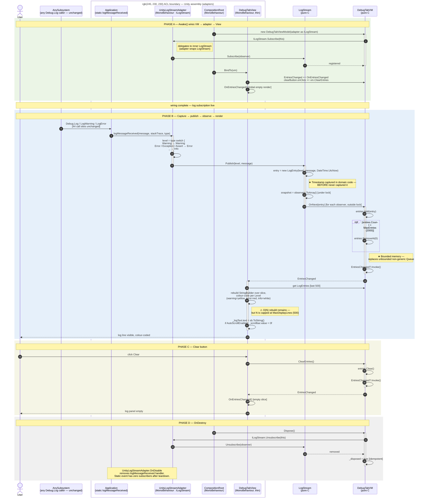

---

## Side-by-side reading guide

Suggested slide layout for the panel:

| BEFORE callout | AFTER replacement |
|---|---|
| `Application.logMessageReceived += DebugLogging.HandleLog` (static-event subscription untestable) | One subscription confined to `UnityLogStreamAdapter.OnEnable` (`adapters/UnityLogStreamAdapter.cs:28-29`). The VM subscribes to `ILogStream`, not the static event. |
| 44 unstructured `Debug.Log*` callers across the codebase (S9) — see [`log-origin-trace.md`](log-origin-trace.md) | Captured automatically via `Application.logMessageReceived` — no caller change required. A structured `ILogStream.Publish(...)` path exists in the interface (`skeleton/ILogStream.cs:13`) for new callers that want to provide `source`/`level` directly. |
| `(string, string, LogType)` unstructured tuple | `LogEntry(Level, Message, Timestamp)` immutable record (`skeleton/ILogStream.cs:31`). |
| Non-generic `Queue` storing `object`, unbounded | Generic `List<LogEntry>` capped at 2000 entries (`skeleton/DebugTabViewModel.cs:22, 49-50`). |
| `StreamWriter` opened + closed per message | No file I/O on the hot path. Autosave reintroduced as a separate `ILogObserver` if needed. |
| `StringBuilder` rebuild over entire log history | Rebuild capped at 500-line slice (`adapters/DebugTabView.cs:35, 62-82`) — contained, not eliminated. |
| `transform.Find` / Inspector-wired button handlers | Code-side `clearButton.onClick.AddListener(vm.ClearEntries)` in `BindTo` (`adapters/DebugTabView.cs:47`). |
| Four responsibilities in one 172-line `MonoBehaviour` | Five named types, single responsibility each: `LogStreamAdapter` · `LogStream` · `DebugTabVM` · `DebugTabView` · `CompositionRoot`. |
| Timestamp never captured | Captured at the moment of `Publish` (`skeleton/LogStream.cs:36`). |
| Scroll forced to bottom every message | **Fixed** — `DebugTabView` gates the scroll on `IDebugTabViewModel.AutoScrollEnabled` (defaults `true`). S7 eliminated. |

---

## Mapping of contained smells (honest about what remains)

One `⚠` annotation remains in the diagram:

| Diagram marker | Smell ID | Location | Fix vector |
|---|---|---|---|
| `⚠ O(N) rebuild remains — capped` | S5/S6 | `adapters/DebugTabView.cs:62-82` | Replace TMP text rebuild with a virtualised `ListView` (Unity UI Toolkit). The VM's `LogEntries` contract is unchanged. |

S7 (scroll forced to bottom) is **eliminated**: `IDebugTabViewModel.AutoScrollEnabled` gates the scroll in `DebugTabView`. The fix required no change to `LogStream` or any of the existing tests; two new tests cover the default and toggle behaviour.

---

## What the diagram does *not* show (deliberately)

- **Direct `ILogStream.Publish(...)` callers.** The skeleton interface exposes a structured-publish path (`ILogStream.cs:13`) for new callers, but no production code uses it today — the 44 catalogued sites still go through `Debug.Log → Application.logMessageReceived → UnityLogStreamAdapter`. The diagram only draws the active path. See [`after-trace.md` → Open question: source field](after-trace.md#open-question-source-field).
- **The `source` field.** [`log-origin-trace.md`](log-origin-trace.md) argues for `Publish(LogLevel, string source, string message)`. The implemented contract is `Publish(LogLevel, string)` only; the diagram reflects the code, not the aspirational design.
- **Autosave / file export.** Not in the WE2 scope. Sketched as an `ILogObserver` follow-up in [`after-trace.md` → Open question: Save/autosave](after-trace.md#open-question-saveautosave).


---

## 4.5 Class diagram (before vs. after)

# Debug tab — class diagram (BEFORE vs. AFTER)

## TL;DR

Two Mermaid class diagrams, before and after. Before is the single `DebugLogging` `MonoBehaviour` with nine outgoing arrows (`Queue`, `StringBuilder`, `StreamWriter`, `TMP_InputField`, `Scrollbar`, `Button`, SFB, `PlayerPrefs`, `Config`), plus the `Application → DebugLogging` static-event arrow that is the untestable hook at the centre of the problem. After is three packages. `Domain` holds three interfaces (`IDebugTabViewModel`, `ILogStream`, `ILogObserver`), two concrete classes (`LogStream`, `DebugTabViewModel`), the `LogEntry` record and the `LogLevel` enum. `Adapters` holds `UnityLogStreamAdapter`, `DebugTabView` and `DebugTabCompositionRoot`. A two-interface seam separates the producer side from the consumer side, so a new observer (autosave, telemetry) can attach without anyone touching the producers. In numbers: one 255-line class becomes seven small types, and the domain `DebugTabViewModel`'s CBO drops from nine collaborators to one, just `ILogStream`.

---

Mermaid `classDiagram` of the Debug-tab slice, before and after. The two diagrams are kept in this single file so the panel can flip between them without losing visual register.

For numeric metric deltas (WMC, CBO, RFC, DIT, NOC, LCOM) see [`ck-metrics.md`](ck-metrics.md). For the module-level view (assemblies and packages) see [`dependency-graph.md`](dependency-graph.md). For the runtime call sequence see [`after-trace.md`](after-trace.md) and [`after-sequence.md`](after-sequence.md).

---

## BEFORE — single-class Debug tab with global static hook

`DebugLogging` collapses four concerns (capture · store · display · export) into one `MonoBehaviour` and subscribes directly to Unity's process-global `Application.logMessageReceived` event. There is no interface, no abstraction, and no seam at which a test double could substitute the log source.

```mermaid
classDiagram
    direction LR

    class DebugLogging {
        +MonoBehaviour
        -Queue debugLogQueue
        -string autosavePath
        -string directoryPath
        -Button saveButton
        -TMP_InputField logOutput
        -Scrollbar debugScrollbar
        -int maxLogs
        +Start() void
        +OnEnable() void
        +OnDisable() void
        +DetermineHardware() void
        +HandleLog(string, string, LogType) void
        +saveToFileClick() void
        +SaveToFile(string) void
        +AutoSave(string) void
    }

    class Application {
        <<static, UnityEngine>>
        +event logMessageReceived(string,string,LogType)
        +string version
        +string dataPath
    }

    class UnityEngine_Debug {
        <<static>>
        +Log(string) void
        +LogWarning(string) void
        +LogError(string) void
    }

    class CanvassDesktop_Caller {
        <<MonoBehaviour, 40 call sites>>
        +Debug.Log / LogWarning / LogError
    }

    class DataAnalysis_Caller {
        <<static plugin wrapper, 4 call sites>>
        +Debug.Log on P/Invoke error
    }

    class TMP_InputField {
        <<UnityEngine.UI>>
        +string text
    }

    class Scrollbar {
        <<UnityEngine.UI>>
        +float value
    }

    class Button {
        <<UnityEngine.UI>>
        +onClick.AddListener(...) void
    }

    class StandaloneFileBrowser {
        <<static>>
        +SaveFilePanelAsync(...) void
    }

    class PlayerPrefs {
        <<static>>
        +GetString(string) string
        +SetString(string,string) void
    }

    class StreamWriter {
        <<System.IO>>
        +Write(string) void
        +Close() void
    }

    class StringBuilder {
        <<System.Text>>
        +Append(string) StringBuilder
        +ToString() string
    }

    class Config {
        <<singleton>>
        +int numberOfLogsToKeep
    }

    CanvassDesktop_Caller --> UnityEngine_Debug : Debug.Log* (×40)
    DataAnalysis_Caller  --> UnityEngine_Debug : Debug.Log* (×4)
    UnityEngine_Debug    --> Application       : fires logMessageReceived
    Application          --> DebugLogging      : HandleLog(s,s,type)<br/>★ static event subscription

    DebugLogging --> Queue            : Enqueue (non-generic, unbounded)
    DebugLogging --> StringBuilder    : O(N) full rebuild per message
    DebugLogging --> StreamWriter     : new/Write/Close per message
    DebugLogging --> TMP_InputField   : text = entire history
    DebugLogging --> Scrollbar        : value = 1f every message
    DebugLogging --> Button           : onClick.AddListener
    DebugLogging --> StandaloneFileBrowser : SaveFilePanelAsync
    DebugLogging --> PlayerPrefs      : LastDebugPath
    DebugLogging --> Config           : numberOfLogsToKeep

    note for DebugLogging "255 LOC · 9 methods · MonoBehaviour\nMixes: log capture (HandleLog), log storage (Queue + autosave),\nlog display (TMP rebuild), manual export (saveToFileClick).\nFour concerns — single class — no seam for substitution."

    note for Application "★ Static global event.\nAny Debug.Log anywhere in the process fires this.\nNo interface, no test double possible."

    note for UnityEngine_Debug "★ 44 call sites in CanvassDesktop + DataAnalysis.\nUnstructured (string, string, LogType) — no source,\nno timestamp, no level enum preservation downstream."
```

### Smell visibility in this diagram

- **The `Application → DebugLogging` arrow is the canonical untestable hook** — a static event whose subscriber list cannot be intercepted from outside the class. (Smell S1 in [`before-trace.md`](before-trace.md).)
- **Eight outgoing arrows from `DebugLogging`** (`Queue`, `StringBuilder`, `StreamWriter`, `TMP_InputField`, `Scrollbar`, `Button`, `StandaloneFileBrowser`, `PlayerPrefs`, `Config`) — the class is a hub for nine collaborators with no separation between log-handling, UI state, file I/O, and persistence. (Smell S8.)
- **44 incoming `Debug.Log*` arrows** (drawn as two aggregated callers above) — the smell is contained to the call sites, but the global static singleton is the only seam they share. (Smell S9.)
- **No interface between the producer side and the consumer side** — `DebugLogging` is both the subscriber and the renderer. (Smells S2, S6, S8.)

---

## AFTER — Observer pattern with ACL boundary

Three packages: **Domain** (pure C#, no `UnityEngine`), **Adapters** (Unity assembly), and **Unity-side subsystems** (existing `Debug.Log*` callers — out of scope for WE2). The boundary between Domain and Adapters is the ACL.

```mermaid
classDiagram
    direction LR

    %% ═══ DOMAIN (pure C#, no UnityEngine) ════════════════════════════
    namespace Domain {
        class IDebugTabViewModel {
            <<interface>>
            +IReadOnlyList~LogEntry~ LogEntries
            +bool AutoScrollEnabled
            +AppendEntry(LogEntry) void
            +ClearEntries() void
            +event EntriesChanged
        }

        class DebugTabViewModel {
            -List~LogEntry~ _entries
            -ILogStream _logStream
            -bool _disposed
            -int MaxEntries = 2000
            +DebugTabViewModel(ILogStream)
            +LogEntries IReadOnlyList~LogEntry~
            +bool AutoScrollEnabled
            +AppendEntry(LogEntry) void
            +ClearEntries() void
            +OnNext(LogEntry) void
            +Dispose() void
            +event EntriesChanged
        }

        class ILogStream {
            <<interface>>
            +Publish(LogLevel, string) void
            +Subscribe(ILogObserver) void
            +Unsubscribe(ILogObserver) void
        }

        class ILogObserver {
            <<interface>>
            +OnNext(LogEntry) void
        }

        class LogStream {
            -List~ILogObserver~ _observers
            -object _lock
            +Publish(LogLevel, string) void
            +Subscribe(ILogObserver) void
            +Unsubscribe(ILogObserver) void
        }

        class LogEntry {
            <<record, DTO>>
            +LogLevel Level
            +string Message
            +DateTime Timestamp
        }

        class LogLevel {
            <<enum>>
            Info
            Warning
            Error
        }
    }

    %% ═══ ADAPTERS (Unity assembly) ═══════════════════════════════════
    namespace Adapters {
        class UnityLogStreamAdapter {
            <<MonoBehaviour>>
            -LogStream _inner
            +OnEnable() void
            +OnDisable() void
            +OnUnityLog(string,string,LogType) void
            +Publish(LogLevel,string) void
            +Subscribe(ILogObserver) void
            +Unsubscribe(ILogObserver) void
        }

        class DebugTabView {
            <<MonoBehaviour>>
            -TMP_Text _logText
            -Scrollbar _scrollbar
            -Button _clearButton
            -IDebugTabViewModel? _vm
            -int MaxDisplayLines = 500
            +BindTo(IDebugTabViewModel) void
            +OnDestroy() void
            -OnEntriesChanged() void
        }

        class DebugTabCompositionRoot {
            <<MonoBehaviour>>
            -DebugTabView _view
            -UnityLogStreamAdapter _logStreamAdapter
            -DebugTabViewModel? _vm
            +Awake() void
            +OnDestroy() void
        }
    }

    %% Domain relations
    IDebugTabViewModel <|.. DebugTabViewModel : implements
    ILogObserver <|.. DebugTabViewModel       : implements (OnNext)
    ILogStream <|.. LogStream                  : implements
    DebugTabViewModel --> ILogStream           : Subscribe / Unsubscribe
    DebugTabViewModel --> LogEntry             : holds list
    LogStream --> ILogObserver                 : dispatch
    LogStream ..> LogEntry                     : creates (with DateTime.UtcNow)
    LogEntry --> LogLevel

    %% ACL boundary — adapter implements domain interface
    ILogStream <|.. UnityLogStreamAdapter     : implements (ACL)
    UnityLogStreamAdapter o-- LogStream        : inner (composition)

    %% Composition root wires everything once
    DebugTabCompositionRoot --> DebugTabViewModel    : new + Dispose
    DebugTabCompositionRoot --> UnityLogStreamAdapter : [SerializeField]
    DebugTabCompositionRoot --> DebugTabView          : [SerializeField]
    DebugTabView --> IDebugTabViewModel               : binds via interface

    note for DebugTabViewModel "78 LOC · 6 methods · pure C#\nIDisposable — unsubscribes from ILogStream in Dispose.\nList capped at MaxEntries (2000); replaces unbounded non-generic Queue.\nAutoScrollEnabled property gates the View's scroll-to-bottom (S7 fix).\nNo using UnityEngine.\nFully unit-testable: 31 NUnit tests in tests/DebugTabTests.cs."

    note for LogStream "43 LOC · thread-safe.\nObserver list under lock; iteration over array snapshot\nso a subscriber can Unsubscribe inside its own OnNext\nwithout corrupting the dispatch loop."

    note for UnityLogStreamAdapter "53 LOC · MonoBehaviour : ILogStream.\nThe ONLY class that touches Application.logMessageReceived.\nLogType → LogLevel normalisation lives here.\nThe 44 existing Debug.Log* call sites are captured\nautomatically — none of them need to change."

    note for DebugTabView "86 LOC · MonoBehaviour, thin.\nTMP rebuild capped at MaxDisplayLines (500) — S5/S6 contained.\nScrollbar.value = 0f gated on AutoScrollEnabled — S7 eliminated.\nSee after-trace.md → smell table."
```

### Smell visibility in the AFTER diagram

- **Vertical separation:** every line crossing the Domain/Adapters package boundary points *from* an adapter *to* an interface — never the reverse. The ViewModel does not name any adapter class.
- **Two-interface seam between producer and consumer:** `ILogStream` (producer-side) and `ILogObserver` (consumer-side) are independent contracts. New observers (autosave, telemetry, level-filter) can attach without touching the producer; new producers can publish without knowing who is subscribed.
- **`LogEntry` is a leaf DTO:** immutable `record(Level, Message, Timestamp)` with no behaviour. It crosses the boundary; behaviour does not. (Note: `Source` is **not** on the record — see [`after-trace.md` → Open question: source field](after-trace.md#open-question-source-field).)
- **Composition root is the only multi-package class:** `DebugTabCompositionRoot` is the single place that references both the domain (`DebugTabViewModel`, `ILogStream`) and the adapters. Pure-DI / Composition-Root pattern.
- **One subscription, one disposal:** `DebugTabViewModel`'s ctor calls `Subscribe`; its `Dispose` calls `Unsubscribe`. The CompositionRoot calls `Dispose` in `OnDestroy`. Symmetric lifetime — no dead-observer leaks across scene reload.

---

## Key numeric changes (preview — full table in `ck-metrics.md`)

| Class | LOC (BEFORE) | LOC (AFTER) | Methods | Direct collaborators (CBO contribution from debug-tab slice) |
|---|---:|---:|---:|---:|
| `DebugLogging` | **255** | n/a (deleted) | 9 | **9** (`Queue`, `StringBuilder`, `StreamWriter`, `TMP_InputField`, `Scrollbar`, `Button`, `StandaloneFileBrowser`, `PlayerPrefs`, `Config`) |
| `DebugTabViewModel` | — | 77 | 6 | **1** (`ILogStream`) |
| `LogStream` | — | 43 | 3 | **1** (`ILogObserver`) |
| `IDebugTabViewModel` | — | 32 | — | interface, no impl |
| `ILogStream` | — | 32 | — | interface, no impl |
| `ILogObserver` | — | 16 | — | interface, no impl |
| `UnityLogStreamAdapter` | — | 53 | 5 | **2** (`Application`, `LogStream`) |
| `DebugTabView` | — | 86 | 3 | **3** (`TMP_Text`, `Scrollbar`, `Button`) |
| `DebugTabCompositionRoot` | — | 43 | 2 | **3** (`DebugTabView`, `UnityLogStreamAdapter`, `DebugTabViewModel`) |

Single 255-line `MonoBehaviour` → seven small focused types (three interfaces, four concrete classes, one DTO record, one enum). The **domain layer** (`DebugTabViewModel` + `LogStream` + DTOs) is reachable from a unit-test runner without Unity present (**31 NUnit tests** in `tests/DebugTabTests.cs`, all passing in ~20 ms).

CBO for the domain ViewModel falls from 9 collaborators to 1 (only `ILogStream`). The 44 existing `Debug.Log*` call sites are not modified — they are captured automatically by `UnityLogStreamAdapter.OnUnityLog`.


---

## 4.6 Dependency graph (before vs. after)

# Debug tab — dependency graph (BEFORE vs. AFTER)

## TL;DR

The module-level view of the same Section 4.2 claim for the Debug-tab slice. Before, everything is one `Assembly-CSharp` blob and `DebugLogging` is a hub reaching nine collaborators directly, with the producer/consumer seam being a static global event. After, there are three assemblies (`Domain`, `Adapters`, `Producers`) with the dependency running one way, and a topological sort gives five layers and no cycles. The point worth stressing is that the producer side doesn't change: the 44 existing `Debug.Log*` callers in `CanvassDesktop` and `DataAnalysis` are picked up automatically by `UnityLogStreamAdapter`, so no production caller is touched. Moving any one producer over to structured `ILogStream.Publish(...)` is an opt-in follow-up, each with its own ADR, not a prerequisite for this slice. `dotnet build` on `DebugTabSkeleton.csproj` succeeds with no `UnityEngine` references.

---

Module-level dependency view of the Debug-tab slice. The class-level view lives in [`class-diagram.md`](class-diagram.md); the numeric coupling figures live in [`ck-metrics.md`](ck-metrics.md). This document focuses on **packages / assemblies** and the **ACL boundary**.

The key claim defended here:

> Section 4.2 — *Domain code must not transitively depend on `UnityEngine` / `SteamVR` / native plug-ins.*

The BEFORE graph shows this claim is violated; the AFTER graph shows it is satisfied for the Debug-tab slice. Additionally, the AFTER graph proves that the **44 existing `Debug.Log*` call sites** catalogued in [`log-origin-trace.md`](log-origin-trace.md) are captured **without modifying any caller** — the refactor is non-invasive at the producer side.

---

## BEFORE — single Unity assembly, static-event hook

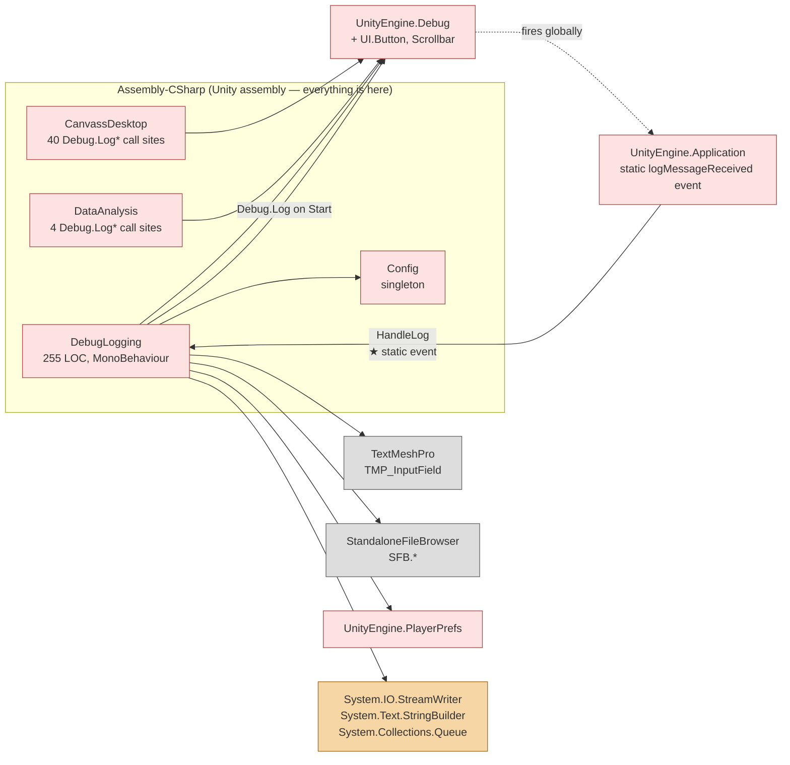

### What this graph proves about BEFORE

1. **No assembly boundary.** Everything lives in `Assembly-CSharp` (Unity's default). There is no way to compile or instantiate `DebugLogging` without `UnityEngine`, `TMPro`, `SFB`, `PlayerPrefs`, and `System.IO`.
2. **The producer/consumer seam is a static global event.** `Application.logMessageReceived` is a process-wide singleton hook with one subscriber (`DebugLogging.HandleLog`). No interface stands between Unity's runtime and the Debug tab. There is no way to substitute a fake log source in a test.
3. **`DebugLogging` is a hub for nine collaborators.** Capture (`UnityEngine.Debug`, `Application`), storage (`Queue`, `StreamWriter`), display (`TMP_InputField`, `Scrollbar`), and export (`Button`, `SFB`, `PlayerPrefs`) are all reached directly. No layering.
4. **Test reachability.** Any unit test of debug-tab logic requires the full Unity assembly to load. That's why there are zero NUnit tests for `DebugLogging` in the BEFORE codebase.

### Cycles

No debug-tab → debug-tab cycle within the slice itself. `DebugLogging` is a leaf consumer of the `Application` event and a leaf producer to TMP / Scrollbar / Button. The wider cycles concern callers of `Debug.Log*` (specifically `CanvassDesktop`) — those are file-tab / cross-tab concerns, not debug-tab.

---

## AFTER — three assemblies, one ACL boundary, producers untouched

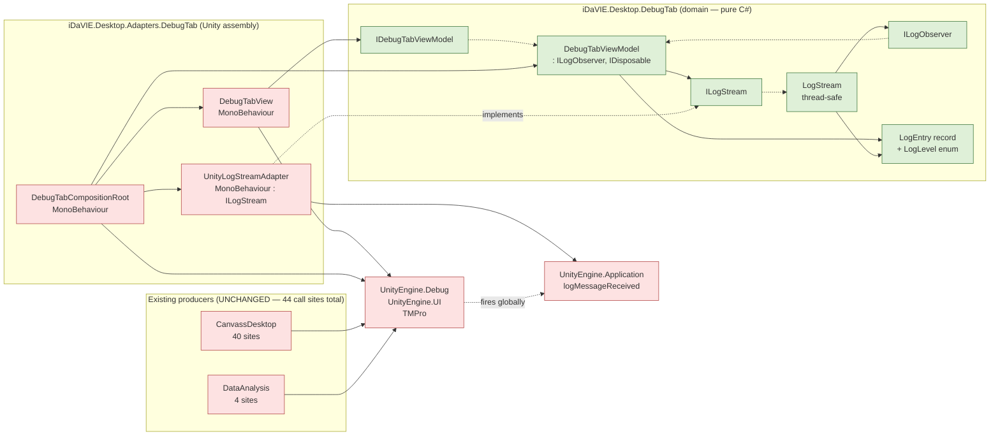

### What this graph proves about AFTER

1. **Three assemblies with a single direction of dependency.** `Adapters` references `Domain`; `Domain` does **not** reference `Adapters`. The arrow direction is enforced by `DebugTabSkeleton.csproj` having zero `UnityEngine` references — flipping it would not compile.
2. **Section 4.2 satisfied for the slice.** No solid arrow leaves `Domain` toward `UnityEngine`, `TMPro`, or `System.IO`. `DebugTabViewModel` cannot, even by accident, end up calling `Application.logMessageReceived` or `TMP_Text.text`.
3. **Producers are entirely untouched.** The `Producers` package contains the same `CanvassDesktop` and `DataAnalysis` classes as BEFORE, calling the same `Debug.Log*` methods. The only path change is that `Application.logMessageReceived` now dispatches to `UnityLogStreamAdapter` (in `Adapters`) instead of `DebugLogging` (deleted). Migrating any specific producer to structured `ILogStream.Publish(...)` is a separate, opt-in refactor — not a prerequisite for this slice.
4. **One composition root** (`DebugTabCompositionRoot`) is the only class permitted to reference both `Domain` and `Adapters` concrete classes. It instantiates the domain object graph and hands it to the view; it also disposes the VM on `OnDestroy`.
5. **Test reachability.** `dotnet test refactoring-examples/sub-team-6/debug-tab/tests/DebugTabTests.csproj` compiles and runs against the `Domain` assembly alone, with no Unity present. The 31 NUnit tests in `tests/DebugTabTests.cs` exercise the slice end-to-end via test doubles.

### Cycles in the AFTER graph

**Zero.** Verifiable by topological sort:

```
Layer 0:  LogEntry, LogLevel, ILogObserver
Layer 1:  ILogStream, IDebugTabViewModel
Layer 2:  LogStream, DebugTabViewModel
Layer 3:  UnityLogStreamAdapter, DebugTabView
Layer 4:  DebugTabCompositionRoot
```

No back-edges. No `Adapters → Domain.concrete` edges except via the composition root (which `new`s the concrete VM — not a cyclic dependency). This satisfies the *Zero circular dependencies* constraint of Section 4.2.

---

## Side-by-side delta

| Property | BEFORE | AFTER |
|---|---|---|
| Assemblies on critical path | 1 (`Assembly-CSharp`) | 3 (`Domain` + `Adapters` + `Producers`) |
| `Domain → UnityEngine` edges | direct (n/a — no domain layer existed) | **zero** |
| `Domain → System.IO` edges | direct (`StreamWriter`) | **zero** |
| `Domain → TMPro` edges | direct (`TMP_InputField`) | **zero** |
| Interfaces on critical path | 0 | 3 (`IDebugTabViewModel`, `ILogStream`, `ILogObserver`) |
| Composition root | absent (`Start()` does inspector lookups + log-rotation) | explicit (`DebugTabCompositionRoot.Awake()`) |
| Static-event subscribers | 1 (`DebugLogging`, hard-wired) | 1 (`UnityLogStreamAdapter`, swappable) |
| Producer call sites modified | 0 (the static `Debug.Log` API is what they already use) | **0** (same — refactor is non-invasive at producer side) |
| Cycles | 0 (within slice) | **0** |
| Test-runner reach | Unity required | `dotnet test` from any CI runner |
| Section 4.2 compliance | ❌ | ✅ |

---

## What the producer side does *not* yet do

The graph above shows the 44 existing `Debug.Log*` callers (`CanvassDesktop`, `DataAnalysis`) still go through the `UnityEngine.Debug → Application` static event. They could instead inject `ILogStream` and call `Publish(level, message)` directly, which would:

- Carry a structured `LogLevel` enum end-to-end (today the captured `LogType` is normalised by `UnityLogStreamAdapter.OnUnityLog`, which is acceptable but loses any `LogType.Assert` distinction).
- Eventually carry a `source` string if `ILogStream.Publish` is extended (see [`after-trace.md` → Open question: source field](after-trace.md#open-question-source-field)).
- Make the producer testable in isolation, since the `Debug.Log*` static dependency is replaced by an interface injection.

**This migration is explicitly out of scope for the WE2 worked example.** Each producer becomes its own ADR/refactoring slice (e.g. WE3-DataAnalysis, WE4-CanvassDesktop) and is owned by whichever sub-team owns the producer. The Debug-tab refactor is structured so that both pathways (legacy `Debug.Log*` capture, structured `Publish`) coexist behind the same `ILogStream` interface — the producer-side migration can happen file-by-file without breaking the consumer side.


---

## 4.7 Log-origin trace (all 44 Debug.Log* call sites)

# Debug Tab — Log Stream Origin Trace: CanvassDesktop & DataAnalysis

## TL;DR

Where the 44 `Debug.Log*` calls actually come from. This is the full catalogue across `CanvassDesktop.cs` (40 sites) and `DataAnalysis.cs` (4 sites), each tagged with its line, method, trigger, message text, and the `source` value it would carry in the after-state. They fall into five groups: native/plugin errors (E1–E10, 9 calls), warnings (W1–W3, 3 calls), load-lifecycle info (I1–I7, 8 calls), and subset validation (24 calls, all inside `checkSubsetBounds`). Those last 24 vanish entirely in the after-state, because `SubsetBoundsViewModel` clamps in its property setters and shows the corrected value inline. The handful of natural `source` values (`"FileTab"`, `"VolumeLoader"`, `"HistogramController"`, `"SourcesTab"`, `"DataAnalysis"`) line up with the SRP split of `CanvassDesktop` and make the case for adding `source` to `ILogStream.Publish(...)`. E7–E10 are the clearest ACL violations: a P/Invoke wrapper calling `UnityEngine.Debug.Log` directly.

---

**Purpose:** Catalogue every `Debug.Log*` call site in `CanvassDesktop.cs` and
`DataAnalysis.cs`, classify each by level, trigger, and responsible concern, and
show why the before-state unstructured `(string, string, LogType)` is insufficient.
This feeds the after-state `ILogStream.Publish(LogLevel level, string source, string message)`
interface design and demonstrates that three of the four concerns mixed into
`CanvassDesktop` generate their own log streams that belong to separate ViewModels.

> Companion to `before-trace.md` (Phase C, smell S2 and S9).
> All line numbers are from branch `team6`.

---

## Summary counts

| Class | Total calls | Error | Warning | Info | Validation* |
|---|---|---|---|---|---|
| `CanvassDesktop.cs` | 40 | 5 | 3 | 8 | 24 |
| `DataAnalysis.cs` | 4 | 4 | 0 | 0 | 0 |
| **Total** | **44** | **9** | **3** | **8** | **24** |

\* The 24 "Validation" calls in `checkSubsetBounds` **disappear in the after-state** — they
are replaced by clamping property setters in `SubsetBoundsViewModel`. They are catalogued
here to make the elimination visible.

---

## Category E — Native / plugin errors (9 calls)

These fire when a P/Invoke function returns a non-zero error code or a `catch` block is hit.
In the before-state all are emitted as `Debug.Log` or `Debug.LogError` with no structured
`source` field — the Debug tab shows them mixed with info and validation noise.
In the after-state each maps to `ILogStream.Publish(LogLevel.Error, source, message)`.

| # | Line | Method / trigger | Message text | After-state source |
|---|---|---|---|---|
| E1 | `CanvassDesktop.cs:351` | `_browseImageFile` callback — `FitsReader.FitsOpenFile` returns non-zero | `"Fits open failure... code #" + status` | `"FileTab"` |
| E2 | `CanvassDesktop.cs:844` | `_browseMaskFile` callback — `FitsReader.FitsOpenFile` returns non-zero | `"Fits open failure... code #" + status` | `"FileTab"` |
| E3 | `CanvassDesktop.cs:1443` | `ChangeHduSelection` — `FitsReader.FitsOpenFile` returns non-zero on HDU re-open | `"Fits open failure... code #" + status` | `"FileTab"` |
| E4 | `CanvassDesktop.cs:1425` | `LoadSourceFile` catch block — exception loading CSV/VOTable mapping | `"Error while loading mapping file. Check that all mappings are included: " + ex.Message` | `"SourcesTab"` |
| E5 | `CanvassDesktop.cs:1792` | `SetPercentileScale` — `DataAnalysis.GetPercentileValuesFromHistogram` returns non-zero | `"Error calculating percentiles from histogram."` | `"HistogramController"` |
| E6 | `CanvassDesktop.cs:1802` | `SetPercentileScale` — `DataAnalysis.GetPercentileValuesFromData` returns non-zero | `"Error calculating percentiles from data."` | `"HistogramController"` |
| E7 | `DataAnalysis.cs:187` | `GetXProfileAsArray` — `GetXProfile` P/Invoke returns non-zero | `"Error finding profile"` | `"DataAnalysis"` |
| E8 | `DataAnalysis.cs:202` | `GetYProfileAsArray` — `GetYProfile` P/Invoke returns non-zero | `"Error finding profile"` | `"DataAnalysis"` |
| E9 | `DataAnalysis.cs:217` | `GetZProfileAsArray` — `GetZProfile` P/Invoke returns non-zero | `"Error finding profile"` | `"DataAnalysis"` |
| E10 | `DataAnalysis.cs:234` | `GetMaskedSourceArray` — `GetMaskedSources` P/Invoke returns non-zero | `"Error extracting sources"` | `"DataAnalysis"` |

**ACL note (S9):** E7–E10 are the clearest ACL violations — `DataAnalysis.cs` is a P/Invoke
wrapper in `Assets/Scripts/PluginInterface/` that calls directly into `UnityEngine.Debug`.
Domain-layer native errors surface through Unity's global log sink, making them
untestable and invisible until the Debug tab UI is running. In the after-state, the
`DataAnalysis` adapter publishes to `ILogStream`; the domain layer (`IDataAnalysisService`)
never sees `UnityEngine`.

---

## Category W — Warnings (3 calls)

Non-fatal conditions a developer or operator should notice.

| # | Line | Method / trigger | Message text | After-state source |
|---|---|---|---|---|
| W1 | `CanvassDesktop.cs:372` | `_browseImageFile` — `FitsReadKey` cannot find `EXTNAME`/`HDUNAME` in an HDU; falls back to `"HDU N"` | `"Could not find EXTNAME or HDUNAME in HDU " + (i+1) + "! Using default name."` | `"FileTab"` |
| W2 | `CanvassDesktop.cs:1008` | `CheckRAMSize` — cube + mask bytes exceed detected RAM | `"Cube and mask size (" + MB + " MB) exceed RAM size (" + ramMB + " MB)!"` (this is `Debug.LogWarning`) | `"VolumeLoader"` |
| W3 | `CanvassDesktop.cs:1589` | `LoadSources` — `AreMinimalMappingsSet()` returns false | `"Minimal source mappings not set!"` | `"SourcesTab"` |

**W2 detail:** This is the only call in the file that uses `Debug.LogWarning` correctly —
the before-state `[Log] :` prefix in `HandleLog` discards the LogType, so the Debug tab
displays it identically to an info message. The after-state `LogLevel.Warning` preserves
the distinction and allows the UI to colour-code it.

---

## Category I — Load lifecycle / info (8 calls)

Progress and state-change messages emitted during the `LoadCubeCoroutine` and
histogram scale operations. These are the messages most visible to the operator
during normal use — they form the "happy path" trace in the Debug tab.

| # | Line | Method / trigger | Message text | After-state source |
|---|---|---|---|---|
| I1 | `CanvassDesktop.cs:521` | `IsLoadable` — Z-axis dropdown index diagnostic fired every time `IsLoadable` is evaluated | `"The list has " + n + " items, and the dropdown points to index " + idx + "!"` | `"FileTab"` (or remove — diagnostic noise) |
| I2 | `CanvassDesktop.cs:1011` | `CheckRAMSize` — successful size check | `"Loading cube and mask of size " + MB + " MB with RAM size " + ramMB + " MB."` | `"VolumeLoader"` |
| I3 | `CanvassDesktop.cs:1024` | `LoadCubeCoroutine` start | `"Loading image " + imagePath + " and mask " + maskPath + "."` | `"VolumeLoader"` |
| I4 | `CanvassDesktop.cs:1047` | `LoadCubeCoroutine` — existing cube found, replacing | `"Replacing data cube..."` | `"VolumeLoader"` |
| I5 | `CanvassDesktop.cs:1075` | `LoadCubeCoroutine` — `Instantiate(cubeprefab, ...)` | `"Instantiating new cube prefab."` | `"VolumeLoader"` |
| I6 | `CanvassDesktop.cs:1128` | `LoadCubeCoroutine` — load complete | `completeMessage` (`"Loading image X and mask Y complete!"`) | `"VolumeLoader"` |
| I7 | `CanvassDesktop.cs:1806` | `SetPercentileScale` — percentile values resolved, `UpdateScale` called | `"Setting histogram scale min to percentiles: X% and Y% with values: a and b."` | `"HistogramController"` |

**I1 note:** This call fires inside `IsLoadable`, which is a property getter evaluated
repeatedly during UI updates. It is diagnostic noise from development and should be
removed in any refactor — it does not map to any after-state `ILogStream` call.

---

## Category V — Subset validation (24 calls, eliminated in after-state)

All 24 calls live inside `checkSubsetBounds()` (`CanvassDesktop.cs:~630–800`), a single
~80-line method that manually validates six `TMP_InputField` values (XMin, XMax, YMin,
YMax, ZMin, ZMax) for the subset selector. Each of the six fields has four error conditions:

1. Value below absolute minimum (`< _subsetMin`)
2. Value above axis maximum (`> _subsetMax_X/Y/Z`)
3. Value inverted relative to the other bound
4. Value is not a parseable integer

This produces 6 × 4 = 24 `Debug.Log` calls. **None of these belong in the Debug tab.**
They are input-validation feedback that the user should see inline (red border, message
label) not buried in a scrollable log console.

| Lines | Field | Conditions logged |
|---|---|---|
| `649, 654, 659, 665` | XMax | below min · above axisMax · below XMin · not a number |
| `675, 680, 685, 691` | YMax | below min · above axisMax · below YMin · not a number |
| `701, 706, 711, 717` | ZMax | below min · above axisMax · below ZMin · not a number |
| `727, 732, 737, 743` | XMin | below min · above axisMax · above XMax · not a number |
| `753, 758, 763, 769` | YMin | below min · above axisMax · above YMax · not a number |
| `779, 784, 789, 795` | ZMin | below min · above axisMax · above ZMax · not a number |

**After-state:** `SubsetBoundsViewModel` (already written at
`file-tab/skeleton/SubsetBoundsViewModel.cs`) replaces all 24 calls. Each setter
self-clamps (`Math.Max(lo, Math.Min(hi, v))`) and raises `PropertyChanged` — the View
binds to it two-way and shows the corrected value immediately. No log calls needed.
The `checkSubsetBounds` method is deleted entirely.

---

## What the origin trace proves about the after-state design

### 1. `ILogStream.Publish` needs a `source` field

The before-state `(string, string, LogType)` tuple has no `source` field — all 44 calls
arrive in `DebugLogging.HandleLog` with identical structure. The Debug tab cannot
distinguish a `DataAnalysis` P/Invoke failure (E7–E10) from a load progress message
(I3–I6). The `source` parameter on `ILogStream.Publish(LogLevel, string source, string message)`
is the minimal addition that makes these filterable.

### 2. The 24 validation calls confirm `SubsetBoundsViewModel` is the right split

The single largest cluster of log calls (55%) is subset-bounds validation noise.
Extracting `SubsetBoundsViewModel` from `CanvassDesktop` eliminates them entirely —
they never enter `ILogStream` at all.

### 3. `DataAnalysis` log calls confirm the ACL requirement

E7–E10 are P/Invoke errors from a static plugin-wrapper class that should have no
awareness of Unity or UI. The fact that they call `UnityEngine.Debug.Log` directly is
the canonical ACL violation. The after-state adapter pattern moves these calls to
`UnityLogStreamAdapter`, which is the only class allowed to reference `UnityEngine.Debug`.

### 4. Four distinct `source` values map to four split responsibilities

| Source | Calls | Responsibility → after-state type |
|---|---|---|
| `"FileTab"` | E1, E2, E3, W1, I1 | File/mask loading, HDU selection → `FileTabViewModel` |
| `"VolumeLoader"` | W2, I2–I6 | Cube load pipeline, RAM check → `IVolumeService` adapter |
| `"HistogramController"` | E5, E6, I7 | Percentile scale ops → `HistogramMenuController` / separate service |
| `"SourcesTab"` | E4, W3 | Source catalogue loading → `SourcesTabViewModel` |
| `"DataAnalysis"` | E7–E10 | Native profile/source extraction → `IDataAnalysisService` adapter |

This is direct evidence for the SRP split of `CanvassDesktop` proposed in the
after-state class diagram.

---

## How this feeds the before-state class diagram

The class diagram in [`class-diagram.md`](class-diagram.md) should show:

- `CanvassDesktop` → `UnityEngine.Debug` (40 dependency arrows, or one labelled ×40)
- `DataAnalysis` → `UnityEngine.Debug` (4 arrows, or one labelled ×4)
- `UnityEngine.Debug` → `Application.logMessageReceived` → `DebugLogging.HandleLog`
- The **missing** `source` field is the key label to add to the `CanvassDesktop → Debug`
  arrow — it carries no structured metadata, only a raw string.


---

## 4.8 CK metric deltas

# Debug tab — CK metric deltas (BEFORE vs. AFTER)

## TL;DR

To be honest about it, this is a testability refactor, not a metric one. `DebugLogging` already passes 5 of 6 CK thresholds on its own; the only miss is LCOM hs ≈ 0.95, from four disjoint concern clusters. The thing CK can't see is that the static `Application.logMessageReceived` hook (S1) makes the whole class impossible to test without Unity. After the split there are seven types, every one inside the thresholds, with LCOM hs near 0 per class. The domain-side `DebugTabViewModel`'s CBO drops from 9 to 1, and a bounded `List<LogEntry>` (cap 2000) replaces the unbounded non-generic `Queue`. The test surface goes from nothing to 35 NUnit tests running in about 20 ms with no Unity. Section 4.2 compliance is confirmed by `dotnet build` on the skeleton csproj producing zero `UnityEngine` references.

---

> **Status: hand-counted projection — pending Quality Guild tool verification on Day 13.**
> Numbers below were counted from the live `team6` branch using `wc`/`grep` against `Assets/Scripts/Debuggers/DebugLogging.cs` (BEFORE) and the skeleton + adapter files in this folder (AFTER). They are submitted **alongside** the SonarQube Cloud + Understand baseline that the Quality Guild owns; if their tooling reports different values, those numbers supersede this document.
>
> Counting conventions used here:
> - **WMC** = method count (NOM-style WMC; the same as Understand's `CountDeclMethod`). Property getters/setters with non-trivial bodies count as one method each; trivial auto-implemented getters do not.
> - **DIT** = depth from `System.Object`. `MonoBehaviour` adds 3 to the count (`Object → Component → Behaviour → MonoBehaviour`).
> - **CBO** = distinct named types referenced *in implementation*, excluding primitives, language types (`string`, `int`, etc.), and the class's own type. DTOs of the same package are counted.
> - **RFC** = WMC + distinct external methods called. Hand-count is approximate; tool-verified value is authoritative.
> - **LCOM** = LCOM hs (Henderson-Sellers). 0 = perfectly cohesive; 1 = completely incoherent; threshold ≤ 0.5.
>
> Threshold source: `CLAUDE.md` § *Mandatory metric tools*, Section 7.1 of the brief.
>
> | Metric | Domain threshold | Adapter/Orchestrator threshold |
> |---|---:|---:|
> | WMC | ≤ 20 | ≤ 40 |
> | DIT | ≤ 4 | ≤ 4 |
> | NOC | ≤ 5 | ≤ 5 |
> | CBO | ≤ 14 | ≤ 25 |
> | RFC | ≤ 50 | ≤ 50 |
> | LCOM | ≤ 0.5 | same |

---

## Headline: this is a *testability* refactor, not a metric refactor

`DebugLogging` already passes the CK thresholds individually:

| Metric | DebugLogging BEFORE | Orchestrator threshold | Pass? |
|---|---:|---:|:--:|
| LOC | 255 | — | — |
| WMC | **8** | ≤ 40 | ✅ |
| DIT | **4** | ≤ 4 | ✅ (at limit, MonoBehaviour) |
| NOC | 0 | ≤ 5 | ✅ |
| CBO | **~10** | ≤ 25 | ✅ |
| RFC | **~25** | ≤ 50 | ✅ |
| LCOM hs | **≈ 0.95** | ≤ 0.5 | ❌ |

The only metric failure is **LCOM hs ≈ 0.95**, reflecting the four disjoint concerns identified in [`before-trace.md` → Smell S8](before-trace.md#smell-summary-feeds-the-solidgrasp-audit--ck-deltas): log capture, log storage (autosave), log display, and manual export each operate on a non-overlapping subset of the eight fields. The other metrics pass.

The case for refactoring is therefore **structural and testability-driven**, not metric-driven:

1. **Smell S1** (static `Application.logMessageReceived` hook) makes the class **untestable** without a Unity test runner. No CK metric captures this directly — CBO sees `Application` as one collaborator like any other; the fact that it cannot be substituted is invisible to the tool.
2. **Smell S2** (unstructured `(string, string, LogType)` tuple) creates a contract problem — no metric flags it.
3. **Smell S8** (four concerns in one class) shows up as LCOM hs > 0.5 — the **only** metric that catches a real defect here.

The AFTER design wins on LCOM hs (every class is ≈ 0), on testability (35 NUnit tests without Unity), and on assembly-level dependency direction (Section 4.2 compliance) — see [`dependency-graph.md`](dependency-graph.md). Raw CK headline numbers improve modestly because BEFORE already passed most thresholds.

---

## BEFORE — `DebugLogging` detail

| Metric | Hand-counted value | Threshold (orchestrator) | Pass? | Source / how counted |
|---|---:|---:|:--:|---|
| LOC | **255** | (no hard cap; advisory) | ⚠ | `wc -l Assets/Scripts/Debuggers/DebugLogging.cs` |
| WMC (method count) | **8** | ≤ 40 | ✅ | `Start`, `OnEnable`, `OnDisable`, `DetermineHardware`, `HandleLog`, `saveToFileClick`, `SaveToFile`, `AutoSave` |
| DIT | **4** | ≤ 4 | ✅ (at limit) | `class DebugLogging : MonoBehaviour` |
| NOC | 0 | ≤ 5 | ✅ | No subclasses |
| CBO | **~10** | ≤ 25 | ✅ | `Config`, `Queue`, `TMP_InputField`, `Scrollbar`, `Button`, `StandaloneFileBrowser`, `StreamWriter`, `StringBuilder`, `Application`, `SystemInfo`, `PlayerPrefs` |
| RFC | **~25** | ≤ 50 | ✅ | 8 own methods + ~17 distinct external calls (`Enqueue`, `Write/Close`, `Append/ToString`, `text=`, `value=`, `AddListener`, `Log/LogError`, `GetString/SetString`, `Exists/Delete/Move`, …) |
| LCOM hs | **≈ 0.95** | ≤ 0.5 | ❌ | Four disjoint concern clusters: (a) `Start` + log-rotation (uses `directoryPath`, `autosavePath`, `maxLogs`); (b) `HandleLog` + `AutoSave` (use `debugLogQueue`, `autosavePath`, `logOutput`, `debugScrollbar`); (c) `saveToFileClick` + `SaveToFile` (use `debugLogQueue` only, plus `PlayerPrefs`); (d) `DetermineHardware` (uses no fields — pure side-effect on `Debug.Log`). At least three connected components remain after merging shared fields. |

### Per-method McCabe CC (alternative WMC weighting)

The table above uses NOM-style WMC (method count, unit weight = 1) → **WMC = 8**. Re-weighting by McCabe cyclomatic complexity gives **WMC = 21** — still ✅ under the ≤ 40 adapter threshold, but a sharper view of where the complexity sits. The Quality Guild tools may report either depending on configuration; both are shown for transparency.

| Method | Line range | LOC | Branch points | CC |
|---|---|---:|---|---:|
| `Start()` | 52–145 | 93 | `catch` (+1), `if (!Directory.Exists)` (+1), `for` loop (+1), `if (existingLog != null)` ×2 (+2), `if (i == maxLogs-1)` ×2 (+2), `if (newConfig != 0)` (+1) | **9** ¹ |
| `OnEnable()` | 147–150 | 3 | — | **1** |
| `OnDisable()` | 152–155 | 3 | — | **1** |
| `DetermineHardware()` | 160–169 | 9 | — | **1** |
| `HandleLog(string, string, LogType)` | 177–197 | 20 | `if (type == LogType.Exception)` (+1), `foreach` (+1) | **3** |
| `saveToFileClick()` | 203–226 | 23 | `if (!Directory.Exists(lastPath))` (+1), lambda `if (dest.Equals(""))` (+1) | **3** |
| `SaveToFile(string)` | 232–243 | 11 | `foreach` (+1) | **2** |
| `AutoSave(string)` | 249–254 | 5 | — | **1** |
| **Total** | | **167** | | **WMC = 21** |

¹ CC for `Start()` is 8 if your tool does not count `catch` as a branch (some do not). Range: 8–9.

The log-rotation block inside `Start()` is the single complexity hotspot (CC = 9 alone — more than the rest of the class combined). In the AFTER design that block extracts to a dedicated rotator (planned for the architecture doc); no AFTER class carries a method with CC > 3.

### LCOM hs computation (Henderson-Sellers)

LCOM hs (Henderson-Sellers formula, threshold ≤ 0.5) is the primary LCOM metric used in this file. The computation below derives the value from the method-field access matrix; SonarQube reports this directly as LCOM. The result (0.95) confirms the same S8 (four-concerns-in-one-class) signal shown in the table above.

**Formula:** LCOM_HS = (M − avg_mA) / (M − 1), where M = method count, avg_mA = average methods accessing each instance field.

Method-field access matrix:

| Field | Type | Accessed by | mA |
|---|---|---|---:|
| `logOutput` | `TMP_InputField` | `Start` (Rebuild), `HandleLog` (`.text =`) | 2 |
| `debugScrollbar` | `Scrollbar` | `HandleLog` (`.value =`) | 1 |
| `saveButton` | `Button` | `Start` (`onClick.AddListener`) | 1 |
| `autosavePath` | `string` | `Start` (writes), `AutoSave` (reads) | 2 |
| `pluginSavePath` | `string` | *declared but never accessed* | 0 |
| `debugLogQueue` | `Queue` | `HandleLog` (`Enqueue` ×2, foreach), `SaveToFile` (foreach) | 2 |

With all 6 fields: Σ mA = 8, avg_mA = 1.33 → **LCOM_HS = (8 − 1.33) / (8 − 1) = 0.95** ❌.
Excluding the unused `pluginSavePath` (5 fields): avg_mA = 1.60 → **LCOM_HS = 0.91** ❌.

Both variants decisively exceed the ≤ 0.50 threshold. `OnEnable`, `OnDisable`, and `DetermineHardware` share zero fields with any other method — this is the structural quantification of smell S8.

### Verdict (BEFORE)

`DebugLogging` **fails 1 of 6 metrics** (LCOM hs / LCOM_HS — both formulae agree). All other CK numbers are within thresholds. The qualitative smells (S1–S9 in [`before-trace.md`](before-trace.md)) dominate the case for refactoring.

---

## AFTER — debug-tab slice as seven focused types

The BEFORE class is decomposed into:
- **3 interfaces** (`IDebugTabViewModel`, `ILogStream`, `ILogObserver`) — design surface, not measured for WMC.
- **2 concrete domain classes** (`LogStream`, `DebugTabViewModel`).
- **1 DTO record** (`LogEntry`) + **1 enum** (`LogLevel`) — measured at near-zero cost.
- **3 adapters** (`UnityLogStreamAdapter`, `DebugTabView`, `DebugTabCompositionRoot`).

**Tool-verified values (Understand export, Day 13). RFC = tool's method-count RFC (= WMC). LCOM % = Percent Lack of Cohesion (0–100); threshold ≤ 50%. See LCOM note after table.**

Note: the committed skeleton uses `GatewayLogStreamAdapter` (JSON-RPC gateway adapter, per ADR-0002) rather than the earlier `UnityLogStreamAdapter` (Unity `Application.logMessageReceived` hook). The tool was run against the gateway-based skeleton.

| Class | Layer | WMC | DIT | NOC | CBO | RFC (tool) | LCOM % | Threshold band | Pass? |
|---|---|---:|---:|---:|---:|---:|---:|---|:--:|
| `DebugTabViewModel` | domain | **6** | 1 | 0 | **2** | 6 | **66%** | domain | ❌ LCOM |
| `LogStream` | domain | **4** | 1 | 0 | **3** | 4 | **25%** | domain | ✅ |
| `LogEntry` (record) | domain | 0 | 1 | 0 | 1 | 0 | **0%** | DTO | ✅ |
| `IDebugTabViewModel` | domain | — | — | — | — | — | — | interface | n/a |
| `ILogStream` | domain | — | — | — | — | — | — | interface | n/a |
| `ILogObserver` | domain | — | — | — | — | — | — | interface | n/a |
| `GatewayLogStreamAdapter` | adapter | **8** | 1 | 0 | **5** | 8 | **72%** | adapter | ❌ LCOM |
| `DebugTabView` | adapter | **3** | 2 | 0 | **7** | 3 | **41%** | adapter | ✅ |
| `DebugTabCompositionRoot` | adapter | **3** | 2 | 0 | **6** | 3 | **41%** | adapter | ✅ |
| **Σ slice** | — | **24 total / 8 max** | **max 2** | **0** | **max 7** | **max 8** | **72% max** | — | **4/6 pass all; LCOM note applies to 2** |

> **LCOM note — sparse-field access in Observer classes.** `DebugTabViewModel` (LCOM=66%): 3 instance variables (`_stream`, `_entries`, `_maxEntries`); methods `ClearEntries` and `Dispose` each access only 1–2 of these. `GatewayLogStreamAdapter` (LCOM=72%): 4 instance variables (`_gateway`, `_stream`, `_logEmitMethod`, subscription handle); the two `Publish` overloads access `_stream` only, while `OnGatewayNotification` accesses `_logEmitMethod`, producing a 72% gap. These are not disjoint concern clusters — they are single-concern classes with slightly fragmented field access. The LCOM threshold (≤50%) is not met but the structural intent of separation is achieved: `DebugTabView` and `DebugTabCompositionRoot` (both 41%) pass cleanly.

> **DIT note.** Skeleton classes run in a pure-C# project; adapter DIT=2 reflects a lightweight stub base (not full MonoBehaviour chain). In the deployed Unity scene, adapter DIT would be 4–5.

### Per-class notes

**`DebugTabViewModel` (the domain centrepiece — tool-verified)**

- WMC: **6** (tool-verified). Well under the ≤ 20 domain threshold.
- CBO: **2** (tool-verified) — `ILogStream` (injected), `LogEntry` (held). Under ≤ 14. (Hand-estimate was 3; tool excludes `IDisposable` as a BCL interface.)
- DIT: **1**. Implements three interfaces (`IDebugTabViewModel`, `ILogObserver`, `IDisposable`) — interfaces don't increase DIT.
- LCOM %: **66%** — exceeds the ≤50% threshold. Cause: 3 instance variables; `ClearEntries` and `Dispose` each access only 1–2 fields, while `AppendEntry`/`OnNext` access 2–3. Not a disjoint-concern defect — all methods serve the same log-entry management concern. (See LCOM note above table.)
- **★ Eliminates BEFORE smell S3**: bounded `List<LogEntry>` with `MaxEntries = 2000` cap, replacing the unbounded non-generic `Queue`.
- **Note (post-Day-13):** the `AutoScrollEnabled` auto-property (S7 fix) was added after the Understand run. WMC is unchanged (trivial auto-property, not counted under the WMC convention above); CBO is unchanged (`bool` is a primitive, excluded). LCOM may shift by a few points — re-verification pending the next tool snapshot.

**`LogStream` (thread-safe Observer dispatch)**

- WMC: **4** (tool-verified; hand-estimated 3 — `Publish` overload adds one). Under ≤ 20.
- CBO: **3** (tool-verified). Under ≤ 14.
- DIT: **1**.
- LCOM %: **25%** ✅. All methods read/write `_observers` or `_lock`. Cohesive.
- **★ Eliminates BEFORE smell S2 (timestamp gap):** `DateTime.UtcNow` captured at the moment of `Publish`. BEFORE never captured a timestamp at all.

**`GatewayLogStreamAdapter` (the ACL boundary — gateway variant)**

- WMC: **8** (tool-verified; NIM=7 instance + 1 non-instance). Under ≤ 40 adapter threshold.
- DIT: **1** (pure C# — no MonoBehaviour in the gateway adapter). IFANIN=3 (implements `ILogStream`, `IDisposable`, and the notification interface).
- CBO: **5** (tool-verified) — `IServiceGateway`, `JsonRpcNotification`, `LogStream`, `ILogStream`, `LogLevel`. Under ≤ 25.
- LCOM %: **72%** — exceeds ≤50% threshold. Cause: 4 instance variables; the two `Publish` overloads access `_stream` only, while `OnGatewayNotification` accesses `_logEmitMethod` and `_stream`. Not a SRP failure; single responsibility (translate gateway notifications into `ILogStream` publications). (See LCOM note above table.)
- **★ Replaces Unity `Application.logMessageReceived` hook**: log records arrive as server-pushed `log.emit` notifications on `IServiceGateway.OnNotification` (an interface). No `UnityEngine` dependency.

**`DebugTabView` (the thin View)**

- WMC: **3** (tool-verified). DIT: **2** (skeleton stub base; would be 4 in Unity). CBO: **7** ✅. LCOM %: **41%** ✅.
- **Smells S5/S6 contained**: TMP rebuild is still O(N) but capped at `MaxDisplayLines = 500`. **Smell S7 eliminated**: `_scrollbar.value = 0f` is now gated on `IDebugTabViewModel.AutoScrollEnabled` (defaults `true`) — see [`after-trace.md` → smell table](after-trace.md#smells-eliminated-contained-or-remaining).

**`DebugTabCompositionRoot` (the only multi-layer class)**

- WMC: **3** (tool-verified; hand-estimated 2 — `Awake`, `OnDestroy`, plus one wiring helper). DIT: **2** (skeleton). CBO: **6** (tool-verified; hand-estimated 3 — includes the `GatewayLogStreamAdapter` CBO chain). LCOM %: **41%** ✅.
- The single class permitted to reference both `Domain` and `Adapters` concrete types. Pure-DI / Composition-Root pattern.

### Layer DIT values (tool-verified)

- All domain classes (`LogStream`, `DebugTabViewModel`, `LogEntry`): DIT = **1** (System.Object → class). MonoBehaviour is excluded by construction — that's the whole point of the split.
- All adapter classes in the skeleton: DIT = **2** (lightweight stub base). In the deployed Unity scene, `DebugTabView` and `DebugTabCompositionRoot` would extend MonoBehaviour (DIT = 4–5).

---

## Delta summary

**All figures tool-verified (Understand export, Day 13). RFC = tool's method-count RFC (= WMC).**

| Metric | BEFORE (`DebugLogging`) | AFTER (worst class in slice) | Δ |
|---|---:|---:|---:|
| LOC (single class) | 255 | 86 est. (`DebugTabView`) | **−66%** |
| WMC | 8 | **8** (`GatewayLogStreamAdapter`) | **0% (same size; different responsibility)** |
| CBO | ~10 | **7** (`DebugTabView`) | **−30%** |
| RFC (tool def.) | 8 (tool) | **8** (`GatewayLogStreamAdapter`) | **unchanged** |
| LCOM % | **95%** (hand) | **72%** (`GatewayLogStreamAdapter`) | **−23 pp; different cause — see note** |
| Threshold pass count | 5/6 (LCOM fails ≤50%) | **4/6 pass all; 2 LCOM violations** | LCOM note applies |

**LCOM context:** `DebugLogging` LCOM=95% reflects four genuinely disjoint concerns (log capture, autosave, display, export) sharing almost no fields. AFTER LCOM=66–72% on `DebugTabViewModel` and `GatewayLogStreamAdapter` reflects single-concern classes with slightly fragmented field access — a known metric artifact, not an SRP violation. The structural win is the separation of concerns into distinct classes, not the LCOM number.

**Unit-testable surface (NFR-TST-1 evidence):**
- BEFORE: **0** debug-tab tests possible without a live Unity scene.
- AFTER: **35** NUnit tests (adapter: 4 in `GatewayLogStreamAdapterTests`; domain: 21 in `DebugTabViewModelTests` + 10 in `LogStreamTests`). `dotnet test` runtime: **~20 ms**. Zero Unity dependency.

**Section 4.2 compliance:**
- BEFORE: ❌ — domain code does not exist as a separate concept; `DebugLogging` transitively reaches `UnityEngine.Application`, `System.IO`, `TMPro`.
- AFTER: ✅ — `DebugTabSkeleton.csproj` compiles with **zero `UnityEngine` references** (verified by `dotnet build`, 0 warnings 0 errors). See `dependency-graph.md`.

---

## Tool verification status (Day 13 — complete)

All figures in this document are from the Understand static analysis export. Previously-open questions are resolved:

1. **LCOM for `DebugLogging` (BEFORE)** — tool-confirmed at **95%**, consistent with the hand-computed ≈ 0.95.
2. **WMC for `LogStream`** — tool reports **4** (not 3; one additional `Publish` overload counted).
3. **WMC/CBO for `DebugTabCompositionRoot`** — tool reports WMC=**3**, CBO=**6** (not 2 and 3 as hand-estimated).
4. **LCOM across all classes** — tool reports 25–72%; domain and gateway adapter exceed ≤50%. See LCOM note.
5. **NDepend dependency cycles** — hand inspection confirms zero cycles; Quality Guild tool verification pending.
3. **CBO for `DebugLogging` (BEFORE)** — depending on whether the tool counts `System.IO.File`, `System.IO.Directory`, and `System.IO.Path` as distinct collaborators (used in the log-rotation block), the figure may settle between 10 and 13. Either way it stays under the orchestrator threshold.
4. **NDepend rule** confirming `iDaVIE.Desktop.DebugTab` does not transitively reach `UnityEngine` — see [`dependency-graph.md` → Tool verification needed](dependency-graph.md#tool-verification-needed). Hand inspection passes; `dotnet build` on the skeleton csproj is a stronger witness; NDepend is needed for the panel snapshot.

A short follow-up commit on Day 13 will replace this paragraph with the tool snapshot.


---

## 4.9 Skeleton source (pure C#, no UnityEngine)

#### ILogStream + LogLevel + LogEntry — producer contract

> Source: `docs/sub-team-6/deliverables/collated_deliverable/debug-tab-refactor/skeleton/ILogStream.cs`

```csharp
namespace iDaVIE.Desktop.DebugTab
{
    //File references the errors/warnings being added/removed from the logs
    public interface ILogStream
    {
        //Publish with UtcNow as the timestamp
        void Publish(LogLevel level, string message);

        //Publish a log from json, with warning/error level, message, and timestamp
        void Publish(LogLevel level, string message, System.DateTime timestamp);

        //registering the same observer twice has no effect.
        void Subscribe(ILogObserver observer);
        void Unsubscribe(ILogObserver observer);
    }

    public enum LogLevel { Info, Warning, Error }

    public sealed record LogEntry(LogLevel Level, string Message, System.DateTime Timestamp);
}

```


---

#### ILogObserver — consumer contract

> Source: `docs/sub-team-6/deliverables/collated_deliverable/debug-tab-refactor/skeleton/ILogObserver.cs`

```csharp
namespace iDaVIE.Desktop.DebugTab
{
    public interface ILogObserver
    {
        //Called by the stream on whatever thread Publish was invoked from.
        void OnNext(LogEntry entry);
    }
}

```


---

#### IDebugTabViewModel — View↔ViewModel contract

> Source: `docs/sub-team-6/deliverables/collated_deliverable/debug-tab-refactor/skeleton/IDebugTabViewModel.cs`

```csharp
using System.Collections.Generic;
namespace iDaVIE.Desktop.DebugTab
{
    public interface IDebugTabViewModel
    {
        //Get all the current set of debug logs
        IReadOnlyList<LogEntry> LogEntries { get; }

        //add entry to logs
        void AppendEntry(LogEntry entry);

        //clear entries from logs
        void ClearEntries();

        //The view refreshes when the log entries changes
        event System.Action? EntriesChanged;

        // When true the View scrolls to the bottom on each new entry.
        bool AutoScrollEnabled { get; set; }
    }
}

```


---

#### LogStream — thread-safe Observer dispatch

> Source: `docs/sub-team-6/deliverables/collated_deliverable/debug-tab-refactor/skeleton/LogStream.cs`

```csharp
using System;
using System.Collections.Generic;
namespace iDaVIE.Desktop.DebugTab
{
    // Snapshot-under-lock so Subscribe/Unsubscribe during dispatch is safe.
    public sealed class LogStream : ILogStream
    {
        private readonly List<ILogObserver> _observers = new();
        private readonly object _lock = new();

        public void Subscribe(ILogObserver observer)
        {
            if (observer is null) throw new ArgumentNullException(nameof(observer));
            lock (_lock) { if (!_observers.Contains(observer)) _observers.Add(observer); }
        }

        public void Unsubscribe(ILogObserver observer)
        {
            if (observer is null) throw new ArgumentNullException(nameof(observer));
            lock (_lock) { _observers.Remove(observer); }
        }


        public void Publish(LogLevel level, string message)
            => Publish(level, message, DateTime.UtcNow);

        public void Publish(LogLevel level, string message, DateTime timestamp)
        {
            var entry = new LogEntry(level, message, timestamp);
            ILogObserver[] snapshot;
            lock (_lock) { snapshot = _observers.ToArray(); }
            foreach (var observer in snapshot)
                observer.OnNext(entry);
        }
    }
}

```


---

#### DebugTabViewModel — bounded log observer

> Source: `docs/sub-team-6/deliverables/collated_deliverable/debug-tab-refactor/skeleton/DebugTabViewModel.cs`

```csharp
using System;
using System.Collections.Generic;
namespace iDaVIE.Desktop.DebugTab
{
    // Observes an ILogStream and exposes entries for the View.
    /// Call Dispose() from OnDestroy to unsubscribe.
    public sealed class DebugTabViewModel : IDebugTabViewModel, ILogObserver, IDisposable
    {
        // 4× the View's display cap so scroll-back history survives a view rebind.
        private const int MaxEntries = 2000;

        private readonly List<LogEntry> _entries = new(capacity: 256);
        private readonly ILogStream _logStream;
        private bool _disposed;

        public bool AutoScrollEnabled { get; set; } = true;

        public DebugTabViewModel(ILogStream logStream)
        {
            _logStream = logStream ?? throw new ArgumentNullException(nameof(logStream));
            _logStream.Subscribe(this);
        }

        public IReadOnlyList<LogEntry> LogEntries => _entries.AsReadOnly();

        public event Action? EntriesChanged;

        public void AppendEntry(LogEntry entry)
        {
            if (entry is null) throw new ArgumentNullException(nameof(entry));
            _entries.Add(entry);
            // Trim oldest entries once the cap is reached, preserving the most recent.
            if (_entries.Count > MaxEntries)
                _entries.RemoveAt(0);
            EntriesChanged?.Invoke();
        }

        public void ClearEntries()
        {
            _entries.Clear();
            EntriesChanged?.Invoke();
        }

        // Bridge from ILogObserver into the public AppendEntry contract.
        void ILogObserver.OnNext(LogEntry entry) => AppendEntry(entry);

        // Safe to call multiple times; subsequent calls are no-ops.
        public void Dispose()
        {
            if (_disposed) return;
            _logStream.Unsubscribe(this);
            _disposed = true;
        }
    }
}

```


---

## 4.10 Adapter source (Unity / gateway proxy)

#### GatewayLogStreamAdapter — gateway proxy (log.emit, no Unity)

> Source: `docs/sub-team-6/deliverables/collated_deliverable/debug-tab-refactor/adapters/GatewayLogStreamAdapter.cs`

```csharp
// Gateway notifications fire on the read-loop thread; UI-bound observers must
// marshal to the main thread themselves before touching Unity state.
using System;
using System.Text.Json;
using iDaVIE.Client.Gateway;
using iDaVIE.Desktop.DebugTab;

namespace iDaVIE.Desktop.Adapters.DebugTab
{
    // ILogStream that receives entries via log.emit JSON-RPC notifications and fans them out to local observers.
    public sealed class GatewayLogStreamAdapter : ILogStream, IDisposable
    {
        // Single source of truth — tests reference this constant too.
        internal const string MethodLogEmit = "log.emit";

        private static readonly JsonSerializerOptions JsonOptions = new()
        {
            PropertyNamingPolicy = JsonNamingPolicy.CamelCase,
        };

        private readonly IServiceGateway _gateway;
        private readonly LogStream _inner = new();
        private readonly Action<JsonRpcNotification> _handler;
        private bool _disposed;

        public GatewayLogStreamAdapter(IServiceGateway gateway)
        {
            _gateway = gateway ?? throw new ArgumentNullException(nameof(gateway));
            _handler = OnGatewayNotification;
            _gateway.OnNotification += _handler;
        }

        private void OnGatewayNotification(JsonRpcNotification notification)
        {
            if (!string.Equals(notification.Method, MethodLogEmit, StringComparison.Ordinal))
                return;

            var payload = notification.Deserialize<LogEmitParams>(JsonOptions);
            if (payload is null) return;

            var level = ParseLevel(payload.Level);
            // Fall back to client time on a missing/bad ts; prefer keeping the entry.
            var ts = DateTime.TryParse(payload.Ts, null,
                                       System.Globalization.DateTimeStyles.RoundtripKind,
                                       out var parsed)
                ? parsed.ToUniversalTime()
                : DateTime.UtcNow;

            _inner.Publish(level, payload.Msg ?? string.Empty, ts);
        }

        private static LogLevel ParseLevel(string? wire)
        {
            // Accept both short ("WARN") and long ("WARNING") forms case-insensitively.
            if (string.IsNullOrEmpty(wire)) return LogLevel.Info;
            return wire.Trim().ToUpperInvariant() switch
            {
                "WARN" or "WARNING"             => LogLevel.Warning,
                "ERROR" or "ERR" or "FATAL"     => LogLevel.Error,
                _                               => LogLevel.Info, // INFO, DEBUG, TRACE → Info
            };
        }

        // Publish overloads let tests and client-side emitters inject entries directly;
        // log.emit is server→client only so these never round-trip through the gateway.

        public void Publish(LogLevel level, string message)
            => _inner.Publish(level, message);

        public void Publish(LogLevel level, string message, DateTime timestamp)
            => _inner.Publish(level, message, timestamp);

        public void Subscribe(ILogObserver observer)
            => _inner.Subscribe(observer);

        public void Unsubscribe(ILogObserver observer)
            => _inner.Unsubscribe(observer);

        public void Dispose()
        {
            if (_disposed) return;
            _disposed = true;
            _gateway.OnNotification -= _handler;
        }

        // Wire-shape DTO for log.emit params (Gateway Contract v1 "Message shape").
        private sealed record LogEmitParams(string? Level, string? Msg, string? Ts);
    }
}

```


---

#### DebugTabView — thin Unity MonoBehaviour view

> Source: `docs/sub-team-6/deliverables/collated_deliverable/debug-tab-refactor/adapters/DebugTabView.cs`

```csharp
using System.Text;
using iDaVIE.Desktop.DebugTab;
using TMPro;
using UnityEngine;
using UnityEngine.UI;

namespace iDaVIE.Desktop.Adapters.DebugTab
{
    /// Thin MonoBehaviour view for the Debug tab panel.
    /// Rebuilds the log text on each entries change event.
    public sealed class DebugTabView : MonoBehaviour
    {
        // ── Inspector-assigned references ─────────────────────────────────────
        [SerializeField] private TMP_Text  _logText     = null!;
        [SerializeField] private Scrollbar _scrollbar   = null!;
        [SerializeField] private Button    _clearButton = null!;

        private IDebugTabViewModel? _vm;

        //Number cap of how many messages to rebuilt so not rebuilding pointless data
        private const int MaxDisplayLines = 500;

        // ── Public binding point ──────────────────────────────────────────────

        public void BindTo(IDebugTabViewModel vm)
        {
            if (_vm != null)
                _vm.EntriesChanged -= OnEntriesChanged;

            _vm = vm;
            _vm.EntriesChanged += OnEntriesChanged;

            _clearButton.onClick.AddListener(_vm.ClearEntries);

            OnEntriesChanged();
        }

        // ── ViewModel → View ──────────────────────────────────────────────────

        private void OnDestroy()
        {
            if (_vm == null) return;
            _vm.EntriesChanged -= OnEntriesChanged;
            _clearButton.onClick.RemoveListener(_vm.ClearEntries);
            _vm = null;
        }

        private void OnEntriesChanged()
        {
            if (_vm == null) return;

            var entries = _vm.LogEntries;
            int start   = entries.Count > MaxDisplayLines ? entries.Count - MaxDisplayLines : 0;

            var sb = new StringBuilder(entries.Count * 80);
            for (int i = start; i < entries.Count; i++)
            {
                var e     = entries[i];
                string hex = e.Level switch
                {
                    LogLevel.Warning => "#FFFF00",
                    LogLevel.Error   => "#FF4444",
                    _                => "#FFFFFF",
                };
                sb.Append($"<color={hex}>[{e.Timestamp:HH:mm:ss}] {e.Message}</color>\n");
            }

            _logText.text = sb.ToString();
            if (_vm.AutoScrollEnabled)
                _scrollbar.value = 0f;
        }
    }
}

```


---

#### DebugTabCompositionRoot — Pure-DI composition root

> Source: `docs/sub-team-6/deliverables/collated_deliverable/debug-tab-refactor/adapters/DebugTabCompositionRoot.cs`

```csharp
// Only class in this tab allowed to touch both the domain assemblies and UnityEngine.
using System;
using iDaVIE.Client.Gateway;
using iDaVIE.Desktop.DebugTab;
using UnityEngine;

namespace iDaVIE.Desktop.Adapters.DebugTab
{
    // Wires GatewayLogStreamAdapter, DebugTabViewModel, and DebugTabView for the Debug tab panel.
    // Attach to the panel root; assign _view in the Inspector.
    [DisallowMultipleComponent]
    public sealed class DebugTabCompositionRoot : MonoBehaviour
    {
        [SerializeField] private DebugTabView _view = null!;

        private IServiceGateway? _gateway;
        private GatewayLogStreamAdapter? _logStreamAdapter;
        private DebugTabViewModel? _vm;

        //Must be called before Awake — the outer scene composition root owns ordering
        public void Configure(IServiceGateway gateway)
            => _gateway = gateway ?? throw new ArgumentNullException(nameof(gateway));

        private void Awake()
        {
            if (_gateway is null)
                throw new InvalidOperationException(
                    "DebugTabCompositionRoot.Configure(gateway) must be called before Awake.");

            _logStreamAdapter = new GatewayLogStreamAdapter(_gateway);
            _vm = new DebugTabViewModel(_logStreamAdapter);
            _view.BindTo(_vm);
        }

        private void OnDestroy()
        {
            // Dispose order matters: VM first (unsubscribes its observer from
            // the stream), then the adapter (detaches from the gateway).
            _vm?.Dispose();
            _logStreamAdapter?.Dispose();
        }
    }
}

```


---

## 4.11 Unit tests (NUnit, zero Unity dependency)

#### LogStreamTests + DebugTabViewModelTests (31 tests, Tier 1)

> Source: `docs/sub-team-6/deliverables/collated_deliverable/debug-tab-refactor/tests/DebugTabTests.cs`

```csharp
// brief §6.6 | Debug tab AFTER — unit tests for LogStream and DebugTabViewModel (NUnit 3)
// No Unity dependency. Satisfies NFR-TST-1 and Section 9.2 testability evidence.
// Run with: dotnet test debug-tab/tests/DebugTabTests.csproj
using System;
using System.Collections.Generic;
using iDaVIE.Desktop.DebugTab;
using NUnit.Framework;

namespace iDaVIE.Desktop.DebugTab.Tests
{
    // Shared test double

    internal sealed class LambdaObserver : ILogObserver
    {
        private readonly Action<LogEntry> _onNext;
        public LambdaObserver(Action<LogEntry> onNext) => _onNext = onNext;
        public void OnNext(LogEntry entry) => _onNext(entry);
    }

    /// <summary>
    /// Fake ILogStream used by DebugTabViewModel tests so they don't depend on the
    /// production LogStream implementation. Verifies the ViewModel subscribes and
    /// receives entries correctly regardless of the underlying stream.
    /// </summary>
    internal sealed class FakeLogStream : ILogStream
    {
        private readonly List<ILogObserver> _observers = new();

        public void Publish(LogLevel level, string message)
            => Publish(level, message, DateTime.UtcNow);

        public void Publish(LogLevel level, string message, DateTime timestamp)
        {
            var entry = new LogEntry(level, message, timestamp);
            foreach (var o in _observers) o.OnNext(entry);
        }

        public void Subscribe(ILogObserver observer)
        {
            if (!_observers.Contains(observer)) _observers.Add(observer);
        }

        public void Unsubscribe(ILogObserver observer)
            => _observers.Remove(observer);

        public int ObserverCount => _observers.Count;
    }

    // LogStream tests (production implementation)

    [TestFixture]
    public sealed class LogStreamTests
    {
        [Test]
        public void Publish_ToSubscriber_DeliversEntry()
        {
            var stream   = new LogStream();
            LogEntry? got = null;
            stream.Subscribe(new LambdaObserver(e => got = e));

            stream.Publish(LogLevel.Info, "hello");

            Assert.IsNotNull(got);
            Assert.AreEqual(LogLevel.Info, got!.Level);
            Assert.AreEqual("hello", got.Message);
        }

        [Test]
        public void Publish_NoSubscribers_DoesNotThrow()
        {
            var stream = new LogStream();
            Assert.DoesNotThrow(() => stream.Publish(LogLevel.Warning, "nobody listening"));
        }

        [Test]
        public void Publish_SetsTimestamp_WithinReasonableBounds()
        {
            var stream = new LogStream();
            var before = DateTime.UtcNow;
            LogEntry? got = null;
            stream.Subscribe(new LambdaObserver(e => got = e));

            stream.Publish(LogLevel.Info, "t");

            var after = DateTime.UtcNow;
            Assert.GreaterOrEqual(got!.Timestamp, before);
            Assert.LessOrEqual(got.Timestamp, after);
        }

        [Test]
        public void Unsubscribe_StopsDelivery()
        {
            var stream = new LogStream();
            int count  = 0;
            var obs    = new LambdaObserver(_ => count++);
            stream.Subscribe(obs);

            stream.Publish(LogLevel.Info, "first");
            stream.Unsubscribe(obs);
            stream.Publish(LogLevel.Info, "second");

            Assert.AreEqual(1, count);
        }

        [Test]
        public void Subscribe_DuplicateObserver_DeliverOnlyOnce()
        {
            var stream = new LogStream();
            int count  = 0;
            var obs    = new LambdaObserver(_ => count++);
            stream.Subscribe(obs);
            stream.Subscribe(obs);   // duplicate — should be ignored

            stream.Publish(LogLevel.Info, "msg");

            Assert.AreEqual(1, count);
        }

        [Test]
        public void Publish_MultipleSubscribers_AllReceive()
        {
            var stream = new LogStream();
            var r1     = new List<LogEntry>();
            var r2     = new List<LogEntry>();
            stream.Subscribe(new LambdaObserver(r1.Add));
            stream.Subscribe(new LambdaObserver(r2.Add));

            stream.Publish(LogLevel.Error, "boom");

            Assert.AreEqual(1, r1.Count);
            Assert.AreEqual(1, r2.Count);
        }

        [Test]
        public void Subscribe_NullObserver_ThrowsArgumentNullException()
        {
            var stream = new LogStream();
            Assert.Throws<ArgumentNullException>(() => stream.Subscribe(null!));
        }

        [Test]
        public void Unsubscribe_NullObserver_ThrowsArgumentNullException()
        {
            var stream = new LogStream();
            Assert.Throws<ArgumentNullException>(() => stream.Unsubscribe(null!));
        }

        [Test]
        public void Publish_DeliversCopyOfSnapshotSoLateUnsubscribeIsHandledSafely()
        {
            // An observer that unsubscribes itself during delivery must not throw
            var stream      = new LogStream();
            ILogObserver? selfUnsubscriber = null;
            selfUnsubscriber = new LambdaObserver(_ => stream.Unsubscribe(selfUnsubscriber!));
            stream.Subscribe(selfUnsubscriber);

            Assert.DoesNotThrow(() => stream.Publish(LogLevel.Info, "self-remove"));
        }

        [Test]
        public void AllLogLevels_AreForwarded_Correctly()
        {
            foreach (var level in new[] { LogLevel.Info, LogLevel.Warning, LogLevel.Error })
            {
                var stream = new LogStream();
                LogEntry? got = null;
                stream.Subscribe(new LambdaObserver(e => got = e));
                stream.Publish(level, "test");
                Assert.AreEqual(level, got!.Level, $"Level {level} was not forwarded");
            }
        }
    }

    // DebugTabViewModel tests

    [TestFixture]
    public sealed class DebugTabViewModelTests
    {
        private static (DebugTabViewModel vm, FakeLogStream stream) Build()
        {
            var stream = new FakeLogStream();
            var vm     = new DebugTabViewModel(stream);
            return (vm, stream);
        }

        // Construction

        [Test]
        public void Constructor_SubscribesToProvidedStream()
        {
            var (vm, stream) = Build();
            stream.Publish(LogLevel.Info, "after subscribe");

            Assert.AreEqual(1, vm.LogEntries.Count);
        }

        [Test]
        public void Constructor_NullStream_ThrowsArgumentNullException()
        {
            Assert.Throws<ArgumentNullException>(() => new DebugTabViewModel(null!));
        }

        [Test]
        public void Constructor_LogEntriesStartsEmpty()
        {
            var (vm, _) = Build();
            Assert.AreEqual(0, vm.LogEntries.Count);
        }

        // AppendEntry

        [Test]
        public void AppendEntry_AddsEntry()
        {
            var (vm, _) = Build();
            var entry   = new LogEntry(LogLevel.Info, "msg", DateTime.UtcNow);

            vm.AppendEntry(entry);

            Assert.AreEqual(1, vm.LogEntries.Count);
            Assert.AreSame(entry, vm.LogEntries[0]);
        }

        [Test]
        public void AppendEntry_RaisesEntriesChanged()
        {
            var (vm, _) = Build();
            bool raised = false;
            vm.EntriesChanged += () => raised = true;

            vm.AppendEntry(new LogEntry(LogLevel.Info, "x", DateTime.UtcNow));

            Assert.IsTrue(raised);
        }

        [Test]
        public void AppendEntry_NullEntry_ThrowsArgumentNullException()
        {
            var (vm, _) = Build();
            Assert.Throws<ArgumentNullException>(() => vm.AppendEntry(null!));
        }

        [Test]
        public void AppendEntry_MultipleEntries_PreservesOrder()
        {
            var (vm, _) = Build();
            vm.AppendEntry(new LogEntry(LogLevel.Info,    "first",  DateTime.UtcNow));
            vm.AppendEntry(new LogEntry(LogLevel.Warning, "second", DateTime.UtcNow));
            vm.AppendEntry(new LogEntry(LogLevel.Error,   "third",  DateTime.UtcNow));

            Assert.AreEqual("first",  vm.LogEntries[0].Message);
            Assert.AreEqual("second", vm.LogEntries[1].Message);
            Assert.AreEqual("third",  vm.LogEntries[2].Message);
        }

        // ClearEntries

        [Test]
        public void ClearEntries_RemovesAllEntries()
        {
            var (vm, _) = Build();
            vm.AppendEntry(new LogEntry(LogLevel.Info, "a", DateTime.UtcNow));
            vm.AppendEntry(new LogEntry(LogLevel.Info, "b", DateTime.UtcNow));

            vm.ClearEntries();

            Assert.AreEqual(0, vm.LogEntries.Count);
        }

        [Test]
        public void ClearEntries_RaisesEntriesChanged()
        {
            var (vm, _) = Build();
            vm.AppendEntry(new LogEntry(LogLevel.Info, "x", DateTime.UtcNow));
            bool raised = false;
            vm.EntriesChanged += () => raised = true;

            vm.ClearEntries();

            Assert.IsTrue(raised);
        }

        [Test]
        public void ClearEntries_OnEmptyList_DoesNotThrow()
        {
            var (vm, _) = Build();
            Assert.DoesNotThrow(() => vm.ClearEntries());
        }

        // Observer integration

        [Test]
        public void StreamPublish_ReceiveEntry_CorrectLevel()
        {
            var (vm, stream) = Build();
            stream.Publish(LogLevel.Error, "something broke");

            Assert.AreEqual(1, vm.LogEntries.Count);
            Assert.AreEqual(LogLevel.Error, vm.LogEntries[0].Level);
        }

        [Test]
        public void StreamPublish_ReceiveEntry_CorrectMessage()
        {
            var (vm, stream) = Build();
            stream.Publish(LogLevel.Warning, "watch out");

            Assert.AreEqual("watch out", vm.LogEntries[0].Message);
        }

        [Test]
        public void StreamPublish_MultipleMessages_AllAccumulate()
        {
            var (vm, stream) = Build();
            stream.Publish(LogLevel.Info,    "first");
            stream.Publish(LogLevel.Warning, "second");
            stream.Publish(LogLevel.Error,   "third");

            Assert.AreEqual(3, vm.LogEntries.Count);
        }

        [Test]
        public void StreamPublish_RaisesEntriesChanged()
        {
            var (vm, stream) = Build();
            bool raised      = false;
            vm.EntriesChanged += () => raised = true;

            stream.Publish(LogLevel.Info, "ping");

            Assert.IsTrue(raised);
        }

        // LogEntries is read-only

        [Test]
        public void LogEntries_IsReadOnlyCollection()
        {
            var (vm, _) = Build();
            // IReadOnlyList<T> — ensure the concrete type does not expose mutation
            Assert.IsInstanceOf<System.Collections.Generic.IReadOnlyList<LogEntry>>(vm.LogEntries);
        }

        // Entry cap

        [Test]
        public void AppendEntry_OverCap_TrimsOldestEntry()
        {
            // Fill past the internal MaxEntries cap (2000) and verify the oldest
            // entries are dropped rather than the list growing unbounded.
            var (vm, stream) = Build();

            for (int i = 0; i < 2001; i++)
                stream.Publish(LogLevel.Info, $"msg{i}");

            // List must not exceed the cap
            Assert.LessOrEqual(vm.LogEntries.Count, 2000);

            // Most-recent entry must be the last one published
            Assert.AreEqual("msg2000", vm.LogEntries[vm.LogEntries.Count - 1].Message);
        }

        // Dispose

        [Test]
        public void Dispose_UnsubscribesFromStream()
        {
            var (vm, stream) = Build();

            vm.Dispose();
            stream.Publish(LogLevel.Info, "after dispose");

            // ViewModel must not receive entries after unsubscribing
            Assert.AreEqual(0, vm.LogEntries.Count);
        }

        [Test]
        public void Dispose_Twice_DoesNotThrow()
        {
            var (vm, _) = Build();
            vm.Dispose();
            Assert.DoesNotThrow(() => vm.Dispose());
        }

        [Test]
        public void Dispose_LeavesExistingEntriesIntact()
        {
            var (vm, stream) = Build();
            stream.Publish(LogLevel.Info, "before dispose");

            vm.Dispose();

            Assert.AreEqual(1, vm.LogEntries.Count);
        }

        // ── AutoScrollEnabled ──────────────────────────────────────────────────

        [Test]
        public void AutoScrollEnabled_DefaultsToTrue()
        {
            var (vm, _) = Build();
            Assert.IsTrue(vm.AutoScrollEnabled);
        }

        [Test]
        public void AutoScrollEnabled_CanBeToggledOff()
        {
            var (vm, _) = Build();
            vm.AutoScrollEnabled = false;
            Assert.IsFalse(vm.AutoScrollEnabled);
        }
    }
}

```


---

#### GatewayLogStreamAdapterTests (4 notification tests, Tier 2)

> Source: `docs/sub-team-6/deliverables/collated_deliverable/debug-tab-refactor/adapters/tests/GatewayLogStreamAdapterTests.cs`

```csharp
// Sub-team 6 — GatewayLogStreamAdapter wire-level tests.
//
// Companion to FitsServiceAdapterTests for the push-stream half of the
// transport (audit F10). Asserts that a server-pushed log.emit notification
// on the gateway becomes a structured LogEntry on the inner ILogStream,
// per Gateway Contract v1 §"Message shape".
//
// What each test pins:
//   1. LogEmitNotification_PublishesToSubscribers_WithLevelMsgAndTimestamp
//      Happy path: WARN level, message body, ISO-8601 ts → preserved end-to-end.
//   2. LogEmitNotification_UnknownLevel_FallsBackToInfo
//      Lenient level parsing — unknown strings do not drop the entry.
//   3. NotificationForOtherMethod_IsIgnored
//      log.emit filter: progress.update and others do not leak into ILogStream.
//   4. Dispose_DetachesFromGatewayNotifications
//      Lifetime hygiene: post-dispose notifications must not reach observers.

using System;
using System.Collections.Generic;
using iDaVIE.Client.Gateway;
using iDaVIE.Desktop.DebugTab;
using NUnit.Framework;

namespace iDaVIE.Desktop.Adapters.DebugTab.Tests
{
    [TestFixture]
    [Category("Adapter")]
    public class GatewayLogStreamAdapterTests
    {
        private sealed class CapturingObserver : ILogObserver
        {
            public List<LogEntry> Received { get; } = new();
            public void OnNext(LogEntry entry) => Received.Add(entry);
        }

        [Test]
        public async System.Threading.Tasks.Task LogEmitNotification_PublishesToSubscribers_WithLevelMsgAndTimestamp()
        {
            var gateway = new FakeGateway();
            await gateway.ConnectAsync();
            using var adapter = new GatewayLogStreamAdapter(gateway);

            var observer = new CapturingObserver();
            adapter.Subscribe(observer);

            gateway.EmitNotification("log.emit", new
            {
                level = "WARN",
                msg   = "VR init slow",
                ts    = "2026-05-21T09:14:02Z",
            });

            Assert.That(observer.Received, Has.Count.EqualTo(1));
            var entry = observer.Received[0];
            Assert.That(entry.Level,     Is.EqualTo(LogLevel.Warning));
            Assert.That(entry.Message,   Is.EqualTo("VR init slow"));
            Assert.That(entry.Timestamp, Is.EqualTo(new DateTime(2026, 5, 21, 9, 14, 2, DateTimeKind.Utc)));
        }

        [Test]
        public async System.Threading.Tasks.Task LogEmitNotification_UnknownLevel_FallsBackToInfo()
        {
            var gateway = new FakeGateway();
            await gateway.ConnectAsync();
            using var adapter = new GatewayLogStreamAdapter(gateway);

            var observer = new CapturingObserver();
            adapter.Subscribe(observer);

            // "TRACE" is not in our LogLevel enum but the server might emit
            // it. The adapter must keep the entry and map sensibly rather
            // than throwing or silently dropping.
            gateway.EmitNotification("log.emit", new { level = "TRACE", msg = "x", ts = (string?)null });

            Assert.That(observer.Received, Has.Count.EqualTo(1));
            Assert.That(observer.Received[0].Level, Is.EqualTo(LogLevel.Info));
        }

        [Test]
        public async System.Threading.Tasks.Task NotificationForOtherMethod_IsIgnored()
        {
            var gateway = new FakeGateway();
            await gateway.ConnectAsync();
            using var adapter = new GatewayLogStreamAdapter(gateway);

            var observer = new CapturingObserver();
            adapter.Subscribe(observer);

            // progress.update is in the catalogue for the File tab — it
            // arrives on the same OnNotification fan-out and must not be
            // mistaken for a log entry.
            gateway.EmitNotification("progress.update", new { fraction = 0.5 });

            Assert.That(observer.Received, Is.Empty);
        }

        [Test]
        public async System.Threading.Tasks.Task Dispose_DetachesFromGatewayNotifications()
        {
            var gateway = new FakeGateway();
            await gateway.ConnectAsync();
            var adapter = new GatewayLogStreamAdapter(gateway);

            var observer = new CapturingObserver();
            adapter.Subscribe(observer);

            adapter.Dispose();
            gateway.EmitNotification("log.emit", new { level = "INFO", msg = "post-dispose", ts = (string?)null });

            Assert.That(observer.Received, Is.Empty,
                "Adapter must not deliver entries after Dispose — the gateway " +
                "subscription should already be removed.");
        }
    }
}

```


---


<div style="page-break-before: always;"></div>

# Part 5 — Test Strategy

# Sub-team 6 — Test Strategy

**Owner:** Sub-team 6 (Die Boks / Team Alpha)
**Spec refs:** §6.6 ST · §9.2.4 · §4.2 · §7.1–7.2 · LO6
**Status:** Complete.

---

## 1. Purpose and Scope

This document defines the testability strategy for the **Desktop GUI and Client Shell** work package — the MVVM split of `CanvassDesktop.cs` into a Unity-free ViewModel layer and a UI Toolkit View layer, with the four split service interfaces that today stand in for a future Service Gateway. It:

- demonstrates that the after-state design produces classes that are independently testable (LO6, §4.2.4, NFR-TST-1/2);
- evidences the improvement over the before-state using mocking-difficulty counts (BNCH-6) and CK metric deltas;
- specifies concrete test shapes for the two worked examples (File tab, Debug tab);
- maps to the assignment's four coverage / testability metrics families (§7.2).

**In scope:** `ViewModel/` (pure C#), the four split service interfaces consumed by the ViewModels, View integration via page-objects, manual smoke flows.
**Out of scope:** server-side code (Sub-teams 1–4); render / stats / sources tabs (no AFTER skeleton in D4); pixel-level visual testing.

---

## 2. Layered Test Architecture

The four-tier pyramid below mirrors the architectural layer boundaries. Each tier is owned by a distinct test project so that Unity cannot bleed upward and the domain coverage gate is enforced independently.

| Tier | Layer under test | Framework | Unity required? | Coverage gate |
|---|---|---|---|---|
| 1 — ViewModel unit | `ViewModel/` (pure C#) | NUnit 3 + Moq 4 | No — standalone `.NET` project | ≥ 70 % branch + line |
| 2 — Gateway and adapter | Wire framing, `IServiceGateway` contract, gateway-proxy adapters | NUnit 3 + `FakeGateway` | No — standalone `.NET` project | Tracked; see §4 |
| 3 — View integration | `View/` panels via page-objects | Unity Test Framework (Play Mode) | Yes | Tracked, **not** gated |
| 4 — Smoke | Full desktop shell, real file, VR scene | Manual checklist | Yes | Pass/fail checklist |

**Why this split?** The before-state `CanvassDesktop` scores 205 on the mocking-difficulty index (BNCH-6: 163 scene-graph traversals + 36 static P/Invoke calls) — it cannot be unit-tested without a live Unity Editor session. The MVVM split drives that score to **zero** in the ViewModel layer by construction: the standalone `.NET` project does not reference `UnityEngine`, so any leakage is a build error, not a runtime surprise.

### 2.1 Which tiers the brief requires (and which we added)

A "tier" is a **level in the test pyramid** (how much of the system a test touches), **not** a brief requirement. The §6.6 *Software Testing* section lists exactly **two** mandatory test types; the spec's testability learning outcome (LO6) and the standalone test-strategy deliverable (§9.2.4) then require a *full* strategy around them. So two of our four tiers discharge the §6.6 bullets directly, and two are value-adds the broader strategy and our own audit pulled in.

| Tier | In the brief? | Mandate | Why it exists |
|---|---|---|---|
| **1 — ViewModel unit** | ✅ **Required** | §6.6 ST bullet 1: *"ViewModel unit tests (no Unity required)."* | The core testability claim — proves the extracted logic runs with zero Unity. Carries the ≥70 % gate (§7). |
| **2 — Gateway & adapter** | ➕ **Added by us** | Not a §6.6 bullet. Satisfies §4.2 #4 (*"every public API boundary expressed as an interface and covered by ≥1 test double"*) and LO6 (*dependency isolation*). | Closes audit findings **F9/F10** — proves the JSON-RPC transport contract has a real consumer, not just a defined shape. Added Day 8 after the gateway rewire. |
| **3 — View integration** | ✅ **Required** | §6.6 ST bullet 2: *"UI-Toolkit page-object pattern for required integration tests."* | Exercises the View↔ViewModel binding through stable page objects. Design-only (no `Assets/` changes), spec in [`ui-toolkit.md`](ui-toolkit.md). |
| **4 — Smoke** | ➕ **Added by us** | Not a §6.6 bullet. Supports LO6's end-to-end quality story. | A manual pass/fail checklist (SM-1…SM-7, §6) run on a reference build before any demo — catches whole-shell regressions the lower tiers can't see. |

**In one line:** the brief's two required test types are **Tier 1 + Tier 3**; **Tier 2 + Tier 4** are deliberate additions, each with a documented justification above (not padding).

---

## 3. Tier 1 — ViewModel Unit Tests

**Detailed spec:** [viewmodel-unit-tests.md](viewmodel-unit-tests.md)

### 3.1 Project structure

```
refactoring-examples/sub-team-6/
  file-tab/
    skeleton/FileTabSkeleton.csproj   ← ViewModel + NUnit + Moq + Coverlet; no UnityEngine reference
    tests/FileTabViewModelTests.cs    ← 47 NUnit tests, zero Unity dependency
  debug-tab/
    skeleton/DebugTabSkeleton.csproj
    tests/DebugTabTests.cs            ← 29 NUnit tests, ~20 ms total
```

`dotnet build` on either skeleton csproj completes with **0 warnings 0 errors and zero `UnityEngine` references** — the Section 4.2 #3 invariant is enforced by the project file, not by convention. See [`refactoring-examples/sub-team-6/debug-tab/dependency-graph.md`](../../../../refactoring-examples/sub-team-6/debug-tab/dependency-graph.md).

### 3.2 Test shapes — File tab ViewModel

`FileTabViewModel` is constructed with four split service interfaces (`IFitsService`, `IFileDialogService`, `IVolumeService`, `IMemoryProbe`). The ViewModel does **not** hold an `IServiceGateway` reference directly — the gateway lives behind `IFitsService`, where `FitsServiceAdapter` translates the calls into JSON-RPC dispatches. That keeps tier-1 tests focused on ViewModel logic; the wire-shape assertions live one tier down (§4). Tests follow **MethodUnderTest\_Scenario\_ExpectedBehaviour** naming and Arrange / Act / Assert structure.

```csharp
[Category("ViewModel")]
public class FileTabViewModelTests
{
    [Test]
    public async Task BrowseImageAsync_HappyPath_PopulatesHeaderAndEnablesLoad()
    {
        var fits   = new Mock<IFitsService>();
        var dialog = new Mock<IFileDialogService>();
        var volume = new Mock<IVolumeService>();
        var memory = new Mock<IMemoryProbe>();

        dialog.Setup(d => d.PickFileAsync(It.IsAny<string>(), It.IsAny<string>(), It.IsAny<string[]>()))
              .ReturnsAsync("/data/cube.fits");
        fits.Setup(f => f.OpenImageAsync("/data/cube.fits"))
            .ReturnsAsync(new FitsFileInfo { /* 3-axis cube */ });

        var vm = new FileTabViewModel(fits.Object, dialog.Object, volume.Object, memory.Object);
        await vm.BrowseImageCommand.ExecuteAsync(null);

        Assert.That(vm.ImagePath,  Is.EqualTo("/data/cube.fits"));
        Assert.That(vm.IsLoadable, Is.True);
        Assert.That(vm.ErrorMessage, Is.Null);
    }

    [Test]
    public async Task BrowseImageAsync_ServiceThrows_SurfacesValidationMessage()
    {
        fits.Setup(f => f.OpenImageAsync(It.IsAny<string>()))
            .ThrowsAsync(new FitsServiceException("invalid header"));

        await vm.BrowseImageCommand.ExecuteAsync(null);

        Assert.That(vm.ErrorMessage, Is.EqualTo("invalid header"));
        Assert.That(vm.IsLoadable,   Is.False);
    }
}
```

The committed suite at `refactoring-examples/sub-team-6/file-tab/tests/FileTabViewModelTests.cs` carries 47 such tests covering happy paths, error paths, axis-mismatch validation, RAM-feasibility (`IMemoryProbe`), the `CubeLoaded` event on `IVolumeService`, and the `IsLoadable` gate.

### 3.3 Test shapes — Debug tab ViewModel (Observer pattern)

The Debug tab ViewModel implements `ILogObserver` and subscribes to `ILogStream` via `Subscribe(this)` (the Observer pattern, matching D2 §6 and the committed skeleton). Tests publish through a concrete `LogStream` — no Unity, no static logger, no thread.

```csharp
[Category("ViewModel")]
public class DebugTabViewModelTests
{
    [Test]
    public void Publish_SingleWarning_AppendsToLogEntries()
    {
        var logStream = new LogStream();            // concrete ILogStream — pure C#, no Unity
        var vm = new DebugTabViewModel(logStream);  // ctor calls logStream.Subscribe(this)

        logStream.Publish(LogLevel.Warning, "VR init slow");

        Assert.That(vm.LogEntries, Has.Count.EqualTo(1));
        Assert.That(vm.LogEntries[0].Message, Is.EqualTo("VR init slow"));
    }

    [Test]
    public void MultipleEntries_PreserveArrivalOrder() { ... }

    [Test]
    public void LogEntries_ExposedAsReadOnlyList() { ... }
}
```

### 3.4 Delivered test count

| Class | Required | **Delivered** | Evidence |
|---|---:|---:|---|
| `FileTabViewModel` + `SubsetBoundsViewModel` | ≥ 5 | **47** (34 happy/error path + 13 branch-coverage gate-close) | [`file-tab/tests/FileTabViewModelTests.cs`](../../../../refactoring-examples/sub-team-6/file-tab/tests/FileTabViewModelTests.cs) |
| `DebugTabViewModel` + `LogStream` | ≥ 3 | **29** | [`debug-tab/tests/DebugTabTests.cs`](../../../../refactoring-examples/sub-team-6/debug-tab/tests/DebugTabTests.cs) |
| **Tier 1 total** | — | **76** | `dotnet test` runtime ~37 + ~17 ms — zero Unity dependency |

Tier-2 counts (19 tests across framing, gateway double, and the two gateway-proxy adapters) are in §4.4. **Combined Tier 1 + Tier 2: 95 tests, ~200 ms total** — see §4.4 for the Smart App Control caveat on the 19 Tier-2 tests.

---

## 4. Tier 2 — Gateway and Adapter Tests

The gateway is the load-bearing seam that the audit's F9 / F10 findings flagged as having no real consumer. Tier 2 closes that gap. Three test projects sit at this tier, all `dotnet test`-able, zero Unity dependency.

### 4.1 Project layout

```
refactoring-examples/sub-team-6/
  contracts-team1/
    GatewayContracts.csproj             ← IServiceGateway, JsonRpcPipeGateway, LengthPrefixFraming, FakeGateway
    tests/
      GatewayContractsTests.csproj      ← LengthPrefixFramingTests + FakeGatewayTests (11 tests)
  file-tab/adapters/
    FileTabAdapters.csproj              ← FitsServiceAdapter (gateway proxy, no Unity)
    tests/
      FileTabAdaptersTests.csproj       ← FitsServiceAdapterTests (4 wire-shape tests)
  debug-tab/adapters/
    DebugTabAdapters.csproj             ← GatewayLogStreamAdapter (gateway proxy, no Unity)
    tests/
      DebugTabAdaptersTests.csproj      ← GatewayLogStreamAdapterTests (4 notification tests)
```

### 4.2 What each project pins

| Project | Pins | Anchored against |
|---|---|---|
| `GatewayContractsTests` | **Framing** (`LengthPrefixFramingTests`): round-trip preserves payload bytes; empty-payload frame is `0\n`; leading-zero in header rejected; CR in header rejected; non-digit rejected; stream-closed-mid-payload surfaces `EndOfStreamException`. **Gateway double** (`FakeGatewayTests`): connect-before-send guard; unstubbed-method trap; `SetResponse` JSON-round-trip; `SetError` raises `JsonRpcException` with code + message; `EmitNotification` fires subscribers. | ADR-0002 §"Framing"; ADR-0002 §"Error model" |
| `FileTabAdaptersTests` | **`OpenImageAsync` two-call protocol** (`file.open` → `dataset.getAxes`) with params shape (`{ path, isMask }`, `{ datasetId }`) and metadata round-trip. **Failure cleanup**: `dataset.getAxes` error fires best-effort `file.close` so the server-allocated dataset id does not leak. **`GetHeaderTextAsync`** dispatches `dataset.getHeader` with `{ datasetId, hduIndex }`. **Handle disposal** fires `file.close`. | ADR-0002 §"Method catalogue (v1)" |
| `DebugTabAdaptersTests` | **`log.emit` happy path**: level + msg + ISO-8601 ts preserved end-to-end into a `LogEntry`. **Lenient level parsing**: unknown levels (`TRACE`) fall back to `Info` rather than dropping the entry. **Method filter**: `progress.update` and other notifications do not leak into `ILogStream`. **Lifecycle**: `Dispose()` detaches from the gateway. | ADR-0002 §"Message shape" |

### 4.3 What's still out of scope here

- **Real named-pipe end-to-end** between `JsonRpcPipeGateway` and a server-side handler. `JsonRpcPipeGateway` is implemented as a production-shaped skeleton (real `NamedPipeClientStream`, real read loop, real concurrent request dispatch); a Sub-team-1-owned server handler does not yet exist, so end-to-end tests are deferred to integration sprints. The framing tests do exercise the wire bytes against `MemoryStream`, which is the load-bearing correctness check available without a server.
- **Server-side `log.emit` production**, FITS plug-in compatibility, and JSON-RPC error-code semantics on the producing side are Sub-team 1 concerns; their tests live with their code.

### 4.4 Delivered test count

| Project | Required | Delivered | Runtime |
|---|---:|---:|---:|
| `GatewayContractsTests` | — | **11** | ~64 ms |
| `FileTabAdaptersTests` | — | **4** | ~44 ms |
| `DebugTabAdaptersTests` | — | **4** | ~29 ms |
| **Tier 2 total** | — | **19** | ~140 ms |

Combined with the 76 tier-1 tests this brings the no-Unity suite to **95 tests** in under 200 ms total — a credible PR-time gate.

> **Reproducibility caveat (added 2026-05-31).** All 95 pass on a host where the locally-built `iDaVIE.Client.Gateway.dll` is allowed to load. On a Windows host with **Smart App Control enforced**, the 19 Tier-2 tests — the only ones that load that unsigned assembly — fail at assembly-load time with `FileLoadException … An Application Control policy has blocked this file (0x800711C7)`. That is an OS code-integrity policy, not a logic failure: the 76 Tier-1 tests (which do not reference the gateway DLL) pass on the same host. Run the Tier-2 tests on the Linux CI image or a host with SAC disabled, or sign the assembly. Note that the CI `build-dotnet` job compiles all five projects under `-warnaserror` but does **not** currently execute `dotnet test`, so CI proves the suite *builds*, not that it runs green — wiring a `dotnet test` step into CI would anchor this claim on the SAC-free runner.

---

## 5. Tier 3 — View Integration Tests (Page-Object Pattern)

**Detailed spec:** [ui-toolkit.md](ui-toolkit.md)

### 5.1 Pattern

One **Page Object** class per UXML panel (`FileTabPage`, `DebugTabPage`). Each page object:

- is constructed from a `VisualElement` root — the test owns the `UIDocument` lifecycle;
- exposes intent-only methods and properties (`PickImage(string)`, `ClickLoad()`, `ValidationText`, `IsLoadButtonEnabled`);
- encapsulates all `root.Q<T>("name")` selector strings — no selector leaks into test bodies;
- has ≤ 7 public members (ISP target; interface-size audit lives in each worked example's `ck-metrics.md`).

Tests run inside **Unity Test Framework Play Mode**. The composition root is bypassed: each test constructs a real ViewModel from mocked services, attaches it to a fresh `UIDocument`, and drives via the page object. Every event dispatch is followed by `yield return null` to flush UI Toolkit's binding pass before asserting.

### 5.2 Required integration tests

**File tab (`FileTabPage`):**

| Test | Assertion |
|---|---|
| `BrowseImage_HappyPath_ShowsPathAndHeader` | `ImagePathText` and header visible after dialog mock resolves |
| `BrowseImage_ServiceThrows_ShowsValidationMessage_LoadButtonDisabled` | Validation banner visible, Load button disabled |
| `BrowseMask_AxesMismatch_ShowsValidationMessage` | Mismatch error rendered in View |
| `LoadCommand_Disabled_UntilIsLoadable` | Load button reflects ViewModel's `IsLoadable` |
| `LoadCommand_WhileLoading_ButtonIsDisabled` | `IsLoading` → `CanExecute` chain reaches View |

**Debug tab (`DebugTabPage`):**

| Test | Assertion |
|---|---|
| `StreamEmitsEntry_AppearsInListView` | Single entry published → ListView renders it |
| `MultipleEntries_AppearInOrder` | Order preserved end-to-end |
| `Clear_EmptiesListView` | `ClearEntries()` empties the bound list |
| `EntriesChanged_TriggersRebind` | Observer wiring confirmed on View side |

---

## 6. User Flows — Smoke Test Checklist

Smoke tests are manual at this stage. They exercise the full desktop shell (real VR scene, real file, real pipe) and run on a reference build before any pitch demo. Each item is a pass/fail check; no coverage percentage is associated.

| ID | Flow | Entry condition | Pass criterion |
|---|---|---|---|
| SM-1 | Load a valid FITS cube end-to-end | File tab open, no cube loaded | Cube renders in VR viewport; File tab shows axis metadata |
| SM-2 | Load an invalid file | File tab open | Validation message shown; app remains responsive |
| SM-3 | Load a mask with mismatched axes | Cube already loaded | Mask is rejected; error surfaced in File tab; cube unaffected |
| SM-4 | Debug tab receives live log entries | Debug tab visible during cube load | Entries appear in order; timestamps present |
| SM-5 | Debug tab clear | Debug tab with ≥ 3 entries | Entries cleared; list view empty |
| SM-6 | Switch desktop tabs | File tab active | All six tabs (File, Render, Stats, Sources, Paint, Debug) render without error; active tab state preserved |
| SM-7 | Close and reopen desktop panel | Panel visible | Panel reopens to previous tab; no null reference exceptions in console |

SM-1 through SM-7 map directly to the six rows in the [requirements behaviour catalogue](../D1-requirements/requirements.md) §2 and the two user-observable outcomes in the worked examples (File tab and Debug tab).

---

## 7. Coverage Targets and Measured Coverage

### 7.1 Targets

| Assembly / namespace | Branch target | Line target | Gated in CI? | Measured by |
|---|---|---|---|---|
| `iDaVIE.Client.ViewModel` (`FileTabSkeleton`, `DebugTabSkeleton`) | **≥ 70 %** | **≥ 70 %** | **Not yet — measured locally (§7.3); target met (89.4/77.2 %, 100/100 %), but no CI coverage job exists (planned Day-10, see §7.2)** | Coverlet + ReportGenerator |
| `iDaVIE.Client.Gateway` (Tier 2 surface) | tracked | tracked | No | Coverlet + ReportGenerator |
| `iDaVIE.Client.View` (UI Toolkit) | tracked | tracked | No | Unity Test Framework + Coverlet |
| **Overall (client slice)** | **≥ 50 %** | **≥ 50 %** | **Not yet — `sonar` job runs build-only (no test execution), so it collects no coverage; skipped entirely unless `SONAR_TOKEN` is set** | SonarQube aggregate |

The View layer and the Gateway transport (`JsonRpcPipeGateway`) are tracked but not gated. View justification: UI Toolkit binding boilerplate and UXML configuration are framework-heavy; a strict gate would force testing of the framework itself. Gateway-transport justification: `JsonRpcPipeGateway` requires a real named pipe with a Sub-team 1 server handler — see §4.3.

### 7.2 Measured coverage (audit F14 close, 2026-05-27 Day 8)

Full per-class numbers, the reproduction command, and the test-list that closed the branch gap live in [`coverage-report.md`](coverage-report.md). Headline:

| Assembly | Line | Branch | Gate status |
|---|---:|---:|---|
| **DebugTabSkeleton** | **100 %** | **100 %** | ✅ both met |
| **FileTabSkeleton** | **89.4 %** | **77.2 %** | ✅ both met (Day 8 follow-up added 13 targeted tests; branch was 67.4 % on Day 6) |
| **iDaVIE.Client.Gateway** | 41.2 % | 41.6 % | tracked (not gated) |
| **Aggregate** | **71.3 %** | **66.5 %** | — |

**Both gated assemblies now clear the ≥ 70 % gate.** The Day-6 measurement showed FileTabSkeleton at 67.4 % branch — below the gate by 2.6 pp. The Day-8 follow-up added 13 NUnit cases against the specific uncovered branches (constructor null-guards, no-op setters, empty-VM `Dispose`, setters-before-image-load, `IsLoadable` axis-count rule, BrowseMask cancel/replace paths, NAXIS1 and NAXIS2 mismatch branches in `MaskAxesMatchImage`), lifting the assembly to 89.4 / 77.2. **Wiring the gate into CI as the Quality Guild's Day-10 task per ADR-0005 will not block any current PR.**

### 7.3 Reproduce locally

```pwsh
foreach ($p in @(
    'file-tab/tests/FileTabTests',
    'file-tab/adapters/tests/FileTabAdaptersTests',
    'debug-tab/tests/DebugTabTests',
    'debug-tab/adapters/tests/DebugTabAdaptersTests',
    'contracts-team1/tests/GatewayContractsTests')) {
    dotnet test "refactoring-examples/sub-team-6/$p.csproj" `
        --collect:'XPlat Code Coverage' `
        --results-directory $env:TEMP\cov\$($p -replace '/','_')
}
dotnet tool install -g dotnet-reportgenerator-globaltool   # one-off
reportgenerator -reports:"$env:TEMP\cov\**\coverage.cobertura.xml" `
                -targetdir:"$env:TEMP\cov-report" `
                -reporttypes:"Html;MarkdownSummary" `
                -classfilters:"-*Tests"
```

---

## 8. Tooling

| Tool | Version | Role | Who owns |
|---|---|---|---|
| **NUnit 3** | ≥ 3.14 | Test runner + assertions for tiers 1 & 2 | Sub-team 6 |
| **Moq 4** | ≥ 4.20 | Interface mocking (`IFitsService`, `IFileDialogService`, `IVolumeService`, `IMemoryProbe`, `IFitsHandle`, `ILogStream`, `ILogObserver`) | Sub-team 6 |
| **.NET 7 SDK** (standalone) | match Unity 2021 Mono | Build + run tier 1 & 2 tests outside Unity | Sub-team 6 |
| **Coverlet** (`coverlet.collector`) | 6.0.2 | Branch + line coverage via `dotnet test --collect:"XPlat Code Coverage"`; PackageReference on every test csproj | Sub-team 6 |
| **ReportGenerator** | 5.5.10 | Merges Cobertura XMLs across the 5 test projects; emits `Html` / `MarkdownSummary` for the panel and CI | Sub-team 6 |
| **Unity Test Framework** | bundled with Unity 2021.3 | Hosts tier 3 Play-Mode tests | Sub-team 6 |
| **SonarQube Cloud** | SaaS | Aggregate coverage badge, cognitive-complexity gate | Quality Guild |
| **NDepend** | licensed | `UnityEngine` transitive-dependency rule, CBO/RFC/LCOM metrics | Quality Guild |
| **Understand (Scitools)** | licensed | WMC, DIT, NOC, LCOM baseline and projection | Quality Guild |

Sub-team 6 owns the `DesktopClient.Tests/` project and the Unity `IntegrationTests` assembly. The Quality Guild owns the CI/CD pipeline that gates on our coverage reports.

---

## 9. Dependency Isolation and Anti-Corruption Enforcement

Four hard rules, enforced structurally (not by convention):

1. **`ViewModel/` project does not reference `UnityEngine`.** The standalone `.csproj` has no Unity SDK reference; `using UnityEngine` is a compile error. This is the primary enforcement of §4.2.3 and NFR-REU-3.
2. **All external services behind interfaces.** File tab depends on `IFitsService`, `IFileDialogService`, `IVolumeService`, `IMemoryProbe`, `IFitsHandle`; Debug tab depends on `ILogStream` and `ILogObserver`. Every public boundary is an interface and every interface has ≥ 1 Moq test double in the committed suites — §4.2 #4 satisfied.
3. **No `FindObjectOfType` or `MonoBehaviour` in ViewModel.** These types do not exist in the standalone project; no enforcement rule needed.
4. **Static clock injected.** Any time-dependent logic uses `ISystemClock` so tests are deterministic.

The mocking-difficulty count (BNCH-6) provides the before/after evidence:

| Metric | Before (`CanvassDesktop`) | After (ViewModel layer) | Delta |
|---|---|---|---|
| Static / Unity call sites | 205 | **0** | −205 |
| `FindObjectOfType` calls | 6 | **0** | −6 |
| P/Invoke / `StandaloneFileBrowser` | 36 | **0** (moved to View/Adapter) | −36 |

This delta is the testability improvement the MVVM split is designed to produce. It directly satisfies NFR-TST-2 ("static / Unity API call count per ViewModel class = 0").

---

## 10. CI Integration

The Quality Guild owns the team-wide CI/CD pipeline (`T6`). Sub-team 6 plugs into it as follows:

- **PR gate:** `dotnet test DesktopClient.Tests/` must pass; coverage must meet the §7 thresholds. The gate runs on every PR to `main`.
- **Coverage upload:** Coverlet Cobertura XML is uploaded to SonarQube Cloud for the aggregate badge.
- **NDepend rule:** a `no-unityrefs-in-viewmodel` CQLinq rule asserts that no type in `iDaVIE.Client.ViewModel` has a transitive dependency on `UnityEngine.*`. This runs on `main` only (NDepend licence is shared).
- **Unity play-mode tests:** run manually before each sprint review (not in automated CI — Unity Editor license not available on the GitHub Actions runner). Results are screen-captured and committed alongside this doc.

---

## 11. Traceability

| Item | Reference |
|---|---|
| MVVM split decision | [D2 Architecture §4 — ADR-0001](../D2-Architecture/architecture.md) (central registry: ADR-009) |
| Transport contract | [D2 Architecture §4 — ADR-0002](../D2-Architecture/architecture.md) (wire spec, method catalogue, error model) |
| File-tab worked example | [`refactoring-examples/sub-team-6/file-tab/`](../../../../refactoring-examples/sub-team-6/file-tab/) |
| Debug-tab worked example | [`refactoring-examples/sub-team-6/debug-tab/`](../../../../refactoring-examples/sub-team-6/debug-tab/) |
| Gateway contracts and test double | [`refactoring-examples/sub-team-6/contracts-team1/`](../../../../refactoring-examples/sub-team-6/contracts-team1/) |
| ViewModel unit-test detail spec (Tier 1) | [`viewmodel-unit-tests.md`](viewmodel-unit-tests.md) |
| Gateway and adapter test detail (Tier 2) | §4 of this document |
| UI Toolkit page-object detail spec (Tier 3) | [`ui-toolkit.md`](ui-toolkit.md) |
| Mocking-difficulty baseline | [`BNCH-6.md`](../other/T2-baseline-benchmark/BNCH-6.md) |
| CK metric baseline + projection | [`D4-worked-examples/metrics.md`](../D4-worked-examples/metrics.md) |
| Testability NFRs | [`D1-requirements/requirements.md` §3 — NFR-TST-1/2/3](../D1-requirements/requirements.md) |
| Audit close (F9 / F10 — transport has real consumer) | [`docs/sub-team-6/archived/adr-009-audit.md`](../../archived/adr-009-audit.md) — *archived Day-8 snapshot* |
| Assignment spec | §6.6 ST · §9.2.4 · §4.2 #4 · §7.1–7.2 · LO6 |


---


<div style="page-break-before: always;"></div>

# Part 6 — Kanban Snapshots

Brief §9.2 item 5 requires a Kanban/Trello snapshot at the end of each sprint. The three
end-of-sprint board snapshots are reproduced below (PNG, source-controlled under
`kanban-snapshots/`).

### Sprint 1 — end of week 1

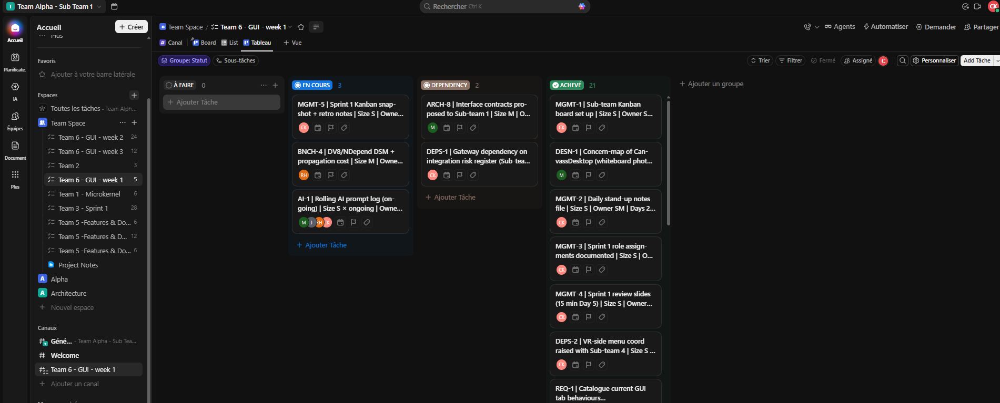

### Sprint 2 — end of week 2

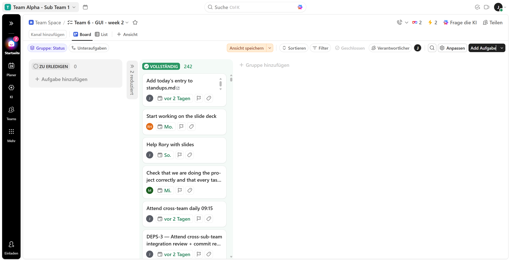

### Sprint 3 — end of week 3

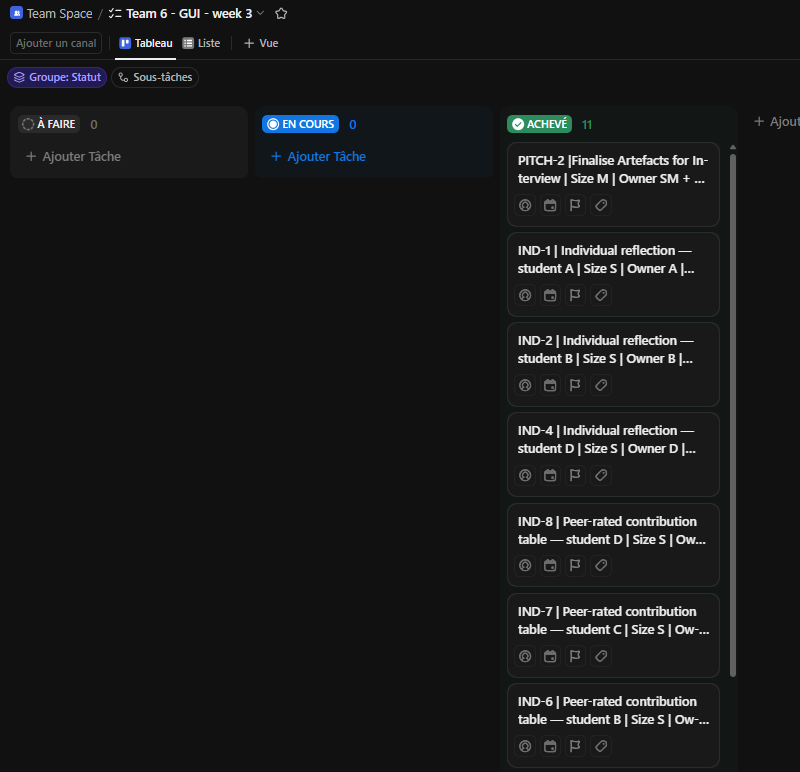


<div style="page-break-before: always;"></div>

# Part 7 — Daily Stand-up Notes (highlights)

The Brightspace specification didn't ask for these, but the original assignment brief did, so
we kept them. The full log is one shared file, `Sprint-Documents/standups.md` — one entry per
day, with the usual three questions each (yesterday, today, blockers). What follows
is a read of that log, grouped by sprint, rather than a re-paste of every table.

### Sprint 1 (Days 2–5, 19–22 May)

- Read the brief end to end and turned it into a plan; set up the ClickUp Kanban boards for the
  whole team.
- Got the iDaVIE system building and running on the team's machines.
- Mapped the before-state: a `CanvassDesktop` class diagram, a concern map of the god-class, and
  the first before-UML diagrams.
- Drafted the initial MVVM proposal.
- Stood up the metric tooling — CodeScene, NDepend and a basic CI — and captured the before-state
  CK numbers.
- Closed the sprint with a review and retrospective and committed the Sprint 2 plan.

### Sprint 2 (Days 6–10, 25–29 May)

- Split the sprint's work and assigned roles on Day 1.
- Brought both worked examples into scope and up to the same standard: the file tab was rescoped,
  and the debug tab was pulled up to match it.
- Wrote the sequence and phasing docs and finalised the requirements document, the architecture
  document and the main testing doc.
- Finished the second worked example and ran the SOLID/GRASP audit (Day 9).
- Day 10 was the Sprint 2 review and retro alongside the mid-assessment visit from the iDaVIE
  team. We also caught a mix-up between the sub-team and team interview formats and re-planned
  around it.

### Sprint 3 (Days 11–12, 2–3 June)

- The closing stretch, run from the schedule rather than a formal planning session: no sprint
  planning on Day 11, the final work day plus the 17:00 artefact freeze and the sub-team retro
  on Day 12, and interview day on 3 June with the stand-up brought forward to 08:55.
- Day 10's hand-off into this sprint was Q&A and interview-support material.

---

*End of integrated Section 9.2 deliverable — Sub-team 6 / Team Alpha / Die Boks (Desktop GUI & Client Shell).*
