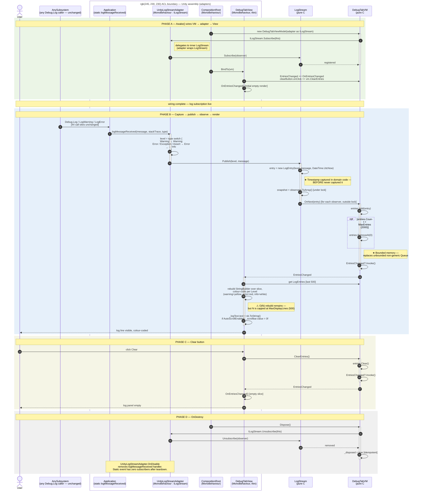

# Debug tab — AFTER sequence diagram (Mermaid)

## TL;DR

Mermaid `sequenceDiagram` of the AFTER trace. ACL boundary drawn as a `box` around `[Application, UnityLogStreamAdapter, CompositionRoot, DebugTabView]`. Producer side (`AnySubsystem → Application`) deliberately unchanged — the 44 `Debug.Log*` callers are captured automatically. Centrepiece: the `LogStream.Publish → ILogObserver.OnNext` dispatch replaces the entire BEFORE `HandleLog → Queue → StreamWriter → StringBuilder → TMP_InputField` chain in one arrow. `activate` bars only on `LogStream` (during dispatch) and `DebugTabVM` (during `AppendEntry`). Two `⚠` annotations mark the contained smells (O(N) rebuild capped at 500, forced scroll-to-bottom). Phase D (teardown) shown explicitly to make symmetric Subscribe/Unsubscribe lifetime visible.

---

Mermaid rendering of [`after-trace.md`](after-trace.md). Pair side-by-side with the BEFORE diagram in [`before-sequence.md`](before-sequence.md) on the panel slide: every BEFORE `→ HandleLog → Queue.Enqueue → StreamWriter → StringBuilder → TMP_InputField` chain collapses into the single `LogStream.Publish → ILogObserver.OnNext` dispatch here.

The ACL boundary is drawn as a `box` around the Unity-side adapters. The `DebugTabVM` and `LogStream` lifelines never send a message into the box without going through an interface.

Note that the producer-side `UnityEngine.Debug` hop shown in the BEFORE diagram (`Sub → UE → App`) is omitted here — the path is unchanged in AFTER, so the diagram skips straight from `Sub → App` to keep the eye on the new ACL and Observer structure.

---

## Side-by-side reading guide

Suggested slide layout for the panel:

| BEFORE callout | AFTER replacement |
|---|---|
| `Application.logMessageReceived += DebugLogging.HandleLog` (static-event subscription untestable) | One subscription confined to `UnityLogStreamAdapter.OnEnable` (`adapters/UnityLogStreamAdapter.cs:28-29`). The VM subscribes to `ILogStream`, not the static event. |
| 44 unstructured `Debug.Log*` callers across the codebase (S9) — see [`log-origin-trace.md`](log-origin-trace.md) | Captured automatically via `Application.logMessageReceived` — no caller change required. A structured `ILogStream.Publish(...)` path exists in the interface (`skeleton/ILogStream.cs:13`) for new callers that want to provide `source`/`level` directly. |
| `(string, string, LogType)` unstructured tuple | `LogEntry(Level, Message, Timestamp)` immutable record (`skeleton/ILogStream.cs:31`). |
| Non-generic `Queue` storing `object`, unbounded | Generic `List<LogEntry>` capped at 2000 entries (`skeleton/DebugTabViewModel.cs:22, 49-50`). |
| `StreamWriter` opened + closed per message | No file I/O on the hot path. Autosave reintroduced as a separate `ILogObserver` if needed. |
| `StringBuilder` rebuild over entire log history | Rebuild capped at 500-line slice (`adapters/DebugTabView.cs:35, 62-82`) — contained, not eliminated. |
| `transform.Find` / Inspector-wired button handlers | Code-side `clearButton.onClick.AddListener(vm.ClearEntries)` in `BindTo` (`adapters/DebugTabView.cs:47`). |
| Four responsibilities in one 172-line `MonoBehaviour` | Five named types, single responsibility each: `LogStreamAdapter` · `LogStream` · `DebugTabVM` · `DebugTabView` · `CompositionRoot`. |
| Timestamp never captured | Captured at the moment of `Publish` (`skeleton/LogStream.cs:36`). |
| Scroll forced to bottom every message | **Fixed** — `DebugTabView` gates the scroll on `IDebugTabViewModel.AutoScrollEnabled` (defaults `true`). S7 eliminated. |

---

## Mapping of contained smells (honest about what remains)

One `⚠` annotation remains in the diagram:

| Diagram marker | Smell ID | Location | Fix vector |
|---|---|---|---|
| `⚠ O(N) rebuild remains — capped` | S5/S6 | `adapters/DebugTabView.cs:62-82` | Replace TMP text rebuild with a virtualised `ListView` (Unity UI Toolkit). The VM's `LogEntries` contract is unchanged. |

S7 (scroll forced to bottom) is **eliminated**: `IDebugTabViewModel.AutoScrollEnabled` gates the scroll in `DebugTabView`. The fix required no change to `LogStream` or any of the existing tests; two new tests cover the default and toggle behaviour.

---

## What the diagram does *not* show (deliberately)

- **Direct `ILogStream.Publish(...)` callers.** The skeleton interface exposes a structured-publish path (`ILogStream.cs:13`) for new callers, but no production code uses it today — the 44 catalogued sites still go through `Debug.Log → Application.logMessageReceived → UnityLogStreamAdapter`. The diagram only draws the active path. See [`after-trace.md` → Open question: source field](after-trace.md#open-question-source-field).
- **The `source` field.** [`log-origin-trace.md`](log-origin-trace.md) argues for `Publish(LogLevel, string source, string message)`. The implemented contract is `Publish(LogLevel, string)` only; the diagram reflects the code, not the aspirational design.
- **Autosave / file export.** Not in the WE2 scope. Sketched as an `ILogObserver` follow-up in [`after-trace.md` → Open question: Save/autosave](after-trace.md#open-question-saveautosave).
