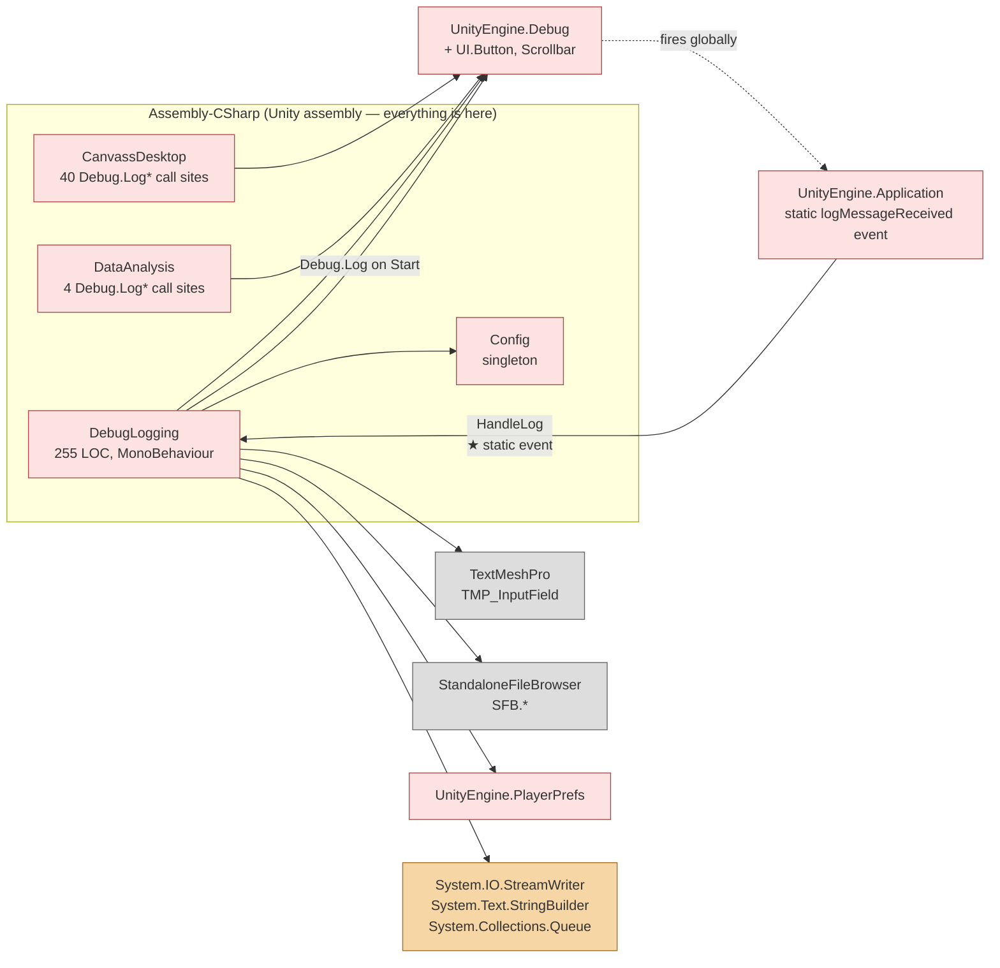
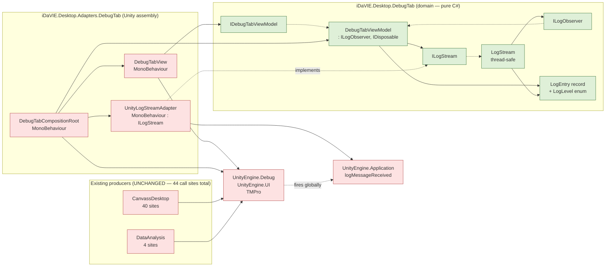

# Debug tab — dependency graph (BEFORE vs. AFTER)

## TL;DR

Module-level view defending the Section 4.2 claim for the Debug-tab slice. **BEFORE:** one `Assembly-CSharp` blob, `DebugLogging` is a hub for 9 collaborators reached directly, the producer/consumer seam is a static global event. **AFTER:** three assemblies (`Domain`, `Adapters`, `Producers`) with one-way dependency. Topological sort prints 5 layers with **zero cycles**. **Key claim — non-invasive at the producer side:** the 44 existing `Debug.Log*` callers in `CanvassDesktop` + `DataAnalysis` are captured automatically via `UnityLogStreamAdapter` — no production caller is modified. Migrating any specific producer to structured `ILogStream.Publish(...)` is an opt-in follow-up refactor (own ADR per producer), not a prerequisite. `dotnet build` on `DebugTabSkeleton.csproj` succeeds with zero `UnityEngine` references.

---

Module-level dependency view of the Debug-tab slice. The class-level view lives in [`class-diagram.md`](class-diagram.md); the numeric coupling figures live in [`ck-metrics.md`](ck-metrics.md). This document focuses on **packages / assemblies** and the **ACL boundary**.

The key claim defended here:

> Section 4.2 — *Domain code must not transitively depend on `UnityEngine` / `SteamVR` / native plug-ins.*

The BEFORE graph shows this claim is violated; the AFTER graph shows it is satisfied for the Debug-tab slice. Additionally, the AFTER graph proves that the **44 existing `Debug.Log*` call sites** catalogued in [`log-origin-trace.md`](log-origin-trace.md) are captured **without modifying any caller** — the refactor is non-invasive at the producer side.

---

## BEFORE — single Unity assembly, static-event hook



### What this graph proves about BEFORE

1. **No assembly boundary.** Everything lives in `Assembly-CSharp` (Unity's default). There is no way to compile or instantiate `DebugLogging` without `UnityEngine`, `TMPro`, `SFB`, `PlayerPrefs`, and `System.IO`.
2. **The producer/consumer seam is a static global event.** `Application.logMessageReceived` is a process-wide singleton hook with one subscriber (`DebugLogging.HandleLog`). No interface stands between Unity's runtime and the Debug tab. There is no way to substitute a fake log source in a test.
3. **`DebugLogging` is a hub for nine collaborators.** Capture (`UnityEngine.Debug`, `Application`), storage (`Queue`, `StreamWriter`), display (`TMP_InputField`, `Scrollbar`), and export (`Button`, `SFB`, `PlayerPrefs`) are all reached directly. No layering.
4. **Test reachability.** Any unit test of debug-tab logic requires the full Unity assembly to load. That's why there are zero NUnit tests for `DebugLogging` in the BEFORE codebase.

### Cycles

No debug-tab → debug-tab cycle within the slice itself. `DebugLogging` is a leaf consumer of the `Application` event and a leaf producer to TMP / Scrollbar / Button. The wider cycles concern callers of `Debug.Log*` (specifically `CanvassDesktop`) — those are file-tab / cross-tab concerns, not debug-tab.

---

## AFTER — three assemblies, one ACL boundary, producers untouched



### What this graph proves about AFTER

1. **Three assemblies with a single direction of dependency.** `Adapters` references `Domain`; `Domain` does **not** reference `Adapters`. The arrow direction is enforced by `DebugTabSkeleton.csproj` having zero `UnityEngine` references — flipping it would not compile.
2. **Section 4.2 satisfied for the slice.** No solid arrow leaves `Domain` toward `UnityEngine`, `TMPro`, or `System.IO`. `DebugTabViewModel` cannot, even by accident, end up calling `Application.logMessageReceived` or `TMP_Text.text`.
3. **Producers are entirely untouched.** The `Producers` package contains the same `CanvassDesktop` and `DataAnalysis` classes as BEFORE, calling the same `Debug.Log*` methods. The only path change is that `Application.logMessageReceived` now dispatches to `UnityLogStreamAdapter` (in `Adapters`) instead of `DebugLogging` (deleted). Migrating any specific producer to structured `ILogStream.Publish(...)` is a separate, opt-in refactor — not a prerequisite for this slice.
4. **One composition root** (`DebugTabCompositionRoot`) is the only class permitted to reference both `Domain` and `Adapters` concrete classes. It instantiates the domain object graph and hands it to the view; it also disposes the VM on `OnDestroy`.
5. **Test reachability.** `dotnet test refactoring-examples/sub-team-6/debug-tab/tests/DebugTabTests.csproj` compiles and runs against the `Domain` assembly alone, with no Unity present. The 31 NUnit tests in `tests/DebugTabTests.cs` exercise the slice end-to-end via test doubles.

### Cycles in the AFTER graph

**Zero.** Verifiable by topological sort:

```
Layer 0:  LogEntry, LogLevel, ILogObserver
Layer 1:  ILogStream, IDebugTabViewModel
Layer 2:  LogStream, DebugTabViewModel
Layer 3:  UnityLogStreamAdapter, DebugTabView
Layer 4:  DebugTabCompositionRoot
```

No back-edges. No `Adapters → Domain.concrete` edges except via the composition root (which `new`s the concrete VM — not a cyclic dependency). This satisfies the *Zero circular dependencies* constraint of Section 4.2.

---

## Side-by-side delta

| Property | BEFORE | AFTER |
|---|---|---|
| Assemblies on critical path | 1 (`Assembly-CSharp`) | 3 (`Domain` + `Adapters` + `Producers`) |
| `Domain → UnityEngine` edges | direct (n/a — no domain layer existed) | **zero** |
| `Domain → System.IO` edges | direct (`StreamWriter`) | **zero** |
| `Domain → TMPro` edges | direct (`TMP_InputField`) | **zero** |
| Interfaces on critical path | 0 | 3 (`IDebugTabViewModel`, `ILogStream`, `ILogObserver`) |
| Composition root | absent (`Start()` does inspector lookups + log-rotation) | explicit (`DebugTabCompositionRoot.Awake()`) |
| Static-event subscribers | 1 (`DebugLogging`, hard-wired) | 1 (`UnityLogStreamAdapter`, swappable) |
| Producer call sites modified | 0 (the static `Debug.Log` API is what they already use) | **0** (same — refactor is non-invasive at producer side) |
| Cycles | 0 (within slice) | **0** |
| Test-runner reach | Unity required | `dotnet test` from any CI runner |
| Section 4.2 compliance | ❌ | ✅ |

---

## What the producer side does *not* yet do

The graph above shows the 44 existing `Debug.Log*` callers (`CanvassDesktop`, `DataAnalysis`) still go through the `UnityEngine.Debug → Application` static event. They could instead inject `ILogStream` and call `Publish(level, message)` directly, which would:

- Carry a structured `LogLevel` enum end-to-end (today the captured `LogType` is normalised by `UnityLogStreamAdapter.OnUnityLog`, which is acceptable but loses any `LogType.Assert` distinction).
- Eventually carry a `source` string if `ILogStream.Publish` is extended (see [`after-trace.md` → Open question: source field](after-trace.md#open-question-source-field)).
- Make the producer testable in isolation, since the `Debug.Log*` static dependency is replaced by an interface injection.

**This migration is explicitly out of scope for the WE2 worked example.** Each producer becomes its own ADR/refactoring slice (e.g. WE3-DataAnalysis, WE4-CanvassDesktop) and is owned by whichever sub-team owns the producer. The Debug-tab refactor is structured so that both pathways (legacy `Debug.Log*` capture, structured `Publish`) coexist behind the same `ILogStream` interface — the producer-side migration can happen file-by-file without breaking the consumer side.

---

## Tool verification needed

Once the Quality Guild's tooling is wired up (Day 2 baseline, Day 13 projected snapshot), confirm:

1. **NDepend rule:** `Application_Code.AreInNamespace("iDaVIE.Desktop.DebugTab")` does **not** transitively reach `Application_Code.AreInNamespace("UnityEngine")` — should report 0 violations on the AFTER skeleton.
2. **DV8 architecture model:** declare the three packages above and assert the only legal direction is `Adapters → Domain` (and `Producers → UnityEngine.Debug`, which is unchanged). The DSM should be strictly lower-triangular for the Domain/Adapters slice.
3. **CodeScene hotspots:** `Assets/Scripts/Debuggers/DebugLogging.cs` should appear on the BEFORE snapshot's churn-vs-complexity list; after our refactor the equivalent responsibilities (now split across `LogStream`, `DebugTabViewModel`, `UnityLogStreamAdapter`, `DebugTabView`) should each be below the hotspot threshold.

A short follow-up commit on Day 13 will paste tool screenshots / DSM exports alongside this document.
