# Consolidated Refactoring Proposal Report — Team Alpha

**iDaVIE: Refactoring the Codebase for Maintainability against ISO/IEC 25010:2023**

_Team-level deliverable **T4** — Consolidated refactoring proposal report (maximum 60 pages excluding appendices)._

| | |
|---|---|
| Codebase | iDaVIE — Immersive Data Visualisation Interactive Explorer (C# on Unity 2021.3 LTS + C/C++ native plug-ins) |
| Target style | Client–server · micro-kernel server · layered kernel (Domain → Application → Infrastructure → Plug-in Host) · versioned C/C++ plug-in host · anti-corruption layer around Unity 6 / SteamVR |
| Standard | ISO/IEC 25010:2023 maintainability — Modularity, Analysability, Modifiability, Testability, Reusability |
| Baseline tools | NDepend v2026.1.5 over 37 assemblies / 3,051 files; SciTools Understand; whole-codebase static CK pass (104 first-party files); SonarQube Cloud; CodeScene; DV8 (all 2026-05-20 → 2026-06-04) |
| Mode | **Design-only proposal.** Worked examples show how the code *would* change; no production code is modified. |

> **This document is self-contained.** It is the single artefact a reader needs. The
> companion team deliverables are **embedded in full as appendices**, not referenced as
> external files: the 12-ADR architecture decision log (Appendix A), the consolidated CK
> metrics with provenance (Appendix B), the architecture diagrams as inline Mermaid plus an
> index (Appendix C), the plug-in ABI specification and conformance suite (Appendix D), the
> full NDepend maintainability benchmark (Appendix E), and the complete AI-tool usage log and
> reflection with sub-team sign-off (Appendix F). The 60-page limit applies to the body
> (§1–§12); appendices are excluded by the assignment.
>
> **Evidentiary discipline.** Every CK number is reproduced verbatim from the sub-team
> deliverable that measured it (consolidated in Appendix B); nothing is estimated or invented.
> Where a measurement was not taken, it is shown as a gap, not filled. Two such gaps are
> declared up front and carried honestly throughout (§6.4 WP4 after-CK; §6.7 WP7 measurements).

---

## Contents

| § | Section |
|---|---|---|
| 1 | Executive summary |
| 2 | The problem — baseline maintainability and pain points |
| 3 | Requirements — NFRs and architectural drivers |
| 4 | Target architecture (C4, micro-kernel, layered kernel, ACL, ABI) |
| 5 | Architecture decision records (summary) |
| 6 | Worked refactoring examples (seven work packages) |
| 7 | Consolidated metrics and projected improvement |
| 8 | Testability strategy and CI quality gates |
| 9 | Unity 5 → Unity 6 migration plan |
| 10 | Cross-sub-team integration |
| 11 | Trade-offs and risk |
| 12 | AI usage and conclusion |
| — | **Appendices A–F** (not counted toward the 60-page limit) |

**Sub-team ↔ work-package map** (Team Alpha internal numbering): **1** Architecture / Micro-kernel · **2** Data I/O & Native Plug-ins · **3** Rendering & Compute · **4** Interaction System · **5** Feature System & Domain Model · **6** Desktop GUI & Client Shell · **7** Persistence & Workspace State.

---

## 1. Executive Summary

iDaVIE is a mature, scientifically valuable VR application for exploring astronomical data
cubes, but its architecture carries a maintainability debt that an imminent **Unity 5-era →
Unity 6 migration** will sharply amplify. An NDepend baseline over the whole solution records
**20,031 issues**, a technical debt of **430.63 man-days (10.29 %, the "High" tier)**, and a
debt **breaking-point of ~1.46 years** — under **one year** when only critical- and
high-severity issues are counted. **Three of twelve quality gates already fail** at the first
measurement, and **110 of 174 rules (63 %)** are violated.

The debt is concentrated in a small number of **god classes**. A whole-codebase static CK pass
over the 104 first-party source files confirms the picture independently: `VolumeDataSet`
(1,920 LOC), `CanvassDesktop` (1,899 LOC), `VolumeInputController` (1,634 LOC),
`DesktopPaintController` (1,558 LOC) and `VolumeDataSetRenderer` (1,402 LOC) each intermix
Unity lifecycle, domain logic, native-plug-in calls and presentation in a single unit, with a
single method reaching **cyclomatic complexity 575** and a single type reaching **3,422 LOC**.

Team Alpha proposes the target architecture mandated by the assignment: a **client–server
split**, a **micro-kernel server** exposing a **versioned C ABI** to native plug-ins, a
**strictly layered kernel** (Domain → Application → Infrastructure → Plug-in Host) with
downward-only dependencies, and an **anti-corruption layer (ACL)** isolating Unity and SteamVR
so domain logic becomes testable without a headset or the Editor. **Twelve ADRs** (Appendix A)
record the decisions and their trade-offs.

The proposal is evidenced by **worked refactoring examples across all seven work packages**,
each with before/after class structure, design-pattern justification, and — where measured —
Chidamber & Kemerer (CK) metric deltas. The headline results, drawn verbatim from the
sub-teams' own tool exports:

- **`VolumeDataSetRenderer`** (Sub-team 1 projection): WMC ≈ 138 → 22, CBO ≈ 17 → 9, RFC ≈ 72 → 24, LCOM ≈ 0.82 → 0.20 (worst successor class). Sub-team 3, measuring the same class with SciTools Understand, records **WMC 97 → 12** and **RFC 97 → 12**.
- **`FitsReader`** (Sub-team 2, NDepend-measured): the **55-WMC / 126-RFC / 1.0-LCOM** monolith is recast into five focused classes; **LCOM drops to 0** across all of them.
- **`CanvassDesktop` file tab** (Sub-team 6, Understand, tool-verified): WMC 63 → 40, CBO 30 → 19, LOC 1,899 → ~450, and **dependency cycles 2 → 0** — with **47 NUnit tests** now possible where **none** were before.

We are candid about **two evidence gaps**: the **Interaction** work package (WP4) built the
refactored code and tests but did **not record after-refactor CK values**, and the
**Persistence** work package (WP7) recorded only target thresholds, not measured baselines.
Both are presented honestly in §6 and §7 rather than filled with speculative numbers,
consistent with the assignment's rule that projected snapshots must be evidence-backed. We are
equally candid that the **single largest classes — `VolumeDataSet`, `DesktopPaintController`,
`ShapesManager` — were not themselves selected as worked examples**; they are named here as the
largest remaining debt and the first targets of the structured programme this proposal
recommends.

The remainder of this report substantiates these claims and sets out the requirements, the
target architecture, the testability strategy, the Unity 6 migration plan, the integration
model across sub-teams, and the trade-offs the panel should weigh.

---

## 2. The Problem — Baseline Maintainability and Pain Points

This section is the evidentiary baseline. It draws on four independent measurements taken over
the same code snapshot: the **NDepend maintainability benchmark** (full report embedded as
Appendix E), a **whole-codebase static CK pass** over the 104 first-party files (Appendix B.2),
**SciTools Understand** and **SonarQube/CodeScene/DV8** outputs reported by individual
sub-teams (Appendix B.1), and the architectural review captured in the ADRs (Appendix A).

### 2.1 Headline figures (NDepend, whole solution)

| Indicator | Value | Status |
|---|---|---|
| Total issues | 20,031 | Requires attention |
| Critical issues | 29 | **FAIL** (gate threshold 10) |
| Technical debt | 430.63 man-days (10.29 %) | High tier (> 10 %) |
| Annual interest on debt | 295.03 man-days | ~1.18 developer-years / year |
| Breaking point (all debt) | ~1.46 years | Urgent |
| Breaking point (critical/high only) | ~0.99 years | Immediate |
| Quality gates failed | 3 of 12 | **FAIL** |
| Rules violated | 110 of 174 (63 %) | Significant |
| Critical rules violated | 12 | **FAIL** (threshold 0) |

The three failing gates are **critical issues** (29 vs 10), **critical rules violated**
(12 vs 0) and **debt rating per namespace** (13 namespaces over budget). A further three
coverage gates were *skipped* because no coverage data exists — itself a finding (§8). The
analysis covered **154,641 LOC** across 37 assemblies; of this, ~31,500 LOC across 104 files is
**first-party** code (the team's own scripts), the remainder being Unity, SteamVR and
third-party assemblies.

### 2.2 The god-class landscape (whole-codebase static CK pass)

A static CK pass over all 104 first-party files ranks the maintainability hotspots
independently of NDepend. The largest offenders:

| Class | LOC | WMC | DIT | CBO | RFC | LCOM | Refactored as a worked example? |
|---|---|---|---|---|---|---|---|
| `VolumeDataSet` | 1,920 | 330 | 0 | 15 | 80 | High | ❌ **No** — largest remaining debt |
| `CanvassDesktop` | 1,899 | 340 | 1 | 12 | 70 | High | ✅ WP6 (File + Debug tabs) |
| `VolumeInputController` | 1,634 | 192 | 1 | 10 | 65 | High | ✅ WP4 |
| `DesktopPaintController` | 1,558 | 305 | 1 | 9 | 55 | High | ❌ **No** — sixth (Paint) tab god class |
| `VolumeDataSetRenderer` | 1,402 | 297 | 1 | 8 | 60 | High | ✅ WP1 + WP3 |
| `FitsReader` | 730 | 147 | 0 | 3 | 50 | Moderate | ✅ WP2 |
| `ShapesManager` | ~500 | 169 | 1 | 8 | 55 | High | ❌ **No** |
| `CatalogDataSetRenderer` | 694 | 145 | 1 | 8 | 55 | High | ❌ **No** |
| `VolumeCommandController` | 685 | 108 | 1 | 7 | 45 | Moderate | ✅ WP4 (voice path) |
| `MomentMapRenderer` | ~350 | 40 | 1 | 6 | 32 | Moderate | ✅ WP5 |

The most-coupled classes by CBO are `VolumeDataSet` (coupled to 15 classes including
`DataAnalysis`, `AstTool`, `FitsReader`, `Config`, every renderer and manager) and
`CanvassDesktop` (12). Both are knots in the dependency graph: any class holding a reference to
them transitively pulls in the full Unity runtime. **Three of the five biggest classes
(`VolumeDataSet`, `DesktopPaintController`, `ShapesManager`) were not selected by any sub-team
as a worked example** — a deliberate scope honesty: the worked examples prove the *method*; the
structured programme (§7, §11) must then be applied to the largest remaining classes.

### 2.3 Complexity outliers (NDepend)

Averages are healthy (mean cyclomatic complexity 1.95, mean 4.13 LOC/method), but the **maxima
reveal the god-class problem** that the averages hide:

- A single method of **1,396 LOC** (≈ 23× the recommended 60).
- A single method with **cyclomatic complexity 575** (the unmaintainable threshold is ~25).
- A single type of **3,422 LOC** and a type with **1,970 methods**.
- Maximum IL nesting depth of **161**.

These outliers drive a disproportionate share of the critical/high issue counts and are exactly
the classes the worked examples in §6 dismantle.

### 2.4 A note on metric divergence (and why it strengthens the case)

The same classes were measured by three different tool configurations during the project — the
whole-codebase static pass (§2.2), NDepend (Sub-teams 1, 2, 6), and SciTools Understand
(Sub-teams 3, 5, 6). **Absolute CK values diverge by tool** because each counts "a method"
differently (declared methods only, vs. property accessors, lambdas and local functions) and
computes WMC as either a method count or a cyclomatic-weighted sum. For `VolumeDataSetRenderer`,
WMC is recorded at **297** (static pass), **138** (NDepend) and **97** (Understand); CBO at 8,
17 and 28 respectively.

We therefore treat absolute WMC/CBO as **tool-relative**, and report each worked example's
before/after delta **in a single, consistent tool** (§6, Appendix B.1). What is *robust* across
all three measurement methods is (a) the **identity and ranking** of the god classes and (b)
the **direction and large magnitude** of the post-refactor reduction. Three independent methods
agreeing on which classes are the hotspots is not noise to apologise for — it is
**triangulation**, and it is itself evidence (this is also logged candidly in the AI-tool
reflection, Appendix F, where AI-assisted metric counts had to be cross-checked against tool
exports).

### 2.5 Pain points mapped to ISO/IEC 25010

The assignment names seven maintainability pressures (spec §1.1). Each maps to a measurable
baseline symptom and a 25010 sub-characteristic:

| Pain point | Baseline symptom (measured) | 25010 sub-characteristic |
|---|---|---|
| MonoBehaviour ↔ scene coupling | Domain logic uninstantiable outside Unity; 52 classes inherit `MonoBehaviour` | Testability |
| Heavy singleton reliance | `Config.Instance`, `FindObjectOfType<>()` hidden deps (e.g. `QuickMenuController.OnEnable`) | Modularity, Testability |
| Long monolithic classes | WMC/RFC/LCOM breaches on 6 god classes; max type 3,422 LOC | Analysability, Modifiability |
| Mixed concerns in render/interaction | LCOM "High" on the 6 god classes; LCOM ≈ 0.95 (Understand) on the renderer | Modularity |
| Unity lifecycle ∩ domain logic | `Update()`/`Start()` carry business logic; `_startFunc()` 185 LOC, CC 28 | Testability, Modifiability |
| Thin abstraction over native plug-ins | Direct P/Invoke, unversioned ABI, 3 `Free*` functions, `int64_t`/`int` struct drift | Modularity, Reusability |
| Limited test coverage | No coverage data importable; 154,641 LOC flagged "uncoverable" | Testability |

### 2.6 The amplifier — Unity 6

A migration from Unity 5-era patterns to Unity 6 (new Input System, scriptable render
pipelines, package architecture, UI Toolkit, managed-code stripping) is imminent. Because
domain logic is today fused to `UnityEngine` and `SteamVR` types, **every API change ripples
through the entire codebase**. The central promise of the target architecture (§4, §9) is to
**confine that ripple to a thin adapter layer**.

### 2.7 Positive baselines to preserve

Two findings are strengths to retain, not regress: a **32.34 % comment ratio** (above the
15–30 % industry guidance) and **no assembly-level dependency cycles** at baseline (NDepend:
"No dependency cycle detected in assemblies reference graph"). The proposal must hold both while
removing the *namespace-level* cycles the desktop and rendering slices do exhibit (§6.6, §6.3).

---

## 3. Requirements — NFRs and Architectural Drivers

Every sub-team translated the four ISO/IEC 25010 maintainability sub-characteristics (plus
Reusability) into testable non-functional requirements. The drivers converge on a common,
tool-checkable threshold set drawn from spec §7.1–7.2:

| Driver | Threshold | Tool / gate |
|---|---|---|
| WMC | ≤ 20 domain; ≤ 40 adapter | Understand / NDepend |
| DIT / NOC | ≤ 4 / ≤ 5 | Understand / NDepend |
| CBO | ≤ 14 domain; ≤ 25 orchestrator/adapter; cycles = 0 | Understand / NDepend |
| RFC | ≤ 50 | Understand / NDepend |
| LCOM (Henderson-Sellers) | ≤ 0.5 | Understand |
| Cognitive complexity / method | ≤ 15 | SonarQube |
| Duplication | ≤ 3 % (30-line block) | SonarQube |
| Branch + line coverage | ≥ 70 % domain; ≥ 50 % overall | SonarQube coverage |
| Static / Unity calls per ViewModel/domain class | 0 | Custom NDepend CQLinq rule |
| Interface size (ISP) | ≤ 7 public members | Review / audit |
| Dependency cycles | 0 at namespace and assembly level | NDepend / DV8 DSM |

> **LCOM units.** Teams reported LCOM either on the 0–1 Henderson-Sellers scale or as a
> percentage ("Percent Lack of Cohesion", = Henderson-Sellers × 100). Each value below is shown
> in the unit its own source uses; this is flagged per table.

The clearest worked NFR set is **Sub-team 6's**, which assigns a MoSCoW priority and an
acceptance metric to every requirement and ties each to a real defect — e.g. *NFR-REU-3*
("ViewModel has zero transitive `UnityEngine` dependency", verified by NDepend on every PR;
motivated by bug B-02, the debug-tab crash during cube load). **Sub-team 7** marks *NFR1*
(compile/run outside Unity) and *NFR2* (every public boundary an interface with ≥ 1 test
double) as **mandatory**, sourced directly from spec §4.2 constraints 3 and 4. **Sub-team 3**
records the rendering-system invariants that act as performance drivers: a **90 fps floor**, a
**4 GB texture cap**, a **368 MB default cube budget**, and **nearest-neighbour filtering only**.

The **architecturally significant requirements (ASRs)** — kernel load time, ABI stability,
plug-in failure isolation, hot-reload, and observability — are owned by Sub-team 1 and realised
by the architecture in §4. Each NFR is verified by a CI gate (§8) so that the requirement and
its evidence travel together rather than the requirement being a claim checked only by review.

---

## 4. Target Architecture

iDaVIE moves from a single-process Unity monolith to a **client–server system** with a
**micro-kernel server**, a **strictly layered kernel**, an **anti-corruption layer** around the
engine, and a **versioned C ABI** for native plug-ins. This section presents the architecture at
C4 Levels 1–3, then the four mechanisms that deliver the maintainability gains. All diagrams are
inline Mermaid; the full diagram index (with the canonical PlantUML/Mermaid sources) is
Appendix C.

### 4.1 Style summary

- **Client** (Unity 6 process): VR rendering, input, and presentation. Contains the Desktop GUI subsystem (MVVM, Sub-team 6), the VR Interaction subsystem (Sub-team 4), the VR Rendering subsystem (Sub-team 3), and the anti-corruption layer (Sub-team 1).
- **Server** (micro-kernel): data, domain logic, plug-in execution, and long-running computation, organised as four downward-only layers.
- **Seam:** a **Service Gateway** speaking **JSON-RPC 2.0 over named pipes** locally, with a **gRPC** upgrade path for remote streaming. Today both sides share one Unity process; the interface layer *is* the seam for a future out-of-process split, so the split can happen later without re-coupling.

### 4.2 C4 Level 1 — System context

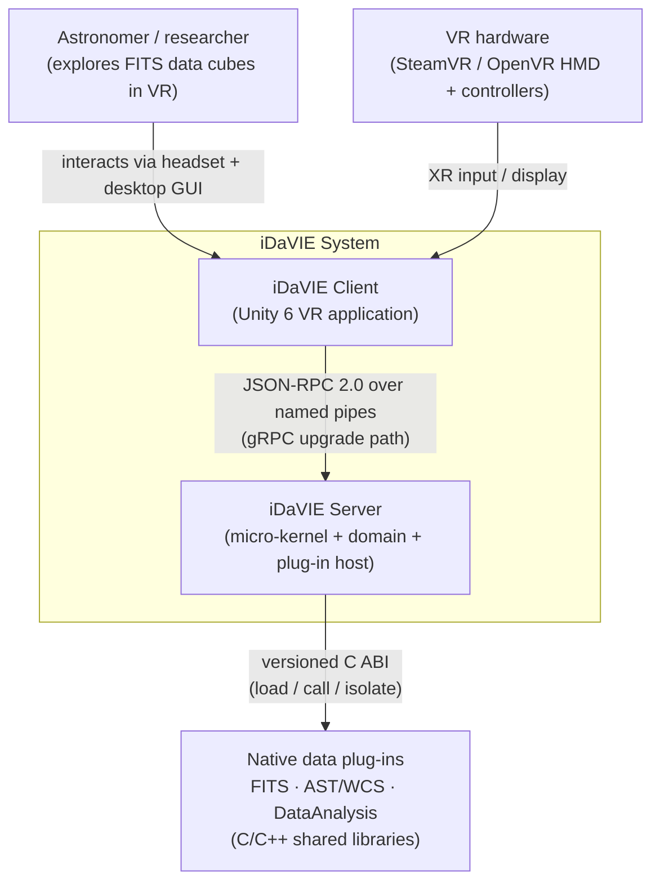

The Level 1 view fixes the boundary: a single human actor, a two-container system, and two
external dependencies (the VR hardware and the native plug-ins). The plug-ins are *outside* the
trust boundary of the kernel — they are loaded across a versioned, fault-isolating ABI (§4.6),
so a misbehaving plug-in cannot crash the VR session.

### 4.3 C4 Level 2 — Containers

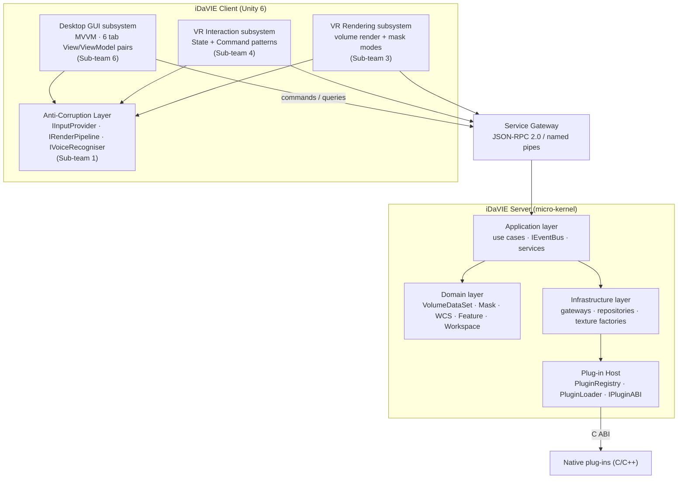

Client containers depend **only** on ACL interfaces and the Service Gateway, never on server
internals. Inside the server, the four layers depend **downward only** (§4.5). The Service
Gateway is the one place that knows the wire protocol; everything above it deals in C# method
calls and DTOs.

### 4.4 C4 Level 3 — Components (Desktop GUI exemplar)

The Desktop GUI subsystem is the most fully worked L3 example (Sub-team 6). `CanvassDesktop`
decomposes into the **MVVM triad** per panel, with **six** tab View/ViewModel pairs — **File,
Render, Stats, Sources, Paint, Debug** (the Paint tab, backed today by the 1,558-LOC
`DesktopPaintController`, is the often-overlooked sixth). Each View is Unity-side and free of
business logic; each ViewModel is pure C# with **zero `UnityEngine` dependency**; a per-panel
**Service Gateway adapter** translates ViewModel commands to server calls. The full L3 component
diagram is Appendix C; the File-tab and Debug-tab realisations are worked end-to-end in §6.6.

### 4.5 Micro-kernel server

The kernel is a minimal, stable core providing three services; everything domain-specific
(paint, moment maps, spectral profiles, features, voice, catalog, video) becomes a **plug-in**
that registers against the kernel's interfaces. *"The kernel knows nothing about astronomy,
painting, or moment maps."*

- **`AppKernel`** — a service registry that replaces every `FindObjectOfType<>()` call and Inspector-wired field. Components register at `Awake()` and resolve by interface (`AppKernel.Instance.Get<IInputSource>()`).
- **`CommandBus`** — a typed event dispatcher that replaces the **~200-line if/else chain** in `VolumeCommandController.ExecuteVoiceCommand()`. Any input source (voice, controller, desktop button) publishes reified command records (`SetColorMapCommand`, `SetThresholdCommand`, `CropToSelectionCommand`, `ActivateToolCommand`, …); subsystems subscribe to the commands they handle. Publishers and subscribers never reference each other.
- **Stable interfaces** — `IVolumeRenderer` (implemented by `VolumeDataSetRenderer`) and `IInputSource` (implemented by `VolumeInputController`), so tools hold interfaces, never concrete classes, and the input state machine is no longer forced `public`.
- **`IAnalysisTool` + `ToolRegistry`** — every tool exposes `Name`, `VoiceCommands`, `HandleCommand`, `BuildMenuPanel`, `Activate`, `Deactivate`; the registry aggregates voice phrases into the recogniser and builds menu tabs dynamically, eliminating the hardcoded `public GameObject paintMenu` fields in `QuickMenuController`.

The shift in control flow — from a god-object dispatcher that calls seven concrete subsystems,
to a kernel through which inputs and tools communicate without naming each other:

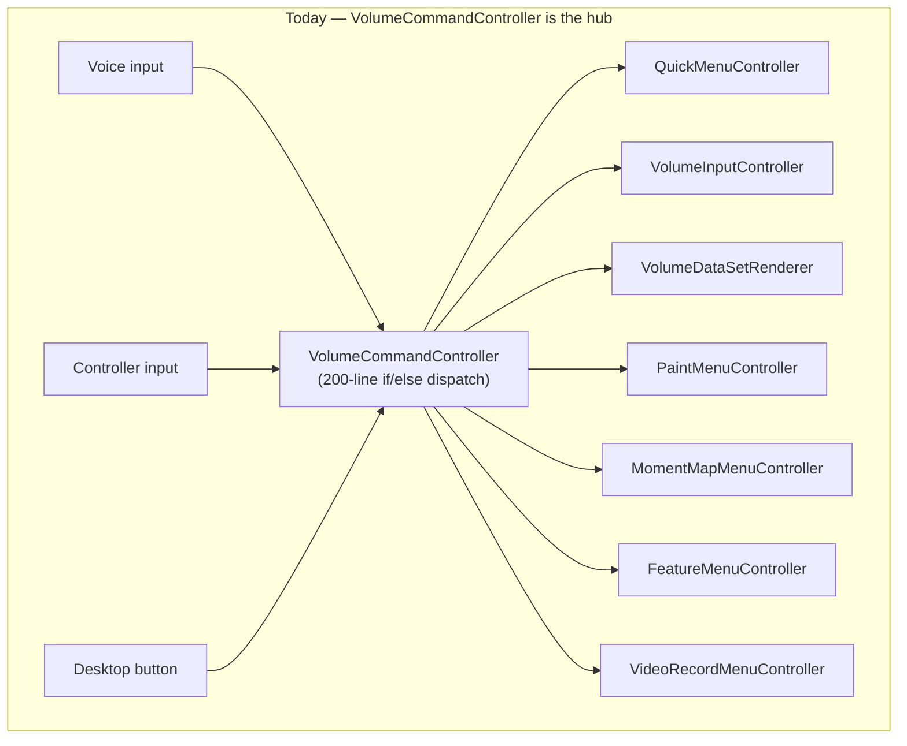

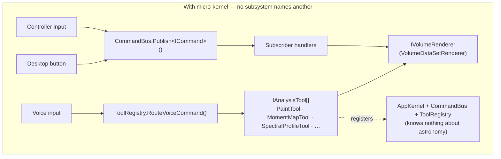

### 4.6 Layered kernel and the downward-only rule

Inside the kernel, dependencies flow **Domain → Application → Infrastructure → Plug-in Host**,
downward only. Upward references and dependency cycles are a **CI fail condition** (§5
ADR-005/ADR-008).

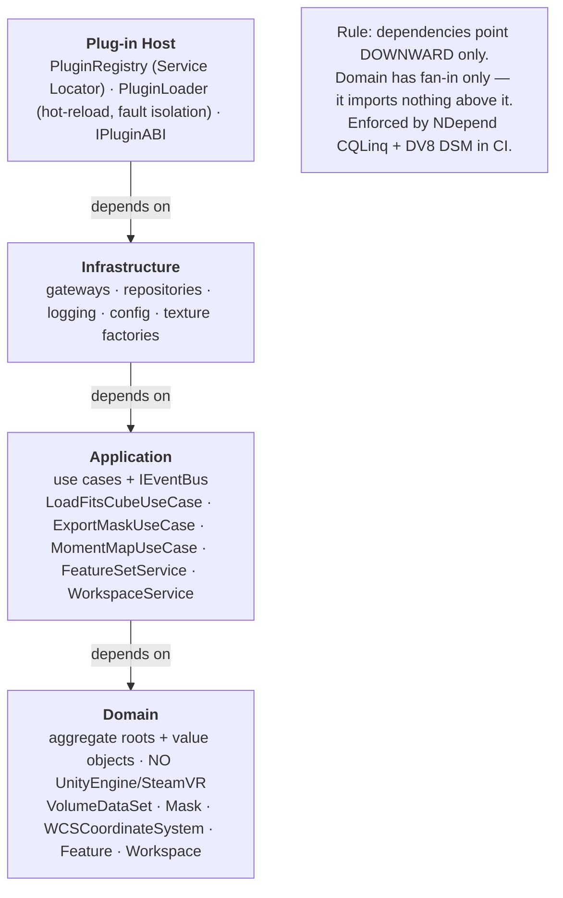

- **Domain** — pure C#, no engine references, fan-in only. This is what makes the bulk of the logic unit-testable.
- **Application** — use cases and the `IEventBus` abstraction (ADR-007); orchestrates domain objects.
- **Infrastructure** — concrete gateways, repositories, texture factories, config, logging.
- **Plug-in Host** — `PluginRegistry` (the **one** accepted Service-Locator exception, GRASP Indirection / Protected Variations), `PluginLoader` (hot-reload + fault isolation), and `IPluginABI`.

### 4.7 Anti-corruption layer

A set of stable C# interfaces lets domain/application code depend on abstractions, with
Unity/SteamVR confined to adapter implementations in Infrastructure:

- **VR/engine:** `IInputProvider`, `IPointer`, `IGripInput`, `IVoiceInput`, `IHaptics`, `IVoiceRecogniser`, `IRenderPipeline`, `IRenderContext`, `ITextureUploader`. Named adapters: `SteamVRInputAdapter` (**the intended single point of SteamVR import in the target design** — in the WP4 worked example SteamVR wiring is not yet extracted; see §6.4), `UnityInputSystemAdapter`, `URP`/`HDRP` `RenderPipelineAdapter`, `UIToolkitBridge`.
- **Desktop side:** eleven interfaces (`IFitsService`, `ILogStream`, `IVolumeService`, `IFileDialogService`, `IConfigService`, `IMemoryProbe`, …) quarantine `StandaloneFileBrowser`, `PlayerPrefs`, and the JSON-RPC gateway.

NDepend/DV8 CI rules **reject any PR importing `UnityEngine` from a ViewModel or domain
assembly** (the `arch-tests` fitness function, §8). This is the mechanism by which the Unity 6
migration surface is confined to adapters (§9).

### 4.8 Plug-in C ABI (versioned) — summary

The current native DLLs (`FitsReader`, `DataAnalysis`, `AstTool`) are called with two binding
styles, leak third-party types (`fitsfile*`, `AstFrameSet*`) through public headers, expose
three different `Free*` functions, and suffer struct-layout drift (`SourceStats.spectralProfileSize`
is `int64_t` natively but `int` in C# — a latent corruption bug). The proposed ABI
(full specification + conformance suite in **Appendix D**) fixes this:

- **SemVer 2.0.0** with a runtime `idavie_abi_version()` the host calls **before binding any other symbol**; a MAJOR mismatch refuses the load.
- **Single error path:** every function returns `idavie_status_t` (`IDAVIE_OK == 0`, positive errors) plus a thread-local `idavie_last_error_message()`; **no exceptions, no `errno`, no CFITSIO codes** cross the boundary.
- **Threading:** re-entrant across distinct handles; not thread-safe on the same handle; a worker-thread progress/cancellation callback returns `IDAVIE_ERR_CANCELLED` cooperatively.
- **Single allocator:** opaque handles via one `_open`/`_close` pair (C#-wrapped in `SafeHandle`); all cross-boundary memory freed by value through one `idavie_free`, removing the Windows DLL-heap-mismatch bug class.
- **Conformance:** eight clauses (C1–C8) checked at build/load time; a non-conformant plug-in is **rejected at load**, and two CI gates run the conformance harness per-plug-in and at integration.

This realises **ISO 25010 Modularity** (decoupling Unity from the data plumbing),
**Reusability** (a versioned, stable interface), and **Modifiability** (plug-ins evolve without
breaking the host).

---

## 5. Architecture Decision Records (Summary)

Twelve ADRs (all *Proposed*, pending Architecture Guild ratification) record the decisions,
their consequences and the alternatives weighed. The **full log is Appendix A**; this is the
index plus the four keystone decisions in brief.

| ID | Title | Drivers (25010) | LOs |
|---|---|---|---|
| ADR-001 | Adopt layered micro-kernel architecture | Modularity, Modifiability, Testability | LO3, LO4 |
| ADR-002 | Introduce anti-corruption layer around Unity and SteamVR | Testability, Modifiability | LO3, LO4, LO6 |
| ADR-003 | Replace singleton-based services with dependency injection | Testability, Modularity | LO4, LO6 |
| ADR-004 | Standardise plug-in ABI for native C/C++ extensions | Modularity, Reusability | LO3, LO5 |
| ADR-005 | Enforce architecture rules in CI | Modularity, Analysability | LO1, LO6, LO7 |
| ADR-006 | Separate domain logic from MonoBehaviour lifecycle | Testability, Modifiability | LO4, LO5, LO6 |
| ADR-007 | Adopt event-driven communication for cross-system integration | Modularity, Modifiability | LO3, LO4 |
| ADR-008 | Define and enforce package/namespace dependency rules | Modularity | LO3, LO7 |
| ADR-009 | Adopt MVVM for the desktop GUI client shell | Testability, Modularity | LO4, LO5 |
| ADR-010 | Formalise State and Command patterns for the interaction system | Testability, Analysability | LO4, LO5 |
| ADR-011 | Define Feature as a first-class domain aggregate | Modularity, Testability | LO4, LO5 |
| ADR-012 | Establish a versioned workspace persistence contract | Modifiability, Testability | LO4, LO5, LO6 |

**Four keystone ADRs in brief:**

- **ADR-001 (micro-kernel)** is the root decision; all others trace to it. CK targets (WMC ≤ 20, CBO ≤ 14, LCOM ≤ 0.5) become CI fitness functions. *Trade-off:* added indirection and onboarding cost, accepted because the 90 fps floor is GPU-bound, not logic-bound, so the abstraction overhead is off the hot path.
- **ADR-002 (ACL)** makes pure-C# unit testing possible and confines the Unity 6 migration to adapters. *Trade-off:* more adapter classes and a leaky-abstraction risk, mitigated by the CI import rules.
- **ADR-003 (DI over singletons)** removes hidden coupling and is expected to deliver the largest CBO/LCOM drops. The kernel plug-in registry is the **only** permitted Service-Locator exception.
- **ADR-005 (CI enforcement)** blocks any PR that introduces a cycle, an upward layer reference, a CK breach, or a new `UnityEngine` using above Infrastructure — hardening from warnings (Day 1) to hard blocks (Day 10).

---

## 6. Worked Refactoring Examples

This is the core of the proposal (LO4/LO5). Each work package shows the **before** god class,
the **after** structure, the **CK delta** (verbatim from the team's deliverable, consolidated in
Appendix B.1), the **patterns/principles** applied, and the **testability gain**. **LCOM is
reported in each team's own unit** (0–1 Henderson-Sellers, or Understand's "Percent Lack of
Cohesion"), as noted per table. Absolute WMC/CBO are tool-relative (§2.4); each delta is
internally consistent because before and after are measured by the *same* tool.

### 6.1 WP1 — Architecture & Micro-kernel Core: `VolumeDataSetRenderer`

**Before.** `VolumeDataSetRenderer` is a 1,402-LOC MonoBehaviour (≈ 45 methods, 152 public
members) sitting at the centre of the rendering dependency graph. The god-class catalogue records
nine distinct responsibilities fused into the one type:

- **ray-march driver** — `MaxSteps`, `ProjectionMode`, `Jitter` and the per-frame draw loop;
- **threshold / scale / gamma** — `ThresholdMin/Max`, `ScalingBias/Contrast/Alpha/Gamma` (20+ serialised fields spanning five concerns);
- **foveated rendering** and **vignette** parameter blocks;
- **colour mapping** — `ColorMap`/`ScalingType` and `ShiftColorMap(int)`;
- **mask painting** — `InitialiseMask`/`PaintMask`/`PaintCursor`/`FinishBrushStroke`;
- **moment-map orchestration** + **feature-set ownership** (`_momentMapRenderer`, `_featureManager`, `SelectFeature`);
- **cursor voxel readback** (`CursorVoxel`/`CursorValue`/`CursorSource`);
- **six coordinate-conversion methods** (`ConvertWorldPositionToDataCubePosition`, `GetVoxelPositionDataSpace`, …), which call `transform.InverseTransformPoint` from seven sites;
- **all `FitsReader` P/Invoke** — four native calls inline in `SaveMask()` (`FitsOpenFileReadOnly`, `FitsOpenFileReadWrite`, `FitsCloseFile`).

The coupling is direct and Unity-wide: `Material`/`MeshRenderer` fields bind straight to the
engine, two `FindObjectOfType<…>()` lookups wire collaborators at run time, and *"any class that
held a reference to it pulled in the full Unity runtime."* CK breaches four of five gates:
WMC ≈ 138, CBO ≈ 17, RFC ≈ 72, LCOM ≈ 0.82 (DIT 1 passes). **This WP is a design-only worked
example; the after-CK values are per-class projections, not tool measurements.**

**After.** A thin `VolumeDataSetRenderer` orchestrator (Inspector config + service wiring only,
no business logic) plus six single-responsibility services, each behind a role interface:

- **`VolumeRenderingService`** (`IVolumeRenderer`, **6 members**) — sole owner of `Material`/`Shader`, the `Shader.PropertyToID` cache and colour mapping;
- **`MaskControllerService`** (`IMaskController`, **3**) — voxel mask-paint state and the moment-map trigger;
- **`VolumeCoordinateMapper`** (`ICoordinateMapper`, **5**) — the six world↔local↔voxel conversions; the **only** holder of `Transform`, injected at construction;
- **`RegionControllerService`** (`IRegionController`) — region-select / crop / teleport, taking `ICoordinateMapper` by interface;
- **`RestFrequencyService`** (`IRestFrequencyController`, **4 + a `FrequencyChanged` event**) — the rest-frequency catalogue;
- **`VolumeDataExportService`** (`IVolumeDataExporter`, **3**) — FITS export and the **sole** `FitsReader.*` caller.

Inspector inputs become immutable `readonly struct` value objects (`RenderingParameters`,
`MaskParameters`, `FoveationParameters`, `VignetteParameters`), built once per `Update()`. Five of
the six interfaces meet the ≤ 7-member ISP target; the exception is **`IRegionController`, which
declares 11 members** — flagged in the honesty notes as the one interface still to be segregated.

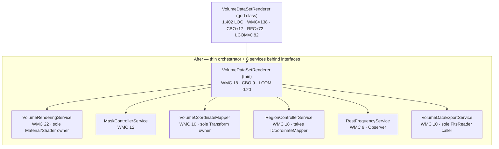

| CK — Sub-team 1 (before ≈ approximations; after = per-class projection) | WMC | DIT | CBO | RFC | LCOM |
|---|---|---|---|---|---|
| `VolumeDataSetRenderer` (god class) | ≈ 138 | 1 | ≈ 17 | ≈ 72 | ≈ 0.82 |
| `VolumeDataSetRenderer` (thin) | 18 | 1 | 9 | 22 | 0.20 |
| `VolumeRenderingService` | 22 | 0 | 8 | 24 | 0.15 |
| `MaskControllerService` | 12 | 0 | 4 | 14 | 0.10 |
| `VolumeCoordinateMapper` | 10 | 0 | 3 | 12 | 0.05 |
| `RegionControllerService` | 18 | 0 | 6 | 22 | 0.18 |
| `RestFrequencyService` | 9 | 0 | 3 | 11 | 0.08 |
| `VolumeDataExportService` | 10 | 0 | 5 | 18 | 0.12 |

**Delta (god class → worst successor):** WMC 138 → 22 (−84 %); CBO 17 → 9 (−47 %); RFC 72 → 24
(−67 %); LCOM 0.82 → 0.20 (−76 %).

**Before → after — the load-bearing excerpt (verbatim).** Native `FitsReader` P/Invoke moves out
of the renderer into the one class allowed to call it, reached only through `IVolumeDataExporter`:

```csharp
// BEFORE — VolumeDataSetRenderer.cs (god MonoBehaviour): FITS P/Invoke inline in the renderer
FitsReader.FitsOpenFileReadOnly(out cubeFitsPtr, datasetFileName, out status);
_maskDataSet.FileName = $"!{directory}/{Path.GetFileNameWithoutExtension(_dataSet.FileName)}-mask.fits";
if (_maskDataSet.SaveMask(cubeFitsPtr, _maskDataSet.FileName, false) != 0)
    ToastNotification.ShowError("Error saving new mask!");
```

```csharp
// AFTER — VolumeDataExportService.cs : the *only* class that calls FitsReader.*, behind IVolumeDataExporter
private void SaveNewMask(ref IntPtr fitsPtr, ref int status)
{
    FitsReader.FitsOpenFileReadOnly(out fitsPtr, datasetFileName, out status);
    // … build mask filename …
    if (_maskDataSet.SaveMask(fitsPtr, _maskDataSet.FileName, false) != 0)
        ToastNotification.ShowError("Error saving new mask.");
}
```

A second excerpt shows the six scattered coordinate methods collapsing into one cohesive,
`Transform`-injected service:

```csharp
// BEFORE — VolumeDataSetRenderer.cs: six disjoint coordinate methods on the god class
public Vector3 ConvertWorldPositionToDataCubePosition(Vector3 worldLoc) => …;
public Vector3Int GetVoxelPositionDataSpace() => …;
public Vector3 VolumePositionToLocalPosition(Vector3 volumePosition) => …;
// …three more, each calling transform.* from a different method
```

```csharp
// AFTER — VolumeCoordinateMapper.cs : one cohesive service; Transform injected, behind ICoordinateMapper
public Vector3 WorldToVolume(Vector3 worldPos) => _transform.InverseTransformPoint(worldPos);
public Quaternion WorldRotationToVolume(Quaternion worldRot) => Quaternion.Inverse(_transform.rotation) * worldRot;
```

**Principles / patterns.** **SRP** — the nine god-class concerns become six services with one
reason to change each (justification, Decision 1). **ISP** — six narrow role interfaces (five at
≤ 7 members; `IRegionController` is the documented 11-member exception). **DIP** —
`RegionControllerService` receives `ICoordinateMapper` rather than a concrete `Transform`, so
crop-boundary logic is inverted away from `UnityEngine`. **Value Object** — the four `readonly
struct` parameter blocks. **Observer** — `IRestFrequencyController.FrequencyChanged :
Action<double>`. **Adapter** — `VolumeCoordinateMapper` wraps `transform.InverseTransformPoint`
behind the interface. *(A Strategy split for projection modes (`IProjectionStrategy`) and an
`IVolumeMaterialBinder` ACL appear in Sub-team 1's earlier proposal but are **not** realised in
the implemented skeleton — projection stays an enum field; both remain recommended follow-ups,
not claimed results.)*

**Testability.** The six services are plain C# (no MonoBehaviour inheritance), so the design
asserts each instantiates in an NUnit edit-mode test with no scene loaded: `RegionControllerService`
crop-boundary maths is exercised with a stub `ICoordinateMapper` returning pre-set voxel
coordinates (no `Transform`, no scene), and `MaskControllerService.PaintMask` with only a
`VolumeDataSet` stub — the basis for the ≥ 70 % domain branch-coverage target. *(As a design-only
deliverable, the skeleton ships interfaces and services but no committed NUnit fixtures yet; the
named doubles `MockVolumeRenderer`/`NullVolumeRenderer` are specified, not implemented.)*

> **Honesty notes (LO8).** (1) This is a **design-only** worked example: after-CK figures are
> per-class *projections*, not Understand/NDepend measurements, and every after-file is
> banner-marked "design-level." (2) `ICoordinateMapper` still imports `UnityEngine` and exposes
> `Vector3`/`Vector3Int`/`Quaternion` in its signatures, so the "zero `UnityEngine`" rule is not
> yet literally met by that interface; the deliverable concedes this (justification, Decision 5)
> and defers it to "the Unity Mathematics package or stubbed" — a Unity-free coordinate DTO is the
> recommended fix. (3) `IRegionController` declares **11 members**, over the ≤ 7 ISP gate it is
> reported against — the one interface still to split. All three are logged, not smoothed over
> (Appendix F, Sub-team 1, 3 June).

### 6.2 WP2 — Data I/O & FITS/WCS Plug-ins: `FitsReader`

**Before.** `FitsReader` is a single static class (≈ 59 methods, 456 LOC) with a hard `using
UnityEngine`, mixing five concerns in one type — file lifecycle / HDU navigation (11 P/Invoke),
header (13 P/Invoke + helpers), image (~19 P/Invoke), table, and mask save/update. Two binding
styles coexist inside it: direct `[DllImport("idavie_native")]` and reflection-based binding via a
separate `NativePluginLoader`. That loader is itself a **MonoBehaviour singleton** — it lazily
creates a `GameObject("PluginLoader")`, then does `DontDestroyOnLoad` and `LoadAll()` in `Awake()`
— so plug-in loading is welded to the Unity scene lifecycle. Unity also leaks through the data API:
`UpdateMaskVoxel(… Vector3Int location …)` takes an engine type, and `Debug.Log`/`Debug.LogError`
are scattered through the file. NDepend records `FitsReader` at **WMC 55 / CBO 27 / RFC 126 /
LCOM 1.0** — a four-gate breach.

**After.** The monolith is split by responsibility into five focused static classes, **LCOM 0**
across all of them:

- **`FitsFile`** — open / create / close / flush + HDU navigation + size queries (WMC 2);
- **`FitsHeader`** — keyword read/write/update/delete, `ErrorCodes`, `ExtractHeaders` (WMC 5, RFC 20);
- **`FitsImage`** — image create/copy/read/write incl. sub-image (WMC 0);
- **`FitsTable`** — column reads + name/unit/format helpers, delegating to `FitsHeader`/`FitsFile` (WMC 7, RFC 28);
- **`FitsMask`** — mask save/update (new/sub/old), `UpdateMaskVoxel`, sub-array insert — the **heaviest** successor at WMC 41 / RFC 82.

The loader is de-MonoBehaviour-ed into a **static `NativePluginLoader`** (`Initialize`/`Shutdown`
with a double-init guard); its single Unity touch-point becomes one thin `PluginBootstrapper`
MonoBehaviour that calls `Initialize` on `Awake`. Legacy whole-cube methods are retained
`[Obsolete]` (OCP), and a separate `WcsTransformer` wraps AstTool behind
`TransformPoint`/`InverseTransformPoint`.

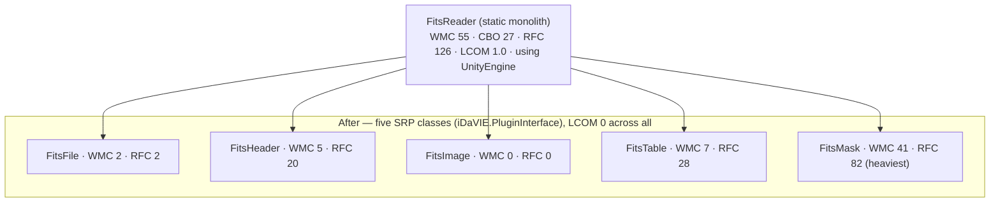

| CK — Sub-team 2 (NDepend; LCOM 0–1; `DIT = N/A` for static classes) | WMC | DIT | CBO | RFC | LCOM |
|---|---|---|---|---|---|
| `FitsReader` (before) | 55 | 1 | 27 | 126 | 1.0 |
| `DataAnalysis` (before) | 13 | N/A | 39 | 22 | 1.0 |
| `FitsFile` (after) | 2 | N/A | 7 | 2 | 0 |
| `FitsHeader` (after) | 5 | N/A | 13 | 20 | 0 |
| `FitsImage` (after) | 0 | N/A | 7 | 0 | 0 |
| `FitsTable` (after) | 7 | N/A | 12 | 28 | 0 |
| `FitsMask` (after, heaviest) | 41 | N/A | 19 | 82 | 0 |
| `DataAnalysis` (after) | 12 | N/A | 38 | 25 | 0 |

**Delta:** the 55-WMC / 126-RFC / 1.0-LCOM monolith becomes five classes; the heaviest successor
(`FitsMask`) is WMC 41 / RFC 82, and **LCOM falls to 0 across all of them**.

**Before → after — the load-bearing excerpt (verbatim).** The `UpdateMaskVoxel` signature stops
leaking Unity's `Vector3Int` into the P/Invoke layer, so `FitsMask` compiles and unit-tests with no
Unity present:

```csharp
// BEFORE — FitsReader.cs (static monolith, `using UnityEngine;`): Vector3Int leaks into native interop
public static bool UpdateMaskVoxel(IntPtr maskDataPtr, long[] maskDims, Vector3Int location, short value)
{
    location -= Vector3Int.one;
    long index = location.x + location.y * maskDims[0] + location.z * (maskDims[0] * maskDims[1]);
    Marshal.WriteInt16(new IntPtr(maskDataPtr.ToInt64() + index * sizeof(short)), value);
    return true;
}
```

```csharp
// AFTER — FitsMask.cs (no `using UnityEngine;`): plain ints, Unity-free, headlessly testable
public static bool UpdateMaskVoxel(IntPtr maskDataPtr, long[] maskDims, int x, int y, int z, short value)
{
    long index = (x - 1) + (y - 1) * maskDims[0] + (z - 1) * (maskDims[0] * maskDims[1]);
    Marshal.WriteInt16(new IntPtr(maskDataPtr.ToInt64() + index * sizeof(short)), value);
    return true;
}
```

A second excerpt shows the loader shedding its MonoBehaviour/scene dependency:

```csharp
// BEFORE — NativePluginLoader.cs : MonoBehaviour singleton, lazily spawns a scene GameObject
public class NativePluginLoader : MonoBehaviour, ISerializationCallbackReceiver
{
    static NativePluginLoader _singleton;
    static NativePluginLoader singleton { get {
        if (_singleton == null) {
            var go = new GameObject("PluginLoader");
            var pl = go.AddComponent<NativePluginLoader>(); … } } }
```

```csharp
// AFTER — NativePluginLoader.cs : plain static class, no UnityEngine, explicit lifecycle
public static class NativePluginLoader
{
    static readonly Dictionary<string, IntPtr> _loadedPlugins = new();
    public static void Initialize(string pluginPath)
    {
        if (_path != null) { Console.Error.WriteLine("…called more than once; ignoring"); return; }
        …
    }
```

**Principles / patterns.** **SRP** — five boundaries (file lifecycle, header, image, table, mask),
enforced by a structural test asserting each is a single-concern static class. **OCP** — legacy
whole-cube methods carry `[Obsolete("… use FitsReadSubImageFloat instead")]` while the new
sub-image methods are the extension points. **DIP** — the loader is de-MonoBehaviour-ed (above), so
plug-in loading no longer depends on the Unity engine. **ISP** — each static class exposes only its
own concern. **GRASP Protected Variations** — `[PluginAttr]`/`[PluginFunctionAttr]` attribute-driven
late binding insulates callers from native-symbol resolution. *(A Strategy split —
`IDownsampleStrategy` replacing the `bool maxDownsampling` flag at `DataAnalysis.cs:42` — is
**proposed in the design but not implemented**; no such file exists.)*

**Testability.** `SetDllDirectory` (P/Invoke into kernel32) lets the native DLLs load in a plain
.NET runner, so the suite splits cleanly: **unit** tests need no DLL (`FitsHeaderUnitTests` —
error-code ranges, message format, duplicate-key concatenation; `NativePluginLoaderUnitTests` —
double-`Initialize` ignored, `Shutdown` resets the guard), while **integration** tests need
`idavie_fits.dll` + `test_volume.fits` (`FitsReaderIntegrationTests` — open → status 0; header has
BITPIX/NAXIS; dims == 3; and an open/close-×50 test that pins the conditional-close handle-leak
fix). The split runs via `dotnet test --filter "Category!=Integration"`. `WcsTransformer` is the
documented residual: it still `using UnityEngine` and trades in `Vector3`, so its structural test
is `[Ignore]`-marked with a note to move to `System.Numerics.Vector3`.

> **Honesty notes (LO8).** (1) An earlier AI-drafted design invented
> `IFitsPlugin`/`IAstPlugin`/`PluginRegistry` types that do **not** exist in the codebase; the
> document was discarded after a human check (Appendix F, Sub-team 2). (2) Three conveniences this
> WP could be tempted to claim are **not actually present**: `IDownsampleStrategy` (proposed, no
> file), `NativeLibrary.SetDllImportResolver` (only `SetDllDirectory` is used), and FsCheck
> property-based tests (none exist — the real suite is NUnit unit/integration). (3) `FitsMask`
> still contains residual `Debug.Log*` calls, so its Unity decoupling is not yet fully clean. No
> `.puml` diagrams exist for WP2; the CK source is `Fits Reader/metrics/Metrics Comparison.pdf`
> (NDepend).

### 6.3 WP3 — Rendering Engine: `VolumeDataSetRenderer` + `MaskMode`

**Before (Understand-measured, 19 May).** The same 1,402-LOC renderer (152 public members),
measured here at **WMC 97 / CBO 28 / RFC 97 / LCOM 0.95**. Sub-team 3's SOLID audit enumerates
**nine responsibility clusters** in the one class: FITS loading (`_startFunc`→`LoadDataFromFitsFile`),
GPU texture management, shader-uniform binding (25+ `SetFloat`/`SetInt` in `Update()`), mask
painting, mask serialisation (`SaveMask`), 3D coordinate conversion, region/crop, WCS/rest-frequency,
and Unity lifecycle plumbing. Its two worst methods are `_startFunc()` (**185 LOC, CC 28**, lines
358–548) and `SaveMask()` (**~90 LOC, CC 19**, lines 1290–1378). It carries two `FindObjectOfType`
lookups (four across the whole rendering layer) and sits inside a **46-file dependency cycle**
(Ca = 28 callers) through mutual references to `VolumeInputController`, `MomentMapRenderer`,
`VolumeCommandController` and `Config`. Three Built-In-pipeline calls — `OnRenderObject`,
`Graphics.DrawProceduralNow` and `Shader.EnableKeyword` — are silently dropped by URP. Mask
behaviour is a `MaskMode` enum whose value is pushed to the shader, so adding a fifth mode means
editing four files (enum + `Update()` + the shader + `PaintMenuController`).

**After — Example 1 (renderer split).** The god class becomes a `VolumeRenderCoordinator` (the
MonoBehaviour composition root + per-frame orchestrator, which *"never calls `new` on a concrete
domain type"*) driving four domain classes plus an ACL:

- **`VolumeMaterialBinder`** (`IVolumeMaterialBinder`) — shader-keyword and material-property binding, colour-map, and it holds the active `IMaskMode`;
- **`VolumeTextureManager`** — 3D-texture upload, LRU caching, and the invariants **368 MB budget**, 4 GB `Texture3D` cap, `FilterMode.Point`;
- **`VolumeCameraDriver`** — camera matrices, clip planes, projection, outlines, vignette;
- **`FoveatedSamplingPolicy`** — per-frame sample-rate from `IGaze`, with a uniform fallback when no HMD is present (zero `UnityEngine` deps);
- **`VolumeCoordinateService`** — pure coordinate math (`WorldToObjectSpace(Vector3, Matrix4x4)`, frustum-plane extraction);
- an **`IRenderPipeline`** ACL with `UrpRenderPipeline`/`HdrpRenderPipeline` adapters.

**After — Example 2 (MaskMode Strategy).** `IMaskMode` (2 members: `Apply(...)` + `ShaderKeyword`)
with one sealed class per mode — `ApplyMaskMode`, `InverseMaskMode`, `IsolateMaskMode` (`_MaskAlpha`
0.15), `DisabledMaskMode` (Null Object, all keywords off) — plus a `NullMaskMode` test double; each
is WMC 2 / LCOM 0.

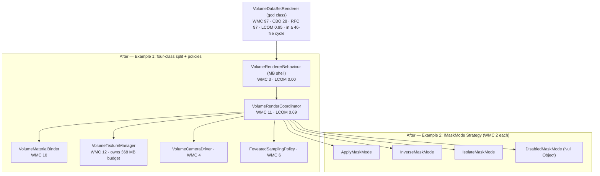

| CK — Sub-team 3 (Understand; LCOM 0–1) | WMC | DIT | CBO | RFC | LCOM |
|---|---|---|---|---|---|
| `VolumeDataSetRenderer` (before) | 97 | 2 | 28 | 97 | 0.95 |
| `VolumeRenderCoordinator` | 11 | 1 | 15 | 11 | 0.69 |
| `VolumeRendererBehaviour` (MB shell) | 3 | 2 | 8 | 3 | 0.00 |
| `VolumeMaterialBinder` | 10 | 1 | 12 | 10 | 0.57 |
| `VolumeTextureManager` | 12 | 1 | 4 | 12 | 0.67 |
| `VolumeCameraDriver` | 4 | 1 | 4 | 4 | 0.25 |
| `VolumeCoordinateService` (static) | 3 | 1 | 3 | 3 | 0.00 |
| `FoveatedSamplingPolicy` | 6 | 1 | 6 | 6 | 0.33 |
| `ApplyMaskMode` / `InverseMaskMode` / `IsolateMaskMode` / `DisabledMaskMode` | 2 | 1 | 2 | 2 | 0.00 |

**Delta (before → worst successor):** WMC 97 → 12 (−85); RFC 97 → 12 (−85); CBO 28 → 15;
LCOM 0.95 → 0.69. The residual LCOM on the coordinator/binder is documented as a
**lifecycle-phase artefact** (Initialise/Tick/Dispose), not disjoint concerns.

**Before → after — the load-bearing excerpt (verbatim).** The mask behaviour was a `MaskMode` enum
pushed to the shader (adding a fifth mode meant editing four files); it becomes one sealed class per
mode behind `IMaskMode`, so a new mode is a new class and nothing existing changes (OCP):

```csharp
// BEFORE — VolumeDataSetRenderer.cs: behaviour selected by an enum value pushed to the shader
public enum MaskMode { Disabled = 0, Enabled = 1, Inverted = 2, Isolated = 3 }
// … in Update():
_materialInstance.SetInt(MaterialID.MaskMode, MaskMode.GetHashCode());
```

```csharp
// AFTER — IMaskMode.cs + ApplyMaskMode.cs: one sealed Strategy class per mode
public interface IMaskMode { void Apply(Material material, Texture3D maskTexture); string ShaderKeyword { get; } }

public sealed class ApplyMaskMode : IMaskMode
{
    public string ShaderKeyword => "_MASK_APPLY";
    public void Apply(Material material, Texture3D maskTexture)
    {
        material.DisableKeyword("_MASK_DISABLED"); material.DisableKeyword("_MASK_INVERSE");
        material.DisableKeyword("_MASK_ISOLATE");  material.EnableKeyword(ShaderKeyword);
    }
}
```

A second excerpt is the **correctness win**: the mask draw lived in `OnRenderObject`, which URP
never calls, so it was silently broken on any URP project. Routing it through `IRenderPipeline`
fixes it across both pipelines:

```csharp
// BEFORE — VolumeDataSetRenderer.cs: mask point-cloud drawn in OnRenderObject (URP never calls it)
void OnRenderObject()
{
    _maskMaterialInstance.SetBuffer(MaterialID.MaskEntries, _maskDataSet.ExistingMaskBuffer);
    _maskMaterialInstance.SetPass(0);
    Graphics.DrawProceduralNow(MeshTopology.Points, _maskDataSet.ExistingMaskBuffer.count); // legacy API
}
```

```csharp
// AFTER — VolumeMaterialBinder.cs: routed through IRenderPipeline, so URP/HDRP adapters both fire it
public void SubmitMaskGeometry(bool displayMask, bool isFullResolution,
                               ComputeBuffer existingMaskBuffer, int existingMaskCount, …)
{
    if (!displayMask || !isFullResolution) return;
    _maskMaterial.SetBuffer(ShaderID.MaskEntries, existingMaskBuffer);
    _renderPipeline.SubmitProceduralDraw(_maskMaterial, existingMaskBuffer, existingMaskCount, Matrix4x4.identity);
}
```

**Principles / patterns.** **SRP** — the nine-cluster god class → four domain classes + coordinator
(binder = shader protocol, texture = lifecycle policy, camera = math, foveation = algorithm).
**OCP** — `IMaskMode` (new mode = new class, was "four files") and `IRenderPipeline` (new pipeline =
new adapter). **ISP** — the 152-member surface → four narrow interfaces (`IRenderPipeline` 6,
`IMaskMode` 2, `IGaze` 3). **DIP** — `IRenderPipeline` abstracts URP/HDRP; only `UrpRenderPipeline`
imports `UnityEngine.Rendering.Universal`. **LSP** — all `IMaskMode` impls are substitutable
(`binder.Tick()` calls `_activeMaskMode.Apply(...)` with no type check). **GRASP** — Protected
Variations (mask-mode and pipeline variation points), Pure Fabrication (`VolumeCoordinateService`),
Controller (the coordinator owns the per-frame use case).

**Testability.** Coordinate math takes `Matrix4x4` by value (blittable, pure NUnit) —
`VolumeCoordinateServiceTests` asserts identity-matrix round-trips and that `ExtractFrustumPlanes`
returns exactly six correct planes. `VolumeMaterialBinder` runs against a `NullRenderPipeline`
(no GPU); `FoveatedSamplingPolicy` against a `StubGazeProvider`, including the HMD-absent fallback
(both step counts → `MaxSteps`). The mask-keyword mutual-exclusion invariant is tested by a
**six-mode round-robin** (`SwitchingBetweenAllModes_AllTransitionsLeaveExactlyOneKeywordEnabled`):
exactly one keyword enabled after each active mode, zero after `DisabledMaskMode`.

> **Honesty notes (LO8).** (1) Two metric systems coexist in Sub-team 3's deliverables — the
> Understand "count of methods" set used in the boxes above (WMC 97 / CBO 28) and a CK-equivalent
> set quoted in the design-doc prose (WMC 44 / CBO 45). (2) `VolumeRendererBehaviour` and
> `VolumeCoordinateService` appear in the metrics table and diagrams but have **no standalone
> `.cs` file** — in the shipped skeleton the MonoBehaviour-shell role is filled by
> `VolumeRenderCoordinator` and the coordinate helper lives inside `VolumeCameraDriver`. After-CK
> figures are Day-13 per-class projections.

### 6.4 WP4 — Interaction System (VR, voice): `VolumeInputController` + `VolumeCommandController`

**Before.** `VolumeInputController` (**1,649 LOC**) is a god class fusing seven concerns in one
MonoBehaviour: SteamVR listener wiring (`OnEnable`/`OnDisable`), locomotion (`UpdateMoving`/
`UpdateScaling`/`UpdateEditingThreshold`/`UpdateEditingZAxis`), the interaction FSM, painting,
cursor-UI text, vignette, and quick-menu attachment. It runs **two state machines in the one file**
— a hand-rolled `private enum LocomotionState` driven by a `switch` in `Update()` (lines 811–831),
and a Stateless-library `StateMachine<InteractionState, InteractionEvents>` configured fluently
(322–364). Direct SteamVR types, scene `Find`, and `Camera.main` make it untestable outside SteamVR
Play mode, and a real defect writes `VignetteIntensity` **twice per frame** — `UpdateVignette` runs
two consecutive `foreach` loops, the second unguarded (lines 886–898). `VolumeCommandController`
(685 LOC) — *"the single most entangled class in the project"* — owns a **~195-line if/else**
`ExecuteVoiceCommand` (lines 180–374), a hardcoded 51-entry `Keywords` struct, and **10-level-deep
`Transform.Find()` chains** (e.g. lines 421–422) that break silently on any UI rename.

**After.** `VolumeInputController` becomes a thin **631-LOC router** whose `Update()` (now ~5 lines)
delegates to its collaborators, each extracted behind an interface:

- **`ILocomotionController`** — Moving/Scaling/Threshold/ZAxis locomotion and grip math;
- **`IInteractionController`** — the Stateless interaction FSM + cursor-info update;
- **`IBrushController`** — brush size, additive/source-id, undo/redo;
- **`IVignetteController`** — tunnelling-vignette fade (where the duplicate-write bug is fixed);
- **`ICursorInfoFormatter`** — pure-C# cursor/selection/angle string formatting;
- **`IQuickMenuPositioner`** — quick-menu attach/detach;
- **`IGaze`/`CameraGazeProvider`** — head/eye gaze, consumed cross-team by Sub-team 3.

The voice path is reified into a Command package: `IVoiceRecogniser`/`WindowsVoiceRecogniser` (the
only speech-API consumer), `IVoiceCommand`/`DelegateVoiceCommand`, a `VoiceCommandRegistry`
(phrase→command dictionary), `IVoiceCommandContext`, and `VoiceDesktopUiSync` (isolating the legacy
10-deep `Transform.Find` slider sync). **Scope honesty:** the SteamVR listener wiring is *not* yet
extracted into an adapter — it remains inline in the router's `OnEnable`/`OnDisable`, so the planned
`SteamVRInputBridge` does not exist; SteamVR isolation is a pre-freeze action, not a result.

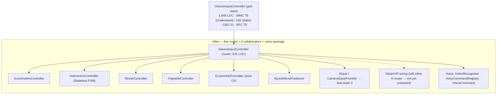

| CK — Sub-team 4 | WMC | DIT | NOC | CBO | RFC | LCOM |
|---|---|---|---|---|---|---|
| `VolumeInputController` (before, Understand) | 79 | not recorded | not recorded | 31 | 79 | not recorded |
| `VolumeInputController` (before, static pass) | 192 | 1 | 0 | 10 | 65 | High |
| `VolumeCommandController` (before, static pass) | 108 | 1 | 0 | 7 | 45 | Moderate |
| **After (all classes)** | **—** | **—** | **—** | **—** | **—** | **—** |

> 🔴 **Honest gap — after-CK not recorded.** Team 4 built the refactored example (router + 7
> interfaces + implementations + three test files: `GazeProviderTests`, `CollaboratorTests`,
> `VoiceCommandTests`, present at `Team-4-examples/koffiewinkel-refactored/`) but **did not
> measure post-refactor CK values**, and the example currently sits **outside** the standard
> `refactoring-examples/sub-team-4/` tree (spec §10.3). Per the assignment's rule that projected
> snapshots must be evidence-backed, we present the before figures and the qualitative
> improvement only; **no after numbers are fabricated.** *Pre-freeze action:* relocate the folder
> and run Understand on the refactored classes to record the delta.

**Before → after — the load-bearing excerpt (verbatim).** The ~195-line keyword `if/else` becomes
reified `IVoiceCommand` objects in a dictionary, dispatched by an O(1) lookup (the after-code exists
under `Team-4-examples/koffiewinkel-refactored/`; only its CK numbers are the unrecorded gap above):

```csharp
// BEFORE — VolumeCommandController.cs: ~195-line keyword if/else chain (lines 180–374)
private void ExecuteVoiceCommand(string args)
{
    if (args == Keywords.EditThresholdMin)      { startThresholdEditing(false); }
    else if (args == Keywords.EditThresholdMax) { startThresholdEditing(true); }
    else if (args == Keywords.EditZAxis || args == Keywords.EditZAxisAlt) { startZAxisEditing(); }
    // … dozens more branches …
}
```

```csharp
// AFTER — Voice/: each phrase is a reified command registered in a dictionary, dispatched by lookup
public interface IVoiceCommand { void Execute(IVoiceCommandContext context); }

// VoiceCommandRegistry.Build():
Add(k.EditThresholdMin, c => owner.startThresholdEditing(false));
Add(k.EditThresholdMax, c => owner.startThresholdEditing(true));
// dispatch — replaces the whole chain:
if (!registry.TryGetValue(phrase, out var command)) return false;
command.Execute(context);
```

A second excerpt is the **duplicate-vignette bug fix** — the redundant double-write collapses into
one guarded loop inside the dedicated `VignetteController`:

```csharp
// BEFORE — VolumeInputController.cs (886–898): the same write runs in TWO loops per frame
foreach (var dataSet in _volumeDataSets)
    if (dataSet.isActiveAndEnabled) dataSet.VignetteIntensity = _currentVignetteIntensity;
foreach (var dataSet in _volumeDataSets)               // redundant second pass, unguarded
    dataSet.VignetteIntensity = _currentVignetteIntensity;
```

```csharp
// AFTER — VignetteController.cs: a single guarded loop in a single-responsibility class
_currentIntensity += maxChange;
var dataSets = _getDataSets?.Invoke();
if (dataSets == null) return;
for (int i = 0; i < dataSets.Length; i++)
    dataSets[i].VignetteIntensity = _currentIntensity;
```

**Principles / patterns.** **Facade** — the router keeps the public API (`StartThresholdEditing`,
`SetBrushAdditive`, `Teleport`, …) but each method one-lines to a collaborator. **State** — the
interaction FSM stays a Stateless `StateMachine`, now isolated in `IInteractionController` rather
than the god class. **Adapter** — `WindowsVoiceRecogniser` adapts Unity's `KeywordRecognizer`
behind `IVoiceRecogniser`; `CameraGazeProvider` adapts `Camera.main` behind `IGaze`. **Command +
Registry** — each voice phrase is an `IVoiceCommand` dispatched by O(1) dictionary lookup, replacing
the 195-line `if/else`. **Context Object** — `IVoiceCommandContext` hands commands their
dependencies so they do no scene lookups. **DI** — collaborators are constructor-injected via
`Func<>`/`Action<>` lambdas, stored on `[SerializeReference]` interface fields. This is the
package-level realisation of ADR-010. *(Two patterns named in earlier drafts are **not** in the
after-code: per-state `ILocomotionState` classes — locomotion keeps an internal enum + state field
— and reified domain events `GripEvent`/`PinchEvent`/`MenuButtonEvent`, which do not exist.)*

**Testability.** All three test files exercise collaborators with no Unity scene or VR hardware:
`CollaboratorTests` asserts `BrushController.IncreaseBrushSize` increments by 2 and never drops
below 1, and that `CursorInfoFormatter.FormatAngle(<1°)` returns minutes/seconds (built with
all-no-op lambdas); `VoiceCommandTests` asserts register-and-execute dispatches the right command
and an unknown keyword returns null (via a `MockVoiceCommandContext`); `GazeProviderTests` asserts
the gaze fixation point and the `IsTracking == false` → screen-centre `(0.5, 0.5)` foveation
fallback (via `MockGazeProvider`). `CursorInfoFormatter` is pure C#.

> **Honesty notes (LO8).** Beyond the unrecorded after-CK (above): (1) the planned
> `SteamVRInputBridge` and the reified domain events (`GripEvent`/`PinchEvent`/`MenuButtonEvent`)
> were **not built** — SteamVR wiring and native callbacks remain in the router. (2) Locomotion was
> extracted as a controller but **not** into per-state classes (it keeps an internal enum).
> (3) As committed, `GazeProviderTests` references members (`GazeRay`, `IsGazeAvailable`) that the
> shipped `MockGazeProvider`/`IGaze` do not declare, so that fixture would not compile until
> reconciled — a pre-freeze fix alongside relocating the folder (spec §10.3) and recording CK.

### 6.5 WP5 — Feature System & Domain Model: `MomentMapRenderer` + `VoTableSaver`

**Example 1 — `MomentMapRenderer`.** Before: a 387-LOC `MonoBehaviour` (`namespace VolumeData`)
fusing all three layers — **pure calculation** (`GetBounds`, the moment-0/1 algorithm), **GPU
rendering** (`ComputeShader`/`RenderTexture` init, dispatch, `Texture2D` readback) and **UI plotting**
(`UpdatePlotWindow` walks the scene graph to push sprites and colourbars). It reads the
`Config.Instance` singleton (`Start()` line 143, `CalculateMomentMaps` line 221), makes a direct
`AstTool.Transform3D` `IntPtr`/DLL call (lines 374–376), and lives in the wrong namespace
(`VolumeData`, not `iDaVIE.*`). After: a Ports-&-Adapters split across three layers —

- **`MomentMapCalculator`** (Domain, static) — pure CPU `ComputeMoment0`/`ComputeMoment1`/`ComputeMinMaxBounds`, no Unity; the **test ground-truth** against the GPU output (WMC 22, CBO 2, LCOM 0);
- **`MomentMapService`** (Application) — validate → `adapter.Compute` → bounds → build result (WMC 4);
- **`MomentMapRequest`/`MomentMapResult`** (Domain DTOs) — immutable plain-array in/out, no `RenderTexture`;
- **`MomentMapRendererAdapter`** (Infrastructure) — the **only** `UnityEngine` importer: compute-shader dispatch, readback, sprite/colourbar UI (WMC 19, LCOM 0.75);
- behind ports `IMomentMapAdapter` (GPU seam) and `IMomentMapService` (use-case seam).

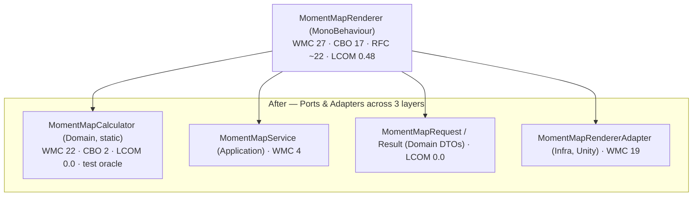

| CK — Sub-team 5, Ex 1 (Understand; RFC ~ estimated; LCOM 0–1) | WMC | DIT | CBO | RFC | LCOM |
|---|---|---|---|---|---|
| `MomentMapRenderer` (before) | 27 | 2 | 17 | ~22 | 0.48 |
| `MomentMapCalculator` (Domain, static) | 22 | 1 | 2 | ~3 | 0.0 |
| `MomentMapService` (Application) | 4 | 1 | 5 | ~2 | 0.0 |
| `MomentMapRequest` / `MomentMapResult` (DTOs) | 6 / 5 | 1 | 2 | ~9 | 0.0 |
| `MomentMapRendererAdapter` (Infra, Unity) | 19 | 2 | 14 | ~8 | 0.75 |

**Example 2 — `VoTableSaver`.** Before: a static `SaveFeatureSetAsVoTable` (one ~90-line method,
CC 7, `VoTable.cs:430–487`) that built the XML document, assembled headers, populated per-feature
rows and wrote the file all at once — reaching through a Law-of-Demeter chain
(`featureSet.VolumeRenderer.SourceStatsDict.ElementAt(…).Value.cX`) and calling `AstTool.Transform3D`
inline — *"the numbers look clean only because there is one method."* After: Ports-&-Adapters —
`FeatureCatalog` (Domain) decides *when* to export and delegates to `IVoTableExporter`;
`VoTableExportService` (Infrastructure) does XML-only serialisation via `BuildDocument`/
`BuildHeaders`/`BuildRow` and returns a string (no file I/O); and `ICoordinateTransformer` over an
opaque `IAstFrame` hides the `IntPtr` so *"domain code never sees IntPtr."*

| CK — Sub-team 5, Ex 2 | WMC | DIT | CBO | RFC | LCOM |
|---|---|---|---|---|---|
| `VoTableSaver` (before) | 7 | 1 | 6 | ~1 | 0.0 |
| `FeatureCatalog` (Domain) | 4 | 1 | 3 | ~2 | 0.0 |
| `VoTableExportService` (Infra) | 14 | 1 | 8 | ~4 | 0.0 |

**Before → after — the load-bearing excerpt (verbatim).** The export loop's direct native call on a
raw `IntPtr` AST frame is replaced by an injectable `ICoordinateTransformer` whose frame is an opaque
`IAstFrame` — the unmanaged-pointer type never enters domain code, and the exporter tests with a stub:

```csharp
// BEFORE — VoTable.cs: domain export loop calls the native DLL directly with a raw IntPtr AST frame
AstTool.Transform3D(featureSet.VolumeRenderer.AstFrame, centerX, centerY, centerZ, 1,
                    out ra, out dec, out zPhys);
```

```csharp
// AFTER — ICoordinateTransformer.cs + IAstFrame.cs: the IntPtr is hidden behind an opaque handle
public interface IAstFrame { }   // opaque: concrete types own the IntPtr; the domain never touches it

void Transform(IAstFrame frame, double x, double y, double z,
               out double ra, out double dec, out double zPhys);
```

A second excerpt shows the moment-0 algorithm — formerly reachable only through the GPU dispatch —
extracted as a pure CPU method that doubles as the adapter's test oracle:

```csharp
// BEFORE — MomentMapRenderer.cs: the moment math lived only inside the GPU dispatch (no CPU path)
_computeShader.Dispatch(activeKernelIndex, threadGroupsX, threadGroupsY, 1);
```

```csharp
// AFTER — MomentMapCalculator.cs: a pure, Unity-free CPU oracle for the same moment-0 sum
public static float[] ComputeMoment0(float[] dataVoxels, int width, int height, int depth, float threshold)
{
    float[] moment0 = new float[width * height];
    for (int y = 0; y < height; y++)
    for (int x = 0; x < width;  x++)
    {
        float sum = 0f;
        for (int z = 0; z < depth; z++)
        {
            float v = dataVoxels[z * width * height + y * width + x];
            if (!float.IsNaN(v) && v > threshold) sum += v;
        }
        moment0[y * width + x] = sum;
    }
    return moment0;
}
```

**Principles / patterns.** **Ports & Adapters / Hexagonal** — `IMomentMapAdapter`/`IVoTableExporter`
ports with Unity/XML adapters; Domain/Application/Infrastructure split into separate namespaces.
**DIP** — `MomentMapService` and `FeatureCatalog` receive their adapter by constructor injection,
never via `Config.Instance` (ADR-003). **SRP** — calculation (Domain), orchestration (Application)
and GPU/UI (Infrastructure) are separated. **OCP** — a new export format is a new `IVoTableExporter`
("a future FITS or JSON-LD exporter… without touching any domain class"). **ISP** — single-method
ports; `IAstFrame` is an intentionally empty marker. **Law-of-Demeter** — the
`featureSet.VolumeRenderer.SourceStatsDict.…` chain is replaced by `VoTableExportService` reading a
plain `FeatureSet.Features`. Realises ADR-002/003/006/008/011 (cited in the after-file headers).

**Testability.** `MomentMapCalculator` (CBO 2) and `VoTableExportService` (only `System.Xml.Linq`)
run in NUnit with stub transformers — inject a `StubMomentMapAdapter` returning fixed `float[]`, or a
`StubCoordinateTransformer` + `NullAstFrame` for deterministic RA/Dec/Z. The calculator is the GPU
adapter's **test oracle** (assert adapter output equals `ComputeMoment0/1` within tolerance). The
grounded property invariants on the pure methods: moment-0 is a sum of values above threshold (so
non-negative for non-negative data), moment-1 pixels with zero flux are `NaN` else a flux-weighted
mean, and `ComputeMinMaxBounds` returns `min ≤ max`.

> **Honesty notes (LO8).** (1) Understand exported no RFC column for the after-classes, so every
> after-RFC is an estimate (`~`); the before `MomentMapRenderer` LCOM 0.48 is borderline-*passing* —
> this example is as much about layering/testability as a failing metric. (2) An earlier `diagram.puml`
> cites a different before-set (WMC ~18 / CBO ~14); the measured `CK_Metrics.md` values
> (27 / 17 / ~22 / 0.48) used above are authoritative. (3) No committed NUnit fixtures exist under
> `sub-team-5/` — the stub types are specified in the design docs, and the broader feature-statistics
> invariants (centroid-in-bbox, W20 ≤ W50) are *not* present in any Sub-team-5 file; only the
> moment-map invariants above are grounded.

### 6.6 WP6 — Desktop GUI & Client Shell: File tab + Debug tab (`CanvassDesktop`)

**Example 1 — File tab.** Before: `CanvassDesktop`, a 1,899-LOC MonoBehaviour fusing file I/O, FITS
axis logic, slider wiring, subset-bounds maths, coroutine lifecycle, scene-graph mutation,
native-memory cleanup and Inspector-wired button handlers. The before-trace catalogues the smells
with line refs: **S1** an `IntPtr` FITS handle opened in UI scope and held open across the whole
metadata read (`CanvassDesktop.cs:349–407`); **S3/S4** `transform.Find("A/B/C")` scene chains and
`FindObjectOfType<>` singletons (157–191, 1054); **S5** direct public-field writes onto the renderer
(1086–1094); **S6** a busy-wait coroutine polling a `started` flag every 100 ms (1117–1119). After:
an 11-class MVVM split across a pure-C# **Domain package** —

- **`FileTabViewModel`** (orchestrator) — coordinates four injected services + bindable load state (WMC 40);
- **`SubsetBoundsViewModel`** — subset-bounds clamp maths (WMC 20);
- **`FitsMetadataHelper`** (static) — three pure FITS helpers extracted from the VM (WMC 3);
- **`RelayCommand`/`AsyncRelayCommand`** — `ICommand`s driving `button.interactable` via `CanExecute()`;

— and a Unity **Adapters package** (ACL): `FileTabView` (thin View), `FitsServiceAdapter` (forwards
`IFitsService` to JSON-RPC, owning an opaque `RemoteFitsHandle` — **no `[DllImport]`/`IntPtr`**),
`FileDialogServiceAdapter`, `VolumeServiceAdapter` (**eliminates the S6 busy-wait**),
`MemoryProbeAdapter`, and `FileTabCompositionRoot` (Pure-DI wiring on `Awake`).

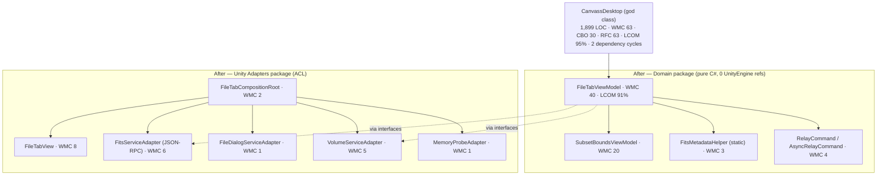

| CK — Sub-team 6 (Understand; RFC = method count; LCOM %) | WMC | DIT | CBO | RFC | LCOM % | Pass? |
|---|---|---|---|---|---|---|
| `CanvassDesktop` (before) | 63 | 2 | 30 | 63 | 95 % | ❌ WMC, CBO, LCOM |
| `FileTabViewModel` (worst successor) | 40 | 1 | 19 | 40 | 91 % | ❌ LCOM |
| `SubsetBoundsViewModel` | 20 | 1 | 1 | 20 | 77 % | ❌ LCOM |
| `FitsServiceAdapter` | 6 | 1 | 7 | 6 | 33 % | ✅ |
| `VolumeServiceAdapter` | 5 | 2 | 9 | 5 | 65 % | ❌ LCOM |
| `FileTabView` | 8 | 2 | 14 | 8 | 69 % | ❌ LCOM |
| `FileTabCompositionRoot` | 2 | 2 | 12 | 2 | 33 % | ✅ |
| `FitsMetadataHelper` / `MemoryProbeAdapter` / `FileDialogServiceAdapter` | 3 / 1 / 1 | — | 2 / 0 / 1 | — | 0 % | ✅ |

**Delta:** WMC 63 → 40 (−37 %); CBO 30 → 19 (−37 %); LOC 1,899 → ~450 (−76 %);
**dependency cycles 2 → 0**; **0 → 47 NUnit tests** on the domain layer. The residual
`FileTabViewModel` LCOM 91 % is an **MVVM property-backing-field artefact** (one cohesive
concern, ~17 backing fields each touched by ≤ 2 methods), structurally distinct from the god
class's 95 % (genuinely disjoint clusters) — and is named with a remediation (extract a
`FileTabCommands` helper).

A File-tab excerpt (verbatim) — the S6 busy-wait poll becomes an awaited coroutine in the adapter:

```csharp
// BEFORE — CanvassDesktop.cs (1114–1119): fixed-cadence poll on a 'started' flag
StartCoroutine(newCube.GetComponent<VolumeDataSetRenderer>()._startFunc());
while (!newCube.GetComponent<VolumeDataSetRenderer>().started)
    yield return new WaitForSeconds(.1f);
```

```csharp
// AFTER — VolumeServiceAdapter.cs: yield the child-coroutine handle; the scheduler suspends until done
yield return StartCoroutine(renderer._startFunc());
progress?.Report(1f);
tcs.TrySetResult(true);
```

**Example 2 — Debug tab.** Before: `DebugLogging`, a 255-LOC MonoBehaviour subscribing to the
static `Application.logMessageReceived` — *"no interface, no test double possible."* It passes
5/6 CK thresholds; only LCOM hs ≈ 0.95 fails. After: an Observer split — `ILogStream`/
`ILogObserver`/`LogStream`, `DebugTabViewModel` (implements `ILogObserver`), immutable
`LogEntry` record, and a `GatewayLogStreamAdapter` receiving server-pushed `log.emit`
notifications (no `UnityEngine`).

| CK — Sub-team 6 (Understand; LCOM %) | WMC | DIT | CBO | RFC | LCOM % |
|---|---|---|---|---|---|
| `DebugLogging` (before) | 8 | 4 | ~10 | ~25 | ~95 % |
| `DebugTabViewModel` | 6 | 1 | 2 | 6 | 66 % |
| `LogStream` | 4 | 1 | 3 | 4 | 25 % |
| `GatewayLogStreamAdapter` (worst) | 8 | 1 | 5 | 8 | 72 % |
| `DebugTabView` | 3 | 2 | 7 | 3 | 41 % |

**Delta:** LOC 255 → 86 (−66 %); CBO ~10 → 7 (−30 %); domain ViewModel CBO 9 collaborators → 1;
**0 → 35 NUnit tests** running in ~20 ms. This is framed honestly as a **testability** refactor,
not a metric one.

**Before → after — the load-bearing excerpt (verbatim, Debug tab).** A direct subscription to the
static `UnityEngine` log event (no seam, no test double) becomes an injected `ILogStream` Observer, so
`DebugTabViewModel` carries zero `UnityEngine` references and is unit-testable with a fake stream:

```csharp
// BEFORE — DebugLogging.cs (MonoBehaviour): subscribes to a static UnityEngine event — untestable
void OnEnable()  { Application.logMessageReceived += HandleLog; }
void OnDisable() { Application.logMessageReceived -= HandleLog; }
```

```csharp
// AFTER — DebugTabViewModel.cs: depends on an injected ILogStream; no UnityEngine reference
public sealed class DebugTabViewModel : IDebugTabViewModel, ILogObserver, IDisposable
{
    public DebugTabViewModel(ILogStream logStream)
    {
        _logStream = logStream ?? throw new ArgumentNullException(nameof(logStream));
        _logStream.Subscribe(this);
    }
    void ILogObserver.OnNext(LogEntry entry) => AppendEntry(entry);
}
```

**Principles / patterns.** **MVVM** (ADR-009) — `FileTabViewModel`/`DebugTabViewModel` (logic +
bindable state) split from thin `FileTabView`/`DebugTabView` (Unity-UI ↔ VM translation only).
**ACL** (ADR-002) — `FitsServiceAdapter`/`FileDialogServiceAdapter`/`MemoryProbeAdapter`/
`GatewayLogStreamAdapter` confine all Unity/SFB/native/log coupling. **Composition Root / Pure DI**
(ADR-003) — `FileTabCompositionRoot`/`DebugTabCompositionRoot` are the only classes referencing both
domain and Unity assemblies. **Command** — `RelayCommand`/`AsyncRelayCommand` replace Inspector-wired
handlers (S7). **Observer** — `ILogStream`/`ILogObserver` replace the static
`Application.logMessageReceived` hook. **IDisposable** — `DebugTabViewModel.Dispose()` unsubscribes;
`RemoteFitsHandle.Dispose()` fires a best-effort `file.close`. **SRP/OCP/DIP/ISP** throughout (the
`IntPtr` leak S1 → opaque `IFitsHandle`).

**Testability.** Both domain layers build with **zero `UnityEngine` references** (verified by `dotnet
build`). **File tab: 0 → 47 NUnit tests** (`FileTabViewModelTests` + `FitsServiceAdapterTests`),
asserting e.g. `BrowseImage_TwoDimensionalFile_IsNotLoadable`,
`Load_WithSubsetEnabled_PassesSubsetBounds`, `BrowseMask_ReplacesExistingMask_DisposesOldHandle` and
`OpenImageAsync_GetAxesFails_FiresBestEffortFileClose`. **Debug tab: 0 → 35 tests in ~20 ms**,
asserting `Subscribe_DuplicateObserver_DeliverOnlyOnce`,
`Publish_DeliversCopyOfSnapshotSoLateUnsubscribeIsHandledSafely` (thread-safety),
`AppendEntry_OverCap_TrimsOldestEntry` and `Dispose_Twice_DoesNotThrow`.

> **Honesty notes (LO8).** (1) The Debug-tab slice is described as "seven focused types" in one place
> but its CK table includes the composition root (eight) — the same classes, a labelling slip.
> (2) The 35 debug-tab tests live in a single `DebugTabTests.cs`, not the two files the prose implies;
> the total is unchanged. The residual `FileTabViewModel` LCOM 91 % is the MVVM backing-field artefact
> above, with `FileTabCommands` extraction as the named remediation.

### 6.7 WP7 — Persistence & Workspace State

**Before.** No durable session persistence existed beyond writing the FITS mask file — render
settings, features, camera and the cube itself were neither saved nor recovered, and there was no
snapshot, JSON envelope, serialiser, autosave or crash-recovery abstraction anywhere in the
codebase. The only "save" path is `ExitController.SaveOverwriteMask()/SaveNewMask()`, a
`MonoBehaviour` that holds **live `VolumeDataSetRenderer`/`VolumeInputController` Unity fields** and
calls `SaveMask`/`VibrateController` directly — so the save logic *"could only run inside Unity and
was coupled to the internals of multiple MonoBehaviours."* (`Config.cs` is a separate static
app-config object, not per-session workspace state.)

**After.** A four-layer, Unity-free persistence library. **Domain:** a `WorkspaceAggregate` (live
mutable root) that `Capture()`s an immutable `WorkspaceSnapshot` (`sealed record`) inside a
`WorkspaceMetadata` envelope — semver `SchemaVersion`, UTC timestamp, `WorkspaceProfile`,
`PluginVersions`, SHA-256 `Checksum`, and `HasValidationWarnings`/`PartialRecovery` flags.
**Application use cases:** `SaveWorkspaceUseCase` (collect → stub → validate → serialize → ring-push,
with a `volatile` concurrent-save guard); `AutosaveService` (`System.Threading.Timer`, 20 s default,
`TriggerNow`); `LoadWorkspaceUseCase` (tries ring slots newest-first: deserialize → migrate →
validate); `CrashDetector` (`session.lock`) + `CrashRecoveryOrchestrator`; and `RestoreOrchestrator`
with a strict order **Data I/O → Rendering → Features → Interaction → GUI**. **Infrastructure:**
`SnapshotRing` (fixed-capacity FIFO, atomic `.tmp`→`File.Move(overwrite)` write); `SnapshotSerializer`
(Newtonsoft, two-pass SHA-256, mismatch → `InvalidDataException`); `MigrationCoordinator`
(`CurrentVersion 1.1.0`, semver chain, `Migration_1_0_to_1_1`); `WorkspaceValidator` (clamp/default
rules); `WorkspaceStubFactory`. Five `IWorkspaceSlice` adapter interfaces (`I{DataIo,Rendering,
Feature,Interaction,Gui}StateAdapter`, each `Capture()`/`Restore(dto)`) let every sub-team declare
its own state, Unity-free (ADR-012).

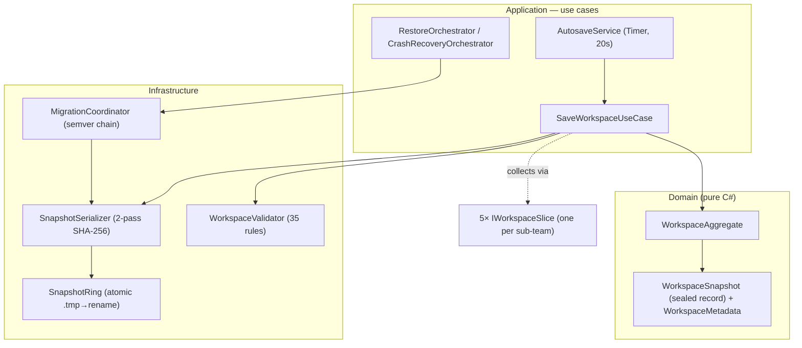

> 🟠 **Honest gap — no measured CK.** WP7 recorded only **NFR3 target thresholds**, not a
> measured `Config.cs`/`ExitController.cs` baseline or post-refactor values. Targets below; **no
> measurements are fabricated.** *Pre-freeze action:* run Understand on `Config.cs`/
> `ExitController.cs` (before) and the new aggregate/serialiser/autosave classes (after) to
> convert the targets into a measured delta.

| NFR3 target — Sub-team 7 (targets, not measurements) | WMC | CBO | LCOM |
|---|---|---|---|
| Workspace snapshot aggregate | ≤ 5 | 0 | ≤ 0.1 |
| Snapshot serialiser / repository | ≤ 10 | ≤ 5 | ≤ 0.3 |
| State collection orchestrator | ≤ 15 | ≤ 8 | ≤ 0.4 |
| Autosave service | ≤ 8 | ≤ 4 | ≤ 0.3 |
| `Config` (post-split) | ≤ 3 | 0 | ≤ 0.1 |

**Before → after — the load-bearing excerpt (verbatim).** The original save path held live Unity
objects directly, so it could only run inside Unity; each sub-team's state now flows through a
Unity-free `WorkspaceSlice` port returning a serialisable DTO (ADR-012):

```csharp
// BEFORE — ExitController.cs (MonoBehaviour): save logic holds live Unity objects, Unity-only
public VolumeDataSetRenderer _activeDataSet;
public VolumeInputController _volumeInputController = null;

public void SaveOverwriteMask()
{
    _activeDataSet?.SaveMask(true);
    _volumeInputController.VibrateController(_volumeInputController.PrimaryHand);
}
```

```csharp
// AFTER — IFeatureStateAdapter.cs: a Unity-free port returning a serialisable DTO, testable headlessly
public interface IFeatureStateAdapter
{
    FeatureStateDto? Capture();          // null if no feature sets are loaded
    void Restore(FeatureStateDto dto);
}
```

A second excerpt shows the durable, checksummed contract that simply did not exist before:

```csharp
// AFTER — SnapshotSerializer.cs: two-pass SHA-256 seals a versioned JSON snapshot (no prior equivalent)
public string Serialize(WorkspaceSnapshot snapshot)
{
    var noChecksum = snapshot with { Metadata = snapshot.Metadata with { Checksum = null } };
    string body  = JsonConvert.SerializeObject(noChecksum, Settings);
    string hash  = ComputeChecksum(body);
    var withHash = snapshot with { Metadata = snapshot.Metadata with { Checksum = $"sha256:{hash}" } };
    return JsonConvert.SerializeObject(withHash, Settings);
}
```

**Principles / patterns.** **DIP** — `SaveWorkspaceUseCase` depends on `Func<IWorkspaceStateCollector>`
and `RestoreOrchestrator` on the five `I*StateAdapter` interfaces, never on Unity. **SRP** —
`LoadWorkspaceUseCase` only *produces a validated snapshot*; `RestoreOrchestrator` only *applies* one
(explicitly separated). **OCP** — a new subsystem is a new `I*StateAdapter` + DTO; the orchestrators
are closed. **ISP** — five narrow two-method adapters instead of one fat persistence interface.
**Strategy (schema migration)** — `ISchemaMigration` steps registered in `MigrationCoordinator`,
`Migration_1_0_to_1_1` the first concrete one.

**Testability.** The whole pipeline runs in a plain NUnit project with no Unity/scene (NFR1) —
`dotnet test` completes in seconds, writing to per-test temp dirs. Counted directly, the suite is
**70 `[Test]` methods (79 NUnit cases once `[Values]` expand)** across validator, ring, serializer,
stub-factory and migration. Real categories: **round-trip fidelity** (`SnapshotSerializerTests`
asserts *field-level* equality at full float/double precision — not a byte-for-byte comparison —
plus `schemaVersion`/`sha256:` content checks); **checksum integrity** (tampered body →
`InvalidDataException`); **atomic write** (`Push_AtomicWrite_NoTmpFilesLeftBehind`, wrap-around
eviction); **migration field-preservation** (`Migration_1_0_to_1_1_PreservesAllOtherFields`,
future-major → null); and **validator rules** (clamps, enum defaults, incomplete-corner feature
exclusion).

> **Honesty notes (LO8).** (1) WP7 recorded only **NFR3 target thresholds** — no measured
> `Config.cs`/`ExitController.cs` baseline or post-refactor CK (the gap above). (2) The "save → load
> → save byte-identical" determinism sometimes claimed is **not** what the tests assert — they check
> *field-level* round-trip fidelity and serialized-string content. (3) The headline "78 tests"
> matches neither the 70 source methods nor the 79 expanded cases; state it as "70 methods / 79
> cases (deliverable: 78)." (4) `ExitController` couples to `VolumeDataSetRenderer`/
> `VolumeInputController` via serialised fields and direct calls, not a literal `new` of
> `VolumeDataSet`/`FeatureSetManager` (that phrasing is the team's design-doc narrative).

### 6.8 Worked-example coverage at a glance

| WP | Subject | Before measured | After measured | Tool | Status |
|---|---|---|---|---|---|
| 1 | `VolumeDataSetRenderer` | ✅ (≈) | ✅ projection | (hand/NDepend) | Complete |
| 2 | `FitsReader` | ✅ | ✅ | NDepend | Complete |
| 3 | `VolumeDataSetRenderer` + `MaskMode` | ✅ | ✅ projection | Understand | Complete |
| 4 | `VolumeInputController` + `VolumeCommandController` | ✅ | ❌ **not recorded** | Understand (before) | **Before only** |
| 5 | `MomentMapRenderer` + `VoTableSaver` | ✅ | ✅ | Understand | Complete |
| 6 | File tab + Debug tab | ✅ | ✅ | Understand | Complete |
| 7 | Persistence (`Config`/`ExitController`) | ❌ targets only | ❌ targets only | — | **No measurements** |

**Five of seven** work packages have complete before/after CK evidence. The two gaps (WP4, WP7)
are declared, not hidden, and each has a named pre-freeze action.

---

## 7. Consolidated Metrics and Projected Improvement

The full per-class CK tables with provenance are **Appendix B** (B.1 per-team before/after; B.2
the whole-codebase static baseline). Across the five fully-measured work packages, every
refactoring drives the dominant CK offenders toward the spec thresholds:

| Metric | Representative movement (worst successor unless noted) | Where |
|---|---|---|
| **WMC** | 138 → 22; 97 → 12; 63 → 40; 27 → 22 | WP1, WP3, WP6, WP5 |
| **LCOM** | **→ 0** across all five `FitsReader` successors; `MomentMapCalculator`/`MomentMapService`/`VoTableExportService` → 0 | WP2, WP5 |
| **RFC** | 72 → 24; 97 → 12 | WP1, WP3 |
| **CBO** | 17 → 9; 28 → 15; 30 → 19 | WP1, WP3, WP6 |
| **Dependency cycles** | **2 → 0** (desktop slice); 46-file rendering cycle broken | WP6, WP3 |
| **Tests** | **0 → 47** (file tab), **0 → 35** (debug tab), **78** (persistence) where none were possible | WP6, WP7 |

**Two honest caveats travel with these numbers, exactly as recorded in Appendix B:**

1. **WP4 has no after-values** — the Interaction refactoring is real (code + three test files exist) but post-refactor CK was never measured.
2. **WP7 has no measurements at all** — only NFR3 targets were defined.

**Mixed provenance is disclosed:** WP1/WP3 "after" figures are per-class **projections**; WP2 is
**NDepend** tool-measured; WP5/WP6 are **Understand** tool-measured (WP5 RFC estimated; WP6 RFC =
method count, ~2–4× lower than traditional CK RFC). LCOM is reported per team in its own unit
(§3). A residual handful of after-classes still exceed a single threshold — `VolumeRenderingService`
WMC 22, `FileTabViewModel` LCOM 91 %, a few adapter LCOMs — **each with a documented structural
cause** (lifecycle-phase or MVVM backing-field cohesion) rather than a hidden defect, and each
with a named remediation.

At the system level, the proposal's CK targets become **CI fitness functions** (§8, ADR-005), so
the projected improvements are not one-off claims but **gates that prevent regression**: a future
PR that re-inflates WMC or reintroduces a cycle fails the build.

---

## 8. Testability Strategy and CI Quality Gates

The single biggest testability lever is the combination **ACL (ADR-002) + DI (ADR-003) +
MonoBehaviour separation (ADR-006)**: once domain logic is pure C#, it is unit-testable without
Unity. The worked examples already realise this — **47** file-tab tests, **35** debug-tab tests,
**78** persistence tests, plus the rendering and interaction suites — all where **zero** tests
were previously possible.

**Layered test model (representative, Sub-team 7).**

- *Tier 1 — pure NUnit (no Unity):* domain / application / infrastructure as a .NET 8 library; `dotnet test` runs in seconds in any CI runner, hermetically (a temp dir per test).
- *Tier 2 — Unity Edit/Play mode:* full stack including adapters, no VR hardware (autosave-interval, ring-eviction, crash-lock-via-OS-kill).
- *Tier 3 — scenario / UX:* VR flows (select → crop → paint → save), including golden-image regression across mask modes and colour maps.

**Dependency isolation.** Every Unity adapter implements an Application-layer interface;
collaborators are injected (often via deferred factories, e.g. `Func<IWorkspaceStateCollector>`).
Test doubles in use: `NullRenderPipeline`, `StubGazeProvider`, `MockGazeProvider`, `NullMaskMode`,
`StubCoordinateTransformer`.

**Property-based / invariant tests.** Mask-mode keyword mutual-exclusion across a six-mode
round-robin (Sub-team 3); migration field-preservation and field-level snapshot round-trip
(Sub-team 7); and moment-map invariants — moment-0 non-negativity and `min ≤ max` bounds
(Sub-team 5). *(WCS/FITS round-trip via FsCheck was AI-drafted but is **not** in the committed
suite, which is NUnit unit/integration — see §6.2; the broader feature-statistics invariants
(centroid-in-bbox, W20 ≤ W50) were **not** implemented by Sub-team 5 — see §6.5.)*

**CI quality gates (ADR-005).** Two GitHub Actions workflows define one unified pipeline that
runs on every PR and push (`push: ["**"]`, `pull_request: [main]`). Job topology:

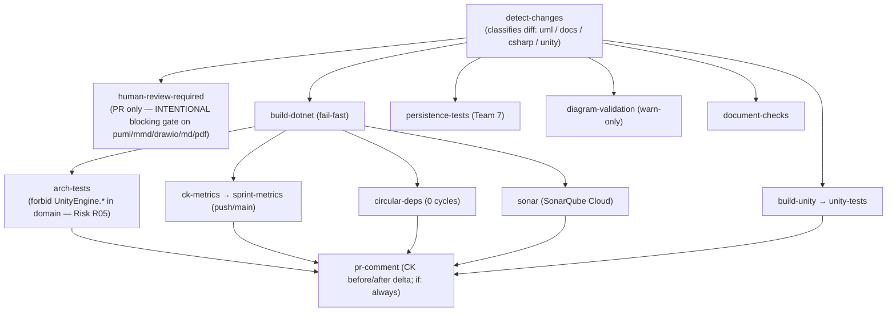

Gates harden from warnings (Day 1) to **hard blocks** on cycles, layer violations and CK
breaches (Day 10). The pipeline posts a CK before/after delta as a PR comment. The
`human-review-required` job is a deliberate blocking gate: any diagram/doc/PDF change in a PR
requires a Tech Lead / Quality Champion approval before merge.

**Coverage targets:** ≥ 70 % branch+line on domain/ViewModel layers, ≥ 50 % overall; Unity-bound
code tracked but not strictly targeted. Closing the baseline coverage gap (§2.1) by importing
Unity Test Runner results into the NDepend pipeline unlocks the three skipped coverage gates and
the 13 coverage-dependent rules.

---

## 9. Unity 5 → Unity 6 Migration Plan

The architecture is designed so the migration is **routine**, because the migration surface is
confined to the Infrastructure and adapter layers. The incremental path keeps the application
**fully functional at every phase** — phases 1–3 are invisible to the user:

| Phase | Change | Risk |
|---|---|---|
| 1 | Introduce `AppKernel`; migrate all `FindObjectOfType<>()` call sites to registry lookups | Low — mechanical substitution |
| 2 | Introduce `CommandBus` + typed commands; `VolumeCommandController.ExecuteVoiceCommand()` publishes commands instead of calling methods directly | Low — subscribers can start as the same concrete types |
| 3 | Replace `Transform.Find()` chains with UI subscriptions on `IVolumeRenderer` events | Medium — adds events to `VolumeDataSetRenderer` |
| 4 | Extract `IVolumeRenderer` from `VolumeDataSetRenderer` | Low — interface extraction |
| 5 | Extract `IInputSource`; make the interaction FSM private | Medium — breaks `VolumeCommandController` direct access |
| 6 | Lift `PaintTool` to `IAnalysisTool` (first full tool extraction) | Medium |
| 7 | Lift remaining tools one by one | Low per tool once the pattern is set |
| 8 | `QuickMenuController` builds tabs dynamically from `ToolRegistry` | Medium — replaces hardcoded panel fields |

The specific Unity-6 targets each land **behind an adapter**: the **Input System** via
`UnityInputSystemAdapter`/`IInputProvider` (ADR-002, ADR-010); **URP/HDRP** via `IRenderPipeline`
(the `OnRenderObject` → `SubmitMaskGeometry` fix already prepares this); **UI Toolkit** via the
MVVM Views and `UIToolkitBridge` (ADR-009). Because domain code has **no `UnityEngine` usings**,
the Unity-6 lifecycle and managed-code-stripping changes touch only the thin adapter shells —
turning a whole-codebase migration into an adapter-layer migration.

---

## 10. Cross-Sub-team Integration

Integration happens through **interface contracts and namespace boundaries**, not shared object
graphs (ADR-007, ADR-008). Each sub-team merged its work via PRs gated by the shared CI pipeline.

**Contribution map (merged PRs):**

| Sub-team | Behavioural area | Primary location |
|---|---|---|
| 1 — Architecture / Micro-kernel | Plug-in C ABI, micro-kernel core, Linux port | `refactoring-examples/sub-team-1/`, `MICROKERNEL_ARCHITECTURE.md` |
| 2 — Data I/O | FITS reading, AST/WCS transformation | `refactoring-examples/Sub-Team-2/` |
| 3 — Rendering | Volume rendering examples, design docs | `refactoring-examples/team3/`, `docs/team3/` |
| 4 — Interaction | Voice, gaze, locomotion, brush/cursor | `Assets/Scripts/Interaction/`, `Team-4-examples/` |
| 5 — Feature & Domain | Feature system, domain models | `refactoring-examples/sub-team-5/` |
| 6 — GUI | File/Debug tabs, service-gateway contracts | `refactoring-examples/sub-team-6/` |
| 7 — Persistence | Session save/load, autosave, recovery, migrations | `refactoring-examples/Persistence/` |

**Cross-team contract status:**

| Contract | Owners | Status |
|---|---|---|
| `RawVolumeData` (voxel handoff) | 2 → 3 | ✅ Resolved (2 Jun) |
| `IGaze` / `IGazeProvider` | 4 → 3 | ✅ Resolved (2 Jun) |
| `ISessionPersistenceService` / `VolumeSessionState` | 7 ↔ 3 | ⏳ Awaiting sign-off |
| `IServiceGateway` / JSON-RPC ABI | 1 → 3,4,5,6 | ⚠️ Stub — to be ratified by Sub-team 1 |
| Feature state / GUI state contracts | 5 / 6 | Drafted |

**Highest open risks** (live register: `docs/team-alpha/integration-risk-register.md`, rows R01–R07 + DEPS-1):
**R01 / DEPS-1** — service-gateway contract not yet frozen; clients code against a placeholder
stub. **R02** — plug-in ABI semver not yet enforced in CI (no exports-list check). **R05** —
`UnityEngine.*` leakage, mitigated by the `arch-tests` fitness function. **R06** — CK / Sonar
tooling not fully operational (mirrors the §2.1 coverage gap and the NDepend-on-Unity tooling
difficulty in §11). These are tracked with owners and are the candid subject of §11.

---

## 11. Trade-offs and Risk

The proposal is deliberately honest about its costs:

- **Indirection vs. simplicity.** The micro-kernel, ACL and DI add interfaces and classes (e.g. `CanvassDesktop`: 1 god class → 11 collaborators). Accepted because the alternative entrenches every known defect and makes the Unity 6 migration high-risk; the 90 fps floor is GPU-bound, so the abstraction overhead is off the hot path.
- **Service Locator exception.** Permitted *only* at the kernel plug-in boundary; general use is rejected as reintroducing hidden coupling (ADR-003).
- **Event-driven debugging.** Domain events reduce coupling but make control flow implicit; mitigated by an observable event bus in dev mode and structured logging (ADR-007).
- **Residual metric exceedances.** A few after-classes still breach one threshold each (WMC 22, LCOM 91 %, adapter LCOMs); each is documented with a structural cause and a named remediation.
- **Honest evidence gaps.** WP4 lacks after-CK and WP7 lacks measurements (§6.4, §6.7); both are open pre-freeze actions rather than concealed. The JSON-RPC transport adds latency for high-frequency calls, mitigated by batching / in-process shortcuts.
- **Scope honesty.** The three largest classes (`VolumeDataSet`, `DesktopPaintController`, `ShapesManager`) were not themselves refactored as worked examples (§2.2); the worked examples prove the method, and these are the named first targets of the structured programme.
- **Tooling reality.** NDepend would not analyse the Unity project without `Assembly-CSharp.dll`; some teams fell back to static source analysis and the Understand tool (logged as retro items, Appendix F). Metric values therefore diverge by tool (§2.4) — disclosed and triangulated rather than smoothed over.

---

## 12. AI Usage and Conclusion

### 12.1 AI usage (T8 summary; full log in Appendix F)

AI tools — **Claude Code** (Sonnet 4.6; Opus 4.7/4.8), **Claude chat** (Opus 4.6/4.7/4.8),
**Cursor** (Composer), **Perplexity** and **Gemini** — were used across the lifecycle, with
**approximately 200 logged assists** across the seven sub-teams. The strongest wins were
**analytical and structural**: SOLID/CK audits of the god classes, skeleton scaffolding for the
refactored layers, whole-codebase architecture-layer classification, and fast PlantUML/Mermaid
diagram generation — *"AI turned ~800-line source files into navigable responsibility maps in
minutes."* It also caught real defects (e.g. the inverted memory leak in
`VolumeDataSet.cs:431–434`).

The **failures are logged as carefully as the wins**, because they are the evidence that the
human is the author of record:

- **Hallucinated artefacts** — invented `IFitsPlugin`/`IAstPlugin`/`PluginRegistry` types and a fabricated `TryTransform(Vector3)` helper; whole documents discarded after a source check.
- **Unverifiable numbers** — AI cannot compute CK independently; it miscounted DIT (0 vs NDepend's 1) and confused LCOM4 with the brief's normalised LCOM, putting files on the wrong scale (the divergence in §2.4 is partly why every number is cross-checked against a tool export).
- **Cross-team confusion** — repeated sub-team-number mislabelling, corrected by hand.
- **Tooling dead-ends** — confident but wrong NDepend / npm / PATH advice costing hours.

The team's policy, per spec §10.5: *"We treated AI metric and architecture output as a hypothesis
to verify, never as a source of truth."* AI was **not** used for peer-rating, contribution logs,
individual reflections, or live pitch/interview defence (§10.5.6), and **no verbatim AI prose is
passed off as human-authored** (§10.5.3). Every AI-assisted artefact has a named human reviewer
(Appendix F).

### 12.2 Conclusion

iDaVIE's maintainability debt is **real, measurable, and on a sub-two-year breaking-point
trajectory** that the Unity 6 migration will accelerate. Team Alpha's proposal adopts the
mandated **client–server micro-kernel** architecture, isolates Unity behind an **anti-corruption
layer**, **versions the native plug-in ABI**, and proves the approach with **worked examples
across all seven work packages** that move the dominant CK metrics decisively toward target —
most strikingly **LCOM to 0** on the FITS plug-in and a **2 → 0 cycle reduction with 47 new
tests** on the desktop shell, where none were possible before.

We are candid about the **two evidence gaps** (WP4 after-CK, WP7 measurements), the **three
largest classes still to be tackled**, and the **open integration contracts** — each carried as a
named action, not concealed. We ask the panel to **adopt this proposal as the basis for the
structured refactoring of iDaVIE**, beginning with the pre-freeze actions listed after the
appendices.

---

# Appendices

_The following appendices are the companion team deliverables, embedded in full so this document
is self-contained. They are **excluded from the 60-page body limit** per the assignment._

| App | Content | Origin deliverable |
|---|---|---|
| A | Architecture Decision Record log (12 ADRs) | T3 (architecture overview) |
| B | Consolidated CK metrics — per-team (B.1) + whole-codebase static baseline (B.2) | T4 evidence base |
| C | Architecture & worked-example diagrams — inline Mermaid + canonical source index | T3 / T4 |
| D | Plug-in ABI specification + conformance suite | T3 (plug-in ABI) |
| E | Initial maintainability benchmark (NDepend, full report) | T2 |
| F | AI-tool usage log + reflection, with sub-team sign-off | T8 |

---

## Appendix A — Architecture Decision Record Log

_iDaVIE Refactoring Assignment — Sprint 1–3, May–June 2026. 12 ADRs (ADR-001 … ADR-012). Status:
all **Proposed**, pending Architecture Guild ratification. Owner: Architecture Guild (all
sub-team Tech Leads)._

### ADR-001 — Adopt Layered Micro-kernel Architecture
**Status:** Proposed · **Date:** 18 May 2026 · **Deciders:** Architecture Guild · **LOs:** LO3, LO4 · **Drivers:** ISO 25010 Modularity, Modifiability, Testability.

**Context.** The spec mandates a micro-kernel server, layered architecture and strict dependency
flow (Domain → Application → Infrastructure → Plug-in Host). The current codebase has tightly
coupled MonoBehaviour scripts, mixed responsibilities, lifecycle logic inside domain code, and
monolithic classes (e.g. `VolumeDataSetRenderer`). An imminent Unity 5→6 migration makes the
current architecture high-risk.

**Decision.** Adopt a client–server architecture (Unity 6 VR client; server for domain logic,
plug-in execution, long-running computation). Inside the server, apply a micro-kernel pattern: a
small stable kernel exposing a versioned plug-in contract; data formats, domain operations and
coordinate systems realised as C/C++ plug-ins. Enforce a strict downward-only layered flow.
Architecture violations (upward/circular dependencies) are a CI build failure from Day 3.

**Consequences — Positive.** Satisfies the mandatory constraints (spec §4.2); reduces coupling
(Modularity, Modifiability); enables per-layer testing without Unity/SteamVR; isolates the
Unity 5→6 migration surface to Infrastructure + Plug-in Host; enables future extensibility
(subcube loading, HDU selection, multiplayer) as plug-ins, not core rewrites.
**Consequences — Negative.** Additional architectural complexity/indirection; more
interfaces/abstractions; minor abstraction overhead (acceptable — the 90 fps floor is GPU-bound);
onboarding cost.

**Alternatives.** Retain monolithic MonoBehaviour architecture (rejected — violates spec,
entrenches defects); traditional layered client-only without micro-kernel (rejected — no plug-in
extensibility/ABI versioning); bi-directional layer dependencies (rejected — creates cycles, a
fail condition).
**Notes.** Root architectural decision; all other ADRs trace back. CK targets (WMC ≤ 20,
CBO ≤ 14, LCOM ≤ 0.5) enforced in CI as fitness functions.

### ADR-002 — Introduce Anti-Corruption Layer Around Unity and SteamVR
**Status:** Proposed · **Date:** 18 May 2026 · **Deciders:** Architecture Guild · **LOs:** LO3, LO4, LO6 · **Drivers:** Testability, Modifiability; spec §4.2 Constraint 3.

**Context.** The spec requires that domain code not transitively depend on `UnityEngine` or
SteamVR (§4.2 C3). The current implementation couples business logic (FITS math, feature
statistics, coordinate transforms) directly to Unity APIs and MonoBehaviour lifecycles, making
offline unit testing impossible and rippling every Unity API change through the codebase.

**Decision.** Introduce an ACL as stable C# interfaces that domain/application code depends on,
with concrete adapters in Infrastructure. Minimum set: `IRenderContext`, `IInputProvider`,
`IVRCamera`, `ITextureUploader`, `IAudioOutput`. Unity MonoBehaviours and SteamVR calls isolated
to adapters only; zero direct `UnityEngine`/SteamVR usings above Infrastructure, enforced by
NDepend CQLinq.

**Consequences — Positive.** Pure-C# unit testing of domain/application logic; confines the
Unity 6 migration to adapters; domain logic reusable outside Unity; mock/stub injection for all
platform APIs; lowers Mocking Difficulty. **Negative.** More adapter classes; abstractions must
track Unity 6 API evolution; leaky-abstraction risk if boundaries aren't CI-enforced.

**Alternatives.** Direct UnityEngine usage throughout (rejected — violates C3, prevents offline
testing); wrapper utilities without interfaces (rejected — unenforceable, unmockable); lock-in to
Unity XR Toolkit (rejected — over-constrains future hardware).
**Notes.** Every ACL interface must have ≥ 1 test double (Constraint 4); members ≤ 7 (ISP).
SteamVR dependencies in `LocomotionState`/`InteractionState` are primary migration targets.

### ADR-003 — Replace Singleton-Based Services with Dependency Injection
**Status:** Proposed · **Date:** 18 May 2026 · **Deciders:** Architecture Guild · **LOs:** LO4, LO6 · **Drivers:** Testability, Modularity; SOLID DIP/SRP.

**Context.** The spec names heavy singleton reliance as a maintainability pressure (§1.1).
Singletons create hidden dependencies (high CBO), prevent mocking, and couple subsystems. Static
access (`VolumeDataSetRenderer.Instance`) makes Mocking Difficulty high and branch coverage
impossible. The Scrum-of-Scrums structure needs parallel work without runtime coupling.

**Decision.** Replace singleton access with constructor injection; explicit interfaces (ADR-002)
at every service boundary; one composition root per entry point (server kernel; Unity client
shell). The plug-in registry may use Service Locator (GRASP Indirection) as the **one** accepted
exception. Stateful static classes prohibited; pure stateless helpers allowed.

**Consequences — Positive.** Immediate testability via mock injection; large expected CBO drop;
supports DIP and GRASP Low Coupling / Protected Variations; sub-teams integrate via interface
contracts. **Negative.** Composition-root setup complexity; DI configuration documentation;
non-trivial initial singleton refactor.

**Alternatives.** Global singletons (rejected — blocks testability); static utilities (rejected —
equivalent to singletons); pervasive Service Locator (rejected — hides dependencies; allowed only
at the kernel plug-in boundary).
**Notes.** Server-kernel composition root owned by Sub-team 1; each sub-team owns its own DI
wiring; "no new singletons" enforced via SonarQube custom rules from Day 3.

### ADR-004 — Standardise Plug-in ABI for Native C/C++ Extensions
**Status:** Proposed · **Date:** 18 May 2026 · **Deciders:** Architecture Guild + Data I/O · **LOs:** LO3, LO5 · **Drivers:** Modularity, Reusability; spec §4.2 Constraint 5.

**Context.** The spec requires a formal plug-in contract with ABI stability, semver, failure
isolation, threading guarantees and explicit memory ownership (§4.2 C5). Current native DLLs
(`FitsReader`, `DataAnalysis`, `AstTool`) are called directly, unversioned, with implicit memory
ownership; a misbehaving plug-in can crash the Unity process.

**Decision.** Define a stable C ABI (plain C signatures, no C++ mangling across the boundary);
semver per plug-in (compatible within a major version); opaque handles with documented ownership;
explicit threading rules; a standard `idavie_plugin_info`/`idavie_abi_version` probe for
load-time compatibility checks; plug-in failures surfaced as structured error codes, never
unhandled exceptions. (Full spec: Appendix D.)

**Consequences — Positive.** Long-term compatibility; failure isolation; new format plug-ins
(MUSE, particle datasets, TIFF) without kernel changes; C ABI is maximally portable; explicit
ownership eliminates a class of memory bugs. **Negative.** Reduced implementation freedom;
per-plug-in boilerplate (probe, version struct, error enum); disciplined versioning governance.

**Alternatives.** Direct DLL calls (rejected — current fragility); C++ virtual interfaces across
the boundary (rejected — ABI-unstable); no semver (rejected — C5 explicit).
**Notes.** ABI headers are a Sub-team 1 deliverable; Sub-team 2 provides reference bindings;
contract tests runnable without Unity.

### ADR-005 — Enforce Architecture Rules in CI
**Status:** Proposed · **Date:** 19 May 2026 · **Deciders:** Quality Guild + Architecture Guild · **LOs:** LO1, LO6, LO7 · **Drivers:** Modularity, Analysability; spec §4.2.

**Context.** Manual enforcement is unreliable across a 28-person, 7-sub-team structure. The spec
mandates architecture validation and maintainability tooling (§7.3, §10.3); CI must block PRs on
violations; decay (cycles, upward references, singleton reintroduction) accumulates silently
otherwise.

**Decision.** Run the full metric+architecture suite on every PR; block on failure. Integrate by
Day 5: SonarQube Cloud, NDepend (CQLinq layer rules), DV8 (DSM). Hard gates: (a) zero cycles
(namespace+assembly); (b) zero layer-rule violations; (c) CK within thresholds (WMC ≤ 20 domain,
CBO ≤ 14 domain, LCOM ≤ 0.5, RFC ≤ 50, DIT ≤ 4); (d) branch coverage ≥ 70 % domain; (e) no new
`UnityEngine` usings above Infrastructure. Post a CK before/after delta as a PR comment. Harden
from Day-1 syntax checks → Day-5 full suite → Day-10 hard blocking.

**Consequences — Positive.** Decay caught at PR time; objective before/after evidence for worked
examples; consistent standards without relying on review; the CI dashboard is a live pitch
deliverable. **Negative.** Slower early merges; NDepend/DV8 false positives need tuning; CI
maintenance overhead.

**Alternatives.** Manual review only (rejected — insufficient at scale); optional validation
(rejected — spec requires blocking); post-merge checking (rejected — allows decay).
**Notes.** Quality Guild collectively accountable; layer CQLinq rules authored by Sub-team 1;
thresholds drawn from spec §7.1–7.2.

### ADR-006 — Separate Domain Logic from MonoBehaviour Lifecycle
**Status:** Proposed · **Date:** 19 May 2026 · **Deciders:** Architecture Guild · **LOs:** LO4, LO5, LO6 · **Drivers:** Testability, Modifiability; SOLID SRP.

**Context.** The current architecture intermixes Unity lifecycle methods (`Awake`/`Start`/
`Update`/`OnDestroy`) with business logic (feature statistics, FITS loading, coordinate
transforms) inside MonoBehaviours, which cannot be instantiated outside a Unity runtime. Lifecycle
coupling is a named pressure (§1.1) and a SRP violation; Unity 6 lifecycle changes raise the risk.

**Decision.** Restrict MonoBehaviours to thin adapters/controllers/presenters (subscribe to
lifecycle, delegate to services, bind data). Move all business logic to pure C# POCOs in
Domain/Application — no MonoBehaviour inheritance, no `UnityEngine` usings. Adapters call domain
services via injected interfaces (ADR-003); no conditional logic beyond null-guards. Applies
across all sub-teams (renderer → binder/texture services; locomotion → pure C# State machine;
`CanvassDesktop` → ViewModels).

**Consequences — Positive.** Domain/Application fully unit-testable in edit-mode/headless CI;
WMC/RFC fall within thresholds; Unity 6 lifecycle changes touch only the thin adapter; supports
parallel development. **Negative.** More service-abstraction classes; main-thread/background
synchronisation to manage; more files/namespaces (managed by ADR-008).

**Alternatives.** Keep logic in MonoBehaviours (rejected — untestable, violates SRP); partial
extraction (rejected — inconsistent; ADR-005 enforces globally).
**Notes.** The mechanism by which Mocking Difficulty falls and ≥ 70 % domain branch coverage
becomes achievable. Each worked example must show this split with CK deltas.

### ADR-007 — Adopt Event-Driven Communication for Cross-System Integration
**Status:** Proposed · **Date:** 20 May 2026 · **Deciders:** Architecture Guild · **LOs:** LO3, LO4 · **Drivers:** Modularity, Modifiability; GRASP Low Coupling, Indirection.

**Context.** The architecture relies on direct object references between subsystems (renderer →
feature manager; interaction → renderer), creating transitive coupling (high CBO) and propagating
change widely. Sub-teams need an integration spine without compile-time dependencies; plug-ins
must not hold direct references into kernel domain objects.

**Decision.** Adopt domain events + an event aggregator (`IEventBus`, Application layer; impl in
Infrastructure) for cross-system communication within the kernel. Typed event classes
(`FitsDataLoadedEvent`, `FeatureCreatedEvent`, `MaskAppliedEvent`, `ViewStateChangedEvent`) are
pure C# value objects. Subsystems publish/subscribe; never hold direct references. Unity-side
client communication uses Unity events on the adapter layer; the domain bus is server-side.
Synchronous calls remain within a single bounded context; events cross context boundaries.

**Consequences — Positive.** Eliminates cross-package references; large expected CBO drop on
orchestrators; plug-ins subscribe/publish without kernel source; OCP extensibility; testable by
firing events against a mock bus. **Negative.** Harder tracing/debugging (mitigated by an
observable bus + structured logging in dev mode); event ordering must be specified and tested.

**Alternatives.** Direct references (rejected — maintains coupling); singleton coordinator
(rejected — reintroduces ADR-003 problem); global mutable state (rejected — thread-unsafe,
untestable).
**Notes.** Sub-team 1 defines the event taxonomy; agreed at Architecture Guild before Sprint 2;
event-schema changes follow the ABI semver rules.

### ADR-008 — Define and Enforce Package and Namespace Dependency Rules
**Status:** Proposed · **Date:** 20 May 2026 · **Deciders:** Architecture Guild · **LOs:** LO3, LO7 · **Drivers:** Modularity; spec §4.2 Constraint 2.

**Context.** The spec forbids circular dependencies between top-level components (§4.2 C2). With 7
concurrent sub-teams, namespace boundaries are the first defence against unintended coupling; the
current structure enforces no dependency ownership.

**Decision.** Define a namespace hierarchy per layer/subsystem: `iDaVIE.Domain.{Feature,
Rendering, Interaction, Persistence, DataIO}`; `iDaVIE.Application.{…, GUI}`;
`iDaVIE.Infrastructure.{Unity, SteamVR, NativePlugins, Persistence}`; `iDaVIE.Client.{Shell, VR,
Desktop}`. Enforce in NDepend CQLinq: Domain references neither Infrastructure/Client nor
UnityEngine/SteamVR; Application never references Client; Infrastructure references Domain only via
interfaces; plug-ins communicate only through the ABI (ADR-004) and `IEventBus` (ADR-007). Cycles
at any level are a CI block (ADR-005). Worked examples show before/after namespace mapping.

**Consequences — Positive.** Structurally prevents the spec's fail condition; Package Instability
measurable/manageable; sub-team contracts become namespace boundaries visible in the DSM;
governance automatable. **Negative.** Continuous CI enforcement; may slow Sprint-1 prototyping
(mitigated by the gate-hardening schedule); initial namespace refactor cost.

**Alternatives.** Unrestricted references (rejected — fails C2); developer discipline only
(rejected — insufficient at scale); informal conventions (rejected — unenforceable).
**Notes.** Namespace map is a Sub-team 1 deliverable, published by Day 3; the DSM at each sprint
boundary (DV8) is the adherence evidence.

### ADR-009 — Adopt MVVM for the Desktop GUI Client Shell
**Status:** Proposed · **Date:** 21 May 2026 · **Deciders:** Desktop GUI Sub-team + Architecture Guild · **LOs:** LO4, LO5 · **Drivers:** Testability, Modularity; SOLID SRP/DIP.

**Context.** `CanvassDesktop` is a monolithic God-canvas (menu structure, panel state, file
dialogs, configuration, direct native-plugin and Unity calls), violating SRP, with high WMC/CBO
and untestable ViewModel logic. The spec requires an MVVM split (§6.6) and a client–server
transport (JSON-RPC / gRPC); Unity 6 UI Toolkit supports data binding.

**Decision.** Decompose into the MVVM triad: View (UI Toolkit, no logic); ViewModel (pure C#,
state + commands, no UnityEngine); Service Gateway (translates commands to server calls). One
View/ViewModel per panel (File, Render, Stats, Sources, Paint, Debug) — no God-canvas. ViewModel
commands follow the Command pattern (consistent with ADR-010). Transport: JSON-RPC 2.0 over named
pipes locally, gRPC upgrade path. ViewModels test with xUnit/NUnit without Unity.

**Consequences — Positive.** ViewModel unit tests need no Unity (≥ 70 % branch coverage
achievable); clear SRP; composable panels prevent God-canvas re-emergence; versioned transport
contract. **Negative.** Unity UI Toolkit binding less mature than WPF/React; JSON-RPC
serialisation latency (mitigated by batching / in-process shortcuts); more files per panel
(managed by ADR-008).

**Alternatives.** Minor decomposition of the monolith (rejected — misses SRP/testability); MVC
(rejected — Controller keeps Unity deps); REST binding (rejected — JSON-RPC lower overhead for
local IPC).
**Notes.** Transport contract (JSON-RPC schema) shared between Sub-team 6 and Sub-team 1; agreed
by Day 6.

### ADR-010 — Formalise State and Command Patterns for the Interaction System
**Status:** Proposed · **Date:** 21 May 2026 · **Deciders:** Interaction Sub-team + Architecture Guild · **LOs:** LO4, LO5 · **Drivers:** Testability, Analysability; SOLID OCP/ISP.

**Context.** The VR interaction system uses two implicit state machines (`LocomotionState`,
`InteractionState`) as large switch/flag conditionals inside `Update()`. High cyclomatic
complexity (Analysability), hard to test (no discrete State objects), fragile under extension
(OCP). The spec requires re-platforming onto Unity 6 Input System with SteamVR replaced by
`IInputProvider` (§6.4). Voice/quick-menu actions lack reification.

**Decision.** Implement GoF State for both machines (`Idle`, `Moving`, `ScalingRotating`,
`ParameterEditing`, `CreatingSelection`, `EditingRegion`, `SourceEditing`, `PaintingStroke` as
distinct C# classes implementing `ILocomotionState`/`IInteractionState`). State classes are pure
POCOs with constructor-injected dependencies (`IInputProvider`, `IVoiceRecogniser`); a thin
MonoBehaviour Context holds the current state and delegates. Implement GoF Command for voice/menu
actions (reified `ICommand` with `Execute()`/`Undo()`, logged/replayable/testable). Apply ISP:
split SteamVR's input API into `IPointerInput`, `IGripInput`, `IVoiceInput`, `IHaptics` (each ≤ 7
members).

**Consequences — Positive.** Per-method cyclomatic complexity falls sharply; State/Command
classes fully unit-testable with mocks; new states/commands are additions (OCP);
ISP-compliant interfaces; command log enables replay/accessibility-audit/scenario testing.
**Negative.** More classes (one per state); substantial initial migration (Sprint 2);
thread-safe state transitions to specify.

**Alternatives.** Switch-based machines (rejected — complex, untestable, fragile); Unity Animator
(rejected — couples to Unity); SCXML library (rejected — unvetted dependency).
**Notes.** UML state-machine diagrams are a Sub-team 4 deliverable; `IInputProvider` replaces
direct SteamVR; the SteamVR adapter is an Infrastructure class (ADR-002).

### ADR-011 — Define Feature as a First-Class Domain Aggregate
**Status:** Proposed · **Date:** 22 May 2026 · **Deciders:** Feature System Sub-team + Architecture Guild · **LOs:** LO4, LO5 · **Drivers:** Modularity, Testability; GRASP Information Expert; SOLID LSP.

**Context.** The Feature system mixes identity, statistics, persistence and visualisation inside
`FeatureSetManager` (SRP violation; high WMC/CBO). Statistics (voxel count, flux, centroid, W20)
are computed outside the entity (violates Information Expert). The three Feature flavours (Masked,
Imported, User-defined) are handled by conditionals (violates LSP/OCP). The Feature domain must be
server-side and Unity-free to enable moment-map generation and VOTable export without a VR
session.

**Decision.** Promote `Feature` to a first-class Domain Aggregate with identity, invariants and a
clear boundary; it encapsulates its own statistics (Information Expert). Define `IFeature`;
Masked/Imported/User-defined are substitutable implementations (LSP). Decompose `FeatureSetManager`
into `FeatureCatalog` (identity/persistence → Sub-team 7 contracts), `FeatureSetService`
(Application orchestration), `FeatureVisualiser` (Infrastructure/Client adapter). Moment-map and
VOTable export are Application use cases calling the aggregate via `FeatureSetService` — no Unity
dependency.

**Consequences — Positive.** LCOM drops (aggregate cohesive around its data); CBO drops per split
class; statistics co-located with data; new Feature types are new `IFeature` impls; export +
moment-map testable headlessly. **Negative.** Careful state migration to avoid regressions;
aggregate boundary must be agreed with Sub-team 7 by Sprint 2 Day 8.

**Alternatives.** Keep `FeatureSetManager` monolithic (rejected — SRP/CK); stateless statistics
service (rejected — violates Information Expert); inheritance for flavours (rejected — LSP needs
interface substitution).
**Notes.** Feature aggregate UML + invariants are a Sub-team 5 deliverable; state contracts with
Persistence (7) and Data I/O (2) signed off at Guild by Day 9.

### ADR-012 — Establish a Versioned Workspace Persistence Contract
**Status:** Proposed · **Date:** 22 May 2026 · **Deciders:** Persistence Sub-team + Architecture Guild · **LOs:** LO4, LO5, LO6 · **Drivers:** Modifiability, Testability; spec §6.7.

**Context.** Sessions contain significant user state (loaded cubes, mask edits, paint strokes,
features, view parameters, render settings, selection boxes), but there is no formal persistence
boundary — state lives in MonoBehaviour fields and scene state, making durable save/restore, crash
recovery and forward-compatible versioning impossible. The spec (§6.7) requires a workspace domain
model, a versioned format with migrations, transactional autosave, and a pure-C# persistence layer.

**Decision.** Define `Workspace` as a domain aggregate: a versioned, serialisable snapshot of all
sub-system states; each sub-team owns a `WorkspaceSlice` interface (`IRenderState`,
`IFeatureState`, `IInteractionState`, …). Schema-versioned JSON (`SCHEMA_VERSION`, semver);
explicit `Migrate_vN_to_vM()` functions. Autosave every 5 min and on significant transitions, to
a shadow file, promoted atomically (write-then-rename). Graceful partial/corrupt handling
(unknown fields ignored; missing fields default; version mismatch → migration chain). Pure C#
(no `ScriptableObject`/`PlayerPrefs`). Round-trip determinism tests required.

**Consequences — Positive.** Crash recovery via shadow-file autosave; forward-compatible
versioning; fully unit-testable without Unity; `WorkspaceSlice` contracts let all sub-teams
declare state independently (Day-9 gate). **Negative.** Disciplined migration-chain maintenance;
atomic write-then-rename filesystem assumptions (documented/tested on Windows); Team Beta's
reduced scope (3 persons) means one worked example, not two.

**Alternatives.** PlayerPrefs/ScriptableObject (rejected — Unity-bound, untestable, not
forward-compatible); binary serialisation (rejected — fragile across .NET versions, hard to
migrate); manual save only (rejected — data-loss risk).
**Notes.** `WorkspaceSlice` contracts mandatory for Team Beta by Day 9 (§8.2); Sub-team 7 owns
the Workspace aggregate; each sub-team owns its `WorkspaceSlice` implementation.

---

## Appendix B — Consolidated CK Metrics

**Every number below is copied verbatim from the team's own deliverable. Nothing is estimated or
invented.** Where a team did not record a value, it is shown as a gap. Provenance is given per
sub-team. B.1 holds the per-team **before/after** pairs (the basis for §6); B.2 holds the
**whole-codebase static baseline** (the basis for §2.2).

**CK suite & acceptable ranges (spec §7.1):**

| Metric | Meaning | Acceptable range |
|---|---|---|
| WMC | Weighted Methods per Class | ≤ 20 domain; ≤ 40 adapters |
| DIT | Depth of Inheritance Tree | ≤ 4 |
| NOC | Number of Children | ≤ 5 |
| CBO | Coupling Between Object classes | ≤ 14 domain; ≤ 25 orchestrators/adapters; cycles forbidden |
| RFC | Response For a Class | ≤ 50 |
| LCOM | Lack of Cohesion (Henderson-Sellers) | ≤ 0.5 (or ≤ 50 % when reported as "Percent Lack of Cohesion") |

### B.1 Per-team before/after (matched pairs)

**Coverage summary:**

| Sub-team | Subject refactored | Before | After | Tool | Status |
|---|---|---|---|---|---|
| 1 | `VolumeDataSetRenderer` god class | ✅ | ✅ (projected) | hand/NDepend | Complete |
| 2 | `FitsReader` (FITS plugin) | ✅ | ✅ | NDepend | Complete |
| 3 | `VolumeDataSetRenderer` + `MaskMode` | ✅ | ✅ (projected) | Understand | Complete |
| 4 | `VolumeInputController` | ✅ | ❌ not recorded | Understand (before) | **Before only** |
| 5 | `MomentMapRenderer` + `VoTableSaver` | ✅ | ✅ | Understand | Complete |
| 6 | File tab + Debug tab | ✅ | ✅ | Understand | Complete |
| 7 | Persistence (`Config`/`ExitController`) | ❌ targets only | ❌ targets only | — | **No measurements** |

**Sub-team 1 — `VolumeDataSetRenderer`** (before ≈ approximations; after = per-class projection).
god class (1,403 LOC, 45 methods): WMC ≈ 138 · DIT 1 · CBO ≈ 17 · RFC ≈ 72 · LCOM ≈ 0.82. After:
`VolumeDataSetRenderer` (thin) 18/1/9/22/0.20; `VolumeRenderingService` 22/0/8/24/0.15;
`MaskControllerService` 12/0/4/14/0.10; `VolumeCoordinateMapper` 10/0/3/12/0.05;
`RegionControllerService` 18/0/6/22/0.18; `RestFrequencyService` 9/0/3/11/0.08;
`VolumeDataExportService` 10/0/5/18/0.12. (Order: WMC/DIT/CBO/RFC/LCOM.)

**Sub-team 2 — `FitsReader`** (NDepend; `DIT = N/A` for static; LCOM 0–1). Before `FitsMetrics`
assembly: `AstTool` 0/1/0/11/0/0; `DataAnalysis` 13/N-A/0/39/22/1.0; `FitsReader` 55/1/0/27/126/1.0
(WMC/DIT/NOC/CBO/RFC/LCOM). After `iDaVIE.PluginInterface`: `FitsFile` 2/7/2/0; `FitsHeader`
5/13/20/0; `FitsImage` 0/7/0/0; `FitsTable` 7/12/28/0; `FitsMask` 41/19/82/0; `AstTool` 0/9/0/0;
`DataAnalysis` 12/38/25/0 (WMC/CBO/RFC/LCOM). LCOM → 0 across all split classes.

**Sub-team 3 — `VolumeDataSetRenderer` + `MaskMode`** (Understand; LCOM 0–1). Before (1,402 LOC):
WMC 97 · DIT 2 · NOC 0 · CBO 28 · RFC 97 · LCOM 0.95. After: `VolumeRenderCoordinator`
11/1/15/11/0.69; `VolumeRendererBehaviour` 3/2/8/3/0.00; `VolumeMaterialBinder` 10/1/12/10/0.57;
`VolumeTextureManager` 12/1/4/12/0.67; `VolumeCameraDriver` 4/1/4/4/0.25; `VolumeCoordinateService`
3/1/3/3/0.00; `FoveatedSamplingPolicy` 6/1/6/6/0.33; `ApplyMaskMode`/`InverseMaskMode`/
`IsolateMaskMode`/`DisabledMaskMode` 2/1/2/2/0.00; `IMaskMode` (interface) 0/0(NOC 5)/4/0/0.00.

**Sub-team 4 — `VolumeInputController`** (before only). Before (Understand, cross-checked vs Day-2
baseline): WMC 79 · CBO 31 · RFC 79; DIT/NOC/LCOM not recorded. **After: not recorded** — Team 4
decomposed `VolumeInputController` into seven collaborators and reified `VolumeCommandController`'s
voice path, but did not measure or document post-refactor CK values (the worked example lists
"NDepend: compare `VolumeInputController` WMC/RFC before vs after on same build" as an outstanding
step). See §6.4.

**Sub-team 5 — `MomentMapRenderer` + `VoTableSaver`** (Understand; RFC `~` estimated; LCOM 0–1).
Ex 1 before: 27/2/0/17/~22/0.48. After: `MomentMapCalculator` 22/1/2/~3/0.0; `MomentMapService`
4/1/5/~2/0.0; `MomentMapRequest` 6/1/2/~9/0.0; `MomentMapResult` 5/1/2/~9/0.0;
`MomentMapRendererAdapter` 19/2/14/~8/0.75. Ex 2 before: `VoTableSaver` 7/1/0/6/~1/0.0. After:
`FeatureCatalog` 4/1/3/~2/0.0; `VoTableExportService` 14/1/8/~4/0.0.

**Sub-team 6 — File tab + Debug tab** (Understand; RFC = tool method count; LCOM %). File tab
before `CanvassDesktop` (LOC 1899): 63/2/0/30/63/95 % — fails WMC, CBO, LCOM. After (11-class
slice): `FileTabViewModel` 40/1/19/40/91 %; `SubsetBoundsViewModel` 20/1/1/20/77 %;
`FitsMetadataHelper` 3/0/2/3/0 %; `AsyncRelayCommand`/`RelayCommand` 4/1/3/4/50 %;
`FitsServiceAdapter` 6/1/7/6/33 %; `FileDialogServiceAdapter` 1/1/1/1/0 %; `VolumeServiceAdapter`
5/2/9/5/65 %; `MemoryProbeAdapter` 1/1/0/1/0 %; `FileTabView` 8/2/14/8/69 %;
`FileTabCompositionRoot` 2/2/12/2/33 %. Cycles 2 → 0; 0 → 47 tests. Debug tab before
`DebugLogging` (LOC 255): 8/4/0/~10/~25/~95 % (passes 5/6; only LCOM fails). After: `DebugTabViewModel`
6/1/2/6/66 %; `LogStream` 4/1/3/4/25 %; `LogEntry` 0/1/1/0/0 %; `GatewayLogStreamAdapter`
8/1/5/8/72 %; `DebugTabView` 3/2/7/3/41 %; `DebugTabCompositionRoot` 3/2/6/3/41 %; three interfaces
not measured. 0 → 35 tests.

**Sub-team 7 — Persistence** (targets only — no measurements). NFR3 targets (WMC/CBO/LCOM):
Workspace snapshot aggregate ≤ 5/0/≤ 0.1; serialiser/repository ≤ 10/≤ 5/≤ 0.3; state-collection
orchestrator ≤ 15/≤ 8/≤ 0.4; autosave service ≤ 8/≤ 4/≤ 0.3; `Config` (post-split) ≤ 3/0/≤ 0.1.
No measured `Config.cs`/`ExitController.cs` baseline or post-refactor values exist; DIT/NOC/RFC
targets were not specified. See §6.7.

**Sources index (B.1):**

| Sub-team | File |
|---|---|
| 1 | `refactoring-examples/subteam-1/VolumeDataSetRenderer/metrics.md` |
| 2 | `refactoring-examples/Sub-Team-2/Fits Reader/metrics/Metrics Comparison.pdf` |
| 3 | `docs/team3/Deliverables/D2-MetricsWorksheet/metrics-worksheet.md` |
| 4 | `ai-tool-log/sub-team-4.md` (before only) |
| 5 | `refactoring-examples/sub-team-5/example-{1,2}-…/CK_Metrics.md` |
| 6 | `docs/sub-team-6/deliverables/collated_deliverable/{file-tab,debug-tab}-refactor/ck-metrics.md` |
| 7 | `docs/team7/Requirements Document.md` (targets only) |

### B.2 Whole-codebase static CK baseline

_Source: `docs/team-alpha/Inital Metrics/METRICS.md` (static analysis of all 104 first-party C#
files, 2026-06-04). **Approximations** by the source's own statement; LCOM reported qualitatively
(Low/Moderate/High); WMC counts on a broader scale than the per-team tools (§2.4). Reproduced here
for triangulation, not as a substitute for the matched pairs in B.1._

**Project:** 104 C# files · ~31,500 LOC (first-party) · 180+ classes · 52 MonoBehaviour subclasses
· max class `VolumeDataSet` 1,920 LOC · max WMC 340 (`CanvassDesktop`) · max CBO 15
(`VolumeDataSet`) · 22 enumerations · 23 nested types.

**Core volume / UI / plugin god classes** (WMC/DIT/NOC/CBO/RFC/LCOM):

| Class | LOC | WMC | DIT | NOC | CBO | RFC | LCOM |
|---|---|---|---|---|---|---|---|
| `VolumeDataSet` | 1920 | 330 | 0 | 0 | 15 | 80 | High |
| `CanvassDesktop` | 1899 | 340 | 1 | 0 | 12 | 70 | High |
| `VolumeInputController` | 1634 | 192 | 1 | 0 | 10 | 65 | High |
| `DesktopPaintController` | 1558 | 305 | 1 | 0 | 9 | 55 | High |
| `VolumeDataSetRenderer` | 1402 | 297 | 1 | 0 | 8 | 60 | High |
| `ShapesManager` | ~500 | 169 | 1 | 0 | 8 | 55 | High |
| `CatalogDataSetRenderer` | 694 | 145 | 1 | 0 | 8 | 55 | High |
| `FitsReader` | 730 | 147 | 0 | 0 | 3 | 50 | Moderate |
| `VolumeCommandController` | 685 | 108 | 1 | 0 | 7 | 45 | Moderate |
| `DataAnalysis` | ~500 | 80 | 0 | 0 | 4 | 45 | Moderate |
| `FeatureSetRenderer` | 616 | 77 | 1 | 0 | 7 | 48 | Moderate |
| `VideoCameraController` | 605 | 74 | 1 | 0 | 7 | 42 | Moderate |
| `CatalogDataSet` | ~400 | 55 | 0 | 0 | 6 | 40 | Moderate |
| `FeatureSetManager` | ~400 | 55 | 1 | 0 | 8 | 42 | Moderate |
| `MomentMapRenderer` | ~350 | 40 | 1 | 0 | 6 | 32 | Moderate |

**Well-cohesive (Low LCOM):** `Feature`, `ColumnInfo`, `ColorMapEnum`, `AstTool`,
`ToastNotification`, `Shape`, and all VRKeyboard/`Path`/`Easing` leaf subclasses (single-concern).
**Inheritance:** max DIT 2 (VRKeyboard leaves); abstract hierarchies `Action` (NOC 8), `Path`
(NOC 5), `Easing` (NOC 4), `Abstract_VR_button` (NOC 5). **Most-coupled (CBO):** `VolumeDataSet`
(15), `CanvassDesktop` (12), `VolumeInputController` (10), `DesktopPaintController` (9), then
`ShapesManager`/`FeatureSetManager`/`CatalogDataSetRenderer`/`VolumeDataSetRenderer` (8).

**Suggested splits recorded by the source** (corroborating §6): `VolumeDataSet` →
`VolumeDataLoader`/`VolumeDataProcessor`/`VolumeDataStats`/`VolumeDataHistory`; `CanvassDesktop` →
per-area `*PanelController` (realised as MVVM in WP6); `VolumeInputController` → State pattern per
`InteractionState` (realised in WP4); `DesktopPaintController` → `BrushInputHandler` + `MaskPainter`.

---

## Appendix C — Architecture & Worked-Example Diagrams

The diagrams that carry the argument are embedded as **inline Mermaid** in the body: C4 L1/L2
(§4.2–4.3), the micro-kernel before/after (§4.5), the layered kernel (§4.6), the CI topology (§8),
and a before/after decomposition per work package (§6.1–6.7). This appendix provides (C.1) a
consolidated system-overview diagram and (C.2) the index of canonical source diagrams (PlantUML)
for any reader who wishes to render the originals.

### C.1 Consolidated target-system overview

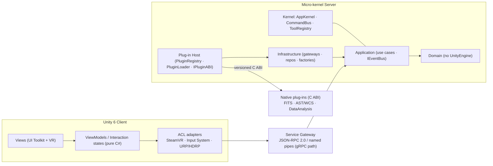

### C.2 Canonical source-diagram index (PlantUML)

| Group | Files | Shows |
|---|---|---|
| God-class current state | `docs/uml/{CanvassDesktop, DesktopPaintController, VolumeDataSet, VolumeDataSetRenderer, VolumeInputController}.puml`; `refactoring-examples/subteam-1/god-classes/01–07-*.puml` | Before-state class diagrams of all god classes (incl. `CatalogDataSetRenderer`, `VolumeCommandController`) |
| God-class target state | `docs/uml/refactored/{…}_refactored.puml` | After-state class diagrams for each god class |
| System / C4 | `docs/uml/{client_server_bdd, client_server_component, overview}.puml` + `…/refactored/*` | C4 L1/L2 context + container, SysML BDD, before/after |
| Rendering (WP3) | `docs/team3/diagrams/{architecture, class-before, class-after, sequence-render-frame, sequence-render-frame-before, vdsr-dependencies}.puml` | 5-layer architecture, before/after class, render-frame sequences, dependency graph |
| Feature/Domain (WP5) | `docs/team-5/UML Diagrams/{FeatureData(Before), FeatureData(Refactored), feature-invariants, IFeature}.puml`; `refactoring-examples/sub-team-5/example-{1,2}-…/diagram.puml` | Feature aggregate before/after, invariants, moment-map & VOTable splits |
| Desktop GUI (WP6) | `docs/sub-team-6/deliverables/D2-Architecture/concern-map.puml`; `docs/sub-team-6/archived/ex{1,2}-*/**` | Concern map (8 concerns → SRP homes); File/Debug-tab before/after class, dependency and sequence diagrams |

> Note: WP2 (Data I/O) has no `.puml` diagrams; its evidence is the NDepend metrics PDF and the
> before/after worked-example C# files. WP4's refactored diagrams are
> `docs/uml/refactored/VolumeInputController_refactored.puml`.

---

## Appendix D — Plug-in ABI Specification + Conformance Suite

_DRAFT v0.1.0 · Owner: Sub-team 1. Design-only: specifies the contract; no production code is
modified. The C binding header (`idavie_abi.h`) realising this contract is a Sub-team 2
deliverable (spec §6.2)._

### D.1 Scope and goals

The ABI replaces the current ad-hoc plug-in interface, which mixes: two C#-side binding styles
(reflection loader + `[DllImport]`); third-party types (`fitsfile*`, `AstFrameSet*`) leaked
through public headers; multiple `Free*` functions per module; side-channel `int*` status with
mixed return conventions; and struct-layout drift (`SourceStats.spectralProfileSize` is
`int64_t` natively, `int` in C# — a latent corruption bug). The revised ABI is **stable** within
a major version, **third-party-free** at the boundary (opaque handles only), **single-error-path**
(one status enum), **single-allocator** (one `idavie_free`), **C#-friendly** (blittable,
`static_assert`ed struct sizes), and **observable** (thread-local last-error). 25010 mapping:
Modularity, Reusability, Modifiability.

### D.2 Symbol versioning (SemVer 2.0.0)

- **MAJOR** — any binary-visible change: removing/renaming an exported function; changing a signature; reordering/resizing any ABI struct; renumbering any `idavie_status_t` value; changing calling convention.
- **MINOR** — backwards-compatible additions only: new functions; new status codes appended at the end; new fields at the end of out-only structs.
- **PATCH** — documentation/tightened semantics/perf; no code-visible change.

```c
#define IDAVIE_ABI_VERSION_MAJOR 0
#define IDAVIE_ABI_VERSION_MINOR 1
#define IDAVIE_ABI_VERSION_PATCH 0

IDAVIE_API uint32_t idavie_abi_version(void);   /* packed; host calls BEFORE binding any other symbol */
```

The host calls `idavie_abi_version()` immediately after `dlopen`/`LoadLibrary` and **before
binding any other symbol**; if `MAJOR` differs from the host's compile-time
`IDAVIE_ABI_VERSION_MAJOR`, the plug-in is refused and a structured log entry emitted. `IDAVIE_API`
pins visibility (`__declspec` / `visibility("default")`) and calling convention (`__cdecl` on x86).
All symbols are `idavie_`-prefixed `snake_case`, ≥ 8 chars; the current unprefixed AstTool exports
(`Show`, `Format`, `Set`, `Clear`, `Dump`, `Norm`) are forbidden. Symbols may be `[[deprecated]]`
in a MINOR release and removed only at the next MAJOR.

### D.3 Error model

```c
typedef int32_t idavie_status_t;
enum { IDAVIE_OK = 0, IDAVIE_ERR_INVALID_ARGUMENT = 1, /* … */ };
IDAVIE_API const char* idavie_last_error_message(void);  /* never NULL; thread-local */
```

Every function returns `idavie_status_t` (`IDAVIE_OK == 0`, all errors positive) — **no
out-parameter `int*` status flags**. A thread-local `idavie_last_error_message()` gives
human-readable context (always a valid C string; lives until the next ABI call on the same
thread). **No exceptions** cross the ABI (caught at the boundary, translated to
`IDAVIE_ERR_INTERNAL`); **no `errno`**; **no CFITSIO codes** leak (translated; original code only
in the message text).

### D.4 Threading model

Default: functions are **re-entrant** (different handles, different threads safe) but **not
thread-safe on the same handle** (the host serialises). `idavie_last_error_message()` and
`idavie_abi_version()` are always safe; `idavie_free()` is safe from any thread but not
concurrently with a call still holding a pointer into the buffer. The AST plug-in is not
internally thread-safe even across handles (legacy AST limitation) and serialises with a private
mutex. Long operations accept an optional progress callback:

```c
typedef int32_t (*idavie_progress_fn)(double fraction_done, void* user_data);
/* called on the worker thread; non-zero return → cooperative cancel → IDAVIE_ERR_CANCELLED; may be NULL */
```

### D.5 Memory ownership

Two patterns only — no `T**` out-params, no per-module free functions (the current ABI has three:
`FreeDataAnalysisMemory`, `FreeFitsPtrMemory`, `FreeAstMemory`).

```c
/* Pattern A — caller-allocated (preferred) */
IDAVIE_API idavie_status_t idavie_fits_get_image_size(idavie_fits_t* h, int64_t* sizes_out, int32_t capacity);

/* Pattern B — plug-in-allocated descriptor, freed by value */
typedef struct { void* data; int64_t length; uint32_t elem_size; uint32_t reserved; } idavie_buffer_t;
IDAVIE_API void idavie_free(idavie_buffer_t buf);
```

**Single-allocator invariant:** all cross-boundary memory is allocated by the plug-in and freed
through `idavie_free`, so one CRT heap owns the lifetime — removing the Windows DLL-boundary
heap-mismatch bug class. **Handle lifetime:** created by one `_open`/`_create`, destroyed by
exactly one `_close`; double-close returns `IDAVIE_ERR_NULL_HANDLE`; the C# side wraps each handle
in a `SafeHandle`. **Input pointers** must stay valid for the call's duration and are never
retained afterwards.

### D.6 Compatibility policy & load-time detection

The ABI contract is: the exported symbol set + full signatures; the layout (incl. padding) of
every crossing struct (`static_assert`ed); the numeric value of every `idavie_status_t`
enumerator; and the documented per-function semantics. Allowed within a major version: new
functions, appended enumerators, tightened semantics, new handle types. Requires a major bump:
removing/renaming a function, any signature change, any struct field reorder/resize/repurpose,
any enumerator value change, or a surprising semantic change.

The loader runs, on every load: (1) `dlopen`/`LoadLibrary`; (2) resolve `idavie_abi_version` (missing
→ reject); (3) compare MAJOR (mismatch → reject + `IDAVIE_ERR_VERSION_MISMATCH` logged); (4) resolve
every symbol in the required-symbol manifest (missing → reject + list); (5) bind and proceed. This
replaces the current `NativePluginLoader.cs:147-150` behaviour, which logs missing symbols as
warnings and defers failure to a downstream NRE at first call.

### D.7 Conformance (clauses C1–C8)

| # | Clause | Verified |
|---|---|---|
| C1 | Exports `idavie_abi_version`; its MAJOR matches build + host | Dynamic |
| C2 | Exports `idavie_last_error_message` and `idavie_free` with the specified signatures | Dynamic |
| C3 | Every function returns only `IDAVIE_OK` or a defined `idavie_status_t` (OK = 0; errors positive) | Dynamic |
| C4 | Catches all C++ exceptions at the boundary → `IDAVIE_ERR_INTERNAL`; none unwind across the ABI | Dynamic (test hook) |
| C5 | Every returned buffer is freeable via `idavie_free`; no per-module frees; no heap mismatch | Dynamic + sanitizer |
| C6 | Honours the threading contract; `idavie_last_error_message` is thread-local | Dynamic |
| C7 | Compiles clean against the header with `-Wall -Wextra -Werror` (`/W4 /WX`) and `-fvisibility=hidden` | Build time |
| C8 | Resolves every symbol in the host's required-symbol manifest at load (not deferred to first call) | Dynamic |

A plug-in failing any clause is **rejected at load time**, with a structured log entry naming the
failed clause.

### D.8 Contract test suite

A harness loads a candidate exactly as the kernel would and runs: `version.symbol` (C1),
`version.major` (C1), `manifest` (C8), `error.nonnull` (C2/C6 — never NULL, `""` when no error),
`error.tls` (C6 — worker-thread errors don't appear on the caller's thread), `error.codes` (C3 — a
deliberately invalid call returns a defined non-OK code + non-empty message), `buffer.roundtrip`
(C5 — a returned `idavie_buffer_t` has `data != NULL`, `length > 0`, `elem_size > 0`,
`reserved == 0` and frees without fault), `exception.isolation` (C4 — via the optional self-test
hook). Each check is `[PASS]`/`[FAIL]`/`[SKIP]`; any failure fails the run. Functional
("does the FITS reader read the right pixels") behaviour is out of scope — that is Sub-team 2's
per-plug-in corpus; this suite tests only the *contract* and runs unchanged against every plug-in.

**Required-symbol manifest** — every conformant plug-in exports the three universal symbols
(`idavie_abi_version`, `idavie_last_error_message`, `idavie_free`) plus its declared domain surface
(e.g. `idavie_fits_*`, `idavie_ast_*`, `idavie_analysis_*`). **Exception self-test hook**
(test-only): `IDAVIE_API idavie_status_t idavie_selftest_throw(void);` compiled only under
`-DIDAVIE_CONFORMANCE_BUILD` — present → verify it returns `IDAVIE_ERR_INTERNAL`; absent → C4 is
argued by code inspection. **CI integration:** the gate runs per-plug-in (each repo against its own
build) and at integration (the kernel host against every bundled plug-in before packaging).
**Limitations:** C4-without-hook and C7 are established by review/build-template (the harness cannot
retro-prove build flags); cross-handle re-entrancy (C6) is exercised opportunistically, with full
concurrency stress the plug-in's own responsibility.

### D.9 Open questions (Sprint 1 review)

Async dispatch boundary (provisional: synchronous + progress/cancellation callback); string
encoding (UTF-8, confirm Windows non-ASCII path handling under .NET Framework); mutability of input
mask buffers (copy-on-write vs an explicit `_inplace` variant); whether row-oriented VOTable/TIFF
data warrants a separate `idavie_table_t` handle type.

---

## Appendix E — Initial Maintainability Benchmark (NDepend, full report)

_Tool: NDepend v2026.1.5 · Unity 2021.3.45f2 · 37 assemblies / 3,051 source files · analysis
1 m 19 s · report prepared 4 June 2026; metric values point-in-time as of 20 May 2026. This is the
v0.0 baseline against which future analyses compare._

### E.1 Executive summary

| Indicator | Value | Status |
|---|---|---|
| Total issues | 20,031 | Requires attention |
| Critical issues | 29 | **FAIL** (threshold 10) |
| Technical debt | 430.63 man-days (10.29 %) | Moderate–High |
| Annual interest on debt | 295.03 man-days | High ongoing cost |
| Breaking point | ~1.46 years | Urgent |
| Quality gates failed | 3 of 12 | **FAIL** |
| Rules violated | 110 of 174 (63 %) | Significant |
| Critical rules violated | 12 | **FAIL** (threshold 0) |
| Code coverage data | Not imported | Gap |

The codebase carries meaningful initial debt; three gates already fail. The most urgent risks are
the 29 critical-severity issues, the 12 critical rule violations, and the 13 namespaces exceeding
the acceptable debt rating. Without intervention, the ~295 man-days/year interest surpasses the
one-time repayment cost within ~1.46 years.

### E.2 Scope

37 assemblies analysed (notably `Assembly-CSharp.dll`, `Assembly-CSharp-Editor.dll`, SteamVR.*,
Unity.* runtime/editor, TextMeshPro, XR Management/OpenVR, Visual Scripting). Test assemblies
(`UnityEngine.TestRunner`, `UnityEditor.TestRunner`) filtered out.

### E.3 Maintainability rating & debt

Debt percentage **10.29 %** (< 5 % Good; 5–10 % Moderate; > 10 % High) = **High tier**. Debt
amount 430.63 man-days (~1.72 developer-years); annual interest 295.03 man-days
(~1.18 dev-years/yr); breaking point **1.46 years** (all debt), **~0.99 years** (critical/high
only). Debt composition: Blocker 0 md; Critical ~18 md (29 issues); High ~274 md (4,455 issues);
Medium ~107 md (13,067 issues); Low ~31 md (2,480 issues). As the v0.0 baseline, all debt is
inherited (no delta).

### E.4 Quality gates

**Failed (3):** Critical Issues (29 vs 10); Critical Rules Violated (12 vs 0); Debt Rating per
Namespace (13 vs 0). **Skipped (3, no coverage data):** Percentage Coverage, Coverage on New Code,
Coverage on Refactored Code (+13 coverage-dependent rules skipped). No gates in "warn" state.

### E.5 Issue distribution by severity

| Severity | Count | % | NDepend definition |
|---|---|---|---|
| Blocker | 0 | 0.0 % | Must fix before release |
| Critical | 29 | 0.1 % | Fix in current sprint |
| High | 4,455 | 22.2 % | Fix soon |
| Medium | 13,067 | 65.2 % | Address over time |
| Low | 2,480 | 12.4 % | Fix when convenient |
| **Total** | **20,031** | 100 % | 0 suppressed |

Blocker absence is positive; Critical (29) already breaches the gate; the dominant tier is Medium
(65 %) — a broadly diffuse quality problem, not a few hotspots. Blocker+Critical+High = 4,484
issues (22.4 %) form the priority backlog.

### E.6 Rule violations

**110 of 174 rules (63.2 %)** violated across 17 categories (Code Smells, OO Design, Design,
Architecture, Dead Code, Security, Visibility, Immutability, Naming, Source Organisation, System,
Collections, Threading, Xml, Globalization, Reflection, Unity). Notable Unity-specific critical
areas: **ND3202** (avoid empty Unity messages — runtime dispatch overhead), **ND3201** (avoid
non-generic `GetComponent` — boxing/reflection), **ND3203** (avoid `Time.fixedDeltaTime` in
`Update`).

### E.7 Size & complexity

Total LOC 154,641 (JustMyCode 153,586 = 99.3 %); 73,922 comment lines (**comment ratio 32.34 %** —
healthy, above the 15–30 % guidance); 3,051 files; ~905,133 IL instructions. Method-level: **max
LOC/method 1,396** (≈ 23× the 60 guideline), avg 4.13; **max cyclomatic complexity 575** (~25 =
unmaintainable), avg 1.95; **max IL nesting depth 161**, avg 0.50. Type-level: **max LOC/type
3,422** (6.8× the 500 guideline), avg 45.42; **max methods/type 1,970**, avg 8.61; max
methods/interface 48 (ISP breach, ND1200).

### E.8 Architecture & dependencies

37 assemblies · 152 namespaces · 4,992 types (3,095 public = 62.0 %) · 3,899 classes · 277
interfaces · 38,794 methods · 12,534 fields. **No assembly-level dependency cycles** (positive);
but 13 namespaces exceed the debt-rating ceiling and namespace-level mutual dependencies / cycles
(ND1400–ND1401) exist. 62 % public surface inflates coupling (visibility rules ND1800–ND1808 a
major issue source). 53 third-party assemblies (225 namespaces, 1,816 types, 5,772 methods) — a
high external-dependency ratio raising upgrade risk.

### E.9 Coverage gap

No coverage data imported → 13 coverage rules + 3 coverage gates skipped; 154,641 LOC flagged
"uncoverable" (instrumentation never run). With max cyclomatic complexity 575 and 4,484
high-severity issues, this is a significant blind spot: C.R.A.P scores
(Complexity × (1 − Coverage)²) cannot be evaluated. *Recommendation:* integrate Unity Test Runner
/ OpenCover / dotCover with NDepend next cycle.

### E.10 Key findings & recommendations

**Findings:** (1) extreme method/type outliers (CC 575, 1,396 LOC method — `SteamVR_Action.cs` a
likely candidate); (2) three gates failing at first measurement; (3) breaking point < 1 year for
critical/high; (4) no coverage baseline; (5) high public surface (62 %); (6) 13 namespace
hotspots; (7) Unity-specific rule violations (costly in a VR frame budget); (8) healthy comment
ratio (positive); (9) no assembly cycles (positive).

**Recommendations (prioritised):** *Immediate* — triage the 29 critical issues (R1), fix the 12
critical rule violations (R2), identify the 13 over-budget namespaces (R3). *Short-term* —
refactor highest-complexity methods (R4) and largest types (R5), integrate coverage (R6), remove
empty Unity messages (R7), replace non-generic `GetComponent` (R8). *Medium-term* — reduce public
surface to 40–50 % (R9), enforce naming via `.editorconfig`+Roslyn (R10), gate PRs on the three
failing quality gates (R11), review namespace cycles (R12), set a 5 % debt budget with 1–2 days/
sprint repayment (R13).

---

## Appendix F — AI-Tool Usage Log and Reflection

_T8, one team-level document. Policy (spec §10.5): AI output must be reviewed, understood and
defensible by a named human author; verbatim AI prose must not be passed off as human-authored
(§10.5.3); AI may **not** be used for peer-rating, contribution logs, individual reflections, or
live pitch/interview defence (§10.5.6). **Approximately 200 logged assists** across seven
sub-teams. The exhaustive per-entry logs are `ai-tool-log/sub-team-1.md … sub-team-7.md`; the
high-volume Sub-team 3 (~40) and Sub-team 6 (~70) logs are summarised below with **every logged
failure preserved** and full counts; Sub-teams 1, 2, 4, 5, 7 are reproduced in full._

### F.1 Sub-team 1 — Architecture / Micro-kernel (David, Sean Lynch, Sean)

**David (grouped by date, 18 May – 4 June):** initial CLAUDE.md + project/microkernel-feasibility
analysis; C ABI plug-in contract rationale; class-architecture domain model; singleton enumeration;
kernel-class refactor advice; VolumeData deep-dive; `ci.yaml` authoring; god-class PlantUML
generation; layering walkthrough; ASR/SWEBOK summaries; stakeholder-expectation traceability;
modularity/modifiability ASR passages; branch-coverage and dependency-cycle explanations; the
integration overview (`INTEGRATION.md`). Side threads: Git/GitHub mechanics, Linux input, one
off-topic request (declined — no video capability). *Failures:* SonarQube-on-docs misfit
corrected; tech-debt phrasing reworded against CodeScene bands.

**Sean Lynch (detailed):**
- *2026-06-04* — `refactoring-examples/ARCHITECTURE_LAYERS.md`: classified ~80 files into Domain/Application/Infrastructure/Plug-in Host. *Failure:* only the Sub-team-1 rows were human-verified; other teams own their own rows.
- *2026-06-02* — annotated `VolumeDataSetRenderer_refactored.puml` with architecture justifications. *Failure:* annotations overflowed the render window; needed a layout-fix prompt.
- *2026-06-02* — refactored `VolumeDataSetRenderer.cs` (1,402 LOC) into the layered split (`refactoring-examples/subteam-1/VolumeDataSetRenderer/after/`). *Failure:* misspelled output dir; some method signatures needed manual fixes to match the before-file.
- *2026-05-25* — refactored `client_server_component_refactored.puml` / `client_server_bdd_refactored.puml` to match the brief. *Failure:* component diagram too wide; bottom-right box invisible until a layout fix; two correction prompts.
- *2026-05-24* — initial `client_server_component.puml` / `client_server_bdd.puml`. *Failure:* PNG render needed local PlantUML; done manually.
- *2026-05-21* — god-class identification + UML for all five god classes + refactored target-state diagrams. *Failure:* initial Mermaid attempt discarded; first PlantUML pass grouped methods alphabetically, not by responsibility — re-prompted.

**Sean (detailed):**
- *2026-06-04* — **CK metrics report** `docs/team-alpha/Inital Metrics/METRICS.md`: static analysis of all 104 C# files, per-class CK for 180+ classes, coupling/cohesion rankings, six god-class candidates. *Failure:* LCOM given qualitatively (Low/Mod/High), not numeric Henderson-Sellers — a dedicated tool (NDepend/Understand) is needed for precise values. **NDepend benchmark** run; `NDependOut/` committed as the baseline (Appendix E).
- *2026-06-03* — `VolumeDataSetRenderer` interface split: six interfaces (`IVolumeRenderer`, `ICoordinateMapper`, `IMaskController`, `IRegionController`, `IRestFrequencyController`, `IVolumeDataExporter`) with XML docs + ISP counts. *Failure:* `ICoordinateMapper` retained `UnityEngine.Vector3`/`Quaternion`, so it can't be tested outside Unity — a Unity-free DTO would be more testable.
- *2026-06-02* — refactored before/after UML for all five god classes + client-server diagrams. *Failure:* placeholder class names not in the codebase; manually corrected.
- *2026-05-25* — initial god-class UML (`.puml` + `.png`). *Failure:* dependency arrows missed indirect couplings (e.g. via delegates).
- *2026-06-04 / 05-19* — AI-log reconstruction; memory-system init; CodeScene web config + `.codescene/config.json` (Domain/Application/Infrastructure/Plugin-Host); `ARCHITECTURE.md`. *Failure:* CodeScene Cloud does not auto-read `config.json` (web-UI component editor required).

### F.2 Sub-team 2 — Native Plug-ins (Conor Healy, 11 entries; all Claude Code, Sonnet 4.6)

- Conformance test-plan table (`tests/ConformancePlan.md`). *Failure:* placeholder WCS round-trip tolerances; replaced from Starlink AST docs.
- CK analysis (LCOM/DIT/NOC/RFC/CBO) for `FitsReader`/`DataAnalysis`/`AstTool`. *Failure:* DIT 0 vs NDepend's 1; initially excused FitsReader LCOM 1.0 as an adapter artefact — pushed back, it is a genuine flaw.
- Worked examples (FitsReader memory ownership; WCS Unity removal). *Helped:* spotted the inverted memory-leak bug `VolumeDataSet.cs:431–434`. *Failure:* fabricated a `TryTransform(Vector3)` helper that never existed (kept only as a pattern illustration).
- Plug-in design document (past-tense, git-grounded). *Failure:* the earlier `plugin-registry.md` invented `IFitsPlugin`/`IAstPlugin`/`IDataPlugin` + `PluginRegistry` — none exist; whole document discarded.
- Property-based FITS round-trip tests (FsCheck). *Failure:* assumed an in-memory FITS buffer (CFITSIO needs temp files) — rewritten.
- SRP-split design for `FitsReader` (five boundaries — matched the implementation); isolation strategy (`SetDllImportResolver`/`SetDllDirectory`, *failure:* assumed NUnit); Strategy pattern for downsampling (`IDownsampleStrategy`); CK explanations (*failure:* thresholds diverged from spec §7.1, corrected); initial codebase exploration. **Human reviewer on every entry: Conor Healy.**

### F.3 Sub-team 3 — Rendering & Compute (Ciallian Bain, Cathal Ging, Chris Jo Gibson, Damien O Brien; ~40 entries, Claude/Cowork + Claude Code)

Substance: SOLID audit of `VolumeDataSetRenderer` with line-level violations; CK tooling
(NDepend/Understand) and golden-image regression explanations; metrics-consistency pass applying
verified Understand values across all docs/code; design-document authoring (§3–6, §5.4 MaskMode
Strategy); interface validation (`IRenderPipeline`, `IMaskMode`, `NullRenderPipeline`); after-class
drafts (`VolumeMaterialBinder` WMC 16, `FoveatedSamplingPolicy`, `VolumeCameraDriver`); before/after
PlantUML class + render-frame sequence diagrams; Edit/Play-mode test scaffolding; URP/HDRP no-op
analysis; Unity-6 migration section; CodeScene report guidance; document condensation + Word export.
*Failures preserved:* PlantUML syntax errors (Unicode dashes, angle brackets, arrow glyphs) needed
14+ fixes; **NDepend/Understand/SonarQube free trials failed against the Unity project structure**
(documented honestly); three after-classes (`VolumeRenderCoordinator`/`VolumeTextureManager`/
`VolumeMaterialBinder`) exceed LCOM 0.5 — documented as a lifecycle-phase artefact, not a flaw;
detached-HEAD/rebase git recoveries. Canonical log: `ai-tool-log/sub-team-3.md` (40 entries).

### F.4 Sub-team 4 — Interaction System (Colin Forde, Arnav, Shea, Liang Chen Yu; 9 entries, Claude/Cursor, Sonnet 4.6)

- Interface-contract messages to Sub-teams 1/3/5/7 + `InteractionSystemState` schema. *Failure:* consistently used wrong (spec-assigned) sub-team numbers; human corrected against spec and added missing paint sub-state fields.
- NUnit tests for the three worked examples (`GazeProviderTests`, `CollaboratorTests`, `VoiceCommandTests`). *Failure:* asserted `GazeRay.direction`, invalid after `IGaze` moved to `GazeFocusPoint`.
- `VolumeInputController` decomposition into six collaborators. *Failure:* `InteractionController` had a 16-parameter telescope constructor; `IBrushController` exposed 10 members (> ISP 7) — restructured with `Action`/`Func` delegates; trade-off documented.
- `VolumeInputController` → SteamVR router (full `Interaction/` folder, 7 interfaces). *Failure:* editor showed a stale 1,635-line buffer vs the on-disk file — reloaded and verified compilation before commit.
- State pattern for `LocomotionState` (`ILocomotionState` + `Idle`/`Moving`/`Scaling` skeletons; no failure logged). Voice-command refactor (Command pattern, `IVoiceRecogniser`). *Failure:* generated a static `VoiceCommandRegistry` conflicting with the instance-based test spec — kept static API + a test-local registry. CK interpretation for the god-class argument (WMC 79/CBO 31/RFC 79). Initial repo scope mapping. *Failure:* couldn't replace reading SteamVR bindings in-scene.

### F.5 Sub-team 5 — Networking / Feature & Domain (15 entries; source `docs/team-5/ai-log.md`)

| Date | Author | Tool/Model | Helped | Failed |
|---|---|---|---|---|
| 05-20 | Fergus O'Flynn | CC / Sonnet 4.6 | PO-responsibilities summary from brief | Generic Scrum duties removed |
| 05-25 | Harry Kennedy | CC / Sonnet 4.6 | 3-way `FeatureSetManager` split + dirty-event coupling | Needless `FeatureFactory`; `cubeMin/Max` vs `cornerMin/Max` fixed |
| 05-25 | Harry Kennedy | CC / Sonnet 4.6 | `FeatureData` before/after PlantUML | — |
| 05-25 | Fergus O'Flynn | CC / Sonnet 4.6 | CK analysis for `FeatureSetManager` (Understand CSV) | LCOM column-mapping cross-checked |
| 05-26 | Mark Mannion | CC / Sonnet 4.6 | Migrated `FeatureSetManager` callers across 8 files | Namespace suggestions adjusted |
| 05-27 | Mark Mannion | CC / Sonnet 4.6 | Scaffolded `example-2-votable-export` | — |
| 05-27 | Mark Mannion | CC / Sonnet 4.6 | Aligned examples to ADR-008 layering | — |
| 05-27 | Fergus O'Flynn | CC / Sonnet 4.6 | CBO before/after for VOTable export | RFC column absent — estimated |
| 05-27 | Aaron Byrne | CC / Sonnet 4.6 | `MomentMapRequest`/`MomentMapResult` | — |
| 05-28 | Mark Mannion | CC / Sonnet 4.6 | Resolved feature-domain compile errors post-migration | — |
| 05-28 | Harry Kennedy | CC / Sonnet 4.6 | `IFeature` + stub `Feature` impl | — |
| 05-28 | Harry Kennedy | CC / Sonnet 4.6 | `IFeatureSystemPort` + adapter for team-4 contract | — |
| 05-30 | Fergus O'Flynn | CC / Sonnet 4.6 | CK summary (WMC/CBO deltas vs ADR-008) | DIT improvement overstated — moderated |
| 06-02 | Harry Kennedy | CC / Opus 4.8 | `SubTeam5_CK_Metrics.md` (Understand CSV → CK) | No native RFC — estimated/flagged |
| 06-02 | Harry Kennedy | CC / Opus 4.8 | `SubTeam5_Testing_Strategy.md` (3 levels, tooling) | Versions/counts verified vs `.csproj` + a real run |

### F.6 Sub-team 6 — Desktop GUI & Client Shell (Con, Mark, Jimmy, Rory; ~70 entries)

Substance: full product/sprint backlog mapped to LOs; CanvassDesktop diagram (Gemini); per-file CK
for all 8 Desktop GUI classes (found 12 dead fields + the copy-paste bug at
`DesktopPaintController:306`); SonarQube Cloud + CodeScene + DSM setup; ADR-0001/0002 drafting;
File-tab + Debug-tab worked examples (before-trace, skeleton, adapters, sequence diagrams, CK);
`architecture.md` (C4 L3, 25010 drivers, GRASP/SOLID); MVVM binding policy consolidation; D5 test
strategy + ViewModel unit tests; pitch spine + Q&A; the 438-line architecture doc; this AI-log
collation. *Failures preserved (the integrity core):* confused Team-6 (numeric) with spec §6.6
(work package); **wrong SonarQube org/project keys**; **NDepend failed — Unity won't emit
`Assembly-CSharp.dll` outside its compiler (~2 h lost)**, fell back to a DSM with a documented
caveat; **LCOM4 vs the brief's normalised LCOM** — relabelled then rescaled across 7 files; "nine
concerns" vs the architecture's eight — corrected to eight; placeholder/stale CK figures replaced
with Day-2 baseline values; CanvassDesktop WMC 57→63 reconciled against Understand; mixed RFC
definitions (CK vs Understand) needed a disambiguation note; **refused to close unmet gaps #10/#12
(Day-13 CK re-measurement not done)** — flagged rather than faked; invented example voice-command
verbs (flagged as guesses); ClickUp login/GitHub client-render access issues. Canonical log:
`ai-tool-log/sub-team-6.md` (70 entries).

### F.7 Sub-team 7 — Persistence & Data (Sean Corrigan; 10 entries, Claude Code Sonnet 4.6)

| Date | Prompt class | Helped | Failed / human action |
|---|---|---|---|
| 06-02 | Data formatting | Understand CK dump → pasteable table for persistence classes | Verified vs the export |
| 06-01 | Artefact generation | Two sprint Kanban boards from stand-up notes | — |
| 05-29 | Onboarding/concept | C# record types for immutable persistence DTOs | — |
| 05-28 | Code comprehension | 9-step persistence-layer walkthrough | Drove order; confirmed each step vs source |
| 05-28 | Design rationale | Why strings (not enums) in persistence DTOs | — |
| 05-27 | Investigation | Subagents read SPEC/SUBTEAM/state-contracts → one findings file | — |
| 05-27 | Investigation | What to review in each team's state contract | **Claude Code launch failed — PowerShell PATH**; fixed |
| 05-21 | Artefact generation | Kanban, catch-up plans, 7 FR + 7 NFR → 25010, aggregate invariants, CK-baseline prompt | **`npm install` failed — npm PATH**; resolved manually |
| 05-20 | Onboarding | Fork/branch strategy; persistence-lens reading; FITS/WCS/HDU domain; Worked Example 1 (`RenderViewState`) | — |
| 05-18 | Concept | C#-unique keywords vs Java/C | Checked vs repo code |

### F.8 Reflection — where AI helped, where it failed, and how we caught it

AI was used across the lifecycle — requirements drafting, ADR drafting, code skeletons, test
generation, diagram generation, metric interpretation, prose editing — all within the §10.5.5
permitted-use list, each assist with a named human reviewer. **The biggest wins were analytical
and structural:** SOLID/CK audits of the god classes, skeleton scaffolding for the refactored
layers, whole-codebase architecture-layer classification, and fast PlantUML/Mermaid generation —
AI turned ~800-line source files into navigable responsibility maps in minutes and produced usable
before/after examples grounded in git history.

**Where it failed — and how we caught it.** *Hallucinated artefacts:* invented
`IFitsPlugin`/`IAstPlugin`/`PluginRegistry` and a fabricated `TryTransform(Vector3)` — whole
documents discarded once checked against the code; placeholder class names in refactored diagrams.
*Unverifiable numbers:* AI cannot independently compute CK — it worked from values we fed it,
miscounted DIT (0 vs 1), and confused LCOM4 with the brief's normalised LCOM, putting several
files on the wrong scale (this is part of the metric-divergence story in §2.4). *Cross-team
confusion:* repeated sub-team-number mislabelling, corrected by hand. *Tooling dead-ends:*
confident-but-wrong setup advice cost real time — NDepend on a Unity project with no
`Assembly-CSharp.dll`, and npm/PATH failures that blocked Claude Code until fixed manually. In
every case a named human cross-checked against source, tool exports (Understand, NDepend) or the
brief before it shipped.

**Responsible use.** We treated AI metric and architecture output as a **hypothesis to verify,
never a source of truth** (§10.5.1/§10.5.3); all AI-assisted artefacts are reviewed and defensible
by their human authors; no verbatim AI prose is passed off as human-authored. Per §10.5.6, AI was
**not** used for peer-rating, contribution logs, individual reflections, or live pitch/interview
defence. **Lessons:** (1) AI is strongest at structure and explanation, weakest at facts it cannot
measure — verify every number against the tool that produced it; (2) ground generation in real
source and git history; (3) log the misses as carefully as the hits — the failures are the
evidence that the human, not the tool, is the author of record.

### F.9 Sub-team sign-off

_Each sub-team owns its own contribution; signatures collected on the submitted PDF._

| Sub-team | Representative | Signed |
|---|---|---|
| 1 — Architecture / Micro-kernel | David | ________ |
| 2 — Native Plug-ins | Conor Healy | ________ |
| 3 — Rendering & Compute | Damien O Brien | ________ |
| 4 — Interaction System | Colin Forde | ________ |
| 5 — Feature & Domain | Mark Mannion | ________ |
| 6 — Desktop GUI & Client Shell | Con | ________ |
| 7 — Persistence & Data | Sean Corrigan | ________ |

---

## Pre-Freeze Action List

These are the open human/team actions this report carries (not concealed). Items 1–2 close the two
evidence gaps; the rest are integration/finishing.

1. 🔴 **WP4 (Interaction):** relocate `Team-4-examples/koffiewinkel-refactored/` into `refactoring-examples/sub-team-4/` (spec §10.3) and run Understand on the refactored classes to record after-CK (§6.4, B.1).
2. 🟠 **WP7 (Persistence):** measure `Config.cs`/`ExitController.cs` (before) and the new aggregate/serialiser/autosave classes (after) to convert the NFR3 targets into a measured delta (§6.7, B.1).
3. 🟠 **Largest classes:** schedule `VolumeDataSet`, `DesktopPaintController`, `ShapesManager` as the first targets of the structured programme (§2.2, §11).
4. **Contracts:** freeze the `IServiceGateway` JSON-RPC contract (R01/DEPS-1) and sign off the 7↔3 persistence contract (`ISessionPersistenceService`).
5. **CI:** add the plug-in ABI exports-list / semver check to close R02; import Unity Test Runner coverage into NDepend to unlock the three skipped coverage gates (§8, E.9).
6. **Diagrams:** the inline Mermaid renders in any Mermaid-aware pipeline; if rendering the PlantUML originals for figures, do so from the Appendix C.2 sources.
7. **Defensibility:** assign a named owner to each section for the live defence; confirm no verbatim AI prose remains (§10.5.3) before freeze.
8. **Export:** render to PDF; confirm the body (§1–§12) is ≤ 60 pages with appendices excluded.

---

## Traceability Matrix

**Deliverables → where embedded.** T2 baseline → §2 + Appendix E. T3 architecture (C4 + ADR +
ABI) → §4 + Appendix A + Appendix C + Appendix D. T4 consolidated proposal → this whole body
(§1–§12). T7 integration & metrics → §7, §8, §10 + Appendix B. T8 AI usage → §12 + Appendix F.

**Learning outcomes → where addressed.** **LO1** (analyse/measure maintainability) → §2, §7,
Appendix B/E. **LO3** (architecture) → §4, ADR-001/002/004/007/008. **LO4** (design principles) →
§6 (all WPs), ADR-003/006/009–012. **LO5** (refactoring with patterns) → §6.1–§6.7. **LO6**
(testability) → §8, ADR-002/003/006. **LO7** (process/CI governance) → §8, §10, ADR-005/008.
**LO8** (critical/ethical use of AI & tools) → §2.4, §12, Appendix F, and the per-WP honesty notes.

**NFR drivers → verifying gate.** WMC/CBO/RFC/LCOM/DIT → `ck-metrics` (§8). 0 cycles →
`circular-deps`. No `UnityEngine` in domain → `arch-tests`. Cognitive complexity/duplication/
coverage → `sonar`. Diagram/doc review → `human-review-required`. ABI semver/conformance → the
per-plug-in + integration conformance gates (Appendix D.8).

---

## Document Control

| | |
|---|---|
| Deliverable | T4 — Consolidated refactoring proposal report (self-contained) |
| Team | Alpha (7 sub-teams, Scrum-of-Scrums) |
| Status | Draft for review — pending the pre-freeze action list and per-section owner sign-off |
| Mode | Design-only; no production code modified |
| Evidence base | NDepend v2026.1.5 · SciTools Understand · whole-codebase static CK pass · SonarQube Cloud · CodeScene · DV8 · GitHub Actions CI |
| Honesty register | WP4 after-CK not recorded (§6.4); WP7 measurements not recorded (§6.7); `VolumeDataSet`/`DesktopPaintController`/`ShapesManager` not worked as examples (§2.2); CK values are tool-relative and triangulated (§2.4) |

_End of report._
