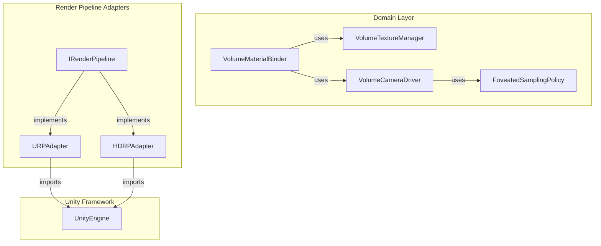
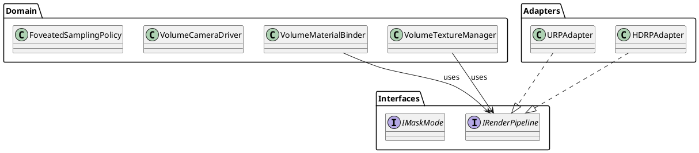

# Testing & Analysis Tools Guide
## iDaVIE Sub-team 3: Rendering Engine

**Date created:** 22 May 2026  
**Maintained by:** Quality Champion (Chris → Ciallian → Damien)

---

## Overview

This guide lists all analysis and testing tools required for the iDaVIE refactoring project, with setup and usage instructions.

| Tool | Type | Purpose | CK Metrics | Status |
|------|------|---------|-----------|--------|
| SonarQube Cloud | Cloud/CI | Code quality, smells, duplication, bugs | No | ✓ Required |
| Understand | Desktop/CLI | Comprehensive CK metrics suite | **YES** | ✓ Required |
| NDepend | Desktop/CLI | Architecture violations, dependency rules | Partial | ✓ Required |
| CodeScene | Cloud/Git | Hotspots, code churn, complexity trends | No | ✓ Required |
| DV8 | Cloud/CLI | Dependency Structure Matrix, DSM analysis | No | Optional |
| PlantUML / Mermaid | CLI/Web | Diagram generation (source-controlled) | No | ✓ Required |
| GitHub Actions | Cloud/CI | Automated testing on push/PR | No | ✓ Required |
| Unity Test Framework | In-editor | Unit tests for editor & play mode | No | ✓ Required |

---

## 1. SonarQube Cloud

### Purpose
Real-time code quality analysis: code smells, bugs, security hotspots, duplication detection.

### Access Type
**Cloud-based** (SaaS)

### Setup & Access
1. **Project already created for iDaVIE?**  
   Check: https://sonarcloud.io/projects — search for `idia-astro/iDaVIE`
   
2. **If not set up yet:**
   - Go to https://sonarcloud.io/
   - Sign in with GitHub account
   - Click **Analyze new project**
   - Select `idia-astro/iDaVIE` repository
   - Choose **Free plan** (SonarCloud free for public repos)
   - Authorize GitHub App installation

3. **GitHub Integration:**
   - SonarCloud will automatically scan on every push to `main` and on PRs
   - No additional setup needed once repository is linked

### How to Use

**Option A: Via GitHub (automatic)**
- Push code to GitHub
- SonarCloud scans automatically
- View results at https://sonarcloud.io/dashboard?id=idia-astro_iDaVIE

**Option B: Local analysis (manual)**
```bash
# Install SonarScanner CLI
brew install sonar-scanner    # macOS
choco install sonar-scanner   # Windows

# Scan your code
sonar-scanner \
  -Dsonar.projectKey=idia-astro_iDaVIE \
  -Dsonar.sources=Assets/Scripts \
  -Dsonar.login=YOUR_TOKEN
```

Get your token:
1. Log into SonarCloud
2. Account → Security → Generate token
3. Store as environment variable: `SONAR_TOKEN`

### Key Metrics to Report
- **Code smells:** Count
- **Bugs:** Count + severity distribution
- **Security hotspots:** Count + review status
- **Duplication:** % of codebase
- **Test coverage:** % (if tests are enabled)
- **Maintainability rating:** A–F

### Output Location
- **Dashboard:** https://sonarcloud.io/dashboard?id=idia-astro_iDaVIE
- **PR comments:** Automatic inline comments on GitHub PRs
- **Export:** Download report as PDF from dashboard

---

## 2. Understand (Science of Software)

### Purpose
**Comprehensive CK metrics suite** — the primary tool for measuring your refactoring success.

### Access Type
**Desktop application** + CLI

### Metrics It Provides (All Required)
- ✓ WMC (Weighted Methods per Class)
- ✓ DIT (Depth of Inheritance Tree)
- ✓ NOC (Number of Children)
- ✓ CBO (Coupling Between Objects)
- ✓ RFC (Response For a Class)
- ✓ LCOM (Lack of Cohesion in Methods)

### How to Get It

**Option A: Free trial (recommended for students)**
1. Go to https://www.scienceofsoft.net/understand/download
2. Request **academic license** (free for university students)
   - Provide .edu email: cathalging96@gmail.com
   - Proof of enrollment (UL student ID)
3. Download Understand for your platform (Windows/macOS/Linux)
4. Activate with provided license key

**Option B: Purchase (if trial unavailable)**
- Individual: ~$400/year
- Team: https://www.scienceofsoft.net/understand/pricing

### Installation
```bash
# Windows
Download .exe installer → double-click → follow wizard

# macOS
Download .dmg → drag Understand.app to Applications

# Linux
Download .tar.gz
tar xzf Understand-6.x-linux64.tar.gz
cd Understand-6.x
./Setup
```

### How to Use

**Step 1: Create project in Understand**
1. Launch Understand
2. File → New Project
3. Name: `iDaVIE-rendering`
4. Add source folder: Point to `Assets/Scripts/Rendering/` (or full `Assets/Scripts/`)
5. Choose language: **C# (Unity)**
6. Click **Create**

**Step 2: Analyze**
1. Project → Analyze (or press Ctrl+A)
2. Wait for scan to complete (~2–5 min depending on codebase size)

**Step 3: Generate CK metrics**

**Via GUI:**
1. Reports → Metrics
2. Select metric type:
   - `CK Metrics` → generates WMC, DIT, NOC, CBO, RFC, LCOM
   - Filter by class name (e.g., `VolumeDataSetRenderer*`)
3. Export → CSV or HTML

**Via CLI (for automation):**
```bash
# Generate CK metrics to CSV
und create -db iDaVIE-rendering.udb \
    -languages C# \
    -add Assets/Scripts/Rendering

und metrics -db iDaVIE-rendering.udb \
    -csv output.csv \
    -metrics CK

# View specific class
und metrics -db iDaVIE-rendering.udb \
    -filters "kind:class name:VolumeDataSetRenderer" \
    -csv renderer-metrics.csv
```

### Output Format

CSV output example:
```
File,Class,WMC,DIT,NOC,CBO,RFC,LCOM
VolumeDataSetRenderer.cs,VolumeDataSetRenderer,45,2,0,18,62,0.42
VolumeMaterialBinder.cs,VolumeMaterialBinder,12,1,0,8,24,0.15
```

**Targets for your refactoring:**
- WMC: ≤ 20 (domain), ≤ 40 (adapters)
- DIT: ≤ 4
- NOC: ≤ 5
- CBO: ≤ 14 (domain), ≤ 25 (orchestrators)
- RFC: ≤ 50
- LCOM: ≤ 0.5

### Capturing Snapshots
1. **Day 2 baseline** (19 May): Run metrics on current `VolumeDataSetRenderer`
2. **Day 13 projected** (3 June): Run metrics on refactored design (from examples)

Save both as CSV → include in `docs/metrics-worksheet.md`

---

## 3. NDepend

### Purpose
Architecture violation detection, dependency rules, SOLID/GRASP audits.

### Access Type
**Desktop application** + CLI

### How to Get It

**Option A: Free trial**
1. Go to https://www.ndepend.com/download
2. Download for your platform
3. 14-day free trial (no credit card)

**Option B: Student license**
- NDepend offers student licenses
- Check https://www.ndepend.com/purchase or email their sales team

**Option C: Open-source project**
- Contact NDepend directly (they may sponsor open-source projects)
- Email: support@ndepend.com

### Installation
```bash
# Windows
Download .msi installer → install via wizard

# macOS / Linux
Download .zip
unzip ndepend-*.zip
cd NDepend/
./NDepend (Linux/macOS)
```

### How to Use

**Step 1: Create NDepend analysis**
1. Launch NDepend
2. File → Analyze a .NET/Unity project
3. Select your Unity project folder or `.csproj` file
4. Choose assembly: `Assembly-CSharp.dll` (main game code)

**Step 2: Write custom rules**

Create `rules.xml` (or use NDepend's rule editor):
```xml
<!-- Check for circular dependencies -->
<Rule Name="No Circular Dependencies">
  <Body>
    Types.Where(t => t.NbDependenciesInLoop > 0)
    .Select(t => new { t.Name, Issues = t.DependenciesInLoop.Count() })
  </Body>
</Rule>

<!-- Check SOLID violations -->
<Rule Name="Single Responsibility Principle">
  <Body>
    Types.Where(t => t.Methods.Count() > 15 && t.FieldsAndPropertiesCount > 8)
    .Select(t => new { t.Name, Methods = t.Methods.Count(), Fields = t.FieldsAndPropertiesCount })
  </Body>
</Rule>

<!-- Check coupling between objects -->
<Rule Name="Low Coupling Between Objects">
  <Body>
    Types.Where(t => t.CBO > 14)
    .Select(t => new { t.Name, CBO = t.CBO })
  </Body>
</Rule>
```

**Step 3: Run analysis**
1. Analysis → Run current analysis (Ctrl+F5)
2. Review violations in **Queries & Rules** panel
3. Export report → HTML/PDF

### Output Format
HTML report includes:
- Architecture violations
- Dependency graph
- Rule violations with suggested fixes
- Metrics summary

### Integration with Your Project
Focus on these rules:
- ✓ No circular dependencies (Section 4.2 of brief)
- ✓ Domain code does NOT import `UnityEngine` (Section 4.2)
- ✓ All public APIs express interfaces (Section 4.2)
- ✓ No SOLID/GRASP violations (Section 4.2)

---

## 4. CodeScene

### Purpose
Identify code hotspots, measure churn, detect complexity trends, find risky areas.

### Access Type
**Cloud-based** (SaaS)

### How to Get It

**Free tier for open-source:**
1. Go to https://codescene.com
2. Sign up with GitHub
3. Authorize access to `idia-astro/iDaVIE`
4. CodeScene automatically indexes your repo

### How to Use

**Automatic:**
- CodeScene scans your GitHub repo on every push
- Dashboard at: https://codescene.com/ (your account → iDaVIE project)

**Manual analysis:**
```bash
# Clone the CodeScene CLI
npm install -g @codescene/cli

# Analyze your local repo
codescene analyze --repo . \
    --user your-codescene-username \
    --api-key YOUR_API_KEY
```

Get API key from CodeScene dashboard → Settings → API tokens

### Key Metrics
- **Hotspots:** Most-changed and complex files
- **Churn:** How often files change (high churn = risky)
- **Complexity trend:** Is complexity increasing or decreasing?
- **Code age:** When was code last touched?

### Output Location
- Dashboard: https://codescene.com/dashboard
- Focus on the rendering layer files:
  - `VolumeDataSetRenderer.cs` (should see high churn → target for refactoring)
  - New `VolumeMaterialBinder.cs`, `VolumeTextureManager.cs`, etc. (should see lower complexity post-refactoring)

---

## 5. DV8 (Dependency Structure Matrix)

### Purpose
Visualize and analyze dependency structure, detect hidden dependencies and cycles.

### Access Type
**Cloud-based** (SaaS) + CLI

### How to Get It

1. Go to https://dv8.io
2. Sign up (free plan available)
3. Link your GitHub repository

### How to Use

**Via web dashboard:**
1. Log in to https://dv8.io
2. Select project `idia-astro/iDaVIE`
3. Generate Dependency Structure Matrix (DSM)
4. View:
   - **Dependency graph** (visual)
   - **DSM heatmap** (matrix view)
   - **Cyclic dependencies** (if any)

**Via CLI (for automation):**
```bash
# Install DV8
npm install -g @dv8/cli

# Generate DSM
dv8 analyze --input ./Assets/Scripts/Rendering \
    --language csharp \
    --output dsm-report.json
```

### What to Look For
- ✓ No cycles in dependency graph
- ✓ Clear layering: `Domain → Adapters → Framework`
- ✓ `VolumeMaterialBinder` should not import `VolumeTextureManager` (and vice versa)

---

## 6. PlantUML / Mermaid

### Purpose
Generate architecture diagrams from source code (diagrams-as-code).

### Tools Needed (Choose One or Both)

### Option A: Mermaid (Recommended — simpler)

**Installation:**
```bash
# Via npm (Node.js required)
npm install -g @mermaid-js/mermaid-cli

# Or Docker
docker pull mermaid/mermaid-cli
```

**Create diagrams:**

File: `diagrams/architecture.mermaid`


**Generate PNG/SVG:**
```bash
mmdc -i diagrams/architecture.mermaid -o diagrams/architecture.png
```

### Option B: PlantUML

**Installation:**
```bash
# Via brew (macOS)
brew install plantuml

# Via apt (Linux)
sudo apt-get install plantuml

# Via chocolatey (Windows)
choco install plantuml
```

**Create diagrams:**

File: `diagrams/class-after.puml`


**Generate image:**
```bash
plantuml diagrams/class-after.puml
# Output: diagrams/class-after.png
```

### Store Diagrams in Git
```bash
# NEVER store .png/.svg in git (they're binary)
# Always store source: .mermaid or .puml
# Generate images locally only

git add diagrams/*.mermaid diagrams/*.puml
git add -A
git commit -m "Update architecture diagrams"
```

---

## 7. GitHub Actions (CI/CD)

### Purpose
Automate testing, code analysis, and quality checks on every push and PR.

### How to Set Up

**File: `.github/workflows/analysis.yml`**

```yaml
name: Code Analysis

on:
  push:
    branches: [main, develop]
    paths: ['Assets/Scripts/Rendering/**']
  pull_request:
    branches: [main]

jobs:
  sonarcloud:
    runs-on: ubuntu-latest
    steps:
      - uses: actions/checkout@v3
        with:
          fetch-depth: 0  # Shallow clones not supported by SonarCloud
      
      - name: SonarCloud Scan
        uses: SonarSource/sonarcloud-github-action@master
        env:
          GITHUB_TOKEN: ${{ secrets.GITHUB_TOKEN }}
          SONAR_TOKEN: ${{ secrets.SONAR_TOKEN }}
      
      - name: Check SonarCloud quality gate
        if: failure()
        run: echo "Quality gate failed!" && exit 1

  code-quality:
    runs-on: ubuntu-latest
    steps:
      - uses: actions/checkout@v3
      
      - name: Set up .NET
        uses: actions/setup-dotnet@v3
        with:
          dotnet-version: 6.0
      
      - name: Restore dependencies
        run: dotnet restore
      
      - name: Build
        run: dotnet build --no-restore
```

**Setup:**
1. Create `.github/workflows/analysis.yml` in your repo
2. Add secrets:
   - Go to GitHub → Settings → Secrets and variables → Actions
   - Add `SONAR_TOKEN` (from SonarCloud)
3. Commit and push — workflow runs automatically

### Running Locally Before Push

```bash
# Simulate GitHub Actions locally
# Install act: https://github.com/nektos/act

act push --job sonarcloud
```

---

## 8. Unity Test Framework

### Purpose
Unit tests for rendering logic (edit-mode and play-mode tests).

### Installation

1. **In Unity:**
   - Window → TextMesh Pro → Import TMP Essential Resources
   - Window → Test Framework → Create Test Assembly Folder
   
   Or add via Package Manager:
   - Window → Package Manager
   - Add by name: `com.unity.test-framework`

2. **Create test folder:**
   ```
   Assets/Tests/
   ├── Editor/
   │   ├── VolumeTextureManagerTests.cs
   │   ├── VolumeMaterialBinderTests.cs
   │   └── VolumeCameraDriverTests.cs
   └── Runtime/
       ├── FoveatedSamplingPolicyTests.cs
       └── MaskModeTests.cs
   ```

### Writing Tests

**Example: `Assets/Tests/Editor/VolumeMaterialBinderTests.cs`**
```csharp
using NUnit.Framework;
using UnityEngine;
using YourNamespace.Rendering;

public class VolumeMaterialBinderTests
{
    private VolumeMaterialBinder _binder;
    
    [SetUp]
    public void Setup()
    {
        _binder = new VolumeMaterialBinder();
    }
    
    [Test]
    public void SetMaterialProperties_WithValidShader_BindsSuccessfully()
    {
        // Arrange
        var material = new Material(Shader.Find("YourShader"));
        
        // Act
        _binder.BindMaterial(material);
        
        // Assert
        Assert.IsNotNull(_binder.BoundMaterial);
    }
    
    [Test]
    public void ApplyClipPlane_OutsideRange_ThrowsException()
    {
        // Arrange
        var invalidPlane = new Vector4(-100, 0, 0, 1);
        
        // Act & Assert
        Assert.Throws<System.ArgumentException>(() =>
            _binder.ApplyClipPlane(invalidPlane)
        );
    }
}
```

### Running Tests

**In Unity:**
1. Window → Test Framework (or General → Test Runner)
2. Select test file
3. Click **Run** (run single) or **Run All**

**Via command line:**
```bash
# Edit mode tests
/Applications/Unity/Hub/Editors/2023.2.0/Unity.app/Contents/MacOS/Unity \
    -runTests \
    -testCategory "Editor" \
    -logFile - \
    -projectPath .

# Play mode tests
/Applications/Unity/Hub/Editors/2023.2.0/Unity.app/Contents/MacOS/Unity \
    -runTests \
    -testCategory "Runtime" \
    -logFile - \
    -projectPath .
```

---

## Quick Reference: Running All Tools

### Day 2 (Baseline Capture)
```bash
# 1. Understand CK metrics (baseline)
understand --create-db rendering-baseline.udb Assets/Scripts/Rendering
understand metrics -db rendering-baseline.udb -csv metrics-baseline.csv

# 2. SonarQube scan
sonar-scanner -Dsonar.projectKey=idia-astro_iDaVIE -Dsonar.sources=Assets/Scripts

# 3. CodeScene analysis
codescene analyze --repo .

# 4. NDepend check
ndepend.exe --VisualStudioProject-CSharp Assets/Scripts/Assembly-CSharp.csproj
```

### Day 13 (Projected Results)
```bash
# 1. Understand CK metrics (projected)
understand metrics -db rendering-projected.udb -csv metrics-projected.csv

# 2. Compare (automated in spreadsheet)
# metrics-baseline.csv vs metrics-projected.csv

# 3. Generate diagrams
mmdc -i diagrams/*.mermaid -o diagrams/

# 4. Final quality gate
sonar-scanner --run-final-check
```

---

## Troubleshooting

| Problem | Solution |
|---------|----------|
| Understand won't open project | Ensure C# language is selected; check `.csproj` file exists |
| SonarCloud showing "0% coverage" | Coverage requires tests; add Unity Test Framework tests |
| NDepend can't find assemblies | Point directly to `Library/ScriptAssemblies/Assembly-CSharp.dll` |
| Mermaid diagrams won't render | Update CLI: `npm install -g @mermaid-js/mermaid-cli@latest` |
| GitHub Actions times out | Increase timeout: `timeout-minutes: 30` in workflow |

---

## Deliverable Checklist

Before finalising on **Thu 4 June**:
- [ ] Day 2 baseline CK metrics captured (`metrics-baseline.csv`)
- [ ] Day 13 projected metrics captured (`metrics-projected.csv`)
- [ ] Metrics worksheet populated (`docs/metrics-worksheet.md`)
- [ ] Architecture diagrams generated (`.mermaid` or `.puml` files in git)
- [ ] SonarQube dashboard showing quality trend
- [ ] CodeScene hotspots report attached to design document
- [ ] NDepend rule violations report (zero critical violations)
- [ ] GitHub Actions passing on `main` branch
- [ ] All tests passing (Unity Test Framework)

---

## References

- SonarQube Cloud: https://sonarcloud.io
- Understand CK Metrics: https://www.scienceofsoft.net/understand
- NDepend: https://www.ndepend.com
- CodeScene: https://codescene.com
- DV8: https://dv8.io
- Mermaid: https://mermaid.js.org
- PlantUML: https://plantuml.com
- Unity Test Framework: https://docs.unity3d.com/Packages/com.unity.test-framework@latest
