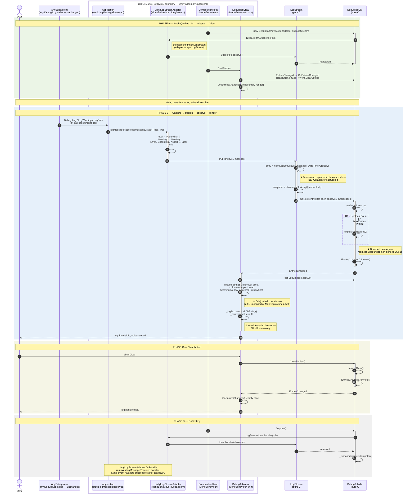

# Debug tab — AFTER sequence diagram (Mermaid)

Mermaid rendering of [`after-trace.md`](after-trace.md). Pair side-by-side with the BEFORE diagram (`uml-diagrams/before-debug-sequence-diagram.puml`) on the panel slide: every BEFORE `→ HandleLog → Queue.Enqueue → StreamWriter → StringBuilder → TMP_InputField` chain collapses into the single `LogStream.Publish → ILogObserver.OnNext` dispatch here.

The ACL boundary is drawn as a `box` around the Unity-side adapters. The `DebugTabVM` and `LogStream` lifelines never send a message into the box without going through an interface.

A higher-level PlantUML version (architectural overview, no line citations) lives at [`docs/sub-team-6/uml-diagrams/after-debug-sequence-diagram.puml`](../../../docs/sub-team-6/uml-diagrams/after-debug-sequence-diagram.puml). This Mermaid version is the code-anchored one.

---

## Side-by-side reading guide

Suggested slide layout for the panel:

| BEFORE callout | AFTER replacement |
|---|---|
| `Application.logMessageReceived += DebugLogging.HandleLog` (static-event subscription untestable) | One subscription confined to `UnityLogStreamAdapter.OnEnable` (`adapters/UnityLogStreamAdapter.cs:28-29`). The VM subscribes to `ILogStream`, not the static event. |
| `(string, string, LogType)` unstructured tuple | `LogEntry(Level, Message, Timestamp)` immutable record (`skeleton/ILogStream.cs:31`). |
| Non-generic `Queue` storing `object`, unbounded | Generic `List<LogEntry>` capped at 2000 entries (`skeleton/DebugTabViewModel.cs:22, 49-50`). |
| `StreamWriter` opened + closed per message | No file I/O on the hot path. Autosave reintroduced as a separate `ILogObserver` if needed. |
| `StringBuilder` rebuild over entire log history | Rebuild capped at 500-line slice (`adapters/DebugTabView.cs:35, 62-82`) — contained, not eliminated. |
| `transform.Find` / Inspector-wired button handlers | Code-side `clearButton.onClick.AddListener(vm.ClearEntries)` in `BindTo` (`adapters/DebugTabView.cs:47`). |
| Four responsibilities in one 172-line `MonoBehaviour` | Five named types, single responsibility each: `LogStreamAdapter` · `LogStream` · `DebugTabVM` · `DebugTabView` · `CompositionRoot`. |
| Timestamp never captured | Captured at the moment of `Publish` (`skeleton/LogStream.cs:36`). |
| Scroll forced to bottom every message | **Unchanged** — still in `DebugTabView` (`⚠` annotation in diagram). S7 is the largest remaining smell; see [`after-trace.md` → Known limitations](after-trace.md#known-limitations). |

---

## Mapping of contained smells (honest about what remains)

The two `⚠` annotations in the diagram correspond to items in [`after-trace.md` → Known limitations](after-trace.md#known-limitations):

| Diagram marker | Smell ID | Location | Fix vector |
|---|---|---|---|
| `⚠ O(N) rebuild remains — capped` | S5/S6 | `adapters/DebugTabView.cs:62-82` | Replace TMP text rebuild with a virtualised `ListView` (Unity UI Toolkit). The VM's `LogEntries` contract is unchanged. |
| `⚠ scroll forced to bottom` | S7 | `adapters/DebugTabView.cs:83` | Add `AutoScrollEnabled` (bool) to `IDebugTabViewModel`; gate the `_scrollbar.value = 0f` line on it. Adds one test. |

Both fixes are pure View/VM-side edits and require no change to `LogStream`, `UnityLogStreamAdapter`, or any of the 29 existing debug-tab tests.

---

## What the diagram does *not* show (deliberately)

- **Direct `ILogStream.Publish(...)` callers.** The skeleton interface exposes a structured-publish path (`ILogStream.cs:13`) for new callers, but no production code uses it today — the 44 catalogued sites still go through `Debug.Log → Application.logMessageReceived → UnityLogStreamAdapter`. The diagram only draws the active path. See [`after-trace.md` → Open question: source field](after-trace.md#open-question-source-field).
- **The `source` field.** [`log-origin-trace.md`](log-origin-trace.md) argues for `Publish(LogLevel, string source, string message)`. The implemented contract is `Publish(LogLevel, string)` only; the diagram reflects the code, not the aspirational design.
- **Autosave / file export.** Not in the WE2 scope. Sketched as an `ILogObserver` follow-up in [`after-trace.md` → Open question: Save/autosave](after-trace.md#open-question-saveautosave).
