# Debug tab — class diagram (BEFORE vs. AFTER)

Mermaid `classDiagram` of the Debug-tab slice, before and after. The two diagrams are kept in this single file so the panel can flip between them without losing visual register.

For numeric metric deltas (WMC, CBO, RFC, DIT, NOC, LCOM) see [`ck-metrics.md`](ck-metrics.md). For the module-level view (assemblies and packages) see [`dependency-graph.md`](dependency-graph.md). For the runtime call sequence see [`after-trace.md`](after-trace.md) and [`after-sequence.md`](after-sequence.md).

---

## BEFORE — single-class Debug tab with global static hook

`DebugLogging` collapses four concerns (capture · store · display · export) into one `MonoBehaviour` and subscribes directly to Unity's process-global `Application.logMessageReceived` event. There is no interface, no abstraction, and no seam at which a test double could substitute the log source.

```mermaid
classDiagram
    direction LR

    class DebugLogging {
        +MonoBehaviour
        -Queue debugLogQueue
        -string autosavePath
        -string directoryPath
        -Button saveButton
        -TMP_InputField logOutput
        -Scrollbar debugScrollbar
        -int maxLogs
        +Start() void
        +OnEnable() void
        +OnDisable() void
        +DetermineHardware() void
        +HandleLog(string, string, LogType) void
        +saveToFileClick() void
        +SaveToFile(string) void
        +AutoSave(string) void
    }

    class Application {
        <<static, UnityEngine>>
        +event logMessageReceived(string,string,LogType)
        +string version
        +string dataPath
    }

    class UnityEngine_Debug {
        <<static>>
        +Log(string) void
        +LogWarning(string) void
        +LogError(string) void
    }

    class CanvassDesktop_Caller {
        <<MonoBehaviour, 40 call sites>>
        +Debug.Log / LogWarning / LogError
    }

    class DataAnalysis_Caller {
        <<static plugin wrapper, 4 call sites>>
        +Debug.Log on P/Invoke error
    }

    class TMP_InputField {
        <<UnityEngine.UI>>
        +string text
    }

    class Scrollbar {
        <<UnityEngine.UI>>
        +float value
    }

    class Button {
        <<UnityEngine.UI>>
        +onClick.AddListener(...) void
    }

    class StandaloneFileBrowser {
        <<static>>
        +SaveFilePanelAsync(...) void
    }

    class PlayerPrefs {
        <<static>>
        +GetString(string) string
        +SetString(string,string) void
    }

    class StreamWriter {
        <<System.IO>>
        +Write(string) void
        +Close() void
    }

    class StringBuilder {
        <<System.Text>>
        +Append(string) StringBuilder
        +ToString() string
    }

    class Config {
        <<singleton>>
        +int numberOfLogsToKeep
    }

    CanvassDesktop_Caller --> UnityEngine_Debug : Debug.Log* (×40)
    DataAnalysis_Caller  --> UnityEngine_Debug : Debug.Log* (×4)
    UnityEngine_Debug    --> Application       : fires logMessageReceived
    Application          --> DebugLogging      : HandleLog(s,s,type)<br/>★ static event subscription

    DebugLogging --> Queue            : Enqueue (non-generic, unbounded)
    DebugLogging --> StringBuilder    : O(N) full rebuild per message
    DebugLogging --> StreamWriter     : new/Write/Close per message
    DebugLogging --> TMP_InputField   : text = entire history
    DebugLogging --> Scrollbar        : value = 1f every message
    DebugLogging --> Button           : onClick.AddListener
    DebugLogging --> StandaloneFileBrowser : SaveFilePanelAsync
    DebugLogging --> PlayerPrefs      : LastDebugPath
    DebugLogging --> Config           : numberOfLogsToKeep

    note for DebugLogging "255 LOC · 9 methods · MonoBehaviour\nMixes: log capture (HandleLog), log storage (Queue + autosave),\nlog display (TMP rebuild), manual export (saveToFileClick).\nFour concerns — single class — no seam for substitution."

    note for Application "★ Static global event.\nAny Debug.Log anywhere in the process fires this.\nNo interface, no test double possible."

    note for UnityEngine_Debug "★ 44 call sites in CanvassDesktop + DataAnalysis.\nUnstructured (string, string, LogType) — no source,\nno timestamp, no level enum preservation downstream."
```

### Smell visibility in this diagram

- **The `Application → DebugLogging` arrow is the canonical untestable hook** — a static event whose subscriber list cannot be intercepted from outside the class. (Smell S1 in [`before-trace.md`](before-trace.md).)
- **Eight outgoing arrows from `DebugLogging`** (`Queue`, `StringBuilder`, `StreamWriter`, `TMP_InputField`, `Scrollbar`, `Button`, `StandaloneFileBrowser`, `PlayerPrefs`, `Config`) — the class is a hub for nine collaborators with no separation between log-handling, UI state, file I/O, and persistence. (Smell S8.)
- **44 incoming `Debug.Log*` arrows** (drawn as two aggregated callers above) — the smell is contained to the call sites, but the global static singleton is the only seam they share. (Smell S9.)
- **No interface between the producer side and the consumer side** — `DebugLogging` is both the subscriber and the renderer. (Smells S2, S6, S8.)

---

## AFTER — Observer pattern with ACL boundary

Three packages: **Domain** (pure C#, no `UnityEngine`), **Adapters** (Unity assembly), and **Unity-side subsystems** (existing `Debug.Log*` callers — out of scope for WE2). The boundary between Domain and Adapters is the ACL.

```mermaid
classDiagram
    direction LR

    %% ═══ DOMAIN (pure C#, no UnityEngine) ════════════════════════════
    namespace Domain {
        class IDebugTabViewModel {
            <<interface>>
            +IReadOnlyList~LogEntry~ LogEntries
            +AppendEntry(LogEntry) void
            +ClearEntries() void
            +event EntriesChanged
        }

        class DebugTabViewModel {
            -List~LogEntry~ _entries
            -ILogStream _logStream
            -bool _disposed
            -int MaxEntries = 2000
            +DebugTabViewModel(ILogStream)
            +LogEntries IReadOnlyList~LogEntry~
            +AppendEntry(LogEntry) void
            +ClearEntries() void
            +OnNext(LogEntry) void
            +Dispose() void
            +event EntriesChanged
        }

        class ILogStream {
            <<interface>>
            +Publish(LogLevel, string) void
            +Subscribe(ILogObserver) void
            +Unsubscribe(ILogObserver) void
        }

        class ILogObserver {
            <<interface>>
            +OnNext(LogEntry) void
        }

        class LogStream {
            -List~ILogObserver~ _observers
            -object _lock
            +Publish(LogLevel, string) void
            +Subscribe(ILogObserver) void
            +Unsubscribe(ILogObserver) void
        }

        class LogEntry {
            <<record, DTO>>
            +LogLevel Level
            +string Message
            +DateTime Timestamp
        }

        class LogLevel {
            <<enum>>
            Info
            Warning
            Error
        }
    }

    %% ═══ ADAPTERS (Unity assembly) ═══════════════════════════════════
    namespace Adapters {
        class UnityLogStreamAdapter {
            <<MonoBehaviour>>
            -LogStream _inner
            +OnEnable() void
            +OnDisable() void
            +OnUnityLog(string,string,LogType) void
            +Publish(LogLevel,string) void
            +Subscribe(ILogObserver) void
            +Unsubscribe(ILogObserver) void
        }

        class DebugTabView {
            <<MonoBehaviour>>
            -TMP_Text _logText
            -Scrollbar _scrollbar
            -Button _clearButton
            -IDebugTabViewModel? _vm
            -int MaxDisplayLines = 500
            +BindTo(IDebugTabViewModel) void
            +OnDestroy() void
            -OnEntriesChanged() void
        }

        class DebugTabCompositionRoot {
            <<MonoBehaviour>>
            -DebugTabView _view
            -UnityLogStreamAdapter _logStreamAdapter
            -DebugTabViewModel? _vm
            +Awake() void
            +OnDestroy() void
        }
    }

    %% Domain relations
    IDebugTabViewModel <|.. DebugTabViewModel : implements
    ILogObserver <|.. DebugTabViewModel       : implements (OnNext)
    ILogStream <|.. LogStream                  : implements
    DebugTabViewModel --> ILogStream           : Subscribe / Unsubscribe
    DebugTabViewModel --> LogEntry             : holds list
    LogStream --> ILogObserver                 : dispatch
    LogStream ..> LogEntry                     : creates (with DateTime.UtcNow)
    LogEntry --> LogLevel

    %% ACL boundary — adapter implements domain interface
    ILogStream <|.. UnityLogStreamAdapter     : implements (ACL)
    UnityLogStreamAdapter o-- LogStream        : inner (composition)

    %% Composition root wires everything once
    DebugTabCompositionRoot --> DebugTabViewModel    : new + Dispose
    DebugTabCompositionRoot --> UnityLogStreamAdapter : [SerializeField]
    DebugTabCompositionRoot --> DebugTabView          : [SerializeField]
    DebugTabView --> IDebugTabViewModel               : binds via interface

    note for DebugTabViewModel "77 LOC · 6 methods · pure C#\nIDisposable — unsubscribes from ILogStream in Dispose.\nList capped at MaxEntries (2000); replaces unbounded non-generic Queue.\nNo using UnityEngine.\nFully unit-testable: 29 NUnit tests in tests/DebugTabTests.cs."

    note for LogStream "43 LOC · thread-safe.\nObserver list under lock; iteration over array snapshot\nso a subscriber can Unsubscribe inside its own OnNext\nwithout corrupting the dispatch loop."

    note for UnityLogStreamAdapter "53 LOC · MonoBehaviour : ILogStream.\nThe ONLY class that touches Application.logMessageReceived.\nLogType → LogLevel normalisation lives here.\nThe 44 existing Debug.Log* call sites are captured\nautomatically — none of them need to change."

    note for DebugTabView "86 LOC · MonoBehaviour, thin.\nTMP rebuild capped at MaxDisplayLines (500) — S5/S6 contained.\nScrollbar.value = 0f every refresh — S7 remaining.\nSee after-trace.md → Known limitations."
```

### Smell visibility in the AFTER diagram

- **Vertical separation:** every line crossing the Domain/Adapters package boundary points *from* an adapter *to* an interface — never the reverse. The ViewModel does not name any adapter class.
- **Two-interface seam between producer and consumer:** `ILogStream` (producer-side) and `ILogObserver` (consumer-side) are independent contracts. New observers (autosave, telemetry, level-filter) can attach without touching the producer; new producers can publish without knowing who is subscribed.
- **`LogEntry` is a leaf DTO:** immutable `record(Level, Message, Timestamp)` with no behaviour. It crosses the boundary; behaviour does not. (Note: `Source` is **not** on the record — see [`after-trace.md` → Open question: source field](after-trace.md#open-question-source-field).)
- **Composition root is the only multi-package class:** `DebugTabCompositionRoot` is the single place that references both the domain (`DebugTabViewModel`, `ILogStream`) and the adapters. Pure-DI / Composition-Root pattern.
- **One subscription, one disposal:** `DebugTabViewModel`'s ctor calls `Subscribe`; its `Dispose` calls `Unsubscribe`. The CompositionRoot calls `Dispose` in `OnDestroy`. Symmetric lifetime — no dead-observer leaks across scene reload.

---

## Key numeric changes (preview — full table in `ck-metrics.md`)

| Class | LOC (BEFORE) | LOC (AFTER) | Methods | Direct collaborators (CBO contribution from debug-tab slice) |
|---|---:|---:|---:|---:|
| `DebugLogging` | **255** | n/a (deleted) | 9 | **9** (`Queue`, `StringBuilder`, `StreamWriter`, `TMP_InputField`, `Scrollbar`, `Button`, `StandaloneFileBrowser`, `PlayerPrefs`, `Config`) |
| `DebugTabViewModel` | — | 77 | 6 | **1** (`ILogStream`) |
| `LogStream` | — | 43 | 3 | **1** (`ILogObserver`) |
| `IDebugTabViewModel` | — | 32 | — | interface, no impl |
| `ILogStream` | — | 32 | — | interface, no impl |
| `ILogObserver` | — | 16 | — | interface, no impl |
| `UnityLogStreamAdapter` | — | 53 | 5 | **2** (`Application`, `LogStream`) |
| `DebugTabView` | — | 86 | 3 | **3** (`TMP_Text`, `Scrollbar`, `Button`) |
| `DebugTabCompositionRoot` | — | 43 | 2 | **3** (`DebugTabView`, `UnityLogStreamAdapter`, `DebugTabViewModel`) |

Single 255-line `MonoBehaviour` → seven small focused types (three interfaces, four concrete classes, one DTO record, one enum). The **domain layer** (`DebugTabViewModel` + `LogStream` + DTOs) is reachable from a unit-test runner without Unity present (**29 NUnit tests** in `tests/DebugTabTests.cs`, all passing in ~20 ms).

CBO for the domain ViewModel falls from 9 collaborators to 1 (only `ILogStream`). The 44 existing `Debug.Log*` call sites are not modified — they are captured automatically by `UnityLogStreamAdapter.OnUnityLog`.
