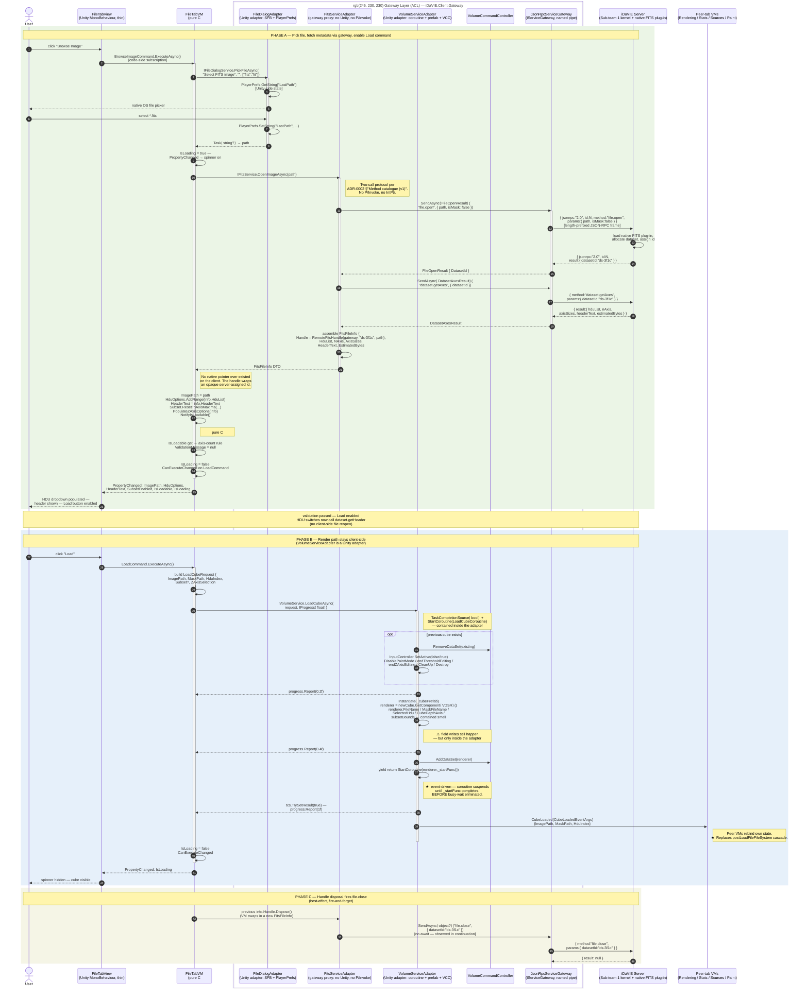

# File tab — AFTER sequence diagram (Mermaid)

## TL;DR

Mermaid rendering of `after-trace.md`, updated for the gateway rewire (ADR-009 / ADR-0002). Phase A's FITS reads no longer cross the Unity ↔ native boundary client-side — `FitsServiceAdapter` is now a **gateway proxy** that dispatches `file.open` and `dataset.getAxes` over JSON-RPC to the server kernel. No `IntPtr` ever exists on the client. The opaque `IFitsHandle` wraps a server-assigned `datasetId`; `Dispose()` fires a best-effort `file.close`. Phase B (cube load) is unchanged — the volume renderer is genuinely client-local and `VolumeServiceAdapter` remains a Unity adapter. The busy-wait elimination (S6) and the contained field-write smell (S5) carry over from the prior version.

---

Mermaid rendering of [`after-trace.md`](after-trace.md). Pair side-by-side with [`before-sequence.md`](before-sequence.md) on the panel slide: every BEFORE `CD → FR → DLL` arrow is replaced by an `IFitsService` call that **the adapter now forwards through `IServiceGateway` to the server**.

The diagram has two grouped lifelines: the **Gateway Layer (ACL)** on the client side (`iDaVIE.Client.Gateway` per D3 §2.1), and the **server-side kernel** beyond the named pipe.

---

## Side-by-side reading guide

Suggested slide layout for the panel:

| BEFORE callout | AFTER replacement |
|---|---|
| `CD → FR → DLL` triangle on every FITS read | `VM → Fits → Gw → Server` — adapter dispatches `file.open` + `dataset.getAxes`; server runs the native plug-in |
| Native `IntPtr` held by `CanvassDesktop` field across coroutines | Opaque `IFitsHandle` wrapping a server-assigned `datasetId` — no native pointer on the client |
| `ChangeHduSelection` (line 1435) reopens the file on every dropdown change | Single durable handle; HDU switches issue `dataset.getHeader` against the same `datasetId` |
| `CD → VCC` direct singleton calls | `VM → Vol → VCC` — VCC reached only via adapter (Phase B unchanged from prior diagram) |
| `transform.Find` self-message | `PropertyChanged` event — no self-mutation visible |
| Two `activate` bars on `CanvassDesktop` (callback + coroutine) | `activate` bar on `VM` for the command, separate `activate` on `Vol` for the coroutine, separate `activate` on `Gw` for the round-trip — lifelines split |
| `★` smell annotations on the arrows themselves | One `⚠` annotation on `Note right of Vol` (S5 field writes — contained); BEFORE busy-wait replaced by coroutine suspension (S6 eliminated); BEFORE FITS P/Invoke eliminated (server-owned) |
| `postLoadFileFileSystem` 13-step self-cascade into other tabs | One `Vol → Peers: CubeLoaded(DTO)` arrow — peer tabs subscribe themselves |

## Mapping of contained smells (honest about what remains)

After the gateway rewire (ADR-009 / ADR-0002), several smells previously *contained* inside `FitsServiceAdapter` are now **eliminated** — they are server-side concerns, not client-side ACL ones.

| Smell ID | Status now | Where it lives |
|---|---|---|
| **S5** field writes onto `VolumeDataSetRenderer` (`renderer.FileName = ...`) | ⚠ contained inside `VolumeServiceAdapter.cs` | Phase B, `Note right of Vol`. Fix vector: when Sub-team 3 introduces `IRendererCommand`, swap field writes for a command emit. ViewModel and 34 unit tests do not change. |
| **S6** busy-wait on `renderer.started` flag | ✓ eliminated | Replaced by `yield return StartCoroutine(renderer._startFunc())` coroutine suspension. |
| **FITS P/Invoke leakage** (BEFORE `FitsOpenFile` / `FitsGetHduCount` / `FitsMovabsHdu` etc. on the client) | ✓ eliminated client-side | Server-side native plug-in (Sub-team 1 kernel). Client speaks only JSON-RPC. |
| **Native `IntPtr` lifetime** (BEFORE coroutine vs. callback ordering bugs) | ✓ eliminated | Server owns the dataset; the client carries an opaque string id and `file.close` for cleanup. |
| **`ChangeHduSelection` file-reopen-per-switch** (BEFORE line 1435) | ✓ eliminated | `dataset.getHeader(datasetId, hduIndex)` is a single server call; no client-side reopen. |

The S5 fix is a pure adapter-side edit — none of the 34 file-tab ViewModel unit tests need to change. The eliminated smells have direct test coverage in `refactoring-examples/sub-team-6/file-tab/adapters/tests/FitsServiceAdapterTests.cs` (gateway-routed assertions) and `refactoring-examples/sub-team-6/contracts/tests/` (wire framing).
