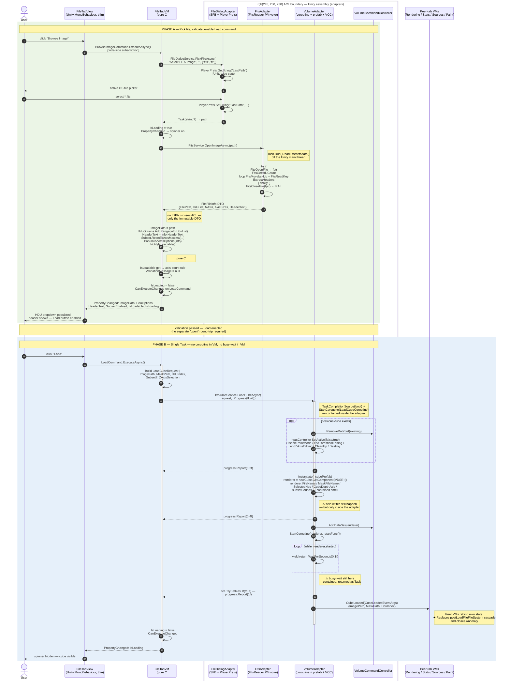

# File tab — AFTER sequence diagram (Mermaid)

## TL;DR

Mermaid rendering of `after-trace.md`. ACL boundary drawn as a `box` around the Unity-side adapters (`FileDialogAdapter`, `FitsAdapter`, `VolumeAdapter`, `VCC`) — the `FileTabVM` lifeline never enters that box without crossing an interface. Every BEFORE `→ DLL` and `→ VCC` arrow collapses into a single `→ interface` message. `activate` bars split cleanly: VM during command execution, Vol during the load coroutine. Two `⚠` annotations mark the contained smells (field writes, busy-wait) — honestly drawn rather than hidden. Final `Vol → Peers: CubeLoaded(DTO)` arrow replaces the 13-step `postLoadFileFileSystem` cross-tab cascade.

---

Mermaid rendering of [`after-trace.md`](after-trace.md). Pair side-by-side with [`before-sequence.md`](before-sequence.md) on the panel slide: every `→ DLL` and `→ VCC` arrow in the BEFORE is replaced by a single `→ interface` message here.

The ACL boundary is drawn as a `box` around the Unity-side adapters. The `FileTabVM` lifeline never sends a message into the box without going through one of the three domain interfaces.

---

## Side-by-side reading guide

Suggested slide layout for the panel:

| BEFORE callout | AFTER replacement |
|---|---|
| `CD → FR → DLL` triangle on every read | One `VM → Fits` arrow returning a DTO |
| `CD → VCC` direct singleton calls | `VM → Vol → VCC` — VCC reached only via adapter |
| `transform.Find` self-message | `PropertyChanged` event — no self-mutation visible |
| Two `activate` bars on `CanvassDesktop` (callback + coroutine) | `activate` bar on `VM` for the *command*, separate `activate` on `Vol` for the *coroutine* — lifelines split |
| `★` smell annotations on the arrows themselves | `⚠` annotations on `Note right of Vol` — smells acknowledged, contained, not eliminated |
| Phase A→B separator: "must click a second button" | Phase A→B separator: "Load enabled — single click possible" |
| `postLoadFileFileSystem` 13-step self-cascade into other tabs | One `Vol → Peers: CubeLoaded(DTO)` arrow — peer tabs subscribe themselves |

## Mapping of contained smells (honest about what remains)

The two `⚠` annotations in the diagram correspond to items in `after-trace.md` → *Known limitations*:

| Diagram marker | Smell ID | Adapter location | Fix vector |
|---|---|---|---|
| `⚠ field writes still happen` | S5 | `VolumeServiceAdapter.cs:115-124` | When Sub-team 3 introduces `IRendererCommand`, swap the field writes for a command emit. The `FileTabViewModel` does not change. |
| `⚠ busy-wait still here` | S6 | `VolumeServiceAdapter.cs:147-148` | When `VolumeDataSetRenderer` exposes a readiness `event` or `Task`, the loop becomes `await renderer.WhenStarted()`. The VM's `await _volumeService.LoadCubeAsync(...)` is unchanged. |

Both fixes are pure adapter-side edits — none of the 27 file-tab unit tests need to change.
