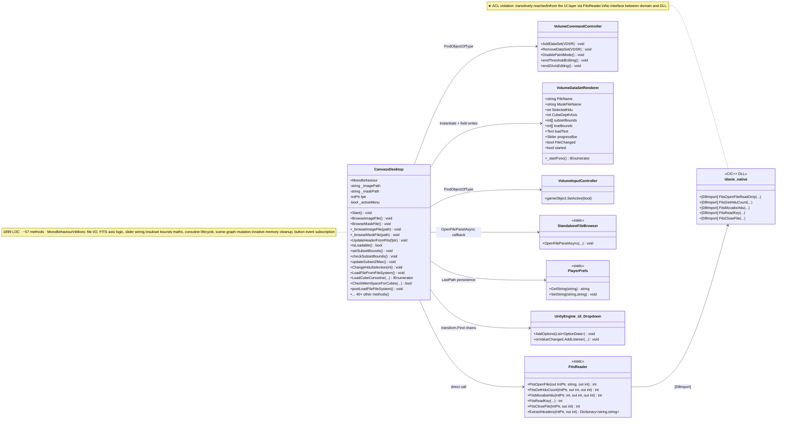

# File tab — class diagram (BEFORE vs. AFTER)

## TL;DR

Two side-by-side Mermaid `classDiagram` blocks. **BEFORE** = single `CanvassDesktop` god-class with 8 outgoing arrows (one per Unity / native subsystem) and zero interfaces — every dependency direct. **AFTER** = two `namespace` packages: `Domain` (pure C#, interfaces + `FileTabViewModel` + `SubsetBoundsViewModel` + DTOs + commands) and `Adapters` (Unity-side concrete `FileTabView`, `FitsServiceAdapter`, `FileDialogServiceAdapter`, `VolumeServiceAdapter`, `MemoryProbeAdapter`, `FileTabCompositionRoot`). Every line crossing the boundary points adapter → interface, with one allowed exception: `FileTabCompositionRoot` may name both layers because composition is the one place a concrete object graph has to be assembled. **Headline numeric:** one 1899-line god-class → eight focused classes; CBO contribution from the slice drops from 8 to ≤4 per class.

---

Mermaid `classDiagram` of the File-tab slice, before and after. The two diagrams are kept in this single file so the panel can flip between them without losing visual register.

For numeric metric deltas (WMC, CBO, RFC, DIT, NOC, LCOM) see [`ck-metrics.md`](ck-metrics.md). For the module-level view (assemblies and packages) see [`dependency-graph.md`](dependency-graph.md).

---

## BEFORE — single-class god-canvas

`CanvassDesktop` collapses the entire File-tab responsibility into one `MonoBehaviour`. Only the file-tab portion of its surface is shown; the panel-state, debug-tab, render-tab and source-tab portions are elided but live in the same class.

### Smell visibility in this diagram

- **One outgoing arrow per Unity / native subsystem** — every dependency is direct. No interface stands between `CanvassDesktop` and any other class.
- **The `note` on `CanvassDesktop`** lists the seven mixed concerns (each one is its own AFTER class).
- **Hand-counted CBO contribution from the file-tab slice alone:** 8 (every adjacent class above). The full `CanvassDesktop` CBO is higher — see [`ck-metrics.md`](ck-metrics.md).

---

## AFTER — MVVM split with ACL boundary

Three packages: **Domain** (pure C#, no `UnityEngine`), **Adapters** (Unity assembly), and **Unity-rendered subsystems** (out of our scope, sub-team 1 + 3 own these). The boundary between Domain and Adapters is the ACL.

```mermaid
classDiagram
    direction LR

    %% ═══ DOMAIN (pure C#, no UnityEngine) ═══════════════════════════
    namespace Domain {
        class IFileTabViewModel {
            <<interface>>
            +string? ImagePath
            +string? MaskPath
            +IReadOnlyList~HduInfo~ HduOptions
            +int SelectedHduIndex
            +IReadOnlyList~string~ ZAxisOptions
            +int SelectedZAxisIndex
            +bool SubsetEnabled
            +SubsetBoundsViewModel Subset
            +IReadOnlyList~string~ RatioModeOptions
            +RatioMode RatioMode
            +bool IsLoadable
            +string? HeaderText
            +bool IsLoading
            +string? ValidationMessage
            +IAsyncCommand BrowseImageCommand
            +IAsyncCommand BrowseMaskCommand
            +IAsyncCommand LoadCommand
            +ICommand      ClearMaskCommand
        }

        class FileTabViewModel {
            -IFitsService _fitsService
            -IFileDialogService _dialogService
            -IVolumeService _volumeService
            -IMemoryProbe _memoryProbe
            -FitsFileInfo? _currentImageInfo
            -FitsFileInfo? _currentMaskInfo
            -RatioMode _ratioMode
            -BrowseImageAsync() Task
            -BrowseMaskAsync() Task
            -LoadAsync() Task
            -ClearMask() void
            +Dispose() void
            +IsLoadable bool
            -PopulateZAxisOptions(info) void
            -MaskAxesMatchImage(image,mask) bool
            -ComputeZScale(mode,info) float
            -BuildMemoryWarning() string?
        }

        class SubsetBoundsViewModel {
            -int _xMin,_xMax,_yMin,_yMax,_zMin,_zMax
            -int _maxX,_maxY,_maxZ
            +ResetToAxisMaxima(maxX,maxY,maxZ) void
            +UpdateZAxisMax(newMaxZ) void
            +ToDto() SubsetBounds
        }

        class IFitsService {
            <<interface>>
            +OpenImageAsync(path) Task~FitsFileInfo~
            +OpenMaskAsync(path)  Task~FitsFileInfo~
            +GetHeaderTextAsync(handle,hdu) Task~string~
        }

        class IFitsHandle {
            <<interface>>
            +string FilePath
            +Dispose() void
        }

        class IFileDialogService {
            <<interface>>
            +PickFileAsync(title,dir,exts) Task~string?~
        }

        class IVolumeService {
            <<interface>>
            +IsCubeLoaded bool
            +LoadCubeAsync(req,progress,ct) Task
            +CubeLoaded event
        }

        class IMemoryProbe {
            <<interface>>
            +long TotalSystemBytes
        }

        class FitsFileInfo {
            <<DTO, IDisposable>>
            +IFitsHandle Handle
            +string FilePath
            +IReadOnlyList~HduInfo~ HduList
            +int NAxis
            +IReadOnlyDictionary~int,long~ AxisSizes
            +string HeaderText
            +long EstimatedBytes
            +Dispose() void
        }

        class LoadCubeRequest {
            <<DTO>>
            +string ImagePath
            +string? MaskPath
            +int HduIndex
            +SubsetBounds? Subset
            +int ZAxisSelection
            +float ZScale
        }

        class CubeLoadedEventArgs {
            <<DTO>>
            +string ImagePath
            +string? MaskPath
            +bool HasMask
            +int HduIndex
        }

        class RatioMode {
            <<enum>>
            Isotropic
            ProportionalZ
        }

        class SubsetBounds {
            <<DTO>>
            +int XMin,XMax,YMin,YMax,ZMin,ZMax
        }

        class HduInfo {
            <<DTO>>
            +int Index
            +string Name
            +string HduType
        }

        class IAsyncCommand {
            <<interface>>
            +CanExecute() bool
            +ExecuteAsync() Task
            +CanExecuteChanged event
        }

        class ICommand {
            <<interface>>
            +CanExecute() bool
            +Execute() void
            +CanExecuteChanged event
        }

        class AsyncRelayCommand {
            <<internal, sealed>>
            -Func~Task~ _execute
            -Func~bool~ _canExecute
            -bool _isRunning
            +CanExecute() bool
            +ExecuteAsync() Task
        }

        class RelayCommand {
            <<internal, sealed>>
            -Action _execute
            -Func~bool~ _canExecute
            +CanExecute() bool
            +Execute() void
        }
    }

    %% ═══ ADAPTERS (Unity assembly) ═══════════════════════════════════
    namespace Adapters {
        class FileTabView {
            <<MonoBehaviour>>
            +BindTo(IFileTabViewModel) void
        }
        class FileTabCompositionRoot {
            <<MonoBehaviour>>
            +Awake() void
        }
        class FitsServiceAdapter {
            +OpenImageAsync(path) Task~FitsFileInfo~
            +OpenMaskAsync(path)  Task~FitsFileInfo~
            +GetHeaderTextAsync(path,hdu) Task~string~
        }
        class FileDialogServiceAdapter {
            +PickFileAsync(title,dir,exts) Task~string?~
        }
        class VolumeServiceAdapter {
            <<MonoBehaviour>>
            +IsCubeLoaded bool
            +LoadCubeAsync(req,progress,ct) Task
            +CubeLoaded event
        }
        class MemoryProbeAdapter {
            +long TotalSystemBytes
        }
    }

    %% Domain relations
    IFileTabViewModel <|.. FileTabViewModel : implements
    IAsyncCommand <|.. AsyncRelayCommand
    ICommand <|.. RelayCommand
    FileTabViewModel --> IFitsService
    FileTabViewModel --> IFileDialogService
    FileTabViewModel --> IVolumeService
    FileTabViewModel --> IMemoryProbe
    FileTabViewModel --> SubsetBoundsViewModel
    FileTabViewModel --> FitsFileInfo : holds (Disposable) DTO
    FileTabViewModel ..> LoadCubeRequest : creates
    FileTabViewModel --> RatioMode : owns selection
    SubsetBoundsViewModel ..> SubsetBounds : ToDto()
    LoadCubeRequest --> SubsetBounds
    FitsFileInfo --> HduInfo
    FitsFileInfo --> IFitsHandle : owns
    IVolumeService ..> CubeLoadedEventArgs : raises

    %% ACL boundary — adapters implement domain interfaces
    IFitsService       <|.. FitsServiceAdapter        : implements (ACL)
    IFileDialogService <|.. FileDialogServiceAdapter  : implements (ACL)
    IVolumeService     <|.. VolumeServiceAdapter      : implements (ACL)
    IMemoryProbe       <|.. MemoryProbeAdapter        : implements (ACL)
    IFitsHandle        <|.. FitsServiceAdapter        : private FitsHandle nested

    %% Composition root wires everything once
    FileTabCompositionRoot --> FileTabViewModel : new + Dispose
    FileTabCompositionRoot --> FitsServiceAdapter : new
    FileTabCompositionRoot --> FileDialogServiceAdapter : new
    FileTabCompositionRoot --> MemoryProbeAdapter : new
    FileTabCompositionRoot --> VolumeServiceAdapter : [SerializeField]
    FileTabCompositionRoot --> FileTabView : [SerializeField]
    FileTabView --> IFileTabViewModel : binds via interface

    note for FileTabViewModel "~480 LOC · ~30 methods including private helpers\nIDisposable — owns FITS handle lifetime.\nNo using UnityEngine; no using System.Runtime.InteropServices.\nFully unit-testable: 34 NUnit tests in tests/FileTabViewModelTests.cs"

    note for FitsServiceAdapter "All [DllImport]/IntPtr usage confined here.\nPrivate FitsHandle nested type carries IntPtr;\nVM disposes the handle when replacing the image\nor on its own Dispose — no IntPtr escapes."

    note for VolumeServiceAdapter "Owns coroutine lifecycle + prefab instantiation.\nRaises CubeLoaded(DTO) once per successful load —\nreplaces postLoadFileFileSystem cross-tab cascade.\nS6 (busy-wait) eliminated: yields the renderer's _startFunc\ncoroutine handle directly. S5 (field writes onto VDSR)\nremains contained inside LoadCubeCoroutine — see after-trace.md."
```

### Smell visibility in the AFTER diagram

- **Vertical separation:** every line crossing the Domain/Adapters package boundary points *from* an adapter *to* an interface — never the reverse. The domain code does not name any adapter class.
- **DTOs are leaves:** `FitsFileInfo` (Disposable — carries the FITS handle), `LoadCubeRequest`, `SubsetBounds`, `HduInfo`, `CubeLoadedEventArgs` have no behaviour other than init/dispose. They cross the boundary; behaviour does not.
- **Composition root is the only multi-package class:** `FileTabCompositionRoot` is the single place that references both the domain (`FileTabViewModel`, the four service interfaces) and the adapters. This is the Pure-DI / Composition-Root pattern.
- **One event surface, no leak:** `IVolumeService.CubeLoaded` is the only event in the diagram and it carries a plain DTO — no renderer reference. This is what closes scope §10 Anomaly #8.

---

## Key numeric changes (preview — full table in ck-metrics.md)

| Class | LOC (BEFORE) | LOC (AFTER) | Direct collaborators (CBO contribution from file-tab slice) |
|---|---:|---:|---:|
| `CanvassDesktop` (file-tab slice only) | ~700 of 1899 | n/a (deleted) | 8 |
| `FileTabViewModel` | — | ~480 | 4 (interfaces only) |
| `SubsetBoundsViewModel` | — | 117 | 1 (`SubsetBounds`) |
| `FileTabView` | — | ~255 | 1 (`IFileTabViewModel`) |
| `FitsServiceAdapter` | — | ~165 | 3 (`IFitsService`, `IFitsHandle`, `FitsReader`) |
| `FileDialogServiceAdapter` | — | 59 | 2 (`IFileDialogService`, SFB+PlayerPrefs) |
| `VolumeServiceAdapter` | — | ~175 | 4 (`IVolumeService`, `CubeLoadedEventArgs`, `VCC`, `VDSR`) |
| `MemoryProbeAdapter` | — | 18 | 2 (`IMemoryProbe`, `SystemInfo`) |

Single 1899-line god-class → eight small focused classes. The **domain layer** (`FileTabViewModel` + helpers + DTOs) is reachable from a unit-test runner without Unity present (34 NUnit tests).
