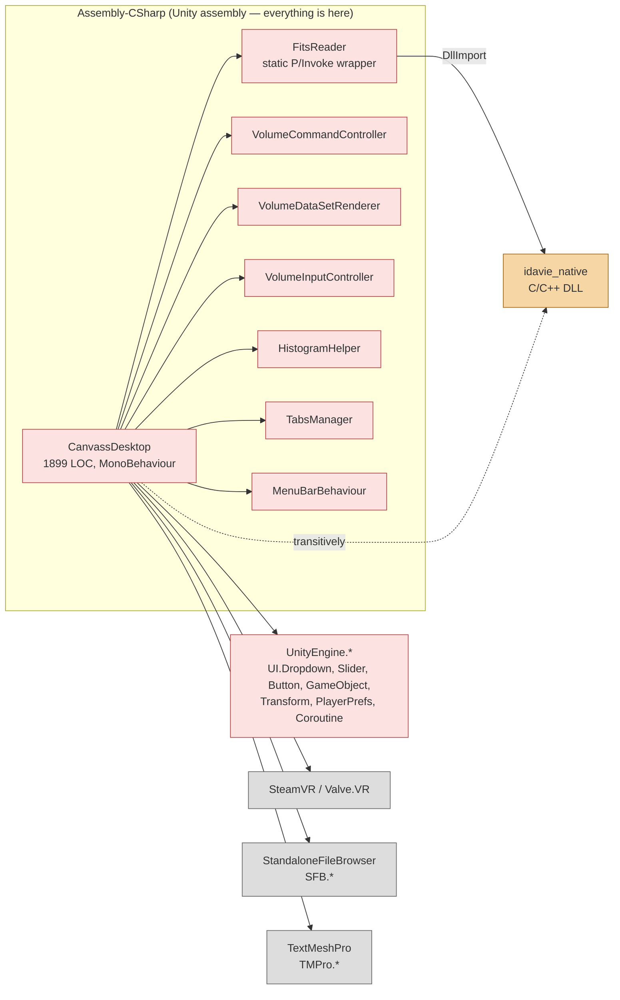
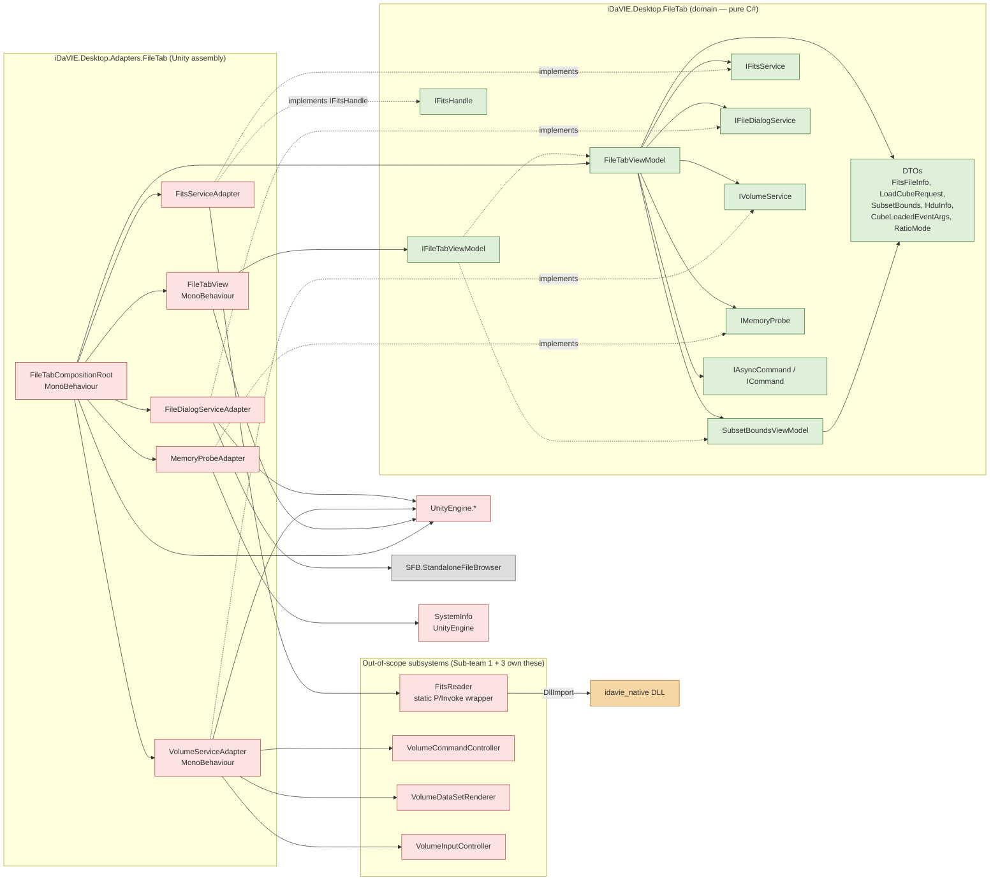

# File tab — dependency graph (BEFORE vs. AFTER)

Module-level dependency view of the File-tab slice. The class-level view lives in [`class-diagram.md`](class-diagram.md); the numeric coupling figures live in [`ck-metrics.md`](ck-metrics.md). This document focuses on **packages / assemblies** and the **ACL boundary**.

The key claim defended here:

> Section 4.2 — *Domain code must not transitively depend on `UnityEngine` / `SteamVR` / native plug-ins.*

The BEFORE graph shows this claim is violated; the AFTER graph shows it is satisfied.

---

## BEFORE — every File-tab file lives in one Unity assembly



### What this graph proves about BEFORE

1. **No assembly boundary.** Everything is `Assembly-CSharp` (Unity's default). There is no way to compile `CanvassDesktop` without `UnityEngine`, `SteamVR`, SFB, TMP, the native DLL, and 30+ Unity sibling classes.
2. **Domain code touches native code transitively.** The dotted edge `CanvassDesktop -.-> idavie_native` is the Section 4.2 violation: a UI class transitively depends on a native plug-in via a static helper.
3. **No interfaces between layers.** Every solid arrow is a direct named-type reference. Cannot substitute any collaborator without modifying `CanvassDesktop`.
4. **Test reachability.** Any unit test of file-tab logic requires the full Unity assembly to load. That's why there are zero NUnit tests for `CanvassDesktop` in the BEFORE codebase.

### Cycles

No file-tab → file-tab cycle, but `CanvassDesktop ↔ TabsManager` and `CanvassDesktop ↔ MenuBarBehaviour` form back-and-forth edges (each holds a reference to the other, each calls into the other). Strictly cyclic only if measured at instance level (both objects co-exist in the scene); the static call graph does have two edges in opposite directions. NDepend / DV8 may report this depending on their depth setting.

---

## AFTER — three assemblies, one ACL boundary



### What this graph proves about AFTER

1. **Three assemblies with a single direction of dependency.** `Adapters` references `Domain`; `Domain` does **not** reference `Adapters`. The arrow direction is enforced by the assembly references themselves — flipping it would not compile.
2. **Section 4.2 satisfied for the slice.** No solid arrow leaves `Domain` toward `UnityEngine`, `SteamVR`, `idavie_native`, `SFB`, or `TMPro`. The transitive reach is broken: `FileTabViewModel` cannot, even by accident, end up calling a native function.
3. **One composition root** (`FileTabCompositionRoot`) is the only class permitted to reference both layers — and it is itself an adapter. It instantiates the domain object graph and hands it to the view.
4. **Test reachability.** `dotnet test refactoring-examples/sub-team-6/file-tab/tests/FileTabTests.csproj` compiles and runs against the `Domain` assembly alone, with no Unity present. The 34 NUnit tests in `tests/FileTabViewModelTests.cs` exercise the slice end-to-end via test doubles.

### Cycles in the AFTER graph

**Zero.** Verifiable by topological sort:

```
Layer 0:  DTOs, Cmds, IFitsService, IFileDialogService, IVolumeService, IFileTabViewModel
Layer 1:  SubsetBoundsViewModel
Layer 2:  FileTabViewModel
Layer 3:  FitsServiceAdapter, FileDialogServiceAdapter, VolumeServiceAdapter, FileTabView
Layer 4:  FileTabCompositionRoot
```

No back-edges. No `Adapters → Domain.concrete` edges except via the composition root (which is *new*-ing the concrete class — not depending on it cyclically). This satisfies the *Zero circular dependencies* constraint of Section 4.2.

---

## Side-by-side delta

| Property | BEFORE | AFTER |
|---|---|---|
| Assemblies on critical path | 1 (`Assembly-CSharp`) | 3 (`Domain` + `Adapters` + `Subsystem`) |
| `Domain → UnityEngine` edges | direct: many | **zero** |
| `Domain → idavie_native` edges | transitive (via `FitsReader`) | **zero** |
| `Domain → SteamVR` edges | direct | **zero** |
| Interfaces on critical path | 0 | 8 (`IFileTabViewModel`, `IFitsService`, `IFitsHandle`, `IFileDialogService`, `IVolumeService`, `IMemoryProbe`, `IAsyncCommand`, `ICommand`) |
| Composition root | absent (`Start()` does ad-hoc `FindObjectOfType<>`) | explicit (`FileTabCompositionRoot.Awake()`) |
| Cycles | 2 instance-level (`CanvassDesktop ↔ TabsManager`, `CanvassDesktop ↔ MenuBarBehaviour`) | **0** |
| Test-runner reach | Unity required | `dotnet test` from any CI runner |
| Section 4.2 compliance | ❌ | ✅ |

---

## Tool verification needed

Once the Quality Guild's tooling is wired up (Day 2 baseline, Day 13 projected snapshot), confirm:

1. **NDepend rule:** `Application_Code.AreInNamespace("iDaVIE.Desktop.FileTab")` does **not** transitively reach `Application_Code.AreInNamespace("UnityEngine")` — should report 0 violations on the AFTER skeleton.
2. **DV8 architecture model:** declare the three packages above and assert the only legal direction is `Adapters → Domain`. The DSM should be strictly lower-triangular.
3. **CodeScene hotspots:** `CanvassDesktop.cs` should appear in the top-5 hotspots on the BEFORE snapshot; after our refactor the same lines (now distributed across 7 small classes) should drop out of the hotspot list entirely.

A short follow-up commit on Day 13 will paste tool screenshots / DSM exports alongside this document.
