# iDaVIE Domain Model — Class Architecture

> **Scope:** Existing codebase as-is. No upstream files modified.  
> **Diagram format:** Mermaid `classDiagram` — render in VS Code preview, GitHub, or `mmdc`.

---

## Relationship legend

| Notation | Meaning |
|---|---|
| `*--` composition | Owner creates / destroys the owned object |
| `o--` aggregation | Owner holds a reference; lifetime independent |
| `-->` dependency | Uses (method call, constructor arg, static call) |
| `<\|--` inheritance | Subclass extends base |

---

## Class Diagram

```mermaid
classDiagram
    %% ─────────────────────────────────────────────
    %% PLUGIN INTERFACE (native DLL boundary)
    %% ─────────────────────────────────────────────
    namespace PluginInterface {
        class NativePluginLoader {
            +LoadAll()
            +UnloadAll()
        }
        class FitsReader {
            +FitsOpenFile()
            +FitsCloseFile()
            +FitsReadSubImageFloat()
            +FitsReadSubImageInt16()
            +FitsCopyHeader()
            +ExtractHeaders()
            +SaveSubMask()
        }
        class DataAnalysis {
            +FindStats()
            +GetHistogram()
            +DataCropAndDownsample()
            +GetMaskedSources()
            +GetZProfileAsArray()
            +GetXProfileAsArray()
            +GetYProfileAsArray()
        }
        class AstTool {
            +InitAstFrameSet()
            +Transform3D()
            +Format()
            +SpectralTransform()
            +DeleteObject()
        }
    }

    NativePluginLoader --> FitsReader : loads
    NativePluginLoader --> DataAnalysis : loads
    NativePluginLoader --> AstTool : loads

    %% ─────────────────────────────────────────────
    %% VOLUME DATA
    %% ─────────────────────────────────────────────
    namespace VolumeData {
        class VolumeDataSet {
            +XDim int
            +YDim int
            +ZDim int
            +DataCube Texture3D
            +RegionCube Texture3D
            +FitsData IntPtr
            +AstFrameSet IntPtr
            +SourceStatsDict Dictionary
            +BrushStrokeHistory Stack
            +LoadDataFromFitsFile()$
            +GenerateVolumeTexture()
            +PaintMaskVoxel()
            +SaveMask()
            +SaveSubCubeFromOriginal()
        }
        class VolumeDataSetRenderer {
            +Data VolumeDataSet
            +Mask VolumeDataSet
            +ColorMap ColorMapEnum
            +ScalingType ScalingType
            +ThresholdMin float
            +ThresholdMax float
            +ProjectionMode ProjectionMode
            +MaskMode MaskMode
            +CursorVoxel Vector3Int
            +LoadRegionData()
            +CropToRegion()
            +PaintCursor()
            +SaveSubCube()
            +SaveMask()
            +SetCursorPosition()
        }
        class VolumeInputController {
            +ActiveRenderers VolumeDataSetRenderer[]
            +HoveredFeature Feature
            +HoveredAnchor FeatureAnchor
            -_interactionState StateMachine
            -_locomotionState StateMachine
        }
        class VolumeCommandController {
            +Renderers VolumeDataSetRenderer[]
            -_keywordRecognizer KeywordRecognizer
        }
        class Config {
            +GpuMemoryLimit int
            +RayMarchingSteps int
            +VoiceConfidenceLevel ConfidenceLevel
            +PushToTalk bool
            +Instance Config$
        }
    }

    VolumeDataSetRenderer *-- VolumeDataSet : data
    VolumeDataSetRenderer *-- VolumeDataSet : mask
    VolumeDataSetRenderer o-- VolumeInputController : input
    VolumeDataSet --> FitsReader : uses
    VolumeDataSet --> DataAnalysis : uses
    VolumeDataSet --> AstTool : uses
    VolumeDataSet --> Config : uses
    VolumeInputController o-- VolumeDataSetRenderer : renderers
    VolumeCommandController o-- VolumeInputController : delegates to
    VolumeCommandController o-- VolumeDataSetRenderer : renderers

    %% ─────────────────────────────────────────────
    %% FEATURE DATA
    %% ─────────────────────────────────────────────
    namespace FeatureData {
        class Feature {
            +Name string
            +Flag int
            +Index int
            +Id int
            +Color Color
            +Selected bool
            +Visible bool
            +CornerMin Vector3
            +CornerMax Vector3
            +RawData Dictionary
            +FeatureSetParent FeatureSetRenderer
            +SetBounds()
        }
        class FeatureAnchor {
            -_inputController VolumeInputController
            -_featureSetManager FeatureSetManager
            +OnTriggerEnter()
            +OnTriggerExit()
        }
        class FeatureSetRenderer {
            +Features Feature[]
            +FeatureType FeatureSetType
            -_volumeRenderer VolumeDataSetRenderer
            +UpdateAnchors()
        }
        class FeatureSetManager {
            +FeatureSets FeatureSetRenderer[]
            +SelectedFeature Feature
            -_volumeRenderer VolumeDataSetRenderer
            +CreateFeature()
            +SelectFeature()
            +UpdateAnchors()
        }
        class FeatureTable {
            +Columns FeatureColumn[]
            +Rows FeatureRow[]
        }
        class FeatureRow {
            +GetValue(index)
        }
        class FeatureColumn {
            +Name string
            +Index int
            +Unit string
        }
        class VoTable {
            +Columns VoColumn[]
            +Rows VoRow[]
        }
        class VoColumn {
            +Name string
            +Datatype string
            +Unit string
            +UCD string
        }
        class VoRow {
            +GetValue(index)
        }
        class VoTableSaver {
            +Save()
        }
        class FeatureMenuController {
            -_featureSetManager FeatureSetManager
            -_volumeRenderer VolumeDataSetRenderer
        }
    }

    FeatureSetManager *-- FeatureSetRenderer : manages
    FeatureSetManager o-- VolumeDataSetRenderer : coord ref
    FeatureSetRenderer *-- Feature : renders
    Feature o-- FeatureSetRenderer : parent
    FeatureAnchor --> VolumeInputController : notifies
    FeatureAnchor --> FeatureSetManager : notifies
    FeatureTable *-- FeatureRow
    FeatureTable *-- FeatureColumn
    VoTable *-- VoRow
    VoTable *-- VoColumn
    VoTableSaver --> FeatureSetRenderer : exports from
    VoTableSaver --> AstTool : coord transform
    FeatureMenuController o-- FeatureSetManager
    FeatureMenuController o-- VolumeDataSetRenderer

    %% ─────────────────────────────────────────────
    %% CATALOG DATA
    %% ─────────────────────────────────────────────
    namespace CatalogData {
        class CatalogDataSet {
            +Columns ColumnInfo[]
            +Data float[][]
            +LoadFromIPAC()
            +LoadFromFits()
        }
        class ColumnInfo {
            +Name string
            +Type string
            +Unit string
        }
        class DataMapping {
            +XColumn string
            +YColumn string
            +ZColumn string
            +ColorColumn string
            +OpacityColumn string
            +SizeColumn string
        }
        class CatalogDataSetRenderer {
            -_dataSet CatalogDataSet
            -_mapping DataMapping
            +Render()
        }
        class CatalogDataSetManager {
            +Renderers CatalogDataSetRenderer[]
        }
    }

    CatalogDataSet *-- ColumnInfo
    CatalogDataSetRenderer *-- CatalogDataSet
    CatalogDataSetRenderer *-- DataMapping
    CatalogDataSetManager *-- CatalogDataSetRenderer

    %% ─────────────────────────────────────────────
    %% MENU CONTROLLERS
    %% ─────────────────────────────────────────────
    namespace Menu {
        class HistogramMenuController {
            -_renderer VolumeDataSetRenderer
        }
        class MomentMapMenuController {
            -_renderer VolumeDataSetRenderer
        }
        class SpectralProfileMenuController {
            -_renderer VolumeDataSetRenderer
        }
        class QuickMenuController {
            -_renderer VolumeDataSetRenderer
            -_inputController VolumeInputController
        }
        class PaintMenuController {
            -_renderer VolumeDataSetRenderer
        }
        class VideoRecordMenuController {
            -_renderer VolumeDataSetRenderer
        }
    }

    HistogramMenuController o-- VolumeDataSetRenderer
    MomentMapMenuController o-- VolumeDataSetRenderer
    SpectralProfileMenuController o-- VolumeDataSetRenderer
    PaintMenuController o-- VolumeDataSetRenderer
    VideoRecordMenuController o-- VolumeDataSetRenderer
    QuickMenuController o-- VolumeDataSetRenderer
    QuickMenuController o-- VolumeInputController
    VolumeCommandController o-- QuickMenuController : opens
    VolumeCommandController o-- PaintMenuController : opens
    VolumeCommandController o-- MomentMapMenuController : opens

    %% ─────────────────────────────────────────────
    %% VIDEO MAKER
    %% ─────────────────────────────────────────────
    namespace VideoMaker {
        class Command {
            <<abstract>>
            +Execute()
        }
        class StartCommand
        class WaitCommand {
            +Duration float
        }
        class MoveCommand {
            +Target VideoLocation
            +Method MovementMethod
        }
        class RotateCommand {
            +Axis RotationAxes
            +Degrees float
        }
        class VideoSettings {
            +Width int
            +Height int
            +Framerate int
        }
        class IDVSParser {
            +Parse() Command[]
        }
    }

    StartCommand --|> Command
    WaitCommand --|> Command
    MoveCommand --|> Command
    RotateCommand --|> Command
    IDVSParser --> Command : produces
    IDVSParser --> VideoSettings : produces
```

---

## Key architectural observations

1. **VolumeDataSet is the central domain object.** Everything else either owns it, renders it, or transforms data for it.

2. **Native plugin layer is a pure dependency sink.** `FitsReader`, `DataAnalysis`, and `AstTool` have no incoming compile-time dependencies from other C# classes — they are called by `VolumeDataSet` and `VoTableSaver` but know nothing about them. This is a natural seam for the plug-in ABI.

3. **VolumeDataSetRenderer is a god class.** It holds two `VolumeDataSet` instances, coordinates input, manages rendering state, and exposes operations that belong in separate use-case classes. The canonical refactoring candidate per our work package.

4. **No C# interfaces exist.** All cross-class communication is via concrete type references. This means every boundary (input→volume, features→volume, menu→volume) is a violation of the Dependency Inversion Principle and a coupling point our kernel boundary must address.

5. **Menu controllers are all fans into VolumeDataSetRenderer.** They represent the Application layer calling down to the Domain — currently not separated by any interface or use-case abstraction.

6. **Circular reference: VolumeDataSetRenderer ↔ VolumeInputController.** Renderer holds InputController; InputController holds Renderer array. This is a bidirectional coupling that the micro-kernel design must break.
